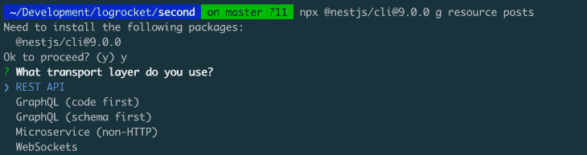

# 在 NestJS 中使用 TypeORM 的 QueryBuilder

> 原文：<https://blog.logrocket.com/using-typeorms-querybuilder-nestjs/>

NestJS 是一个相对较新的 JavaScript web 框架，它使您能够构建企业级的服务器端应用程序。它功能强大，实施最佳实践，并使用最新的 JavaScript 特性。它还默认支持 TypeScript，并使用了 [TypeORM](https://typeorm.io) ，这是一个用 TypeScript 构建的强大的对象关系管理库。

在 GitHub 上有超过 [29.3k 颗星星，TypeORM 是最受欢迎的 Node.js ORMs 之一。除了与数据库无关之外，TypeORM 还有一个独特的 API，允许您使用活动记录和数据映射模式以不同的方式访问 SQL 数据库(如 MYSQL 和 PostgreSQL)和 NoSQL 数据库(如 MongoDB)中的数据。](https://typeorm.io)

在本文中，我们将学习如何将 TypeORM 与 NestJS 集成，添加一个数据库驱动程序，并使用 NestJS 中的 TypeORM QueryBuilder 运行基本查询。

为了有效地阅读本文，您应该具备:

*   [Node.js](https://nodejs.org/en/) v12 LTS 或 Node > v14 安装在您的计算机上— [NVM](https://github.com/nvm-sh/nvm) 使得在 Node.js 的不同版本之间切换变得更加容易
*   NestJS 和 JavaScript 的基本工作知识

需要复习一些基础知识吗？查看这篇关于用 NestJS 构建电子商务应用程序的实用文章。

我们开始吧！

## 目录

设置 NestJS 很简单，根据您的需要，有几种方法可以实现。然而，在本文中，我们将使用 CLI 安装它。

```
npx @nestjs/[email protected] new nest-app

```

这个命令将对 NestJS“Hello，World！”样板应用程序，因此您可以直接开始编码。

现在我们已经安装了 NestJS，让我们将 TypeORM 集成到我们的应用程序中。请密切关注这一部分；在开始编写查询之前，需要正确集成 TypeORM。

在您的终端上运行这个命令来安装 TypeORM 和 SQLite3 驱动程序——我们将在本教程中使用 SQLite 来降低安装和设置 MySQL 或 PostgreSQL 数据库的复杂性。

```
npm install @nestjs/typeorm sqlite3

```

### 生成基本应用程序设置

接下来，让我们使用 NestJS CLI 为查询应用程序的框架生成控制器和服务。运行以下命令来生成它，并选择 REST API 传输层。

```
npx @nestjs/[email protected] g resource posts

```



它将询问您是否想要生成 CRUD 入口点。选择**是**。为您生成所有内容需要一点时间，但这是 NestJS 的一个有益方面。

您的目录结构现在应该如下所示:

```
.
├── README.md
├── dist
├── nest-cli.json
├── package-lock.json
├── package.json
├── src
│   ├── app.controller.spec.ts
│   ├── app.controller.ts
│   ├── app.module.ts
│   ├── app.service.ts
│   ├── main.ts
│   └── posts
│       ├── dto
│       │   ├── create-post.dto.ts
│       │   └── update-post.dto.ts
│       ├── entities
│       │   └── post.entity.ts
│       ├── posts.controller.spec.ts
│       ├── posts.controller.ts
│       ├── posts.module.ts
│       ├── posts.service.spec.ts
│       └── posts.service.ts
├── test
├── tsconfig.build.json
├── tsconfig.json
└── yarn.lock

```

### 用 SQLite 配置 TypeORM

现在，让我们在`src/app.module.ts`文件中配置 TypeORM。

最初，它看起来像这样:

```
// src/app.module.ts
import { Module } from '@nestjs/common';
import { AppController } from './app.controller';
import { AppService } from './app.service';
import { PostsModule } from './posts/posts.module';
@Module({
  imports: [PostsModule],
  controllers: [AppController],
  providers: [AppService],
})
export class AppModule {}

```

导入 SQLite 连接选项、TypeORM 模块和 post 实体，如下面的代码所示:

```
// src/app.module.ts
import { Module } from '@nestjs/common';
import { TypeOrmModule } from '@nestjs/typeorm';
import { SqliteConnectionOptions } from 'typeorm/driver/sqlite/SqliteConnectionOptions';
import { AppController } from './app.controller';
import { AppService } from './app.service';
import { Post } from './posts/entities/post.entity';
import { PostsModule } from './posts/posts.module';

const config: SqliteConnectionOptions = {
  type: "sqlite",
  database: "../db",
  entities: [Post],
  synchronize: true
}

@Module({
  imports: [PostsModule, TypeOrmModule.forRoot(config)],
  controllers: [AppController],
  providers: [AppService],
})
export class AppModule {}

```

现在，让我们完成刚刚添加的更新。首先，查看配置对象的形状，我们添加了数据库和实体，并同步了数据库。但是，重要的是要记住，在生产环境中不应该同步数据库，因为这可能会导致数据丢失。

```
// the config
const config: SqliteConnectionOptions = {
  type: "sqlite",
  database: "../db",
  entities: [Post],
  synchronize: true // set to false on production 
}

```

因为我们使用的是 SQLite 数据库，所以可以用`"../db",`快速添加数据库的路径。如果它不存在，将自动为您创建。对于 MySQL 或 PostgreSQL，形状是不同的，所以查看[文档](https://typeorm.io/)来了解更多。

### 创建数据库实体

实体是数据库模型，在我们的例子中，我们的`Post`实体有一个 ID 和一个标题，如下面的代码所示:

```
// src/post/entities/post.entity.ts
import { Column, Entity, PrimaryGeneratedColumn } from "typeorm";
@Entity()
export class Post {
    @PrimaryGeneratedColumn()
    id: number;
    @Column()
    title: string;
}

```

最后，在一般的应用程序 TypeORM 设置上，让我们用 NestJS 来挂钩 TypeORM 配置。请注意`.forRoot`方法，因为在设置特性级配置时，您可能会看到类似的东西。

```
  imports: [PostsModule, TypeOrmModule.forRoot(config)],

```

这里，我们有一个与 NestJS 挂钩的 TypeORM。接下来，让我们将我们的`Post`特性与 ORM 集成。

导航到`src/posts/posts.module.ts`文件，用以下配置更新它:

```
// src/posts/posts.module.ts
import { Module } from '@nestjs/common';
import { PostsService } from './posts.service';
import { PostsController } from './posts.controller';
@Module({
  controllers: [PostsController],
  providers: [PostsService]
})
export class PostsModule {}

```

接下来，导入 TypeORM，`Post`实体，并通过用`[TypeOrmModule.forFeature([Post])]`设置模块 imports 的值来更新代码。请注意，我们使用的是`forFeature`，传入的是实体数组，而不是应用级的模块配置。

```
import { Module } from '@nestjs/common';
import { PostsService } from './posts.service';
import { PostsController } from './posts.controller';
import { TypeOrmModule } from '@nestjs/typeorm';
import { Post } from './entities/post.entity';
@Module({
  imports: [TypeOrmModule.forFeature([Post])],
  controllers: [PostsController],
  providers: [PostsService]
})
export class PostsModule {}

```

## 在 NestJS 中使用 TypeORM QueryBuilder 运行基本查询

使用 TypeORM 和 NestJS 访问数据库有几种方法，包括使用存储库 API、实体管理器 API 和使用数据源 API。

下面是一个简单的例子，展示了如何使用上面提到的 API 通过 ID 获取一个项目。我已经删除了与这个例子无关的大部分代码，但是你可以在 [GitHub](https://github.com/ezesundayeze/nestjs-typeORM) 上找到完整的代码。

```
//src/posts/posts.service.ts

@Injectable()
export class PostsService {

  constructor(
    @InjectRepository(Post) private postRepository: Repository<Post>,
    @InjectEntityManager() private postManager: EntityManager,
    @InjectDataSource() private dataSource: DataSource
  ) { }

  async findOne(id: number) {

    const postWithRepository = await this.postRepository.findOneBy({ id });

    const postWithRepositoryQueryBuilder = await this.postRepository
      .createQueryBuilder("post")
      .where("post.id= :postId", { postId: id })
      .getOne()

    const postWithEntityManager = await this.postManager
      .createQueryBuilder(Post, "post")
      .where("post.id= :postId", { postId: id })
      .getOne()

    const postWithDataSource = await this.dataSource
      .createQueryBuilder()
      .select("post")
      .from(Post, "post")
      .where("post.id= :postId", { postId: id })
      .getOne()

    return {
      postWithRepository,
      postWithRepositoryQueryBuilder,
      postWithEntityManager,
      postWithDataSource
    };
  }

}

```

如您所见，我们在构造函数中初始化了数据访问层，然后在方法中使用它们。

```
//src/posts/posts.service.ts
...
constructor(
    @InjectRepository(Post) private postRepository: Repository<Post>,
  ) { }
...

```

除此之外，代码的其余部分只是普通的 TypeORM 查询；您可以通过查看他们的[文档](https://typeorm.io/)来更深入地探索 TypeORM。

以上代码中的所有查询都将返回相同的结果。所以，实现一个目标有几种方法，但哪种方法是最有效的呢？

当处理小型数据集时，这两种方法的性能相似。然而，我发现在处理具有多个关系的大型数据集时，QueryBuilder API 比存储库查询更有效。我相信这是因为 [QueryBuilder API](https://stackoverflow.com/questions/58722202/what-are-the-different-use-cases-for-using-querybuilder-vs-repository-in-typeor) 比[存储库 API 相对更接近原始 SQL 查询。](https://martinfowler.com/eaaCatalog/repository.html)

## 通过 NestJS 在 TypeORM 中使用`JOIN`查询

如果您已经编写了一个 SQL 查询，涉及到使用 SQL 从多个表中访问数据，那么您很可能以前也编写过一个`JOIN`查询。`JOIN`查询允许您一次从多个表中查询数据。让我们来看看 TypeORM 中的一个`LEFT JOIN`操作。这种类型的查询将返回左表中的所有行和右表中的匹配行。

* * *

### 更多来自 LogRocket 的精彩文章:

* * *

有几种方法可以在 TypeORM 中执行`LEFT JOIN`操作。让我们来看看其中的一些:

尽管我们的重点是使用 QueryBuilder，但我将向您展示一个使用这两种选项的示例，以便您可以看到两者之间的差异。

下面我们来看看这个 SQL `LEFT JOIN`操作。我们将把它转换成使用 TypeORM 的`find`选项和 QueryBuilder 方法。

```
SELECT * FROM "user"
LEFT JOIN "courses" "course" ON "course"."id" = "user"."courseId"
WHERE "course"."name" = 'JavaScript Fundamentals' AND "course"."length" = '8 hours'

```

### 在类型表单中使用`find`

```
userRepository.find({
    relations: { course: true },
    where: {
        course: { name: "JavaScript Fundamentals", length: "8 hours" },
    },
})

```

上面的代码是一个使用 TypeORM `find`选项的`LEFT JOIN`查询。幸运的是，这很简单，因为 TypeORM 会计算出最适合您的`JOIN`，并给出合适的结果。现在，让我们用 TypeORM QueryBuilder 实现上面的查询。

### 将 QueryBuilder 用于`JOIN`

```
const user = this.userManager
      .createQueryBuilder(User, "user")
      .leftJoin("course"."id", "course")
      .where("course.name = :name", { name: "JavaScript Fundamentals" })
      .andWhere("course.length = :length", { length: "8 hours" })

```

当使用 QueryBuilder 时，您还可以选择不同类型的`JOINS`，不像`find`选项，它在幕后做所有的事情。

下面是 TypeORM 中提供的一些额外的[`JOINS`。](https://typeorm.io/select-query-builder#joining-and-mapping-functionality)

## 结论

如果你想在不影响质量的情况下快速构建一个可靠的后端，可以考虑使用 TypeORM。在本文中，我们学习了如何将 TypeORM QueryBuilder 与 NestJS 集成在一起使用，但我们只是触及了 TypeORM 的皮毛。查看 TypeORM 文档以[了解更多信息](https://typeorm.io/)。

黑客快乐！

## 使用 [LogRocket](https://lp.logrocket.com/blg/signup) 消除传统错误报告的干扰

[](https://lp.logrocket.com/blg/signup)

[LogRocket](https://lp.logrocket.com/blg/signup) 是一个数字体验分析解决方案，它可以保护您免受数百个假阳性错误警报的影响，只针对几个真正重要的项目。LogRocket 会告诉您应用程序中实际影响用户的最具影响力的 bug 和 UX 问题。

然后，使用具有深层技术遥测的会话重放来确切地查看用户看到了什么以及是什么导致了问题，就像你在他们身后看一样。

LogRocket 自动聚合客户端错误、JS 异常、前端性能指标和用户交互。然后 LogRocket 使用机器学习来告诉你哪些问题正在影响大多数用户，并提供你需要修复它的上下文。

关注重要的 bug—[今天就试试 LogRocket】。](https://lp.logrocket.com/blg/signup-issue-free)