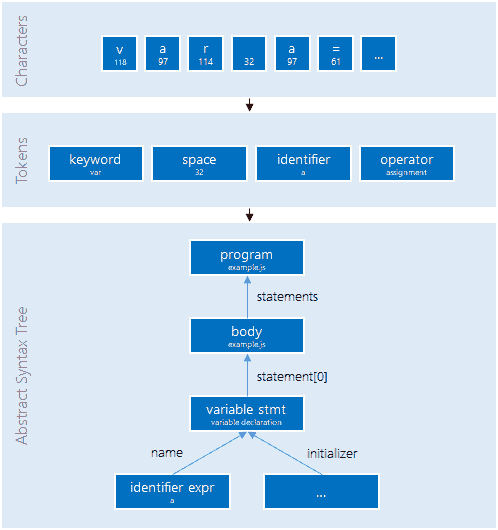

# 使用 TypeScript 转换来丰富运行时代码

> 原文：<https://blog.logrocket.com/using-typescript-transforms-to-enrich-runtime-code-3fd2863221ed/>


当我开始开发时，没有人谈论“编译”他们的 JavaScript 源代码。大家只是写了几个脚本，直接引用。

随着时间的推移，缩小和进一步增强成为 web 开发中事实上的标准，因此在编写代码后进行一些处理成为一种相当正常的做法。如今，每个人都承认前端 web 开发需要一些处理，主要是使用 bundler 来帮助我们驯服 web 怪兽。

就 JavaScript“处理器”而言，有两种主流。我们要么用 TypeScript，要么用 Babel 加一些插件。有些人实际上可能会使用 TypeScript 和 Babel(或者这些天专门用 Babel 来编写他们的 TypeScript 代码)。然而，通常情况下，你只能看到其中之一，这取决于项目是使用 TypeScript 还是其他可以使用 Babel 传输的东西。当然，还有其他可用的语言和工具，但这两种是主要的。

巴别塔是一个成功的故事。它从一个非常简单的任务开始；为可扩展性打开 JavaScript 解析器。随着时间的推移，生态系统成长起来，成为向我们的目标浏览器提供兼容输出的标准工具，在开发过程中对使用什么功能没有任何限制。

太好了！更好的是，它还在标准 JavaScript 之上培养了一些元编程和语法糖，如 JSX，它允许在 React 或类似的 UI 库和框架中编写优雅的前端代码。

到目前为止，这种伟大似乎是巴别塔独有的，然而，这被引入的类型转换所改变。现在，可以从外部增强 TypeScript。在这篇文章中，我们将看到为什么(以及何时)扩展 TypeScript 有意义，以及如何去做。

### 动机

尽管 TypeScript 采用了与 Babel 不同的方法，但它也成为了一个相当成功的故事。最初，许多人怀疑微软在 JavaScript 世界的抱负。然而，由于它的开源特性和解决问题的方法(“以 JavaScript 开始，以 JavaScript 结束”)，人们开始为许多项目快速过渡。

就我个人而言，我一直在为任何与 JavaScript 相关的项目使用 TypeScript，然而，我能理解为什么许多人只在更大的项目中使用它。

TypeScript 的反对者通常给我们以下两个反对使用它的理由:

1.  TypeScript 所做的保证充其量只是表面的——它们很容易被绕过，并且过于局限而无法使用
2.  所有创建类型的工作都会在编译时丢失

虽然前者是 TypeScripts 与“普通”JavaScript 非常强(100%)兼容性的副作用(也就是说，这里已经选择了一个折衷方案，并且这个折衷方案选择得非常好)，但后者肯定是有效的。

目前，没有办法从编译时到运行时引入一些元数据(类型系统)信息。尽管 JavaScript 是动态的，但我们对这种运行时类型信息( **RTTI** )机制感兴趣的原因有很多。首先，它允许我们在运行时检查外来代码的类型(例如，服务端点的 API 中的传入数据，来自请求的 JSON 响应)。

抱怨 TypeScript 缺少 RTTI 对我们没有太大帮助。相反，我们将尝试使用 TypeScript 转换来按需提供 RTTI。理想情况下，代码可能是这样的:

```
import { generateRtti } from 'hypothetical-typescript-rtti';

interface MyType {
  id: string;
}

generateRtti<MyType>();
```

其中附加信息可以这样检索:

```
import { obtainRtti } from 'hypothetical-typescript-rtti';

// get type information as JSON schema
const schema = obtainRtti('MyType').schema;

// get validation results for an instance
const errors = obtainRtti('MyType').validate({ id: 7 });
```

需要明确的是，在这篇文章中，我们将只关注第一部分，第二部分(揭露 RTTI)将不会被讨论。

因此，让我们通过引入 TypeScript 转换来尝试一种生成 RTTI 的解决方案。

### 类型脚本转换

TypeScript 转换只是一个简单的函数，定义如下:

```
import { TransformationContext, Transformer, SourceFile } from 'typescript'

interface TypeScriptTransform {
  (ctx: TransformationContext): Transformer<SourceFile>;
}
```

本质上，我们得到的是一些上下文信息来返回一个函数，该函数可用于源文件的任何类型的转换。以下是此类函数的一个示例:

```
function sampleTransformer(ctx: TransformationContext) {
  return (sf: SourceFile) => visitNode(sf, visitor(ctx, sf, opts))
}
```

在我们继续之前，我们需要看看我们改变了什么。由于 TypeScript 是一个编译器(或 *transpiler* ),我们正在处理由编译器处理的数据结构。高层的编译器管道由一个**前端**(理解源代码并将其转换为核心数据结构)和一个**后端**(将优化等转换应用于数据结构并将其序列化为输出格式)组成。

为了达到核心数据结构(通常以树的形式提供，称为抽象语法树或 **AST** )，已经应用了一些转换:

1.  将字符的线性流转换成定义明确的符号的线性流
2.  将线性令牌流转换成符合语言语法的树形结构

这里也说明了这一点:



Data transformations (pipeline) for parsing source code

使用 TypeScript 转换，我们只能有一个后端转换器，允许我们在现有的 AST 上执行修改。

### AST 基础知识

AST 是一棵树，由表示语法信息组的节点和表示它们之间关系的边组成。例如，一个简单的示例代码如下:

```
const a = 3 + 4;
console.log(a);
```

转换成这样的 AST:

```
{
  "type": "Program",
  "body": [
    {
      "type": "VariableDeclaration",
      "kind": "const",
      "declarations": [
        {
          "type": "VariableDeclarator",
          "id": {
            "type": "Identifier",
            "name": "a"
          },
          "init": {
            "type": "BinaryExpression",
            "operator": "+",
            "left": {
              "type": "Literal",
              "value": 3,
            },
            "right": {
              "type": "Literal",
              "value": 4,
            }
          }
        }
      ]
    },
    {
      "type": "ExpressionStatement",
      "expression": {
        "type": "CallExpression",
        "callee": {
          "type": "MemberExpression",
          "computed": false,
          "object": {
            "type": "Identifier",
            "name": "console"
          },
          "property": {
            "type": "Identifier",
            "name": "log"
          }
        },
        "arguments": [
          {
            "type": "Identifier",
            "name": "a"
          }
        ]
      }
    }
  ]
}
```

这里我们选择了所谓的 [ES 树](https://github.com/estree/estree)规范来以 JSON 形式表示输出。有两件事在所有 AST 实现中都很常见:

1.  由于有许多不同的节点，我们需要一个类型鉴别器来区分不同类型的节点。通常，相关属性被称为`type`
2.  根节点是程序本身，它的主体由所有语句组成。一个语句由表达式组成。表达式可以计算东西，可以组合，语句只是指令，不允许组合(只允许聚合，例如在程序、块语句或函数体中)

使用 AST 最有效的方法是回到经典的软件设计模式，使用**访问者模式**。这种模式允许我们遍历树，而不必实现/知道树中的所有信息。

考虑上面的示例树。为了在没有访问者模式的情况下遍历它，我们需要知道:

*   二元运算有两个子节点，一个在`left`中，一个在`right`中
*   变量声明符有两个子节点，一个在`id`中，一个在`init`中，后者是可选的
*   变量声明中有一个由`declarations`属性公开的声明数组
*   有一个表达式语句(仅由一个表达式组成，没有任何其他指令)，在其`expression`属性中包含该表达式
*   调用表达式包含两个属性`callee`(定义被调用值的表达式)和`arguments`(计算参数的表达式数组)
*   成员表达式由包含在`object`和`property`中的两个表达式组成

这只是一个简单的例子，但是它已经强调了遍历它需要大量的信息。概括这一点将需要巨大的努力，这可以通过使用访问者模式来减轻。

例如，以下代码是将与`a`相关的每个标识符更改为`b`所必需的全部内容:

```
tree.visit({
  Identifier(node) {
    if (node.name === 'a') {
      node.name = 'b';
    }
  },
})
```

这个示例代码说明了在树上应用一个访问者函数会将我们这边的代码减少到我们感兴趣的部分。我们可以只关注标识符节点，而不是做遍历树的所有基础工作。

* * *

### 更多来自 LogRocket 的精彩文章:

* * *

现实世界的实现可能看起来不同。例如，在 TypeScript 中公开的方法如下所示:

```
import * as ts from 'typescript';

function visit(ctx: ts.TransformationContext, sf: ts.SourceFile) {
  const visitor: ts.Visitor = (node: ts.Node): ts.VisitResult => {
    // here we can check each node and potentially return 
    // new nodes if we want to leave the node as is, and 
    // continue searching through child nodes:
    return ts.visitEachChild(node, visitor, ctx);
  };
  return visitor;
}

export default function() {
  return (ctx: ts.TransformationContext): ts.Transformer => {
    return (sf: ts.SourceFile) => ts.visitNode(sf, visit(ctx, sf))
  }
}
```

出于性能原因，TypeScript 访问者需要助手方法来触发遍历。

### 简单的变压器

我们的第一步是创建要导出的转换器。因为我们使用类型，所以从评估的源代码中获取类型检查器实例是有意义的。代码看起来像这样:

```
import * as ts from 'typescript';

export interface TransformerOptions {}

export function transformer(program: ts.Program, opts?: TransformerOptions) {
  function visitor(ctx: ts.TransformationContext, sf: ts.SourceFile) {
    const typeChecker = program.getTypeChecker();

    const visitor: ts.Visitor = (node: ts.Node) => {
      // Implementation here
      return ts.visitEachChild(node, visitor, ctx);
    };

    return visitor;
  }

  return (ctx: ts.TransformationContext) => {
    return (sf: ts.SourceFile) => ts.visitNode(sf, visitor(ctx, sf));
  };
}
```

所以我们创建一个简单的函数，将整个程序作为转换输入。此外，我们接受一些选项(我们现在还没有使用，但是知道用户定义的配置可能传入的位置是很好的)。最后，我们返回前面提到的函数，该函数接受转换上下文并返回实际的源文件转换器。

源文件转换器的实现使用 TypeScript 给出的`visitNode`函数以及我们自己的实现。应用于每个节点的非常特定的访问者仍然需要实现。查看我们的样本代码，我们对调用一个`generateRtti`函数感兴趣。

下面的代码代表了我们想要的一个合理的实现:

```
if (ts.isCallExpression(node) && node.typeArguments && node.expression.getText(sf) == 'generateRtti') {
  const [type] = node.typeArguments;
  const [argument] = node.arguments;
  const fn = ts.createIdentifier('__rtti__generate');
  const typeName = type.getText();
  const typeSource = getDescriptor(type, typeChecker);
  return ts.createCall(fn, undefined, [argument || ts.createStringLiteral(typeName), typeSource]);
}
```

如果我们看到一个节点是带有一些类型参数的对`generateRtti`的调用表达式，我们将该节点转换成:

```
__rtti__generate(name_of_the_type, descriptor_of_the_type);
```

此时会出现两个问题:

*   `getDescriptor`的实现是什么样子的？
*   `__rtti__generate`(或者我们给这个函数起的任何名字)从何而来？

让我们试着逐一回答这些问题。首先，`getDescriptor`的实现需要与我们期望的所有类型对抗。最重要的是，它需要处理类型引用和接口。在上面的例子中，我们得到了一个绑定到接口的类型引用。

一个简单的实现可能如下所示:

```
function getDescriptor(type: ts.Node, typeChecker: ts.TypeChecker): ts.Expression {
  switch (type.kind) {
    case ts.SyntaxKind.PropertySignature:
      return getDescriptor((type as ts.PropertySignature).type, typeChecker);
    case ts.SyntaxKind.TypeLiteral:
    case ts.SyntaxKind.InterfaceDeclaration:
      return ts.createObjectLiteral(
        (type as ts.InterfaceDeclaration).members.map(
          (m): ts.ObjectLiteralElementLike => ts.createPropertyAssignment(m.name || '', getDescriptor(m, typeChecker)),
        ),
      );
    case ts.SyntaxKind.TypeReference:
      const symbol = typeChecker.getSymbolAtLocation((type as ts.TypeReferenceNode).typeName);
      const declaration = ((symbol && symbol.declarations) || [])[0];
      return getDescriptor(declaration, typeChecker);
    case ts.SyntaxKind.NumberKeyword:
    case ts.SyntaxKind.BooleanKeyword:
    case ts.SyntaxKind.AnyKeyword:
    case ts.SyntaxKind.StringKeyword:
      return ts.createLiteral('string');
    case ts.SyntaxKind.ArrayType:
    default:
      throw new Error('Unknown type ' + ts.SyntaxKind[type.kind]);
  }
}
```

为了简单起见，我们省略了许多情况(例如，yielding】),只保留了使我们的例子正常工作所必需的内容。我们看到原语被直接输出(例如，当我们看到一个字符串类型被使用时，给出一个`'string'`文字)，而组合类型如接口声明被递归地使用`getDescriptor`函数。

就第二个问题而言，有多种方法。我们可以:

*   在我们的库中定义函数，并在导入语句中添加对它的引用，或者
*   在新模块中定义该函数(如果该函数已被使用/引用)

第一个可能很容易改变或摆弄，但是，它带来了一些很大的问题。这一次，我们的转换是在绑定阶段之后的*，也就是说，我们需要自己处理任何模块绑定。通常，如果我们知道目标(特别是对于 ES6 模块)，这不是一件大事，但是，支持所有可能的模块系统这可能是相当麻烦的。此外，这将把运行时依赖留在那里，这仍然可能把我们的转换器代码带到包中(取决于所使用的树抖动器的能力)。*

因此，我们应该选择第二个选项，这也是 TypeScript 使用的选项。众所周知，TypeScript 也喜欢为引入的函数生成代码。我们也可以这样做。对我们的 visitor 函数的一个简单修改允许我们在应用了所有转换之后对源文件*做一些修改:*

```
return (ctx: ts.TransformationContext) => {
  return (sf: ts.SourceFile) => {
    const result = { seen: false };
    const newSf = ts.visitNode(sf, visitor(ctx, sf, result));

    if (result.seen) {
      const fn = createGenerateFunction();
      return ts.updateSourceFileNode(newSf, [fn, ...newSf.statements]);
    }

    return newSf;
  };
};
```

如果我们以后需要生成函数，那么应该在我们的 visitor 中更改`seen`属性的值。函数本身(在本例中)将被放在文件的顶部。

由于吊装，我们也可以把它放在底部，没有任何负面影响。函数声明本身并不引人注意——它很长，基本上编译成以下 JavaScript 代码:

```
function __rtti__generate(typeName, typeDefinition) {
  var ctx = typeof window === "undefined" ? global : window;
  var types = ctx.__rtti__types || (ctx.__rtti__types = {});
  types[typeName] = typeDefinition;
}
```

更多细节可以在 GitHub 上的[样本库中看到。](https://github.com/FlorianRappl/ts-transform-sample)

我们的简单转换器目前没有覆盖的是循环引用。所以一个自引用的接口(可能是通过其他被引用的接口间接引用的)肯定不会被捕获，从而导致传统的堆栈溢出。通过将包含的接口放在顶层也可以避免这种情况。

### 使用变压器

不幸的是，目前 transformers 在 TypeScript 中的使用是有限的。有两个问题:

1.  `tsc`应用不消耗/考虑变压器，例如通过 *tsconfig.json*
2.  声明文件( *d.ts* )的发出管道独立于转换器

这两个问题都在 TypeScript 团队的关注范围内，但是，目前还没有最高优先级。虽然第二个问题不容易有效解决，但第一个问题可以通过多种方式规避。

最流行的方法是提供一个额外的 runner 脚本。这也可以用一个小的包装器脚本作为[结果](https://github.com/cevek/ttypescript)来概括。现在我们不叫`tsc`而是叫`ttsc`。希望在将来，TypeScript 直接支持转换/插件，让我们摆脱额外的依赖。

如果我们主要对在诸如 webpack 这样的捆绑器中使用我们的转换感兴趣，那么会有一些好消息。标准装载机如`ts-loader`或`awesome-typescript-loader`支持开箱即用的变压器，不需要`ttsc`。然而，由于这些加载器也可以与“自定义版本的 TypeScript”一起工作，我们也可以将它们与`ttsc`结合使用，让我们可以自由地捆绑或直接传输。

### 结论

现在我们已经看到了如何使用 TypeScript 转换，以及它们会带来什么。在我们的示例中，我们探索了用附加函数调用来注释代码的能力，以声明我们想要为哪些类型生成附加信息。我们停留在生成阶段，没有查看访问包含的 RTTI 的一些 API 的创建。

这种插件带来的可能性是无限的。我们已经在 Babel 生态系统(以及 TypeScript)中看到许多有创造力和聪明的人提出了很大的改进。虽然使用类型系统信息可能是一种方式，但另一种方式可以是对所用代码进行一些自省的简单扩展。

例如，有一个插件([typescript-plugin-inner-jsx](https://github.com/ZEISS/typescript-plugin-inner-jsx))可以将组件中已经使用过的组件放到组件上，以一种更简单(隐式)的方式对组件进行样式化。存在许多其他伟大的打字稿变形器，尽管打字稿生态系统不会像巴别塔生态系统那样依赖于它们。

你对打字稿变形金刚有什么想法？你觉得这些有用吗？目前缺少什么能让它们变得更有用？请在评论中告诉我们！

## [LogRocket](https://lp.logrocket.com/blg/typescript-signup) :全面了解您的网络和移动应用

[](https://lp.logrocket.com/blg/typescript-signup)

LogRocket 是一个前端应用程序监控解决方案，可以让您回放问题，就像问题发生在您自己的浏览器中一样。LogRocket 不需要猜测错误发生的原因，也不需要向用户询问截图和日志转储，而是让您重放会话以快速了解哪里出错了。它可以与任何应用程序完美配合，不管是什么框架，并且有插件可以记录来自 Redux、Vuex 和@ngrx/store 的额外上下文。

除了记录 Redux 操作和状态，LogRocket 还记录控制台日志、JavaScript 错误、堆栈跟踪、带有头+正文的网络请求/响应、浏览器元数据和自定义日志。它还使用 DOM 来记录页面上的 HTML 和 CSS，甚至为最复杂的单页面和移动应用程序重新创建像素级完美视频。

## 200 只显示器出现故障，生产中网络请求缓慢

部署基于节点的 web 应用程序或网站是容易的部分。确保您的节点实例继续为您的应用程序提供资源是事情变得更加困难的地方。如果您对确保对后端或第三方服务的请求成功感兴趣，

[try LogRocket](https://lp.logrocket.com/blg/node-signup)

.

[](https://lp.logrocket.com/blg/node-signup)[https://logrocket.com/signup/](https://lp.logrocket.com/blg/node-signup)

LogRocket 就像是网络和移动应用程序的 DVR，记录下用户与你的应用程序交互时发生的一切。您可以汇总并报告有问题的网络请求，以快速了解根本原因，而不是猜测问题发生的原因。

LogRocket 检测您的应用程序以记录基线性能计时，如页面加载时间、到达第一个字节的时间、慢速网络请求，还记录 Redux、NgRx 和 Vuex 操作/状态。

[Start monitoring for free](https://lp.logrocket.com/blg/node-signup)

.

[Try it for free](https://lp.logrocket.com/blg/typescript-signup)

.