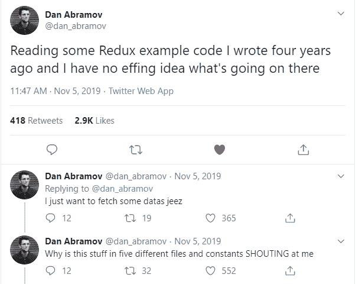
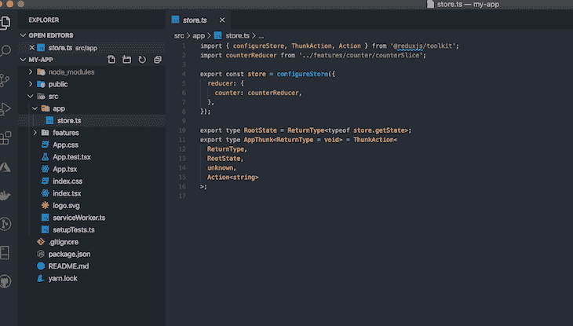
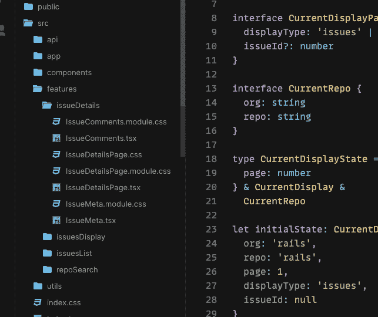

# 将 TypeScript 与 Redux Toolkit 结合使用

> 原文：<https://blog.logrocket.com/using-typescript-with-redux-toolkit/>

React with Redux 中的状态管理非常具有挑战性。除了围绕核心概念和架构模式进行思考之外，您还有大量的样板文件，这些文件可能会使您更加畏缩和困惑。Redux 的创作者 Dan Abramov 比我更好地描述了这种挫败感:



## 我们不只是写 Redux，我们也谈论它。现在听着:

或者以后订阅

### Redux 拯救工具包

## 通过适当程度的抽象， [Redux Toolkit](https://redux-toolkit.js.org/) 是使 Redux 工作不那么令人生畏和更加直观的一次成功尝试。它很容易扩展和适应大型分布式项目。然而，这不是这篇文章的主旨。

您可以更深入地了解[为什么 Redux Toolkit 是一个明智的选择](https://blog.logrocket.com/smarter-redux-with-redux-toolkit/)。相反，我们将集中讨论如何使用 RTK 和 TypeScript。

将 Redux Toolkit 经过深思熟虑的方法和 TypeScript 的类型安全结合起来，将会产生一个更加健壮、可维护和可伸缩的 Redux 项目。然而，用 TypeScript 设置 RTK 并不总是那么简单——这就是我们在本文中试图阐明的。

我们将在这篇文章中讨论的内容

### 安装和初始设置

*   配置商店
*   如何构建你的 Redux 项目
*   使用`createSlice`创建动作减速器
*   带有 thunk、错误处理和加载状态的异步
*   使用`useDispatch`和`useSelector`挂钩连接到商店
*   安装和初始设置

## 如果您刚刚开始使用 React-Redux，那么使用`create-react-app`很容易建立项目。`--template redux-typescript`旗起了作用！

您最终应该会得到一个类似下面这样的项目结构。特别感兴趣的是`app`目录:它包含了`store`和`feature`目录，这两个目录作为子目录保存了应用程序的主要特性。我们稍后将回到这些。

```
npx create-react-app my-app --template redux-typescript
//or
yarn create-react-app my-app --template redux-typescript

```

在现有项目中设置



Our project structure.

### 将 Redux Toolkit 放到现有的 React 项目中也同样容易。当然，您需要安装所有的对等依赖项:

RTK 公开了`configureStore` API，这比传统的 Redux 商店更容易设置。您可以提供中间件和增强器的阵列；`applyMiddleware`和`compose`都是[自动为你](https://redux-toolkit.js.org/usage/usage-guide#simplifying-store-setup-with-configurestore)叫的。

```
npm install @types/react-redux react-redux @reduxjs/toolkit

```

使用`configureStore`配置商店

## 最简单的办法就是用根减器开店。创建`src/app/rootReducer.ts`和`src/app/store.ts`，并添加以下内容:

我们设置了一个空的`rootReducer`，在这里我们将添加所有的 reducers，如下所示:

```
// src/app/rootReducer.ts
import { combineReducers } from '@reduxjs/toolkit'

const rootReducer = combineReducers({})

export type RootState = ReturnType

export default rootReducer

```

我们还将在店内设置`RootState`，用于稍后的`selectors`和动作`dispatch`。当我们键入单个状态和动作时，我们会得到一个正确推断的强类型存储。稍后将详细介绍这一点！

```
const rootReducer = combineReducers({
    oneReducer,
    anotherReducer,
    yetAnotherReducer
})

```

就这么简单——我们现在已经成功建立了我们的 Redux 商店。您还可以配置中间件并将其添加到商店:

```
// src/app/store.ts
import { configureStore, Action } from '@reduxjs/toolkit'
import { useDispatch } from 'react-redux'
import { ThunkAction } from 'redux-thunk'

import rootReducer, { RootState } from './rootReducer'

const store = configureStore({
    reducer: rootReducer,
})

export type AppDispatch = typeof store.dispatch
export const useAppDispatch = () => useDispatch()
export type AppThunk = ThunkAction<void, RootState, unknown, Action>

export default store

```

如何构建你的 Redux 项目

```
import { configureStore, getDefaultMiddleware } from '@reduxjs/toolkit';
import logger from 'redux-logger';
const middleware = [...getDefaultMiddleware(), logger];

export default configureStore({
  reducer,
  middleware,
});

```

## 由于 RTK 相当固执己见，它推荐“特性文件夹”结构。当然，你可以自由地使用最适合你的结构，但是我个人觉得这个结构很容易理解。假设你有一个 GitHub 问题跟踪器，就像官方文档中的例子一样。你会有一个类似于 [this](https://codesandbox.io/s/rtk-github-issues-example-02-issues-display-tdx2w?from-embed) 的文件夹结构:



使用`createSlice`创建动作减速器

## 还记得商店里的`combinedReducer`吗？我们现在将使用`createSlice`创建我们的第一个减速器。想象这是一个应用程序的`authReducer`;任何缩减器都将遵循相同的流程，这取决于您的定制逻辑。

我们已经将`CurrentUser`类型作为泛型传递给了`PayloadAction`,以确保正确的存储类型。

```
// src/features/auth/authSlice.ts
import { createSlice, PayloadAction } from '@reduxjs/toolkit'

import { AppThunk } from '../../app/store'
import { RootState } from '../../app/rootReducer'

export interface AuthError {
    message: string
}

export interface AuthState {
    isAuth: boolean
    currentUser?: CurrentUser
    isLoading: boolean
    error: AuthError
}

export interface CurrentUser {
    id: string
    display_name: string
    email: string
    photo_url: string
}
export const initialState: AuthState = {
    isAuth: false,
    isLoading: false,
    error: {message: 'An Error occurred'},
}

export const authSlice = createSlice({
    name: 'auth',
    initialState,
    reducers: {
        setLoading: (state, {payload}: PayloadAction&lt) => {
            state.isLoading = payload
        },
        setAuthSuccess: (state, { payload }: PayloadAction) => {
            state.currentUser = payload
            state.isAuth = true
        },
        setLogOut: (state) => {
            state.isAuth = false
            state.currentUser = undefined
        },
        setAuthFailed: (state, { payload }: PayloadAction) => {
            state.error = payload
            state.isAuth = false
        },
    },
})

export const { setAuthSuccess, setLogOut, setLoading, setAuthFailed} = authSlice.actions

export const authSelector = (state: RootState) => state.auth

```

注意这里的一个关键问题？切片中的所有方法都是同步的。实际上，我们需要与 API 异步对话来确认身份验证状态。我们将在后面的 async thunk 部分讨论这一点，但是以这种同步方式可视化状态有助于理解数据流。

RTK 也自动生成动作；稍后我们可以从`authSlice.actions`对象中析构它们。

选择器，在这种情况下，`authSelector`将使我们能够在组件树的任何部分获得存储的一部分。我们稍后将回到这一点。

带有 thunk、错误处理和加载状态的异步操作

## 在幕后，RTK 使用`redux-thunk`来处理异步逻辑。如果愿意可以换成`redux-saga`，或者其他替代。让我们看看如何在我们的`authSlice`中处理异步逻辑。

虽然我发现上面的方法足够简单，但另一种方法是使用`[createAsyncThunk](https://redux-toolkit.js.org/usage/usage-with-typescript#createasyncthunk)`。这将根据您传递的活动类型前缀生成承诺生命周期活动类型。然后，它返回一个 thunk 动作创建器，该创建器将运行承诺回调，并根据返回的承诺调度生命周期动作。

```
//src/features/auth/authSlice.ts
  ----
export const login = (): AppThunk =&gt; async (dispatch) =&gt; {
    try {
        dispatch(setLoading(true))
        const currentUser = getCurrentUserFromAPI('https://auth-end-point.com/login')
        dispatch(setAuthSuccess(currentUser))
    } catch (error) {
        dispatch(setAuthFailed(error))
    } finally {
        dispatch(setLoading(false))
    }
}

export const logOut = (): AppThunk =&gt; async (dispatch) =&gt; {
    try {
        dispatch(setLoading(true))
        await endUserSession('https://auth-end-point.com/log-out')
    } catch (error) {
        dispatch(setAuthFailed(error))
    } finally {
        dispatch(setLoading(false))
    }
}

export const authSelector = (state: RootState) =&gt; state.auth
export default authSlice.reducer

```

使用`useDispatch`和`useSelector`挂钩连接到商店

## 让我们将我们的应用程序连接到商店，看看我们如何调度操作并选择商店的任何部分。

结论

```
import React from 'react'
import { login, logOut, authSelector, CurrentUser } from './auth'
import { useSelector, useDispatch } from 'react-redux'
import './App.css'

export function App() {
        const dispatch = useDispatch()
        const { currentUser, isLoading, error, isAuth } = useSelector(authSelector)
        if (isLoading) return <div>....loading</div>
        if (error) return <div>{error.message}</div>
        return (
                <div className="App">
                        {isAuth ? (
                                <button onClick={() => dispatch(logOut)}> Logout</button>
                        ) : (
                                <button onClick={() => dispatch(login)}>Login</button>
                        )}
            <UserProfile user={currentUser}/>
                </div>
        )
}

interface UserProfileProps {
        user?: CurrentUser
}
function UserProfile({ user }: UserProfileProps) {
        return <div>{user?.display_name}</div>
}
```

## 我们已经看到了如何使用 Redux Toolkit 和 TypeScript 进行类型安全的存储、分派和操作。有了`createSlice` API，我们只需几行代码就能轻松设置商店。`useSelector`钩子使我们能够在组件树中的任何点选择存储的任何部分，而`useDispatch`则允许调度一个动作来更新存储。

[LogRocket](https://lp.logrocket.com/blg/typescript-signup) :全面了解您的网络和移动应用

## LogRocket 是一个前端应用程序监控解决方案，可以让您回放问题，就像问题发生在您自己的浏览器中一样。LogRocket 不需要猜测错误发生的原因，也不需要向用户询问截图和日志转储，而是让您重放会话以快速了解哪里出错了。它可以与任何应用程序完美配合，不管是什么框架，并且有插件可以记录来自 Redux、Vuex 和@ngrx/store 的额外上下文。

[](https://lp.logrocket.com/blg/typescript-signup)

除了记录 Redux 操作和状态，LogRocket 还记录控制台日志、JavaScript 错误、堆栈跟踪、带有头+正文的网络请求/响应、浏览器元数据和自定义日志。它还使用 DOM 来记录页面上的 HTML 和 CSS，甚至为最复杂的单页面和移动应用程序重新创建像素级完美视频。

.

[Try it for free](https://lp.logrocket.com/blg/typescript-signup)

.