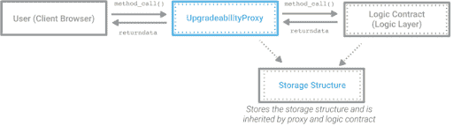
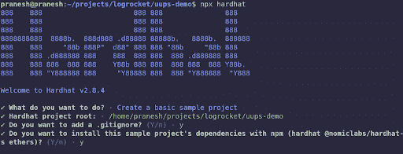
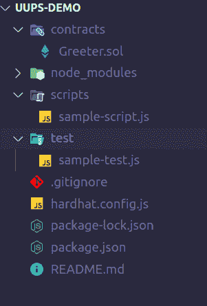
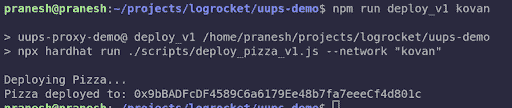
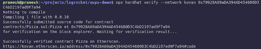
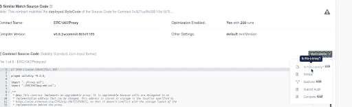
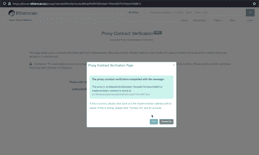
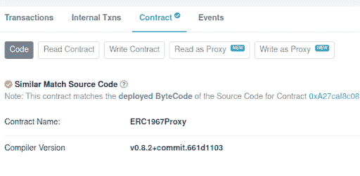
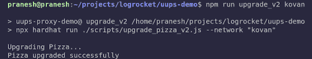
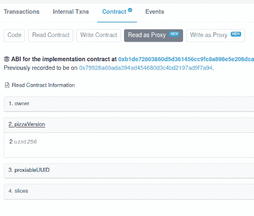

# 使用 UUPS 代理模式升级智能合同

> 原文：<https://blog.logrocket.com/using-uups-proxy-pattern-upgrade-smart-contracts/>

我们都知道区块链最令人印象深刻的特征之一是它的不变性。但是并不是在所有情况下都是有利的。

想象一下，一个部署的智能合约持有的用户资金有一个漏洞。开发人员应该尽早修复这个 bug，就像他们在 Web2 应用程序中所做的那样。但就 Web3 开发而言，情况就不一样了。

传统的智能合约模式不允许这样的热修复。相反，开发人员每次想要添加功能或修复 bug 时，都需要部署新的合同。虽然这在开始时似乎不是一个大问题，但当代码库增长时，这将是一个巨大的开销。每次都需要将数据从旧合同迁移到新合同，以反映协议的当前状态。

为了解决这个问题，已经引入了各种可升级性模式。其中，代理模式被认为是最真实的升级形式。

当我们谈到可升级性时，它意味着客户端总是与同一个契约(代理)交互，但是底层逻辑可以在需要时随时更改(升级)，而不会丢失任何以前的数据。



***注意，**人们可以争辩说，通过可升级的代理，协议甚至可以根据他们的需要改变底层逻辑(即使他们的社区不知道)。有各种方法可以防止这种情况，因为 Dao 遵循时间锁。但是，这超出了本文的范围，这本身是另一天的主题。*

以下是我们将在本文中讨论的内容的摘要:

## 代理模式的类型

目前，有三种类型的代理模式:

*   钻石图案: [EIP-2532](https://eips.ethereum.org/EIPS/eip-2535)
*   透明代理模式
*   通用可升级代理标准(UUPS): [EIP-1822](https://eips.ethereum.org/EIPS/eip-1822)

### 什么是菱形图案？

简而言之，菱形模式是一种可升级的代理模式，其中有多个逻辑契约(面)而不是一个。每当在 diamond 代理契约中调用一个函数时，它都会检查哈希表(映射)以查看哪个方面定义了该函数，然后将调用委托给该方面。这个`delegatecall`发生在代理的`fallback()`方法中。我们可以使用一种叫做`diamondCut()`的方法在单个事务中从任意方面添加或删除任意数量的方法。为了避免存储冲突，这种模式使用了`DiamondStorage`技术。它还允许开发人员独立于其他方面在方面中实现逻辑。

### 什么是透明代理模式？

如前所述，为了实现可升级的智能契约，逻辑层(即，实现契约)与存储层(即，代理契约)分离，并且对代理契约的所有调用被委托给逻辑契约。

这种方法工作得很好，直到一个恶意的后门，代理选择器冲突，被发现和解决。当两个或多个方法在代理和逻辑契约中具有相同的函数签名时，会发生代理选择器冲突。这可能导致智能合同漏洞。

为了解决冲突，OpenZeppelin 引入了透明代理模式。这种模式允许代理和逻辑契约中存在相同的函数签名，但是只有当调用者不是契约管理员时，才会出现逻辑契约的`delegatecall`。否则，如果该函数存在，则在代理契约本身中调用，如果不存在，则返回。

### 什么是 UUPS 代理模式？

UUPS 代理模式类似于透明代理模式，只是升级是通过逻辑契约而不是代理契约触发的。

代理契约中有一个唯一的存储槽来存储它所指向的逻辑契约的地址。每当逻辑契约被升级时，该存储槽就用新的逻辑契约地址来更新。升级合同的功能应该是受保护的功能，以避免未经授权的访问。此外，这提供了逐渐变得完全不可升级的能力，因为如果需要，逻辑契约可以完全移除新实现中的`upgradeTo()`方法。

## 比较代理模式

下表比较了菱形、透明和 UUPS 代理模式的优缺点:

| **代理模式** | **优点** | **缺点** |
| --- | --- | --- |
| 透明代理模式 | 实现起来相对容易和简单；广泛用于 | 相比之下，需要更多的气体来展开 |
| 菱形代理模式 | 通过模块化帮助对抗 24KB 的大小限制；增量升级能力 | 实施和维护更加复杂；使用新人难以理解的新术语；在撰写本文时，以太扫描这样的工具还不支持它 |
| UUPS 代理模式 | 气体效率高；移除可升级性的灵活性 | 不像它相当新那样常用；升级逻辑(访问控制)需要特别小心，因为它存在于实施合同中 |

## 什么时候应该使用 UUPS？

OpenZeppelin 建议使用 UUPS 模式，因为它更节能。但是何时使用 uup 的决定实际上是基于几个因素的，比如项目的业务需求，等等。

UUPS 的最初动机是在 mainnet 上部署许多智能合约钱包。该逻辑可以部署一次。这个代理可以为每个新钱包部署数百次，而不需要花费太多的汽油。

由于升级方法存在于逻辑契约中，如果协议想要在将来完全移除可升级性，开发者可以选择 UUPS。

## 演示时间到了:使用 UUPS 代理模式的智能合同升级

足够的介绍和理论。让我们使用 UUPS 代理模式，利用 Hardhat 和 OpenZeppelin 的 UUPS 库契约，设置和部署一个可升级的 Pizza 契约。

### 使用安全帽和 OpenZeppelin 进行设置

我们将部署一个名为`Pizza`的简单智能契约，并使用 UUPS 代理模式将其升级到`PizzaV2`。

* * *

### 更多来自 LogRocket 的精彩文章:

* * *

由于我们将使用 [Hardhat](https://hardhat.org/) 进行开发，你需要在你的机器上安装 [NodeJS 和 NPM](https://nodejs.org) 。

一旦 Node.js 安装并设置好，您就可以通过运行命令`npm install hardhat -g`从命令行在您的机器上全局安装 Hardhat。

一旦安装了 Hardhat，您就可以轻松地创建新的 Hardhat 项目了！

让我们为我们的项目创建一个全新的目录:

```
mkdir uups-demo && cd uups-demo

```

通过运行`npx hardhat`并选择项目的初始配置来初始化一个新的 Hardhat 项目。



现在，Hardhat 将安装一些必需的库。除此之外，对于 UUPS 模式，我们还需要一些额外的 npm 模块。运行以下命令安装模块。

```
npm i @openzeppelin/contracts-upgradeable @openzeppelin/hardhat-upgrades @nomiclabs/hardhat-etherscan dotenv --save-dev

```

一旦所有东西都安装好了，初始目录结构将如下所示:



***注意，**文件名和内容将随着我们的进行而修改。*

### 签订实施和代理合同

在`contracts` 目录中创建一个名为`Pizza.sol`的新文件，并添加以下代码:

```
// SPDX-License-Identifier: MIT
pragma solidity ^0.8.10;

// Open Zeppelin libraries for controlling upgradability and access.
import "@openzeppelin/contracts-upgradeable/proxy/utils/Initializable.sol";
import "@openzeppelin/contracts-upgradeable/proxy/utils/UUPSUpgradeable.sol";
import "@openzeppelin/contracts-upgradeable/access/OwnableUpgradeable.sol";

contract Pizza is Initializable, UUPSUpgradeable, OwnableUpgradeable {
   uint256 public slices;

      ///@dev no constructor in upgradable contracts. Instead we have initializers
    ///@param _sliceCount initial number of slices for the pizza
   function initialize(uint256 _sliceCount) public initializer {
       slices = _sliceCount;

      ///@dev as there is no constructor, we need to initialise the OwnableUpgradeable explicitly
       __Ownable_init();
   }

   ///@dev required by the OZ UUPS module
   function _authorizeUpgrade(address) internal override onlyOwner {}

   ///@dev decrements the slices when called
   function eatSlice() external {
       require(slices > 1, "no slices left");
       slices -= 1;
   }
}

```

这是一个简单的披萨合同，有三种方法:

*   `initialize()` :可升级的契约应该有一个`initialize`方法来代替构造函数，并且`initializer`关键字确保契约只被初始化一次
*   需要这种方法来防止未经授权的升级，因为在 UUPS 模式中，升级是通过实现契约来完成的，而在透明代理模式中，升级是通过代理契约来完成的
*   `_eatSlice()` :一个简单的函数，用于在调用时减少切片数

现在让我们编译和部署 Pizza 契约。

在此之前，我们必须用以下内容更新`hardhat.config.js`文件:

```
require("@nomiclabs/hardhat-ethers");
require("@openzeppelin/hardhat-upgrades");
require("@nomiclabs/hardhat-etherscan");

require("dotenv").config();

module.exports = {
 solidity: "0.8.10",
 networks: {
   kovan: {
     url: `https://kovan.infura.io/v3/${process.env.INFURA_API_KEY}`,
     accounts: [process.env.PRIVATE_KEY],
   },
 },
 etherscan: {
   apiKey: process.env.ETHERSCAN_API_KEY,
 },
};

```

创建一个名为`.env`的新文件，并添加以下内容:

```
PRIVATE_KEY = <<DEPLOYER_PRIVATE_KEY>>
ETHERSCAN_API_KEY = <<ETHERSCAN_API_KEY>>
INFURA_API_KEY=  <<INFURA_API_KEY>>

```

`PRIVATE_KEY`是部署者钱包的私钥。你可以抓住`[INFURA_API_KEY from here](http://infura.io)`和`[ETHERSCAN_API_KEY from here](http://etherscan.io/login)`。

一旦创建了`.env`文件，您就可以通过在终端中运行`npx hardhat compile`来编译合同。

现在，让我们部署我们的合同。在`scripts` 目录中，创建一个名为`deploy_pizza_v1.js`的新文件，并添加以下内容:

```
const { ethers, upgrades } = require("hardhat");

const SLICES = 8;
async function main() {
 const Pizza = await ethers.getContractFactory("Pizza");

 console.log("Deploying Pizza...");

 const pizza = await upgrades.deployProxy(Pizza, [SLICES], {
   initializer: "initialize",
 });
 await pizza.deployed();

 console.log("Pizza deployed to:", pizza.address);
}

main();

```

保存文件。

现在，您可以通过在终端中运行以下命令来部署契约:

```
npx hardhat run ./scripts/deploy_pizza_v1.js –network kovan

```

您应该会看到类似这样的内容。地址会不一样！



控制台中显示的地址是代理合同的地址。如果您访问 Etherscan 并搜索部署者地址，您将看到通过两个事务创建的两个新合同。第一个是实际披萨合同(执行合同)，第二个是代理合同。

以我为例，披萨合同地址为[0x 79928 a 69 ada 394 ad 454680d 3c 4 BD 2197 ad 9 F7 a 94](https://kovan.etherscan.io/address/0x79928a69ada394ad454680d3c4bd2197ad9f7a94)。

代理合同地址为[0x 9 bbadfcdf 4589 c 6 a 6179 ee 48 b 7 fa 7 eeecf 4d 801 c](https://kovan.etherscan.io/address/0x9bBADFcDF4589C6a6179Ee48b7fa7eeeCf4d801c)*。*

您可以从 Etherscan 复制 Pizza 合同的地址，并通过运行以下命令进行验证:

```
npx hardhat verify –network kovan <<CONTRACT_ADDRESS>>

```

输出应该是这样的:



***注意，**部署后，如果你搞不清哪个契约是代理还是实现，代理契约源代码已经在 Etherscan 上验证过了(大多数情况下)。未经核实的将是实施合同！*

验证后，您的以太网扫描交易将如下所示:


如果你在 Etherscan 里查披萨合同，像`owner`、`slices`等值。因为在代理模式中，一切都是在代理契约的上下文中存储和执行的。

因此，为了与 Pizza 合同进行交互，您应该通过代理合同来完成。为此，首先我们需要通知 Etherscan，部署的契约实际上是一个代理。

在代理合同的`Contract`选项卡中，源代码部分上方会有一个小下拉菜单(在右侧)。



选择“**这是代理吗？”从下拉菜单中选择**，然后**验证**。



在代理合同的**合同**页签中可以看到**读为代理**和**写为代理**选项。



现在，您可以使用这些选项与披萨合同进行交互！

### 升级合同

一段时间后，假设我们必须在披萨合约中加入额外的功能。例如，让我们创建一个简单的函数来填充切片，并创建一个函数来返回当前的合同版本。

我们可以创建我们的 PizzaV2 合同。在 contracts 文件夹中，创建一个名为`PizzaV2.sol`的新文件，添加以下内容，并保存该文件:

```
// SPDX-License-Identifier: MIT
pragma solidity ^0.8.10;

import "./Pizza.sol";

contract PizzaV2 is Pizza {
   ///@dev increments the slices when called
   function refillSlice() external {
       slices += 1;
   }

   ///@dev returns the contract version
   function pizzaVersion() external pure returns (uint256) {
       return 2;
   }
}

```

***注意，**Pizza v2 合同继承了 Pizza 合同。因此，包括两个新功能在内的所有功能都将出现在 V2 合同中。*

一旦文件被保存，现在我们可以将我们的比萨合同升级到 PizzaV2。在`scripts`目录下，新建一个文件`upgrade_pizza_v2.js`，添加以下内容，保存文件。它负责升级已部署的合同:

```
const { ethers, upgrades } = require("hardhat");

const PROXY = <<REPLACE_WITH_YOUR_PROXY_ADDRESS>>;

async function main() {
 const PizzaV2 = await ethers.getContractFactory("PizzaV2");
 console.log("Upgrading Pizza...");
 await upgrades.upgradeProxy(PROXY, PizzaV2);
 console.log("Pizza upgraded successfully");
}

main();

```

您可以运行以下命令来执行升级:

```
npx hardhat run ./scripts/upgrade_pizza_v2.js –network kovan

```



***注意，**如果运行上述命令时遇到任何错误，请重试两三次。应该能行。*

如果您检查 Etherscan，您可以看到来自部署者钱包的另外两个交易。第一个是 PizzaV2 契约的部署，第二个事务将是 Pizza 契约中执行升级的`upgradeTo`调用。这确保了代理契约指向新部署的 PizzaV2 契约。

您可以通过运行以下命令从终端验证 PizzaV2 契约:

```
npx hardhat verify –network kovan <<PIZZA_V2_ADDRESS>>

```

如果您在 Etherscan 中检查代理合同的**合同**选项卡内的**写为代理**选项卡，您可以看到新创建的视图方法`refillSlice()` —与旧方法一样。另外，在 **Read as Proxy** 选项卡中会有一个`pizzaVersion()`方法，确认升级成功！



哇哦。**🎉 🎉**我们已经使用 UUPS 代理模式成功部署和升级了合同！

## 结束语

尽管 UUPS 模式有几个优点，并且推荐的代理模式目前是 UUPS 模式，但是在将它实现到现实世界的项目中之前，我们应该注意一些警告。

一个主要的警告是，因为升级是在`upgradeTo`方法的帮助下通过实现契约完成的，所以更新的实现排除`upgradeTo`方法的风险更高，这可能会永久扼杀升级智能契约的能力。此外，与其他代理模式相比，这种模式实现起来有点复杂。

尽管有这些警告，UUPS 是一个非常高效的代理模式，它有几个优点。这个项目的代码以及一些单元测试可以在这里的 [GitHub repo 中找到。](https://github.com/PraneshASP/uups-proxy)随意摆弄代码。

编码快乐！**🎊**

## 加入像 Bitso 和 Coinsquare 这样的组织，他们使用 LogRocket 主动监控他们的 Web3 应用

影响用户在您的应用中激活和交易的能力的客户端问题会极大地影响您的底线。如果您对监控 UX 问题、自动显示 JavaScript 错误、跟踪缓慢的网络请求和组件加载时间感兴趣，

[try LogRocket](https://lp.logrocket.com/blg/web3-signup)

.

[](https://lp.logrocket.com/blg/web3-signup)[https://logrocket.com/signup/](https://lp.logrocket.com/blg/web3-signup)

LogRocket 就像是网络和移动应用的 DVR，记录你的网络应用或网站上发生的一切。您可以汇总和报告关键的前端性能指标，重放用户会话和应用程序状态，记录网络请求，并自动显示所有错误，而不是猜测问题发生的原因。

现代化您调试 web 和移动应用的方式— [开始免费监控](https://lp.logrocket.com/blg/web3-signup)。