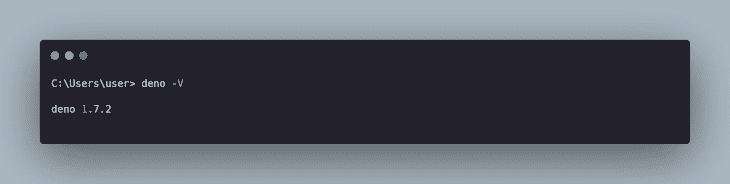
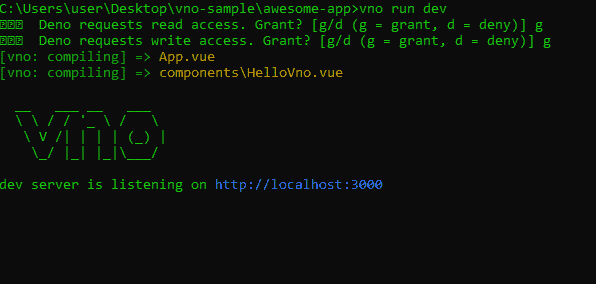
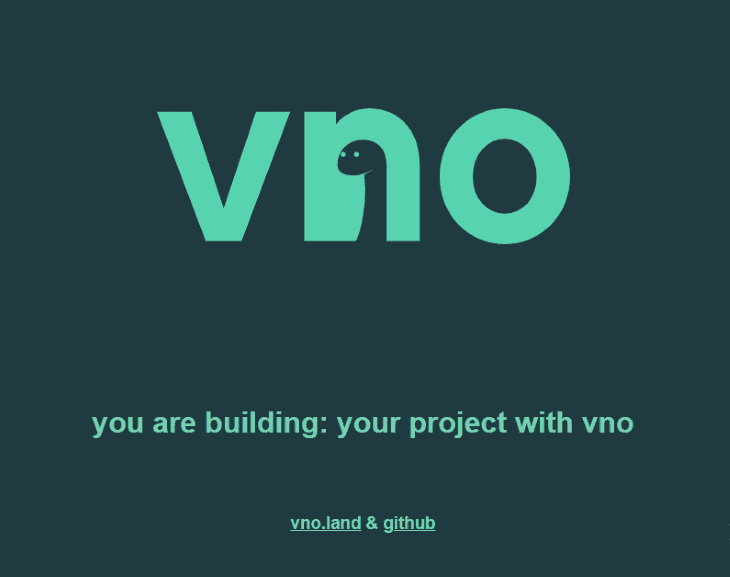

# 使用 vno 配置 Vue 应用程序

> 原文：<https://blog.logrocket.com/using-vno-to-configure-a-vue-app/>

在此之前，不可能使用 Deno 配置 Vue.js 应用程序。但是现在，由于 [vno](https://deno.land/x/vno@v1.2.1) 的引入，这种情况最近发生了变化。

在本文中，我将解释什么是 vno，它提供的强大功能，如何安装 Deno，以及如何使用 vno 配置新的 Vue 应用程序。

## vno 是什么？

vno 的创建者之一 Andrew Rehrig 说:“Vno 是一个解析器、编译器和捆绑器，可以通过一个集成的 CLI 工具轻松访问，该工具可以从头开始创建一个完整的项目，包括一个示例文件结构和组件，也可以用几个简单的命令优化现有的 Vue 项目。”

与使用 Node.js 及其包(节点模块)来配置和捆绑您的 Vue 应用程序的 [Vue CLI](https://cli.vuejs.org/) 不同，vno 将 Vue CLI 的相同体验带到 Deno。

不知道 Deno 是什么？看看[这篇友好的介绍](https://blog.logrocket.com/what-is-deno/)。

## 使用 vno 的优点

*   **更快的开发周期:**与 vue CLI 相比，使用 vno 创建新的 Vue 应用程序更快，因为构建应用程序所需的依赖性更少
*   **没有 node_modules:** 因为 vno 是建立在 Deno 之上的，所以不需要担心通常在用 Node.js 搭建的项目中出现的相对较大的 node_module 文件夹。
*   **易于配置:** vno 预先构建了一个配置文件( *vno.config.js* )，您可以轻松地使用它来调整诸如您的服务器文件、首选端口号、项目标题等选项。
*   **更安全:** vno 是用 Deno(其终极目标是安全性)构建的，这意味着您的项目不能默认访问其他脚本的执行、您的文件系统和您的网络

## 使用 vno 的缺点

*   **无 HR 支持:** vno 目前不支持热重装。如果你的应用中有任何新的变化，你必须在你的终端/CMD 中重新启动项目，并在你的浏览器中重新加载页面
*   **没有服务器端支持:**目前，vno 不支持构建服务器端应用程序(SSR)，但这是 vno 团队计划在未来努力的一个方面
*   **无作用域样式:**作用域 CSS 样式仍在开发中，目前不被支持。

## 使用 vno 配置应用程序的先决条件

本教程假设以下先决条件:

*   某视频剪辑软件
*   命令行界面(CLI)
*   德诺

## 项目设置

### 安装 Deno

所需的第一步是安装 Deno，我们可以使用 [scoop](https://scoop.sh/) 通过运行:

```
scoop install deno

```

一旦完成，运行`deno -V`。如果安装成功，您应该会看到您放入控制台/命令行的 Deno 版本，如下所示:



**注意:**安装 vno 需要 Deno 版本 1.7 或以上。如果您已经安装了 Deno 的早期版本，您可以通过运行以下命令更新到最新版本:

```
deno upgrade

```

### 安装 vno

vno by 的最新稳定版本可以通过运行以下命令来安装:

```
deno install --allow-net --unstable -f -n vno https://deno.land/x/vno/install/vno.ts

```

一旦这个过程完成，您应该会看到一个输出，要求您将`.deno\bin`添加到`PATH`，以及这样做的命令(这个命令会有所不同，取决于您的设备操作系统)。要在 Windows 系统上执行此操作，请运行:

```
set PATH=%PATH%;C:\Users\<PC-Username>\.deno\bin

```

## 创建我们的第一个虚拟运营商应用

与 Vue CLI 类似，创建新应用程序就像运行:

```
vno create new-app

```

完成此过程后，让我们进入新的应用程序目录，并为应用程序提供服务:

```
cd new-app
vno run dev

```

您应该会看到类似这样的内容:



访问完 [http://localhost:3000](http://localhost:3000) 后，您应该会在浏览器上看到以下页面:



### vno 目录结构

*   **组件:**与 Vue CLI 类似，该目录应该包含所有应用程序组件
*   **public:**public 目录包含一个 index.html 文件，您构建的文件将被自动注入其中
*   **vno-build:** 这个目录会在您运行/重新运行`vno run dev`或`vno build`命令时自动生成
*   **App.vue:** 类似于 Vue CLI，`App.vue`文件作为你的 App 入口点。
*   **vno.config.json:** 如果你想进一步配置你的应用，你可以通过编辑这个文件来实现。在这里，您可以轻松地修改您的首选端口，指定您的应用入口点，e.t.c

## 构建您的 vno 应用程序

构建您的 vno 应用程序简单快捷。首先，运行以下命令:

```
vno build

```

这个命令将生成一个新的 **vno-build** 文件夹，它通常包含一个`build.js`和`style.css`文件。

生成这些文件后，创建一个新的 index.html 文件，将`build.js`和`style.css`链接在一起，如下所示:

```
<!DOCTYPE html>
<html lang="en">
  <head>
    <meta charset="utf-8" />
    <meta http-equiv="X-UA-Compatible" content="IE=edge" />
    <meta name="viewport" content="width=device-width,initial-scale=1.0" />
    <link rel="stylesheet" href="./style.css" />
    <title>your project</title>
  </head>
  <body>
    <div id="app">
      <!-- built files will be auto injected -->
    </div>
    <script type="module" src="./build.js"></script>
  </body>
</html>

```

现在构建文件已经链接在一起了，您可以继续运行 index.html 文件了。您应该会看到与我们通过开发服务器运行应用程序时相同的输出。

#### vno 的解析过程

当您运行`vno build`命令时，vno 递归地遍历您的文件结构，定位所有。vue 文件，并开始解析过程。在此过程中，各个组件被隔离并保存，每个文件之间的所有必要连接都被考虑在内，以便在构建过程中可能出现的任何错误都将处于正确的顺序。

## vno 作为一个 API

也可以在不安装 vno CLI 的情况下将 vno 集成到您的应用程序中。

您可以使用如下 URL 将 vno 导入到您的应用程序中:

```
import { Factory } from 'https://deno.land/x/vno/dist/mod.ts';
const vno = new Factory();
await vno.build();

```

如果您已经设置了 vno.config.js 文件，API 将自动搜索它并将其应用到您的应用程序中。但是如果没有 vno.config.js 文件，您可以将对象直接输入到工厂实例中，如下所示:

```
import { Factory } from 'https://deno.land/x/vno/dist/mod.ts';

const vno = Factory.create({
  root: "App",
  entry: "./"
  vue: 3,
  options: {
    port: 3000
  }
})
await vno.build();

```

vno.build()方法与 vno build 命令相同，因为它也将对整个应用程序执行构建，并将其作为一个 javascript 文件和一个 CSS 文件编译到 **vno-build** 目录。

## 结论

在本文中，我向您介绍了 vno 和 Deno，并展示了如何使用 vno 构建新的 Vue 应用程序。

## 像用户一样体验您的 Vue 应用

调试 Vue.js 应用程序可能会很困难，尤其是当用户会话期间有几十个(如果不是几百个)突变时。如果您对监视和跟踪生产中所有用户的 Vue 突变感兴趣，

[try LogRocket](https://lp.logrocket.com/blg/vue-signup)

.

[](https://lp.logrocket.com/blg/vue-signup)[https://logrocket.com/signup/](https://lp.logrocket.com/blg/vue-signup)

LogRocket 就像是网络和移动应用程序的 DVR，记录你的 Vue 应用程序中发生的一切，包括网络请求、JavaScript 错误、性能问题等等。您可以汇总并报告问题发生时应用程序的状态，而不是猜测问题发生的原因。

LogRocket Vuex 插件将 Vuex 突变记录到 LogRocket 控制台，为您提供导致错误的环境，以及出现问题时应用程序的状态。

现代化您调试 Vue 应用的方式- [开始免费监控](https://lp.logrocket.com/blg/vue-signup)。