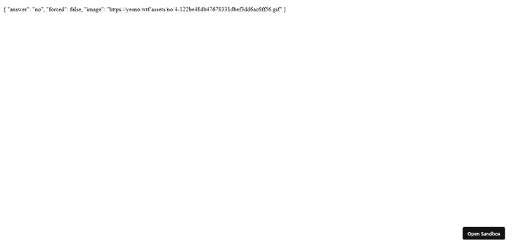

# 使用 Vuex 4 和 Vue 3 

> 原文：<https://blog.logrocket.com/using-vuex-4-with-vue-3/>

编者按:这篇文章在 2021 年 8 月被审查和更新，以包括新的信息。

## Vue 3 中 Vuex 还有存在的必要吗？

Vue 3 中的组合 API 附带了一些特性，如[提供/注入 API](https://blog.logrocket.com/provide-inject-vue-js-3-composition-api/) 和一个新的反应系统，它允许我们在组件外部创建独立的反应变量，并将其导入到我们想要使用的任何组件中。

这两者都可以做 Vuex 的工作，但不足以完全取代 Vuex。我们来看看为什么 Vuex 是仍然有必要的，即使是在 Vue 3 中。

首先，Vuex 提供了 Vue 3 特性所没有的高级调试功能。这对开发人员来说是一个巨大的奖励，因为没有人愿意花那么多时间去调试！

其次，Vuex 有扩展其功能的插件。大多数插件的功能都可以用组合 API 来复制，但是 Vuex 做得更好，结构更有条理。

简短的回答是:是的。Vuex 是 Vue 应用的首选状态管理解决方案， [Vuex 4](https://next.vuex.vuejs.org/) 是与 Vue 3 兼容的版本。

但是，请注意，使用 Vuex 进行状态管理取决于应用程序的复杂性。在一个大的应用程序中，Vuex 可能是多余的，在这种情况下，Provide/Inject API 或 Composition API 的反应特性可能是一个更好的选择。如果您需要进一步的信息，您可以阅读更多关于[何时以及何时不使用 Vuex](https://blog.logrocket.com/do-you-really-need-vuex/) 的信息。

在本教程中，我们将探索如何使用 Vuex 4 与 Vue 3。

## 正在安装 vuex for vue 3

我们可以通过几种方式用 Vue 3 安装 Vuex，其中一种就是使用 script 标签。

要使用脚本标记方法，我们可以编写:

```
<!DOCTYPE html>
<html lang="en">
  <head>
    <script src="https://unpkg.com/[email protected]"></script>
    <script src="https://unpkg.com/[email protected]/dist/vuex.global.js"></script>
    <title>App</title>
  </head>
  <body>
    <div id="app">
      <button>increment</button>
      <p></p>
    </div>
    <script>

      const app = Vue.createApp();
      app.mount("#app");
    </script>
  </body>
</html>

```

上面，我们添加了 Vuex 4 和 Vue 的脚本，然后我们可以在代码中使用 Vuex 全局对象。

## 创建数据存储

Vuex `store`是一个对象，它包装了我们应用程序的所有状态，并使我们能够访问诸如突变、动作和 getters 之类的特性，以便在我们的组件中访问或更新全局状态。

为了创建一个存储，我们用一个对象调用`Vuex.Store`构造函数，这个对象包括我们想要添加的状态和突变，以创建一个基本的存储。

`States`是在我们的 Vuex 商店中存储数据的属性；他们让我们从 Vue 3 应用的任何地方访问数据。

一旦我们创建了我们的商店，我们将它传递给`Vue.createApp`方法，以将商店添加到我们的应用程序中。`app.use(store);`方法调用让我们可以使用 Vue 3 应用程序中的商店。

然后，我们定义应用程序的状态，在本例中是`count`，并创建变异`increment`，这样我们就可以调用它来更新`count`的值。突变是让我们修改 Vuex 存储中的状态的功能。

然后，我们可以使用`this.$store`属性来获取状态并操作我们的存储。`this.$store.commit`方法让我们将突变提交给存储。

我们提交存储中的`increment`突变来更新`count`状态。因此，当我们在模板代码中单击 increment 按钮时，`count` Vuex 状态将随着`count` computed 属性一起更新。

下面是我们的代码应该是什么样子:

```
<!DOCTYPE html>
<html lang="en">
  <head>
    <script src="https://unpkg.com/[email protected]"></script>
    <script src="https://unpkg.com/[email protected]/dist/vuex.global.js"></script>
    <title>App</title>
  </head>
  <body>
    <div id="app">
      <button @click="increment">increment</button>
      <p>{{count}}</p>
    </div>
    <script>
      const store = new Vuex.Store({
        state: {
          count: 0
        },
        mutations: {
          increment(state) {
            state.count++;
          }
        }
      });

      const app = Vue.createApp({
        methods: {
          increment() {
            this.$store.commit("increment");
          }
        },
        computed: {
          count() {
            return this.$store.state.count;
          }
        }
      });
      app.use(store);
      app.mount("#app");
    </script>
  </body>
</html>

```

## 使用 getters 在 Vue 3 中添加存储状态

为了更容易地将存储状态添加到我们的应用程序中，我们可以使用 getters。Getters 是返回一个状态的函数，或者返回已经被操作或与其他值组合的状态。

例如，我们可以通过编写以下内容来添加一个 getter:

```
<!DOCTYPE html>
<html lang="en">
  <head>
    <script src="https://unpkg.com/[email protected]"></script>
    <script src="https://unpkg.com/[email protected]/dist/vuex.global.js"></script>
    <title>App</title>
  </head>
  <body>
    <div id="app">
      <button @click="increment">increment</button>
      <p>{{doubleCount}}</p>
    </div>
    <script>
      const store = new Vuex.Store({
        state: {
          count: 0
        },
        mutations: {
          increment(state) {
            state.count++;
          }
        },
        getters: {
          doubleCount: (state) => {
            return state.count * 2;
          }
        }
      });

      const app = Vue.createApp({
        methods: {
          increment() {
            this.$store.commit("increment");
          }
        },
        computed: {
          ...Vuex.mapGetters(["doubleCount"])
        }
      });
      app.use(store);
      app.mount("#app");
    </script>
  </body>
</html>

```

我们添加了`doubleCount` getter，它返回乘以 2 的`count`状态。然后，在组件中，我们用 getter 的名称调用`Vuex.mapGetters`方法，将它映射到一个计算属性。我们在模板中也有它，所以我们可以看到它的值。

如果我们想要一个方法作为 getter，我们可以在 getter 中返回一个函数。例如，我们可以写:

```
<!DOCTYPE html>
<html lang="en">
  <head>
    <script src="https://unpkg.com/[email protected]"></script>
    <script src="https://unpkg.com/[email protected]/dist/vuex.global.js"></script>
    <title>App</title>
  </head>
  <body>
    <div id="app">
      <div>
        <p>{{getTodoById(1).text}}</p>
      </div>
    </div>
    <script>
      const store = new Vuex.Store({
        state: {
          todos: [
            { id: 1, text: "drink", done: true },
            { id: 2, text: "sleep", done: false }
          ]
        },
        getters: {
          getTodoById: (state) => (id) => {
            return state.todos.find((todo) => todo.id === id);
          }
        }
      });

      const app = Vue.createApp({
        computed: {
          ...Vuex.mapGetters(["getTodoById"])
        }
      });
      app.use(store);
      app.mount("#app");
    </script>
  </body>
</html>

```

我们有了`todos` Vuex 存储状态，我们想通过它的`id`属性值从中获得一个条目。为此，我们有了`getTodosById` getter 方法，它返回一个函数。该函数随后通过调用`find`从`state.todos`数组中返回条目，以通过其`id`值获得值。

在组件中，我们以同样的方式调用`Vuex.mapGetters`来将方法映射到计算的属性。然后，我们可以调用它返回的函数，通过它的`id`值来获取待办事项。因此，`'drink'`应该显示在浏览器屏幕上，因为这里有`id: 1`。

## 用突变修改状态

我们在前面的例子中已经看到了一个突变。这只是一种我们可以用来修改状态的方法。

* * *

### 更多来自 LogRocket 的精彩文章:

* * *

一个突变方法可以接受一个有效载荷，这个有效载荷可以用来修改一个状态值。例如，我们可以写:

```
<!DOCTYPE html>
<html lang="en">
  <head>
    <script src="https://unpkg.com/[email protected]"></script>
    <script src="https://unpkg.com/[email protected]/dist/vuex.global.js"></script>
    <title>App</title>
  </head>
  <body>
    <div id="app">
      <button @click="increment">increment</button>
      <p>{{count}}</p>
    </div>
    <script>
      const store = new Vuex.Store({
        state: {
          count: 0
        },
        mutations: {
          increment(state, n) {
            state.count += n;
          }
        }
      });
      const app = Vue.createApp({
        methods: {
          increment() {
            this.$store.commit("increment", 5);
          }
        },
        computed: {
          count() {
            return this.$store.state.count;
          }
        }
      });
      app.use(store);
      app.mount("#app");
    </script>
  </body>
</html>

```

我们的`increment`突变方法有一个`n`参数，用于增加`count`状态的值。然后，我们调用带有第二个参数的`this.$store.commit`方法，将值传递给`increment`方法。`n`现在应该是`5`，所以`count` Vuex 状态将增加 5。

## 对象样式变异提交

在某些情况下，我们可能需要传递多个数据属性来更新我们的 Vuex 状态，我们可以利用对象样式提交。这也有助于使我们的提交更具描述性。

例如，我们可以写:

```
<!DOCTYPE html>
<html lang="en">
  <head>
    <script src="https://unpkg.com/[email protected]"></script>
    <script src="https://unpkg.com/[email protected]/dist/vuex.global.js"></script>
    <title>App</title>
  </head>
  <body>
    <div id="app">
      <button @click="increment">increment</button>
      <p>{{count}}</p>
    </div>
    <script>
      const store = new Vuex.Store({
        state: {
          count: 0
        },
        mutations: {
          increment(state, { amount }) {
            state.count += amount;
          }
        }
      });
      const app = Vue.createApp({
        methods: {
          increment() {
            this.$store.commit({
              type: "increment",
              amount: 5
            });
          }
        },
        computed: {
          count() {
            return this.$store.state.count;
          }
        }
      });
      app.use(store);
      app.mount("#app");
    </script>
  </body>
</html>

```

在这个代码片段中，我们用一个具有`type`和`amount`属性的对象调用了`this.$store.commit`。

`type`属性用于查找要调用的变异方法的名称。因此，我们将调用`increment`突变方法，因为这是`type`的值。其他属性将与我们作为`increment`方法的第二个参数传递的对象一起传递。

因此，我们从第二个参数`increment`中获取`amount`属性，并使用它来更新 Vuex 商店的`count`状态。

## 带动作的 Vuex 中的异步编码

突变确实有一些局限性。变异方法必须是同步的，这样就可以用 Vuex 跟踪它们的执行顺序。然而，Vuex 有动作方法，让我们运行突变来修改状态。

动作可以运行任何类型的代码，包括异步代码。例如，我们可以写:

```
<!DOCTYPE html>
<html lang="en">
  <head>
    <script src="https://unpkg.com/[email protected]"></script>
    <script src="https://unpkg.com/[email protected]/dist/vuex.global.js"></script>
    <title>App</title>
  </head>
  <body>
    <div id="app">
      <p>{{answer}}</p>
    </div>
    <script>
      const store = new Vuex.Store({
        state: {
          answer: ""
        },
        mutations: {
          setAnswer(state, answer) {
            state.answer = answer;
          }
        },
        actions: {
          async getAnswer(context) {
            const res = await fetch("https://yesno.wtf/api");
            const answer = await res.json();
            context.commit("setAnswer", answer);
          }
        }
      });
      const app = Vue.createApp({
        mounted() {
          this.$store.dispatch("getAnswer");
        },
        computed: {
          answer() {
            return this.$store.state.answer;
          }
        }
      });
      app.use(store);
      app.mount("#app");
    </script>
  </body>
</html>

```

这将添加`setAnswer`动作，该动作作为`actions`属性的方法添加。`context`参数有`commit`方法，让我们提交突变。参数是突变的名称。

`getAnswer`动作方法是异步的，它调用`context.commit`方法来提交`setAnswer`变异。第二个参数中的`answer`作为`answer`参数的值被传递给`setAnswer`方法，并被设置为`state.answer`属性的值。

然后，在组件中，我们可以通过使用`this.$store.state.answer`属性来获取`answer`。在`mounted`钩子中，我们调用`this.$store.dispatch("getAnswer");`来调度`getAnswer`动作。因此，我们应该在模板中看到一个带有答案的对象。



## 结论

Vuex 4 和以前版本的 Vuex 没有太大的不同；v4 更新主要是为了[与 Vue 3](https://blog.logrocket.com/handling-authentication-vuejs-using-vuex-vue-router-and-auth0/) 的兼容性。

它有相同的部分，如 getters、mutations 和 actions，用于获取和设置 Vuex 存储状态。

## 像用户一样体验您的 Vue 应用

调试 Vue.js 应用程序可能会很困难，尤其是当用户会话期间有几十个(如果不是几百个)突变时。如果您对监视和跟踪生产中所有用户的 Vue 突变感兴趣，

[try LogRocket](https://lp.logrocket.com/blg/vue-signup)

.

[](https://lp.logrocket.com/blg/vue-signup)[https://logrocket.com/signup/](https://lp.logrocket.com/blg/vue-signup)

LogRocket 就像是网络和移动应用程序的 DVR，记录你的 Vue 应用程序中发生的一切，包括网络请求、JavaScript 错误、性能问题等等。您可以汇总并报告问题发生时应用程序的状态，而不是猜测问题发生的原因。

LogRocket Vuex 插件将 Vuex 突变记录到 LogRocket 控制台，为您提供导致错误的环境，以及出现问题时应用程序的状态。

现代化您调试 Vue 应用的方式- [开始免费监控](https://lp.logrocket.com/blg/vue-signup)。