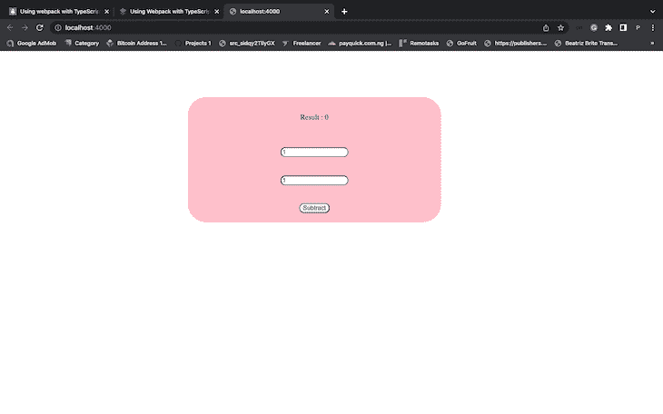
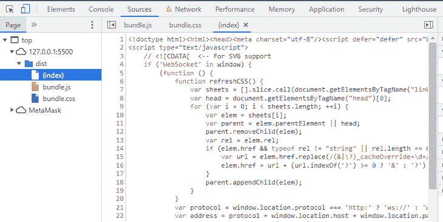
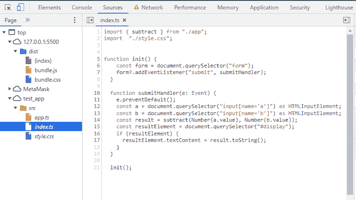

# 将 webpack 与 TypeScript - LogRocket Blog 一起使用

> 原文：<https://blog.logrocket.com/using-webpack-typescript/>

在许多现代项目中使用，webpack 是一个令人惊叹的工具，它优化了应用程序资源，使它们能够在任何设备上更高效地工作。webpack 有助于将模块编译和捆绑到单个文件中，从而减少 HTTP 请求并提高应用程序性能。

使用 webpack，TypeScript 代码被编译成浏览器友好的 JavaScript 文件。使用 webpack 加载器，您还可以将 SASS 和 LESS 文件转换成一个 CSS 包文件。

在本文中，我们将学习如何使用 webpack 将 TypeScript 编译成 JavaScript，将源代码捆绑到单个 JavaScript 文件中，并使用源映射进行调试。我们还将探索如何使用 webpack 插件。

要跟随本教程，您需要以下内容:

*   npm
*   Node.js:如果你已经安装了 Node.js，确保它≥v8.x。
*   您选择的任何代码编辑器；我将使用 [Visual Studio 代码](https://code.visualstudio.com/)
*   打字稿的基础知识

我们开始吧！

* * *

*向前跳转:*

* * *

## webpack 加载程序

默认情况下，webpack 只理解 JavaScript 文件，将每个导入的文件视为一个模块。webpack 不能编译或捆绑非 JavaScript 文件，因此它使用加载器。

加载器告诉 webpack 如何编译和捆绑静态资产。它们用于将 TypeScript 模块编译成 JavaScript，处理应用程序样式，甚至用 ESLint 林挺你的代码。

少数 webpack 加载器包括 ts-loader、css-loader、style-loader 等等；我们将在本教程的后面讨论它们。

## 设置 webpack 和 TypeScript

让我们从建立我们的项目开始。首先，您应该在计算机上安装 TypeScript。若要全局安装 TypeScript，请使用下面的命令:

```
npm install -g typescript

```

全局安装 TypeScript 消除了每次启动新项目时安装 TypeScript 的需要。

接下来，我们将把 webpack 和 [ts-loader](https://www.npmjs.com/package/ts-loader) 包作为依赖项安装到我们的项目中:

```
npm init -y
npm install -D webpack webpack-cli ts-loader webpack-dev-server>
```

## webpack 配置

默认情况下，webpack 不需要配置文件。它将假设您的项目的入口点是`src/index.js`，并将在生产过程中在`dist` / `main.js`中输出缩小和优化的结果。

如果您想要使用插件或加载器，那么您将需要使用 webpack 配置文件，允许您指定 webpack 将如何与您的项目一起工作，要编译哪些文件，以及输出包文件将在哪里。

让我们将 webpack 配置文件添加到项目中。从项目根文件夹中，使用以下配置创建一个`webpack.config.js`文件:

```
const path = require('path');

module.exports = {
  entry: './src/index.ts',
  module: {
    rules: [
      {
        test: /\.ts?$/,
        use: 'ts-loader',
        exclude: /node_modules/,
      },
    ],
  },
  resolve: {
    extensions: ['.tsx', '.ts', '.js'],
  },
  output: {
    filename: 'bundle.js',
    path: path.resolve(__dirname, 'dist'),
  },
  devServer: {
    static: path.join(__dirname, "dist"),
    compress: true,
    port: 4000,
  },
};
```

让我们回顾一些 webpack 配置选项。首先，`entry`选项是应用程序的起点，webpack 在这里开始构建依赖图。webpack 将根据条目文件进入其他模块。

`output`选项告诉 webpack 在哪里保存包文件，并允许您命名包文件。最后，`module`选项告诉 webpack 如何使用加载器处理具有特定规则的模块。

## 类型脚本配置

TypeScript 配置文件控制如何将 TypeScript 编译成 JavaScript，并指定传输 TypeScript 所需的各种编译器选项。

从项目根文件夹中，创建`tsconfig.json`文件并添加以下配置:

```
{
    "compilerOptions": {
        "noImplicitAny": true,
        "target": "ES5",
        "module": "ES2015"
    }
}

```

`target`选项是您想要将类型脚本转换到的 JavaScript 版本，而`module`是所使用的导入语句的格式。您可以将模块设置为 CommonJS、ES6 或 UMD，因为 webpack 将处理所有模块系统。

## 包装配置

现在，我们需要添加一个 webpack 脚本来为我们运行`webpack.config.js`文件。

要添加 webpack 脚本，请打开`package.json`文件，并将以下脚本添加到脚本选项:

```
"develop": "webpack-dev-server --mode development",
"build" : "webpack --mode production"
```

`package.json`文件现在将包含以下配置设置:

```
{
    "name": "webpack-setup",
  "version": "1.0.0",
  "description": "",
  "main": "src/index.ts",
  "scripts": {
    "test": "echo \"Error: no test specified\" && exit 1",
    "develop": "webpack-dev-server --mode development",
    "build": "webpack --mode production"
  },
  "keywords": [],
  "author": "",
  "license": "ISC",
  "devDependencies": {
    "css-loader": "^6.7.1",
    "html-webpack-plugin": "^5.5.0",
    "mini-css-extract-plugin": "^2.6.1",
    "ts-loader": "^9.4.1",
    "webpack": "^5.74.0",
    "webpack-cli": "^4.10.0",
    "webpack-dev-server": "^4.11.1"
  }
}
```

现在，让我们创建一个简单的 TypeScript 程序，它将减去两个数。在`src`文件夹中，创建一个`index.ts`文件，并添加以下类型脚本代码:

```
import { subtract } from "./app";

function init() {
    const form = document.querySelector("form");
    form?.addEventListener("submit", submitHandler);
  }

  function submitHandler(e: Event) {
    e.preventDefault();
    const num1 = document.querySelector("input[name='firstnumber']") as HTMLInputElement;
    const num2 = document.querySelector("input[name='secondnumber']") as HTMLInputElement;
    const result = subtract(Number(num1.value), Number(num2.value));
    const resultElement = document.querySelector("p");
    if (resultElement) {
      resultElement.textContent = result.toString();
    }
  }

  init();

```

接下来，创建另一个`app.ts`文件并添加以下代码:

```
export function subtract(firstnumber: number, secondnumber: number): number {
  return firstnumber - secondnumber;
}

```

运行`develop`脚本将在开发模式下启动应用程序:

```
npm run develop 

```

运行`build`脚本将在生产模式下运行应用程序:

```
npm run build
```

运行 build 命令后，webpack 将把两个 TypeScript 文件转换成 JavaScript 代码，并在`dist`文件夹中生成一个`bundle.js`文件。

## 用`HtmlWebpackPlugin`创建 HTML 页面

`HtmlWebpackPlugin`允许 webpack 生成一个标准的 HTML 页面，为生成的包文件提供服务。

当包的文件名改变或被散列时，`HTMLWebpackPlugin`更新 HTML 页面上的文件名。首先，要安装`HtmlWebpackPlugin`，运行下面的命令:

```
npm install html-webpack-plugin --save-dev
```

接下来，我们需要导入`HtmlWebpackPlugin`并添加到 webpack 配置插件选项，如下所示:

```
const HtmlWebpackPlugin = require("html-webpack-plugin");
const path = require('path');

module.exports = {
  entry: './src/index.ts',
  module: {
    rules: [
      {
        test: /\.ts?$/,
        use: 'ts-loader',
        exclude: /node_modules/,
      }
    ],
  },
  resolve: {
    extensions: ['.tsx', '.ts', '.js'],
  },
  output: {
    filename: 'bundle.js',
    path: path.resolve(__dirname, 'dist'),
  },

  plugins: [
    new HtmlWebpackPlugin({
        title: 'our project', 
        template: 'src/custom.html' }) 
   ],

  devServer: {
    static: path.join(__dirname, "dist"),
    compress: true,
    port: 4000,
  },
};

```

模板是由`HtmlWebpackPlugin`生成的自定义 HTML 文件，将被注入到 HTML 页面中。要创建定制 HTML，在`src`文件夹中，创建一个`custom.html`文件，并添加以下 HTML 代码:

```
<!DOCTYPE html>
<html>
  <head>
    <meta charset="utf-8" />
  </head>
  <body>
    <div class="cal">
      <center>
     <form><br>
      <p>Result : <span id="display"></span></p>
      <input type="number" class="input" placeholder="Enter first number" name="firstnumber" value="1" min="1" min="9" /><br>
      <input type="number" class="input" placeholder="Enter second number" name="secondnumber" value="1" min="1" min="9" /><br><br>
      <button type="submit" class="button">Subtract</button>
    </form>
  </center>
  </div>
  </body>
</html>
```

您不必在自定义 HTML 中包含脚本或链接标签；`HtmlWebpackPlugin`将通过链接包文件 URL 和生成的页面来处理这个问题。

* * *

### 更多来自 LogRocket 的精彩文章:

* * *

在生产模式下运行应用程序将在`dist`文件夹中生成`index.html` HTML 页面。

css-loader 告诉 webpack 如何使用 css 模块。它将`@import`和`URL()`解释为`import/require()`，并解析它们。css-loader 使 webpack 能够编译所有 css 文件，并将其转换为 JavaScript 格式。

用 style-loader 捆绑 CSS 文件会使 HTML 页面样式没有反应，直到`Bundle.js`被完全加载。样式加载器将 CSS 注入 DOM，但是捆绑的 JavaScript 文件必须在样式被注入之前完全加载。要解决这个，我们可以用`[MiniCssExtractPlugin](https://webpack.js.org/plugins/mini-css-extract-plugin/)`。

`MiniCssExtractPlugin`提取 CSS 文件并将它们打包成一个单独的`bundle.css`文件。这有助于减小 CSS 资产的大小，并避免加载它们的不必要的 HTTP 请求。

我们可以通过在终端中运行以下命令来安装 css-loader 和`MiniCssExtractPlugin`:

```
npm install css-loader --save-dev
npm install mini-css-extract-plugin --save-dev
```

现在，让我们将 css-loader 和`MiniCssExtractPlugin`添加到`webpack.config.js`文件中。

在`webpack.config.js`文件的顶部，使用下面的代码导入`MiniCssExtractPlugin`模块:

```
const MiniCssExtractPlugin = require("mini-css-extract-plugin");

```

然后，我们将向`rules`属性添加一个新规则，如下所示:

```
…
{
        test: /\.css$/,
        use: [MiniCssExtractPlugin.loader, "css-loader"]
}
…

```

当 css-loader 将所有 css 文件编译成 JavaScript 时，`MiniCssExtractPlugin.loader`将 CSS 加载到 CSS bundle 文件中。

接下来，我们将把`MiniCssExtractPlugin`添加到插件选项，如下所示:

```
plugins: [
    new HtmlWebpackPlugin({
        title: 'our project', // Load a custom template (lodash by default)
        template: 'src/custom.html' }),
    new MiniCssExtractPlugin({
      filename:"bundle.css"})
  ]

```

现在我们已经配置了`css-loader`和`MiniCssExtractPlugin`，让我们创建一个 CSS 文件并将其导入到`index.ts`中。在`src`文件夹中，创建一个`index.css`文件，并添加以下 CSS 代码:

```
form {
    background-color:pink;
    margin-top:100px;
    border-radius:40px;
}
.cal{
    width:550px;
    height:300px;
    margin-left:400px;
}

.button{
    border-radius:10px;
    margin-top:20px;
    margin-bottom:20px;
}
.input{
    border-radius:10px;
    margin-top:40px;
}

```

在`index.ts`中，导入 CSS 样式如下:

```
import styles "./main.css"

```

运行`npm run build`将会捆绑 CSS 并将其应用到`index.html`。当您在开发模式下启动应用程序并在浏览器上打开`[http://localhost:4000](http://localhost:4000)`时，它看起来应该如下图所示:



## 缩小 CSS

我们可以使用 [`css-minimizer-webpack-plugin`](https://webpack.js.org/plugins/css-minimizer-webpack-plugin/) 删除不用的 CSS 规则，只保留必要的规则，从而减小 CSS 文件的大小。

`css-minimizer-webpack-plugin`分析编译后的 CSS 文件，找出任何未使用的样式。这个插件将从你最终的 CSS 文件中移除这些未使用的样式，从而减小文件的大小。

运行下面的安装命令来安装`css-minimizer-webpack-plugin`:

```
npm install css-minimizer-webpack-plugin --save-dev

```

让我们将`css-minimizer-webpack-plugin`添加到 webpack 配置中。首先，导入插件，如下所示:

```
const CssMinimizerPlugin = require("css-minimizer-webpack-plugin");

```

然后，我们将向 webpack 配置添加一个新的优化属性，如下所示:

```
optimization: {
    minimizer: [
      new CssMinimizerPlugin()
    ],
  }

```

当我们运行 build 命令时，`bundle.css`将被缩小，但`bundle.js`不会。默认的`bundle.js`最小化已经被我们设置的最小化选项覆盖。为了解决这个问题，我们需要使用`TerserWebpackPlugin`来缩小 JavaScript。

## 缩小 JavaScript

在撰写本文时的 webpack 当前版本 v5.74.0 和更高版本中，您不必安装 [`TerserWebpackPlugin`](https://webpack.js.org/plugins/terser-webpack-plugin/) ，因为它是开箱即用的。首先，我们必须导入`TerserWebpackPlugin`:

```
const TerserPlugin = require("terser-webpack-plugin");

```

然后，将`TerserPlugin`添加到最小化选项，如下所示:

```
optimization: {
    minimizer: [
      new CssMinimizerPlugin(),
     new TerserPlugin()
    ],
  }

```

如果您运行`build`脚本并查看`dist`文件夹中的包文件，您会看到 JavaScript 和 CSS 都被缩小了。

## 使用`Copywebpackplugin`

我们可以配置 webpack，使用`[CopyWebpackPlugin](https://webpack.js.org/plugins/copy-webpack-plugin/)`将应用程序资产从开发文件夹复制到构建文件夹`dist`。这个插件可以将图像、视频和其他资源复制到`dist`文件夹中。

使用以下命令安装`CopyWebpackPlugin`:

```
npm install copy-webpack-plugin --save-dev

```

现在，让我们将`CopyWebpackPlugin`添加到 webpack 配置中。按如下方式导入插件:

```
const CopyPlugin = require("copy-webpack-plugin");

```

接下来，我们将把`CopyWebpackPlugin`添加到插件选项中。`from`属性是我们要从中复制的文件夹，`to`属性是`dist`目录中要将所有文件复制到的文件夹:

```
...
plugins: [
new HtmlWebpackPlugin({
        title: 'our project', // Load a custom template (lodash by default)
        template: 'src/custom.html' }),
    new MiniCssExtractPlugin({
      filename:"bundle.css"}),
    new CopyPlugin({
      patterns: [
        { from: "src/img", to: "img" }
      ]
    }),
  ]

...

```

创建一个新的`img`文件夹，并在其中添加图像。一旦运行构建命令，图像将被复制到`dist/img`。

## 使用源映射进行调试

当我们通过将 TypeScript 文件编译成 JavaScript 文件来使用捆绑包时，我们可能需要使用浏览器的 DevTool 来调试和测试捆绑包文件。

当您在浏览器的 DevTool 上调试代码时，您会注意到只出现了包文件。每当我们的 TypeScript 代码中出现错误时，它只会在包文件中指出，这使得很难将错误追溯到 TypeScript 进行更正。然而，有了源映射，我们可以使用我们的 DevTool 轻松地调试 TypeScript:



源映射显示原始的源文件，使我们可以很容易地调试 TypeScript，修复包和缩小的 JavaScript 代码。

源映射`.map`文件包含原始源文件和捆绑文件的细节。DevTools 使用这个文件来映射原始源文件和捆绑文件。

要为包文件生成`.map`文件，我们需要配置 webpack 和 TypeScript。在 TypeScript 配置文件中，将`sourceMap`添加到编译器选项中，并将其值设置为`true`:

```
{
    "compilerOptions": {
        "noImplicitAny": true,
        "target": "ES5",
        "module": "ES2015",
        "sourceMap": true
    }
}

```

接下来，我们将把`devtool`属性添加到 webpack 配置中，并将其设置为`true`，告诉 webpack 为每个包文件生成一个适当的源映射:

```
module.exports = {
  devtool: 'source-map',
   ...
}

```

当您运行 build 命令时，您将能够直接调试原始源代码:



## 结论

随着 TypeScript 越来越受欢迎，webpack 已经成为希望优化项目的开发人员的一个重要选择。使用 webpack 插件，我们可以优化 TypeScript 应用程序资源。

在本教程中，我们逐步完成了用 TypeScript 设置 webpack 的过程。我们还学习了如何使用 webpack 插件优化 TypeScript 应用程序，并探索了如何使用源映射调试 TypeScript 代码。

## [LogRocket](https://lp.logrocket.com/blg/typescript-signup) :全面了解您的网络和移动应用

[](https://lp.logrocket.com/blg/typescript-signup)

LogRocket 是一个前端应用程序监控解决方案，可以让您回放问题，就像问题发生在您自己的浏览器中一样。LogRocket 不需要猜测错误发生的原因，也不需要向用户询问截图和日志转储，而是让您重放会话以快速了解哪里出错了。它可以与任何应用程序完美配合，不管是什么框架，并且有插件可以记录来自 Redux、Vuex 和@ngrx/store 的额外上下文。

除了记录 Redux 操作和状态，LogRocket 还记录控制台日志、JavaScript 错误、堆栈跟踪、带有头+正文的网络请求/响应、浏览器元数据和自定义日志。它还使用 DOM 来记录页面上的 HTML 和 CSS，甚至为最复杂的单页面和移动应用程序重新创建像素级完美视频。

[Try it for free](https://lp.logrocket.com/blg/typescript-signup)

.