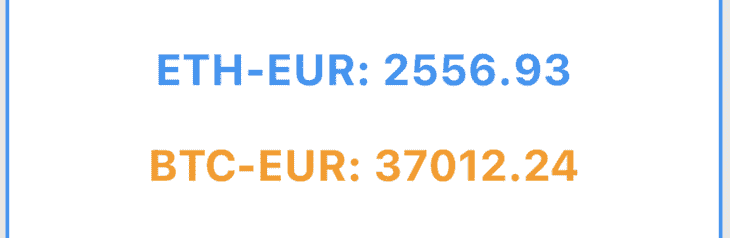
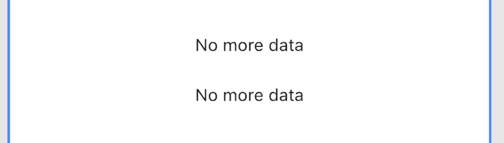
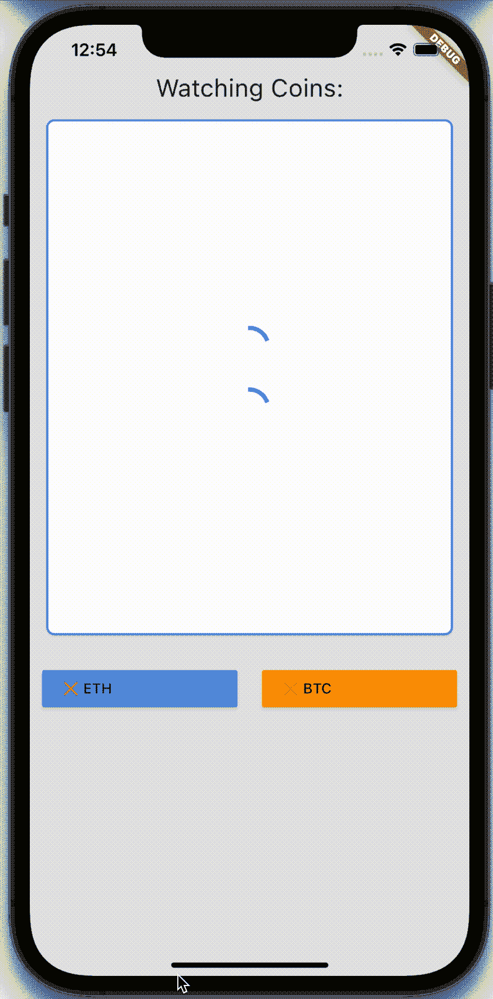

# 在 Flutter 中使用 WebSockets

> 原文：<https://blog.logrocket.com/using-websockets-flutter/>

如今，许多应用需要实时数据来向用户提供即时反馈，无论是显示一个人实时打字的聊天应用，还是直接从硬件传感器绘制数据的远程应用。

我们试图用 REST 解决这些问题，但是面临一个复杂的问题:为了获得接近即时的反馈，我们必须每分钟 ping 服务器几次，这在架构上很难实现，并且会使服务器过载。

但是，如果使用像 Firebase Realtime Database 这样的解决方案，您会注意到，只要一条新记录添加到数据库中，Flutter 应用程序就会接收它作为一个`Stream`并将数据显示给用户。

但是 Firebase 是如何实现的呢？事实是，Firebase 等框架依赖于一项非常重要的技术:WebSockets。

在本文中，我们将探索如何使用我们自己的 WebSockets 来创建向用户显示实时数据的应用程序。

## 什么是 WebSocket API？

根据 Mozilla 的说法，WebSocket API 是“一种先进的技术，它可以在用户的浏览器和服务器之间打开双向的交互式通信会话……你可以向服务器发送消息并接收事件驱动的响应，而不必轮询服务器的回复。”

简而言之，WebSockets 由以下部分组成:

*   流式传输信息的服务器
*   准备接收新数据流的应用程序中的一个`client`
*   用于在`client`和服务器之间通信的`channel`
*   `Messages`在`client`和服务器之间发送

与 REST 相反，使用 WebSockets，我们在向服务器发送消息后，不等待来自服务器的响应。我们可以发送一条消息，并从服务器接收几十条消息。

在某种程度上，你可以把它想象成订阅通知；我们订阅了一个特定的主题，例如，USD-EUR 的兑换值，然后每当 USD-EUR 的兑换值发生变化时，我们都会收到来自服务器的新消息。

这种实时通信流使 WebSockets 成为股票交易应用程序、聊天应用程序、物联网应用程序和其他必须接收输入数据流的应用程序的理想技术。

问题是，我们如何在 Flutter 中使用它们？

## 在 Dart 中使用 WebSockets

幸运的是， [Flutter 的语言 Dart](https://blog.logrocket.com/introduction-to-using-dart-in-flutter/) 为我们提供了一个开箱即用的解决方案来处理 WebSockets: [的`WebSocket`类。](https://api.dart.dev/stable/2.14.2/dart-io/WebSocket-class.html)

如果我们只为一个目标开发应用程序(桌面、网络或移动)，那么我们可以安全地使用`WebSocket`。

然而，当我们选择跨平台使用我们的应用时，我们必须意识到`WebSocket`类依赖于`dart:io`和`dart:html`，这意味着我们不能同时为移动和网络编译。

谢天谢地，Dart 团队创建了`[web_socket_channel](https://pub.dev/packages/web_socket_channel)` [，这是一个官方库](https://pub.dev/packages/web_socket_channel)，它抽象了`dart:io`和`dart:html`逻辑，允许我们使用一个类来创建多平台应用程序。

要使用`web_spclet_channel`，我们必须遵循三个简单的步骤:

1.  使用`WebSocketChannel`创建一个新客户端，并通过`connect`功能连接到一个通道
2.  使用`stream` getter 收听收到的消息
3.  使用`sink` getter 向服务器发送消息

在本文中，我们将使用来自 [CoinBase Pro API](https://docs.pro.coinbase.com/) 的一个例子，通过 WebSockets 获取加密货币的实时价值。

### 创建新的 Dart 项目

让我们通过在命令行上使用以下命令来创建一个全新的 Dart 项目:

```
dart create websocket_example

```

这将在`websocket_example`文件夹中创建一个新的 Dart 专用项目。

接下来，在您最喜欢的 IDE 中打开项目并添加`web_socket_channel`依赖项:

```
dependencies:
  web_socket_channel: ^2.1.0

```

创建好项目后，让我们看看 CoinBase Pro API。

我们的 WebSocket 客户端必须连接到 URI`wss://ws-feed.pro.coinbase.com`，才能接收更新。为了监听这些更新，我们必须`listen`接收任何传入的消息:

```
import 'package:web_socket_channel/web_socket_channel.dart';

void main(List<String> arguments) {
  /// Create the WebSocket channel
  final channel = WebSocketChannel.connect(
    Uri.parse('wss://ws-feed.pro.coinbase.com'),
  );

  /// Listen for all incoming data
  channel.stream.listen(
    (data) {
      print(data);
    },
    onError: (error) => print(error),
  );

}

```

由于我们想从服务器接收当前值为 BTC-欧元的更新，我们必须使用来自 API 的`[subscribe](https://docs.cloud.coinbase.com/exchange/docs/overview#subscribe)` [消息。要向服务器发送消息，我们可以使用新创建的`WebSocketChannel`中的`sink`向服务器发送 JSON 消息:](https://docs.cloud.coinbase.com/exchange/docs/overview#subscribe)

```
import 'dart:convert';

import 'package:web_socket_channel/web_socket_channel.dart';

void main(List<String> arguments) async {
  /// Create the WebSocket channel
  final channel = WebSocketChannel.connect(
    Uri.parse('wss://ws-feed.pro.coinbase.com'),
  );

  channel.sink.add(
    jsonEncode(
      {
        "type": "subscribe",
        "channels": [
          {
            "name": "ticker",
            "product_ids": [
              "BTC-EUR",
            ]
          }
        ]
      },
    ),
  );

  /// Listen for all incoming data
  channel.stream.listen(
    (data) {
      print(data);
    },
    onError: (error) => print(error),
  );
}

```

要查看它的运行情况，我们可以使用`dart run bin/web_socket_example.dart`命令。希望我们可以看到打印出来自 CoinBase Pro API 的新消息的新日志:

```
{"type":"subscriptions","channels":[{"name":"ticker","product_ids":["BTC-EUR"]}]}
{"type":"ticker","sequence":12764748963,"product_id":"BTC-EUR","price":"36941.64","open_24h":"38285.55","volume_24h":"4722.06983151","low_24h":"34300","high_24h":"38674.98","volume_30d":"43802.53509763","best_bid":"36934.04","best_ask":"36941.64","side":"buy","time":"2021-09-21T08:00:20.424250Z","trade_id":50228771,"last_size":"0.08072577"}
{"type":"ticker","sequence":12764749180,"product_id":"BTC-EUR","price":"36941.55","open_24h":"38285.55","volume_24h":"4722.08309939","low_24h":"34300","high_24h":"38674.98","volume_30d":"43802.54836551","best_bid":"36933.09","best_ask":"36941.55","side":"buy","time":"2021-09-21T08:00:21.167335Z","trade_id":50228772,"last_size":"0.01326788"}

```

一个问题仍然存在:我们可以打开一个渠道，但我们如何关闭它？

### 关闭频道

同样的方式我们访问底层`sink`向服务器发送新数据，我们也可以用它来`close`一段时间后的连接:

```
void main(List<String> arguments) async {
  // ...

  /// Wait for 5 seconds
  await Future.delayed(Duration(seconds: 5));

  /// Close the channel
  channel.sink.close();
}

```

如果我们重新运行应用程序，我们会看到五秒钟后，它关闭了频道和应用程序。

## 在颤振中显示实时数据

既然我们已经创建了一个使用 WebSockets 的简单 Dart 应用程序，[我们可以创建一个 Flutter 应用程序](https://blog.logrocket.com/tag/flutter/)来展示我们如何使用 WebSockets。幸运的是，我们之前完成的所有代码都可以在我们的 Flutter 应用程序中重用。该应用程序将:

*   显示欧洲货币的值
*   显示 BTC-欧洲的价值
*   如果用户需要，关闭两个通道

为此，我们将使用两个不同的套接字通道:一个接收 ETH-EUR 消息，另一个接收 BTC-EUR 消息。

但是，请记住，CoinBase Pro API 允许我们使用一个通道来接收多个值，这些值可以使用和映射传入的消息，以显示在不同的小部件中。

我们必须创建适当的`CoinbaseRequest`和`CoinbaseResponse`类，并使用`json_serializable`轻松地序列化和反序列化它们，而不是使用普通的`Map`来接收和发送消息到服务器:

```
import 'package:json_annotation/json_annotation.dart';

part 'coinbase_request.g.dart';

@JsonSerializable()
class CoinbaseRequest {
  final String type;
  final List<Map<String, dynamic>> channels;

  CoinbaseRequest(this.type, this.channels);

  factory CoinbaseRequest.fromJson(Map<String, dynamic> json) =>
      _$CoinbaseRequestFromJson(json);

  Map<String, dynamic> toJson() => _$CoinbaseRequestToJson(this);
}
import 'package:json_annotation/json_annotation.dart';

part 'coinbase_response.g.dart';

@JsonSerializable()
class CoinbaseResponse {
  final String price;
  @JsonKey(name: 'product_id')
  final String productId;

  CoinbaseResponse(this.price, this.productId);

  factory CoinbaseResponse.fromJson(Map<String, dynamic> json) =>
      _$CoinbaseResponseFromJson(json);

  Map<String, dynamic> toJson() => _$CoinbaseResponseToJson(this);
}

```

为了隔离我们的 WebSocket 逻辑，让我们创建`CoinbaseProvider`,它负责:

*   通过构造函数创建 WebSocket 通道
*   用`openBitcoin`方法向通道发送消息
*   使用`bitcoinStream`暴露数据的`Stream`
*   用`closeBitcoin`方法关闭 WebSocket 通道

这同样适用于`Ethereum`，但是为了让这个例子更易读，我们将只展示`BTC-EUR`的代码:

```
/// Manages opening and closing the sockets for the
/// two different sockets: ETH socker and BTC socket
class CoinbaseProvider {
  late final WebSocketChannel _btcWebsocket;

  static const _btcProduct = "BTC-EUR";

  CoinbaseProvider()
      : _btcWebsocket = WebSocketChannel.connect(
          Uri.parse('wss://ws-feed.pro.coinbase.com'),
        );

  Stream<CoinbaseResponse> get bitcoinStream => _btcWebsocket.stream
      .map<CoinbaseResponse>(
          (value) => CoinbaseResponse.fromJson(jsonDecode(value)))
      .skipWhile((element) => element.productId != _btcProduct);

  void openBitcoin() {
    _btcWebsocket.sink.add(
      jsonEncode(
        CoinbaseRequest(
          'subscribe',
          [
            {
              "name": "ticker",
              "product_ids": [_btcProduct]
            }
          ],
        ).toJson(),
      ),
    );
  }

  void closeBitcoin() {
    _btcWebsocket.sink.close();
  }

```

### 使用`StreamBuilder`小部件

根据我们之前的经验，我们发现 Dart 中的`WebSockets`公开了一个`Stream`来接收来自服务器的传入消息，这意味着我们需要一个小部件来接收一个`Stream`并对其做出反应。

为此，我们可以使用`[StreamBuilder](https://api.flutter.dev/flutter/widgets/StreamBuilder-class.html)` [小部件](https://api.flutter.dev/flutter/widgets/StreamBuilder-class.html)，它会告诉我们:

*   我们正在等待数据
*   我们收到了数据
*   我们收到一个错误
*   流以一个`done`事件结束

使用我们的提供者，我们可以创建一个小部件来可视化地显示这些状态，比如一个微调器来指示我们正在等待数据。


我们可以通过显示欧洲瑞士法郎和 BTC 法郎的当前价格来显示我们收到的数据。



我们可以关闭 WebSockets 并显示“没有更多的数据”



使用`StreamBuilder` `connectionState`和`data`来获取关于每个状态的信息，我们可以复制我们想要显示给用户的所有三个状态:

*   当我们还没有收到任何数据时的加载状态
*   当前欧洲法郎或 BTC 法郎价格
*   关闭 WebSocket 连接后的关闭状态

```
class CoinPrice extends StatelessWidget {
  final Stream stream;
  final Color color;

  const CoinPrice({
    required this.stream,
    required this.color,
    Key? key,
  }) : super(key: key);

  @override
  Widget build(BuildContext context) {
    return Padding(
      padding: const EdgeInsets.all(12.0),
      child: StreamBuilder(
        stream: stream,
        builder: (context, snapshot) {
          /// We are waiting for incoming data data
          if (snapshot.connectionState == ConnectionState.waiting) {
            return const Center(
              child: CircularProgressIndicator(),
            );
          }

          /// We have an active connection and we have received data
          if (snapshot.connectionState == ConnectionState.active &&
              snapshot.hasData) {
            return Center(
              child: Text(
                '${snapshot.data!.productId}: ${snapshot.data!.price}',
                style: TextStyle(
                  color: color,
                  fontSize: 24.0,
                  fontWeight: FontWeight.bold,
                ),
              ),
            );
          }

          /// When we have closed the connection
          if (snapshot.connectionState == ConnectionState.done) {
            return const Center(
              child: Text(
                'No more data',
                style: TextStyle(
                  color: Colors.red,
                ),
              ),
            );
          }

          /// For all other situations, we display a simple "No data"
          /// message
          return const Center(
            child: Text('No data'),
          );
        },
      ),
    );
  }
}

```

### 创建按钮小部件

有了接收完整数据流的小部件，我们可以继续创建一个按钮小部件，它向 CoinBase 服务器发送一条消息，以接收关于`BTC-EUR`当前价格的信息，并创建另一个关闭所有套接字连接的按钮。

第一个按钮是`CoinButton`，它可以通过 WebSocket 发送消息，开始接收关于特定硬币的数据。

我们不是创建两个不同的小部件，每个部件对应一种加密货币，而是创建一个通用的小部件，它接受`title`、`backgroundColor`和`isOpen`来了解我们是否已经在接收该硬币的信息。

最后，它将接受`onTap`,允许我们用适当的函数调用`CoinbaseProvider`:

```
/// Send WebSocket message to receive information
/// regarding a certain coin
/// 
/// Usage:
/// ```dart
/// CoinButton(
///  isSocketOpen: _showBitcoin,
///  title: "BTC",
///  backgroundColor: Colors.orange,
///  onTap: (isSocketOpen) {
///    if (!isSocketOpen) {
///      widget.provider.openBitcoin();
///      setState(() => _showBitcoin = true);
///    }
///  },
///)
/// ```
class CoinButton extends StatelessWidget {
  final bool isSocketOpen;
  final String title;
  final Function(bool) onTap;
  final Color backgroundColor;

  const CoinButton({
    required this.isSocketOpen,
    required this.title,
    required this.onTap,
    required this.backgroundColor,
    Key? key,
  }) : super(key: key);

  @override
  Widget build(BuildContext context) {
    return MaterialButton(
      onPressed: () => !isSocketOpen ? onTap(isSocketOpen) : null,
      color: backgroundColor,
      child: Row(
        children: [
          if (!isSocketOpen)
            const Icon(
              Icons.close,
              color: Colors.red,
            ),
          if (isSocketOpen)
            const Icon(
              Icons.check,
              color: Colors.green,
            ),
          Text(title),
        ],
      ),
    );
  }
}

```

其次，我们将创建一个接受`CoinbaseProvider`作为参数的`CloseWebSocketsWidget`，这样我们就可以访问`closeBitcoin`和`closeEthereum`函数:

```
/// Button to close the WebSocket connection
class CloseSocketsWidget extends StatelessWidget {
  const CloseSocketsWidget({
    Key? key,
    required this.provider,

  }) : super(key: key);

  final CoinbaseProvider provider;

  @override
  Widget build(BuildContext context) {
    return MaterialButton(
      color: Colors.red,
      child: Row(
        mainAxisAlignment: MainAxisAlignment.center,
        children: const <Widget>[
          Icon(
            Icons.warning,
            color: Colors.white,
          ),
          SizedBox(
            width: 12.0,
          ),
          Text(
            "CLOSE SOCKETS",
            style: TextStyle(
              color: Colors.white,
            ),
          )
        ],
      ),
      onPressed: () {
        provider.closeBitcoin();
        provider.closeEthereum();
      },
    );
  }
}

```

综上所述，我们可以创建一个简单的应用程序，实时显示不同的加密货币价格:



## 结论

有些时候，我们必须向用户显示实时数据，正如我们所看到的，WebSockets 可以让我们在 Flutter 应用程序中轻松完成这一过程，只需四个简单的步骤:

1.  创建客户端
2.  将客户端连接到通道
3.  向服务器发送消息
4.  监听传入的消息

这允许我们创建反应式的应用程序，我们的`StreamBuilders`小部件可以根据当前状态进行更改。我们在等待新的数据吗？我们收到错误或新数据了吗？

这些问题可以转化为 UI 组件，例如动画显示某人正在聊天中输入内容或更新页面上图形的值。

现在，问你一个问题！您曾经需要在您的应用程序中向用户显示实时数据吗？如果有，你用的是什么？Firebase？WebSockets？gRPC 服务器端流？

很好奇能收到你的回信！😁

要查看完整的代码，你可以查看这个库。

## 使用 [LogRocket](https://lp.logrocket.com/blg/signup) 消除传统错误报告的干扰

[](https://lp.logrocket.com/blg/signup)

[LogRocket](https://lp.logrocket.com/blg/signup) 是一个数字体验分析解决方案，它可以保护您免受数百个假阳性错误警报的影响，只针对几个真正重要的项目。LogRocket 会告诉您应用程序中实际影响用户的最具影响力的 bug 和 UX 问题。

然后，使用具有深层技术遥测的会话重放来确切地查看用户看到了什么以及是什么导致了问题，就像你在他们身后看一样。

LogRocket 自动聚合客户端错误、JS 异常、前端性能指标和用户交互。然后 LogRocket 使用机器学习来告诉你哪些问题正在影响大多数用户，并提供你需要修复它的上下文。

关注重要的 bug—[今天就试试 LogRocket】。](https://lp.logrocket.com/blg/signup-issue-free)