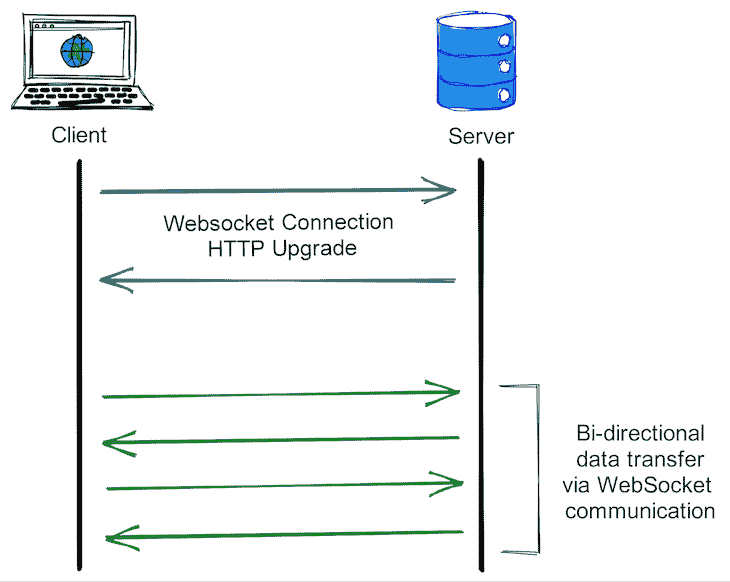
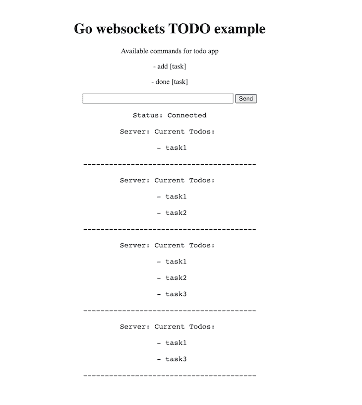

# 在 Golang - LogRocket 博客中使用 WebSockets

> 原文：<https://blog.logrocket.com/using-websockets-go/>

在现代数字时代，用户希望信息能够被即时处理。不管应用程序是什么类型，滞后和缓冲都会对 UX 产生严重的后果。

在过去，[使用像 HTTP 轮询](https://blog.logrocket.com/websockets-tutorial-how-to-go-real-time-with-node-and-react-8e4693fbf843/#HTTPpolling)这样的方法发送和接收消息是一个真正的挑战。服务器上的阻塞给开发者和用户都带来了延迟和挫折。然而，2008 年 WebSockets 的发布为构建实时应用程序引入了一个有效而简单的解决方案。

在本文中，我们将学习如何在 Go 中使用 WebSockets 实现一个待办事项应用。我们将深入探索 WebSockets，为 Go 设置 WebSockets，最后，探索 WebSockets 的一些用例。

如果你是新手，我建议你先熟悉 Go 中的 [web 服务器。我们开始吧！](https://blog.logrocket.com/creating-a-web-server-with-golang/)

## 什么是 WebSockets？

WebSockets 是一种通信协议，它在单一持久的传输 控制协议 (TCP)连接上使用全双工通信信道。

使用全双工通信，服务器和客户端可以同时传输和接收数据而不会被阻塞，与使用半双工通信(如 HTTP 轮询)的替代方案相比，减少了开销。

WebSockets 以较少的开销实现了 web 服务器和 web 浏览器或客户端应用程序之间的实时通信和快速数据传输。WebSocket 通信发起握手，握手使用 HTTP `Upgrade()`头从 HTTP 协议变为 WebSocket 协议。

无需客户机的事先请求，就可以从服务器传输数据，允许消息来回传递，并保持连接打开，直到客户机或服务器终止连接。因此，在客户端和服务器之间可以进行双向实时数据传输。WebSocket 通信通常通过 TCP 端口号`443`来完成。

WebSocket 协议规范定义了两种 URI 方案:

*   WebSocket ( `ws`):用于非加密连接
*   WebSocket Secure ( `wss`):用于加密连接



让我们探索使用 WebSockets 构建应用程序的每个步骤。

## 设置 HTTP 服务器

WebSockets 是建立在 HTTP 之上的，所以首先，我们将建立一个基本的 HTTP 服务器，它可以接受客户机连接并提供消息。将以下代码添加到您的`server.go`文件中:

```
package main

import (
    "fmt"
    "net/http"
)

func main() {
    http.HandleFunc("/", func (w http.ResponseWriter, r *http.Request) {
        fmt.Fprintf(w, "Setting up the server!")
    })
    http.ListenAndServe(":8080", nil)
}

```

通过运行`go run server.go`启动服务器。当您访问`localhost:3000`时，您应该会看到以下输出:

```
Setting up the server!

```

## 开始握手

要建立 WebSocket 连接，客户端和服务器之间需要一次握手。握手使用`Upgrade()`方法将 HTTP 服务器连接升级到 WebSocket 协议。一旦服务器停止，我们还将使用`defer`来关闭连接。

让我们修改我们的`server.go`文件来设置一个 WebSocket 握手:

> 注意:客户端必须发送第一个握手请求。然后，服务器可以验证这个 WebSocket 请求，并用适当的响应回复客户端。

```
conn, err := upgrader.Upgrade(w, r, nil)
if err != nil {
log.Print("upgrade failed: ", err)
return
}
defer conn.Close()
```

## 设置我们的待办事项应用程序

现在我们已经在 WebSockets 中设置了一个基本的应用程序，让我们添加用于添加和完成任务的功能。我们将从客户端在应用程序中设置这两个命令，作为对命令的响应，我们将发送当前的待办事项列表。

首先，我们将添加一个 web 模板，并设置我们的客户机来请求连接并向服务器发送消息。我们将使用一个简单的 HTML 文件和一个创建套接字连接的脚本。

随着应用程序的进一步构建，您可以将 JavaScript 代码移到一个单独的文件中。我们将向`websockets.html`添加以下代码:

```
<html>
  <div>
    <h1>Go websockets TODO example</h1>
    <p>Available commands for todo app</p>
    <p>- add [task]</p>
    <p>- done [task]</p>
    <input id="input" type="text" size="40" />
    <button onclick="send()">Send</button>
    <pre id="output"></pre>
  </div>
  <style>
    html {
      text-align: center;
      font-size: 16px;
    }
    div {
      padding: 1rem;
    }
    #input {
      font-size: 16px;
    }
    p {
        font-size: 16px;
    }
  </style>
  <script>
    var input = document.getElementById("input");
    var output = document.getElementById("output");
    var socket = new WebSocket("ws://localhost:8080/todo");

    socket.onopen = function () {
      output.innerHTML += "Status: Connected\n";
    };

    socket.onmessage = function (e) {
      output.innerHTML += "\nServer: " + e.data + "\n";
    };

    function send() {
      socket.send(input.value);
      input.value = "";
    }
  </script>
</html>

```

现在我们的客户端已经准备好了，让我们更新我们的处理程序来管理我们的待办事项应用程序的功能。
我们将添加命令`add`和`done`来完成任务。待办事项处理程序也将以待办事项列表的当前状态进行响应。

将以下代码复制到`server.go`:

```
package main

import (
    "log"
    "net/http"
    "strings"

    "github.com/gorilla/websocket"
)

var upgrader = websocket.Upgrader{}
var todoList []string

func getCmd(input string) string {
    inputArr := strings.Split(input, " ")
    return inputArr[0]
}

func getMessage(input string) string {
    inputArr := strings.Split(input, " ")
    var result string
    for i := 1; i < len(inputArr); i++ {
        result += inputArr[i]
    }
    return result
}

func updateTodoList(input string) {
    tmpList := todoList
    todoList = []string{}
    for _, val := range tmpList {
        if val == input {
            continue
        }
        todoList = append(todoList, val)
    }
}

func main() {

    http.HandleFunc("/todo", func(w http.ResponseWriter, r *http.Request) {
        // Upgrade upgrades the HTTP server connection to the WebSocket protocol.
        conn, err := upgrader.Upgrade(w, r, nil)
        if err != nil {
            log.Print("upgrade failed: ", err)
            return
        }
        defer conn.Close()

        // Continuosly read and write message
        for {
            mt, message, err := conn.ReadMessage()
            if err != nil {
                log.Println("read failed:", err)
                break
            }
            input := string(message)
            cmd := getCmd(input)
            msg := getMessage(input)
            if cmd == "add" {
                todoList = append(todoList, msg)
            } else if cmd == "done" {
                updateTodoList(msg)
            }
            output := "Current Todos: \n"
            for _, todo := range todoList {
                output += "\n - " + todo + "\n"
            }
            output += "\n----------------------------------------"
            message = []byte(output)
            err = conn.WriteMessage(mt, message)
            if err != nil {
                log.Println("write failed:", err)
                break
            }
        }
    })

    http.HandleFunc("/", func(w http.ResponseWriter, r *http.Request) {
        http.ServeFile(w, r, "websockets.html")
    })

    http.ListenAndServe(":8080", nil)
}

```

现在，运行您的服务器，您应该会在`localhost:8080`上看到工作待办应用程序。随意添加新项目来个性化您的待办事项列表。

添加并完成几个任务后，待办事项应用程序应该看起来像下面的截图:



## WebSockets 的用例

WebSockets 的主要目的是支持全双工或双向通信。除了提供实时更新，WebSockets 还包括一个单一的轻量级服务器，可以支持多个开放式 WebSocket 连接。与大多数其他方法相比，WebSockets 可以在更长的时间内维持客户端和服务器之间的连接。

目前，WebSockets 为 Android、iOS、web 和桌面应用程序提供跨平台支持，WebSockets 通常用于以下类型的应用程序:

*   实时消息传递
*   多人游戏
*   实时分数馈送
*   协作编辑工具
*   实时位置和方向应用
*   音频和视频[使用 WebRTC 聊天](https://blog.logrocket.com/creating-chat-application-with-webrtc/)

## 摘要

在本文中，我们探索了 WebSockets，简要介绍了它们是如何工作的，密切关注全双工通信。为了理解 WebSockets 在 Go 中是如何工作的，我们构建了一个简单的待办事项应用程序，它具有添加和删除任务的功能。最后，我们看了使 WebSockets 有用和通用的几个附加特性，并回顾了 WebSockets 的一些实际应用。

在 Go 中使用 WebSockets 相当简单明了，但是这种组合会对应用程序的性能产生巨大的影响。

## 使用 [LogRocket](https://lp.logrocket.com/blg/signup) 消除传统错误报告的干扰

[](https://lp.logrocket.com/blg/signup)

[LogRocket](https://lp.logrocket.com/blg/signup) 是一个数字体验分析解决方案，它可以保护您免受数百个假阳性错误警报的影响，只针对几个真正重要的项目。LogRocket 会告诉您应用程序中实际影响用户的最具影响力的 bug 和 UX 问题。

然后，使用具有深层技术遥测的会话重放来确切地查看用户看到了什么以及是什么导致了问题，就像你在他们身后看一样。

LogRocket 自动聚合客户端错误、JS 异常、前端性能指标和用户交互。然后 LogRocket 使用机器学习来告诉你哪些问题正在影响大多数用户，并提供你需要修复它的上下文。

关注重要的 bug—[今天就试试 LogRocket】。](https://lp.logrocket.com/blg/signup-issue-free)