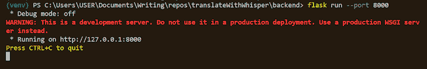
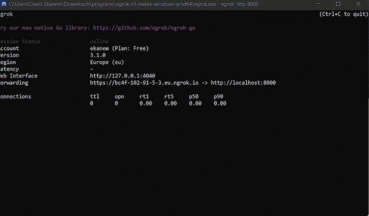
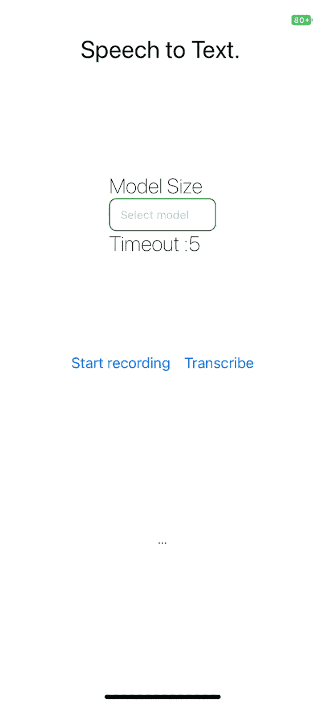

# 在 React Native 中使用 Whisper 进行语音识别

> 原文：<https://blog.logrocket.com/using-whisper-speech-recognition-react-native/>

在本文中，我们将使用 Whisper 创建一个语音到文本的应用程序。Whisper 需要 Python 后端，所以我们将使用 Flask 为应用程序创建服务器。

React Native 作为构建我们的移动客户端的框架。我希望你喜欢创建这个应用程序的过程，因为我确实喜欢。让我们开始吧。

*向前跳转:*

## 什么是语音识别？

语音识别使程序能够将人的语音处理成书面格式。语法、句法、结构和音频对于理解和处理人类语言是必不可少的。

语音识别算法是计算机科学中最复杂的领域之一。人工智能、[机器学习](https://blog.logrocket.com/machine-learning-in-rust-using-linfa/)，无监督预训练技术的发展，以及在自我监督学习和从原始音频学习方面有效的 [Wav2Vec 2.0](https://arxiv.org/abs/2006.11477) 等框架，都提升了他们的能力。

语音识别器由以下组件组成:

*   语音输入
*   解码器，依赖声学模型、发音词典和语言模型进行输出
*   单词输出

这些组件和技术进步使得大量未标记语音数据集的消费成为可能。预训练的音频编码器能够学习高质量的语音表示；它们唯一的缺点是不受监督。

### 什么是解码器？

性能解码器将语音表示映射到可用的输出。解码器解决了音频编码器的监控问题。但是，解码器限制了 Wav2Vec 等框架对语音识别的有效性。解码器使用起来可能非常复杂，需要熟练的从业者，尤其是因为 Wav2Vec 2.0 这样的技术很难使用。

关键是结合尽可能多的高质量语音识别数据集。以这种方式训练的模型比基于单一来源训练的模型更有效。

## 什么是耳语？

Whisper，或 [WSPR](https://openai.com/blog/whisper/) ，代表网络规模的语音识别监督预训练。耳语模型接受训练，能够预测文本的文字。

Whisper 依靠[序列到序列模型](https://blog.keras.io/a-ten-minute-introduction-to-sequence-to-sequence-learning-in-keras.html)来映射话语及其转录形式，这使得语音识别管道更加有效。Whisper 配备了一个音频语言检测器，这是一个经过[vox linga 107](http://bark.phon.ioc.ee/voxlingua107/)训练的微调模型。

Whisper 数据集由音频和来自互联网的文字记录组成。数据集的质量随着自动过滤方法的使用而提高。

## 设置耳语

要使用 Whisper，我们需要依赖 Python 作为我们的后端。Whisper 还需要命令行工具 [ffmpeg](https://ffmpeg.org/) ，它使我们的应用程序能够记录、转换和流式传输音频和视频。

下面是在不同的机器上安装 ffgmeg 的必要命令:

```
# on Ubuntu or Debian
sudo apt update && sudo apt install ffmpeg

# on Arch Linux
sudo pacman -S ffmpeg

# on MacOS using Homebrew (https://brew.sh/)
brew install ffmpeg

# on Windows using Chocolatey (https://chocolatey.org/)
choco install ffmpeg

# on Windows using Scoop (https://scoop.sh/)
scoop install ffmpeg

```

## 用 Flask 创建后端应用程序

在本节中，我们将为我们的应用程序创建后端服务。 [Flask](https://flask.palletsprojects.com/en/2.2.x/installation/) 是用 Python 写的 web 框架。我选择使用 Flask 作为这个应用程序，因为它易于设置。

Flask 开发团队[推荐使用最新版本的 Python](https://flask.palletsprojects.com/en/2.2.x/installation/) ，尽管 Flask 仍然支持 Python ≥ 3.7。

一旦先决条件的安装完成，我们就可以创建项目文件夹来保存我们的客户端和后端应用程序。

```
mkdir translateWithWhisper && cd translateWithWhisper && mkdir backend && cd backend

```

Flask 利用虚拟环境来管理项目依赖性；Python 有一个现成的 [venv 模块](https://docs.python.org/3/library/venv.html#module-venv)来创建它们。

在终端窗口中使用下面的命令创建`venv`文件夹。这个文件夹包含我们的依赖项。

```
python3 -m venv venv
```

### 指定项目依赖关系

使用一个`requirements.txt`文件，指定必要的依赖关系。`requirements.txt`文件位于后端目录的根目录下。

```
touch requirements.txt
code requirements.txt
```

将以下代码复制并粘贴到`requirements.txt`文件中:

```
numpy
tqdm
transformers>=4.19.0
ffmpeg-python==0.2.0
pyaudio
SpeechRecognition
pydub
git+https://github.com/openai/whisper.git
--extra-index-url https://download.pytorch.org/whl/cu113
torch
flask
flask_cors

```

### 创建 Bash shell 脚本来安装依赖项

在根项目目录中，创建一个 Bash shell 脚本文件。Bash 脚本处理 Flask 应用程序中依赖项的安装。

在根项目目录中，打开终端窗口。使用以下命令创建 shell 脚本:

```
touch install_dependencies.sh
code install_dependencies.sh
```

将以下代码块复制并粘贴到`install_dependencies.sh`文件中:

```
# install and run backend
cd backend && python3 -m venv venv
source venv/Scripts/activate

pip install wheel
pip install -r requirements.txt

```

现在，在根目录中打开一个终端窗口，并运行以下命令:

```
sh .\install_dependencies.sh
```

## 创建一个`transcribe`端点

现在，我们将在应用程序中创建一个`transcribe`端点，它将从客户端接收音频输入。应用程序将转录输入并将转录的文本返回给客户端。

这个端点接受一个`POST`请求并处理输入。当响应是 200 HTTP 响应时，客户机接收转录的文本。

创建一个`app.py`文件来保存处理输入的逻辑。打开一个新的终端窗口，并在后端目录中创建一个`app.py`文件:

```
touch backend/app.py
code backend/app.py
```

将下面的代码块复制并粘贴到`app.py`文件中:

```
import os
import tempfile
import flask
from flask import request
from flask_cors import CORS
import whisper

app = flask.Flask(__name__)
CORS(app)

// endpoint for handling the transcribing of audio inputs
@app.route('/transcribe', methods=['POST'])
def transcribe():
    if request.method == 'POST
        language = request.form['language']
        model = request.form['model_size']

        # there are no english models for large
        if model != 'large' and language == 'english':
            model = model + '.en'
        audio_model = whisper.load_model(model)

        temp_dir = tempfile.mkdtemp()
        save_path = os.path.join(temp_dir, 'temp.wav')

        wav_file = request.files['audio_data']
        wav_file.save(save_path)

        if language == 'english':
            result = audio_model.transcribe(save_path, language='english')
        else:
            result = audio_model.transcribe(save_path)

        return result['text']
    else:
        return "This endpoint only processes POST wav blob"

```

### 运行烧瓶应用程序

在包含`venv`变量的激活终端窗口中，运行以下命令启动应用程序:

```
$ cd backend
$ flask run –port 8000
```

期望应用程序启动时没有任何错误。如果是这种情况，在终端窗口中应该可以看到以下结果:



这就结束了 Flask 应用程序中的`transcribe`端点的创建。

## 托管服务器

要向 iOS 中创建的 HTTP 端点发出网络请求，我们需要路由到 HTTPS 服务器。ngrok 解决了创建重路由的问题。

[下载 ngrok](https://ngrok.com/download) ，然后安装包并打开。一个终端窗口启动；输入以下命令以使用 ngrok 托管服务器:

```
ngrok http 8000
```

ngrok 将生成一个托管的 URL，该 URL 将在客户端应用程序中用于请求。



## 使用 React Native 创建语音识别移动应用程序

对于教程的这一部分，您需要安装一些东西:

*   Expo CLI :与 Expo 工具接口的命令行工具
*   用于 Android 和 iOS 的 Expo Go 应用程序:用于打开通过 Expo CLI 提供的应用程序

在新的终端窗口中，初始化 React 本地项目:

```
npx create-expo-app client
cd client
```

现在，启动开发服务器:

```
npx expo start
```

要在 iOS 设备上打开应用程序，请打开相机并扫描终端上的二维码。在 Android 设备上，按下 Expo Go 应用程序的**主页**标签上的**扫描二维码**。


Our Expo Go app

### 处理录音

[Expo-av](https://docs.expo.dev/versions/latest/sdk/av/) 处理我们应用程序中的音频录制。我们的 Flask 服务器希望文件采用`.wav`格式。expo-av 包允许我们在保存前指定格式。

在终端中安装必要的软件包:

```
yarn add axios expo-av react-native-picker-select
```

### 创建模型选择器

应用程序必须能够选择模型大小。有五个选项可供选择:

*   微小的
*   基础
*   小的
*   中等
*   大的

选定的输入大小决定了在服务器上将输入与什么模型进行比较。

再次在终端中，使用以下命令创建一个`src`文件夹和一个名为`/components`的子文件夹:

```
mkdir src
mkdir src/components
touch src/components/Mode.tsx
code src/components/Mode.tsx
```

将代码块粘贴到`Mode.tsx`文件中:

```
import React from "react";
import { View, Text, StyleSheet } from "react-native";
import RNPickerSelect from "react-native-picker-select";

const Mode = ({
  onModelChange,
  transcribeTimeout,
  onTranscribeTimeoutChanged,
}: any) => {
  function onModelChangeLocal(value: any) {
    onModelChange(value);
  }

  function onTranscribeTimeoutChangedLocal(event: any) {
    onTranscribeTimeoutChanged(event.target.value);
  }

  return (
    <View>
      <Text style={styles.title}>Model Size</Text>
      <View style={{ flexDirection: "row" }}>
        <RNPickerSelect
          onValueChange={(value) => onModelChangeLocal(value)}
          useNativeAndroidPickerStyle={false}
          placeholder={{ label: "Select model", value: null }}
          items={[
            { label: "tiny", value: "tiny" },
            { label: "base", value: "base" },
            { label: "small", value: "small" },
            { label: "medium", value: "medium" },
            { label: "large", value: "large" },
          ]}
          style={customPickerStyles}
        />
      </View>
      <View>
        <Text style={styles.title}>Timeout :{transcribeTimeout}</Text>
      </View>
    </View>
  );
};

export default Mode;
const styles = StyleSheet.create({
  title: {
    fontWeight: "200",
    fontSize: 25,
    float: "left",
  },
});
const customPickerStyles = StyleSheet.create({
  inputIOS: {
    fontSize: 14,
    paddingVertical: 10,
    paddingHorizontal: 12,
    borderWidth: 1,
    borderColor: "green",
    borderRadius: 8,
    color: "black",
    paddingRight: 30, // to ensure the text is never behind the icon
  },
  inputAndroid: {
    fontSize: 14,
    paddingHorizontal: 10,
    paddingVertical: 8,
    borderWidth: 1,
    borderColor: "blue",
    borderRadius: 8,
    color: "black",
    paddingRight: 30, // to ensure the text is never behind the icon
  },
});

```

### 创建`Transcribe`输出

服务器返回带有文本的输出。该组件接收输出数据并显示它。

```
mkdir src
mkdir src/components
touch src/components/TranscribeOutput.tsx
code src/components/TranscribeOutput.tsx
```

将代码块粘贴到`TranscribeOutput.tsx`文件中:

```
import React from "react";
import { Text, View, StyleSheet } from "react-native";
const TranscribedOutput = ({
  transcribedText,
  interimTranscribedText,
}: any) => {
  if (transcribedText.length === 0 && interimTranscribedText.length === 0) {
    return <Text>...</Text>;
  }

  return (
    <View style={styles.box}>
      <Text style={styles.text}>{transcribedText}</Text>
      <Text>{interimTranscribedText}</Text>
    </View>
  );
};
const styles = StyleSheet.create({
  box: {
    borderColor: "black",
    borderRadius: 10,
    marginBottom: 0,
  },
  text: {
    fontWeight: "400",
    fontSize: 30,
  },
});

export default TranscribedOutput;

```

### 创建客户端功能

应用程序依靠 [Axios](https://www.npmjs.com/package/axios) 来发送和接收来自 Flask 服务器的数据；我们在前面的部分安装了它。测试应用程序的默认语言是英语。

在`App.tsx`文件中，导入必要的依赖关系:

```
import * as React from "react";
import {
  Text,
  StyleSheet,
  View,
  Button,
  ActivityIndicator,
} from "react-native";
import { Audio } from "expo-av";
import FormData from "form-data";
import axios from "axios";
import Mode from "./src/components/Mode";
import TranscribedOutput from "./src/components/TranscribeOutput";

```

### 创建状态变量

该应用程序需要跟踪正在进行的记录、转录数据、记录和转录。默认情况下，在状态中设置语言、型号和超时。

```
export default () => {
  const [recording, setRecording] = React.useState(false as any);
  const [recordings, setRecordings] = React.useState([]);
  const [message, setMessage] = React.useState("");
  const [transcribedData, setTranscribedData] = React.useState([] as any);
  const [interimTranscribedData] = React.useState("");
  const [isRecording, setIsRecording] = React.useState(false);
  const [isTranscribing, setIsTranscribing] = React.useState(false);
  const [selectedLanguage, setSelectedLanguage] = React.useState("english");
  const [selectedModel, setSelectedModel] = React.useState(1);
  const [transcribeTimeout, setTranscribeTimout] = React.useState(5);
  const [stopTranscriptionSession, setStopTranscriptionSession] =
    React.useState(false);
  const [isLoading, setLoading] = React.useState(false);
  return (
    <View style={styles.root}></View>
)
}

const styles = StyleSheet.create({
  root: {
    display: "flex",
    flex: 1,
    alignItems: "center",
    textAlign: "center",
    flexDirection: "column",
  },
});

```

### 创建引用、语言和模型选项变量

[useRef 钩子](https://reactjs.org/docs/hooks-reference.html#useref)使我们能够跟踪当前初始化的属性。我们想在转录会话、语言和模型上设置`useRef`。

将代码块粘贴到`setLoading` `useState`钩子下:

```
  const [isLoading, setLoading] = React.useState(false);
  const intervalRef: any = React.useRef(null);

  const stopTranscriptionSessionRef = React.useRef(stopTranscriptionSession);
  stopTranscriptionSessionRef.current = stopTranscriptionSession;

  const selectedLangRef = React.useRef(selectedLanguage);
  selectedLangRef.current = selectedLanguage;

  const selectedModelRef = React.useRef(selectedModel);
  selectedModelRef.current = selectedModel;

  const supportedLanguages = [
    "english",
    "chinese",
    "german",
    "spanish",
    "russian",
    "korean",
    "french",
    "japanese",
    "portuguese",
    "turkish",
    "polish",
    "catalan",
    "dutch",
    "arabic",
    "swedish",
    "italian",
    "indonesian",
    "hindi",
    "finnish",
    "vietnamese",
    "hebrew",
    "ukrainian",
    "greek",
    "malay",
    "czech",
    "romanian",
    "danish",
    "hungarian",
    "tamil",
    "norwegian",
    "thai",
    "urdu",
    "croatian",
    "bulgarian",
    "lithuanian",
    "latin",
    "maori",
    "malayalam",
    "welsh",
    "slovak",
    "telugu",
    "persian",
    "latvian",
    "bengali",
    "serbian",
    "azerbaijani",
    "slovenian",
    "kannada",
    "estonian",
    "macedonian",
    "breton",
    "basque",
    "icelandic",
    "armenian",
    "nepali",
    "mongolian",
    "bosnian",
    "kazakh",
    "albanian",
    "swahili",
    "galician",
    "marathi",
    "punjabi",
    "sinhala",
    "khmer",
    "shona",
    "yoruba",
    "somali",
    "afrikaans",
    "occitan",
    "georgian",
    "belarusian",
    "tajik",
    "sindhi",
    "gujarati",
    "amharic",
    "yiddish",
    "lao",
    "uzbek",
    "faroese",
    "haitian creole",
    "pashto",
    "turkmen",
    "nynorsk",
    "maltese",
    "sanskrit",
    "luxembourgish",
    "myanmar",
    "tibetan",
    "tagalog",
    "malagasy",
    "assamese",
    "tatar",
    "hawaiian",
    "lingala",
    "hausa",
    "bashkir",
    "javanese",
    "sundanese",
  ];

  const modelOptions = ["tiny", "base", "small", "medium", "large"];
  React.useEffect(() => {
    return () => clearInterval(intervalRef.current);
  }, []);

  function handleTranscribeTimeoutChange(newTimeout: any) {
    setTranscribeTimout(newTimeout);
  }

```

## 创建录制功能

在这一节中，我们将编写五个函数来处理音频转录。

### `startRecording`功能

第一个函数是`startRecording`函数。该功能使应用程序能够请求使用麦克风的许可。所需的音频格式是预设的，我们有一个 ref 用于跟踪超时:

```
  async function startRecording() {
    try {
      console.log("Requesting permissions..");
      const permission = await Audio.requestPermissionsAsync();
      if (permission.status === "granted") {
        await Audio.setAudioModeAsync({
          allowsRecordingIOS: true,
          playsInSilentModeIOS: true,
        });
        alert("Starting recording..");
        const RECORDING_OPTIONS_PRESET_HIGH_QUALITY: any = {
          android: {
            extension: ".mp4",
            outputFormat: Audio.RECORDING_OPTION_ANDROID_OUTPUT_FORMAT_MPEG_4,
            audioEncoder: Audio.RECORDING_OPTION_ANDROID_AUDIO_ENCODER_AMR_NB,
            sampleRate: 44100,
            numberOfChannels: 2,
            bitRate: 128000,
          },
          ios: {
            extension: ".wav",
            audioQuality: Audio.RECORDING_OPTION_IOS_AUDIO_QUALITY_MIN,
            sampleRate: 44100,
            numberOfChannels: 2,
            bitRate: 128000,
            linearPCMBitDepth: 16,
            linearPCMIsBigEndian: false,
            linearPCMIsFloat: false,
          },
        };
        const { recording }: any = await Audio.Recording.createAsync(
          RECORDING_OPTIONS_PRESET_HIGH_QUALITY
        );
        setRecording(recording);
        console.log("Recording started");
        setStopTranscriptionSession(false);
        setIsRecording(true);
        intervalRef.current = setInterval(
          transcribeInterim,
          transcribeTimeout * 1000
        );
        console.log("erer", recording);
      } else {
        setMessage("Please grant permission to app to access microphone");
      }
    } catch (err) {
      console.error(" Failed to start recording", err);
    }
  }

```

### `stopRecording`功能

`stopRecording`功能使用户能够停止录制。`recording`状态变量存储并保存更新的记录。

```
  async function stopRecording() {
    console.log("Stopping recording..");
    setRecording(undefined);
    await recording.stopAndUnloadAsync();
    const uri = recording.getURI();
    let updatedRecordings = [...recordings] as any;
    const { sound, status } = await recording.createNewLoadedSoundAsync();
    updatedRecordings.push({
      sound: sound,
      duration: getDurationFormatted(status.durationMillis),
      file: recording.getURI(),
    });
    setRecordings(updatedRecordings);
    console.log("Recording stopped and stored at", uri);
    // Fetch audio binary blob data

    clearInterval(intervalRef.current);
    setStopTranscriptionSession(true);
    setIsRecording(false);
    setIsTranscribing(false);
  }
```

### `getDurationFormatted`和`getRecordingLines`功能

要获得录制的持续时间和录制文本的长度，创建`getDurationFormatted`和`getRecordingLines`函数:

```
  function getDurationFormatted(millis: any) {
    const minutes = millis / 1000 / 60;
    const minutesDisplay = Math.floor(minutes);
    const seconds = Math.round(minutes - minutesDisplay) * 60;
    const secondDisplay = seconds < 10 ? `0${seconds}` : seconds;
    return `${minutesDisplay}:${secondDisplay}`;
  }

  function getRecordingLines() {
    return recordings.map((recordingLine: any, index) => {
      return (
        <View key={index} style={styles.row}>
          <Text style={styles.fill}>
            {" "}
            Recording {index + 1} - {recordingLine.duration}
          </Text>
          <Button
            style={styles.button}
            onPress={() => recordingLine.sound.replayAsync()}
            title="Play"
          ></Button>
        </View>
      );
    });
  }

```

### 创建`transcribeRecording`功能

这个函数允许我们与我们的 Flask 服务器通信。我们使用 expo-av 库中的`getURI()`功能访问我们创建的音频。`language`、`model_size`和`audio_data`是我们发送给服务器的关键数据。

一个`200`响应表示成功。我们将响应存储在`setTranscribedData` `useState`钩子中。此回复包含我们的转录文本。

```
function transcribeInterim() {
    clearInterval(intervalRef.current);
    setIsRecording(false);
  }

  async function transcribeRecording() {
    const uri = recording.getURI();
    const filetype = uri.split(".").pop();
    const filename = uri.split("/").pop();
    setLoading(true);
    const formData: any = new FormData();
    formData.append("language", selectedLangRef.current);
    formData.append("model_size", modelOptions[selectedModelRef.current]);
    formData.append(
      "audio_data",
      {
        uri,
        type: `audio/${filetype}`,
        name: filename,
      },
      "temp_recording"
    );
    axios({
      url: "https://2c75-197-210-53-169.eu.ngrok.io/transcribe",
      method: "POST",
      data: formData,
      headers: {
        Accept: "application/json",
        "Content-Type": "multipart/form-data",
      },
    })
      .then(function (response) {
        console.log("response :", response);
        setTranscribedData((oldData: any) => [...oldData, response.data]);
        setLoading(false);
        setIsTranscribing(false);
        intervalRef.current = setInterval(
          transcribeInterim,
          transcribeTimeout * 1000
        );
      })
      .catch(function (error) {
        console.log("error : error");
      });

    if (!stopTranscriptionSessionRef.current) {
      setIsRecording(true);
    }
  }

```

## 组装应用程序

让我们组装到目前为止创建的所有部件:

```
import * as React from "react";
import {
  Text,
  StyleSheet,
  View,
  Button,
  ActivityIndicator,
} from "react-native";
import { Audio } from "expo-av";
import FormData from "form-data";
import axios from "axios";
import Mode from "./src/components/Mode";
import TranscribedOutput from "./src/components/TranscribeOutput";

export default () => {
  const [recording, setRecording] = React.useState(false as any);
  const [recordings, setRecordings] = React.useState([]);
  const [message, setMessage] = React.useState("");
  const [transcribedData, setTranscribedData] = React.useState([] as any);
  const [interimTranscribedData] = React.useState("");
  const [isRecording, setIsRecording] = React.useState(false);
  const [isTranscribing, setIsTranscribing] = React.useState(false);
  const [selectedLanguage, setSelectedLanguage] = React.useState("english");
  const [selectedModel, setSelectedModel] = React.useState(1);
  const [transcribeTimeout, setTranscribeTimout] = React.useState(5);
  const [stopTranscriptionSession, setStopTranscriptionSession] =
    React.useState(false);
  const [isLoading, setLoading] = React.useState(false);
  const intervalRef: any = React.useRef(null);

  const stopTranscriptionSessionRef = React.useRef(stopTranscriptionSession);
  stopTranscriptionSessionRef.current = stopTranscriptionSession;

  const selectedLangRef = React.useRef(selectedLanguage);
  selectedLangRef.current = selectedLanguage;

  const selectedModelRef = React.useRef(selectedModel);
  selectedModelRef.current = selectedModel;

  const supportedLanguages = [
    "english",
    "chinese",
    "german",
    "spanish",
    "russian",
    "korean",
    "french",
    "japanese",
    "portuguese",
    "turkish",
    "polish",
    "catalan",
    "dutch",
    "arabic",
    "swedish",
    "italian",
    "indonesian",
    "hindi",
    "finnish",
    "vietnamese",
    "hebrew",
    "ukrainian",
    "greek",
    "malay",
    "czech",
    "romanian",
    "danish",
    "hungarian",
    "tamil",
    "norwegian",
    "thai",
    "urdu",
    "croatian",
    "bulgarian",
    "lithuanian",
    "latin",
    "maori",
    "malayalam",
    "welsh",
    "slovak",
    "telugu",
    "persian",
    "latvian",
    "bengali",
    "serbian",
    "azerbaijani",
    "slovenian",
    "kannada",
    "estonian",
    "macedonian",
    "breton",
    "basque",
    "icelandic",
    "armenian",
    "nepali",
    "mongolian",
    "bosnian",
    "kazakh",
    "albanian",
    "swahili",
    "galician",
    "marathi",
    "punjabi",
    "sinhala",
    "khmer",
    "shona",
    "yoruba",
    "somali",
    "afrikaans",
    "occitan",
    "georgian",
    "belarusian",
    "tajik",
    "sindhi",
    "gujarati",
    "amharic",
    "yiddish",
    "lao",
    "uzbek",
    "faroese",
    "haitian creole",
    "pashto",
    "turkmen",
    "nynorsk",
    "maltese",
    "sanskrit",
    "luxembourgish",
    "myanmar",
    "tibetan",
    "tagalog",
    "malagasy",
    "assamese",
    "tatar",
    "hawaiian",
    "lingala",
    "hausa",
    "bashkir",
    "javanese",
    "sundanese",
  ];

  const modelOptions = ["tiny", "base", "small", "medium", "large"];

  React.useEffect(() => {
    return () => clearInterval(intervalRef.current);
  }, []);

  function handleTranscribeTimeoutChange(newTimeout: any) {
    setTranscribeTimout(newTimeout);
  }

  async function startRecording() {
    try {
      console.log("Requesting permissions..");
      const permission = await Audio.requestPermissionsAsync();
      if (permission.status === "granted") {
        await Audio.setAudioModeAsync({
          allowsRecordingIOS: true,
          playsInSilentModeIOS: true,
        });
        alert("Starting recording..");
        const RECORDING_OPTIONS_PRESET_HIGH_QUALITY: any = {
          android: {
            extension: ".mp4",
            outputFormat: Audio.RECORDING_OPTION_ANDROID_OUTPUT_FORMAT_MPEG_4,
            audioEncoder: Audio.RECORDING_OPTION_ANDROID_AUDIO_ENCODER_AMR_NB,
            sampleRate: 44100,
            numberOfChannels: 2,
            bitRate: 128000,
          },
          ios: {
            extension: ".wav",
            audioQuality: Audio.RECORDING_OPTION_IOS_AUDIO_QUALITY_MIN,
            sampleRate: 44100,
            numberOfChannels: 2,
            bitRate: 128000,
            linearPCMBitDepth: 16,
            linearPCMIsBigEndian: false,
            linearPCMIsFloat: false,
          },
        };
        const { recording }: any = await Audio.Recording.createAsync(
          RECORDING_OPTIONS_PRESET_HIGH_QUALITY
        );
        setRecording(recording);
        console.log("Recording started");
        setStopTranscriptionSession(false);
        setIsRecording(true);
        intervalRef.current = setInterval(
          transcribeInterim,
          transcribeTimeout * 1000
        );
        console.log("erer", recording);
      } else {
        setMessage("Please grant permission to app to access microphone");
      }
    } catch (err) {
      console.error(" Failed to start recording", err);
    }
  }
  async function stopRecording() {
    console.log("Stopping recording..");
    setRecording(undefined);
    await recording.stopAndUnloadAsync();
    const uri = recording.getURI();
    let updatedRecordings = [...recordings] as any;
    const { sound, status } = await recording.createNewLoadedSoundAsync();
    updatedRecordings.push({
      sound: sound,
      duration: getDurationFormatted(status.durationMillis),
      file: recording.getURI(),
    });
    setRecordings(updatedRecordings);
    console.log("Recording stopped and stored at", uri);
    // Fetch audio binary blob data

    clearInterval(intervalRef.current);
    setStopTranscriptionSession(true);
    setIsRecording(false);
    setIsTranscribing(false);
  }

  function getDurationFormatted(millis: any) {
    const minutes = millis / 1000 / 60;
    const minutesDisplay = Math.floor(minutes);
    const seconds = Math.round(minutes - minutesDisplay) * 60;
    const secondDisplay = seconds < 10 ? `0${seconds}` : seconds;
    return `${minutesDisplay}:${secondDisplay}`;
  }

  function getRecordingLines() {
    return recordings.map((recordingLine: any, index) => {
      return (
        <View key={index} style={styles.row}>
          <Text style={styles.fill}>
            {" "}
            Recording {index + 1} - {recordingLine.duration}
          </Text>
          <Button
            style={styles.button}
            onPress={() => recordingLine.sound.replayAsync()}
            title="Play"
          ></Button>
        </View>
      );
    });
  }

  function transcribeInterim() {
    clearInterval(intervalRef.current);
    setIsRecording(false);
  }

  async function transcribeRecording() {
    const uri = recording.getURI();
    const filetype = uri.split(".").pop();
    const filename = uri.split("/").pop();
    setLoading(true);
    const formData: any = new FormData();
    formData.append("language", selectedLangRef.current);
    formData.append("model_size", modelOptions[selectedModelRef.current]);
    formData.append(
      "audio_data",
      {
        uri,
        type: `audio/${filetype}`,
        name: filename,
      },
      "temp_recording"
    );
    axios({
      url: "https://2c75-197-210-53-169.eu.ngrok.io/transcribe",
      method: "POST",
      data: formData,
      headers: {
        Accept: "application/json",
        "Content-Type": "multipart/form-data",
      },
    })
      .then(function (response) {
        console.log("response :", response);
        setTranscribedData((oldData: any) => [...oldData, response.data]);
        setLoading(false);
        setIsTranscribing(false);
        intervalRef.current = setInterval(
          transcribeInterim,
          transcribeTimeout * 1000
        );
      })
      .catch(function (error) {
        console.log("error : error");
      });

    if (!stopTranscriptionSessionRef.current) {
      setIsRecording(true);
    }
  }
  return (
    <View style={styles.root}>
      <View style={{ flex: 1 }}>
        <Text style={styles.title}>Speech to Text. </Text>
        <Text style={styles.title}>{message}</Text>
      </View>
      <View style={styles.settingsSection}>
        <Mode
          disabled={isTranscribing || isRecording}
          possibleLanguages={supportedLanguages}
          selectedLanguage={selectedLanguage}
          onLanguageChange={setSelectedLanguage}
          modelOptions={modelOptions}
          selectedModel={selectedModel}
          onModelChange={setSelectedModel}
          transcribeTimeout={transcribeTimeout}
          onTranscribeTiemoutChanged={handleTranscribeTimeoutChange}
        />
      </View>
      <View style={styles.buttonsSection}>
        {!isRecording && !isTranscribing && (
          <Button onPress={startRecording} title="Start recording" />
        )}
        {(isRecording || isTranscribing) && (
          <Button
            onPress={stopRecording}
            disabled={stopTranscriptionSessionRef.current}
            title="stop recording"
          />
        )}
        <Button title="Transcribe" onPress={() => transcribeRecording()} />
        {getRecordingLines()}
      </View>

      {isLoading !== false ? (
        <ActivityIndicator
          size="large"
          color="#00ff00"
          hidesWhenStopped={true}
          animating={true}
        />
      ) : (
        <Text></Text>
      )}

      <View style={styles.transcription}>
        <TranscribedOutput
          transcribedText={transcribedData}
          interimTranscribedText={interimTranscribedData}
        />
      </View>
    </View>
  );
};

const styles = StyleSheet.create({
  root: {
    display: "flex",
    flex: 1,
    alignItems: "center",
    textAlign: "center",
    flexDirection: "column",
  },
  title: {
    marginTop: 40,
    fontWeight: "400",
    fontSize: 30,
  },
  settingsSection: {
    flex: 1,
  },
  buttonsSection: {
    flex: 1,
    flexDirection: "row",
  },
  transcription: {
    flex: 1,
    flexDirection: "row",
  },
  recordIllustration: {
    width: 100,
  },
  row: {
    flexDirection: "row",
    alignItems: "center",
    justifyContent: "center",
  },
  fill: {
    flex: 1,
    margin: 16,
  },
  button: {
    margin: 16,
  },
});

```

## 运行应用程序

使用以下命令运行 React 本机应用程序:

```
yarn start
```



[项目库](https://github.com/dueka/translateWithWhisper)是公开可用的。

## 结论

在本文中，我们学习了如何在 React 本地应用程序中创建语音到文本的功能。我预见耳语会改变日常生活中叙述和听写的方式。本文涵盖的技术支持创建听写应用程序。

我很高兴看到新的和创新的方式，开发人员扩展了 Whisper，例如，使用 Whisper 在我们的移动和网络设备上执行操作，或者使用 Whisper 改善我们的网站和应用程序的可访问性。

## [LogRocket](https://lp.logrocket.com/blg/react-native-signup) :即时重现 React 原生应用中的问题。

[](https://lp.logrocket.com/blg/react-native-signup)

[LogRocket](https://lp.logrocket.com/blg/react-native-signup) 是一款 React 原生监控解决方案，可帮助您即时重现问题、确定 bug 的优先级并了解 React 原生应用的性能。

LogRocket 还可以向你展示用户是如何与你的应用程序互动的，从而帮助你提高转化率和产品使用率。LogRocket 的产品分析功能揭示了用户不完成特定流程或不采用新功能的原因。

开始主动监控您的 React 原生应用— [免费试用 LogRocket】。](https://lp.logrocket.com/blg/react-native-signup)