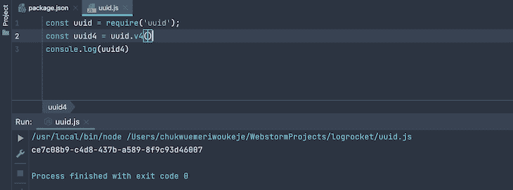
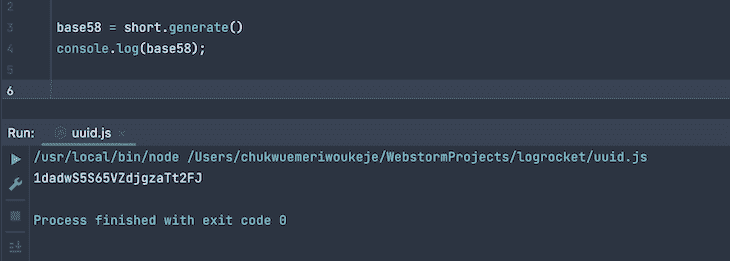
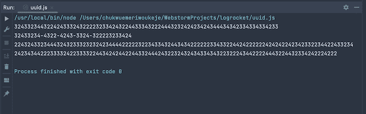

# 了解 Node.js 中的 UUIDs

> 原文：<https://blog.logrocket.com/uuids-node-js/>

用户身份和安全性是构建现代应用程序的关键因素，有许多措施可以确保用户身份的安全性。

互联网上的一种用户识别方法是 UUIDs，即通用唯一标识符。与微软的 [GUIDs(全球唯一标识符)](https://betterexplained.com/articles/the-quick-guide-to-guids/)类似，UUIDs 是唯一的 128 位值，通常用于唯一标识互联网上的实体。

在本文中，您将了解 UUID、UUID 冲突以及如何使用三个包在 Node.js 中生成 uuid。

向前跳:

## UUIDs 是如何工作的？

IETF(互联网工程任务组)在 [RFC 4122](https://tools.ietf.org/html/rfc4122) 中将 UUID 协议定义为“一个 128 位长的标识符，可以保证跨空间和时间的唯一性。”

不同 UUID 版本的生成使用不同的算法和方法。v1 UUIDs 使用生成计算机的时间戳和 Mac 地址进行标识，而 v4 UUIDs 根据生成它们的网站使用随机数生成器。

大多数操作系统都有一个用于生成 UUIDs 的 CLI 工具。

```
uuidgen             // generates a UUID
uuidgen help        // view help for the UUID command.

```

在 Windows、Linux 和 macOS 系统上可以使用`uuidgen`命令在命令行或终端上生成 UUIDs。

您可以在软件开发的许多领域使用 UUIDs，从分布式应用程序、数据库、网络，到高度随机性非常重要的场景。

## UUID 长度和碰撞

因为 UUID 协议是为实现唯一的 UUID 而设计的，所以当两台或多台计算机生成相同的 UUID 时，就会发生 UUID 冲突。

每个 UUID 都不同于其他现有的 uuid，如果计算机每秒生成 10 亿个 uuid，则碰撞概率为 0.00000006，预计在第一次碰撞发生前 85 年(届时将有 271 万亿个 uuid)。

UUID 冲突可能是有害的，主要是在相同的情况下使用——例如，UUID 是数据库中主键的 UUID 冲突。

生成的 UUIDs 的标准长度是 128 位。但是，您可以出于各种目的缩短 UUID，尽管不建议这样做，因为缩短 uuid 会增加冲突的可能性。在关键情况下，缩短 UUIDs 可能对您的应用程序不利。

## 在 Node.js 中生成 UUIDs

大多数编程语言都提供了生成 UUIDs 的功能。在 Node.js 运行时，内置的`crypto`包有一个用于生成 UUIDs 的`randomUUID`方法。

首先，将`crypto`包导入您的 JavaScript 文件。

```
const crypto = require('crypto');

```

调用 UUID 方法会返回一个标准长度的 UUID，您可以在程序中使用它。

```
let uuid = crypto.randomUUID();
console.log(uuid);

```

该代码将生成的 UUID 打印到控制台。


### 用于生成 UUIDs 的包

有许多用于生成 UUIDs 的外部`npm`包。这些包提供了比`crypto`包更多的功能。

在 JavaScript 中生成 UUIDs 的一些流行的 npm 包是`[uuid](https://github.com/uuidjs/uuid)`和 [`short-uuid`](https://github.com/oculus42/short-uuid) 包。

#### `uuid`套餐

[`uuid`包](https://www.npmjs.com/package/uuid)提供生成加密安全标准 uuid 的功能，支持版本 1、3、4 和 5 UUIDs，以及对 [Node.js](https://nodejs.org/en/docs/) 、 [CommonJS](https://nodejs.org/api/modules.html) 、 [Webpack](https://webpack.js.org/) 、 [React Native Expo](https://docs.expo.dev/) 等的跨平台支持。

UUID 包是一个外部依赖项，所以您必须安装这个包。

```
npm install uuid

```

安装完`uuid`包后，将包导入到 JavaScript 文件中。

```
const uuid = require('uuid');

```

这里有一个用`uuid`包生成 v4 UUID 的例子。

```
const uuid4 = uuid.v4()
console.log(uuid4)

```

`v4`方法返回 v4 UUIDs，代码将 UUID 打印到控制台。



#### `short-uuid`套餐

[`short-uuid`包](https://www.npmjs.com/package/short-uuid)提供了生成 RFC4122 v4 兼容标准 UUIDs 并将其翻译成更短格式的功能，反之亦然。您可以使用`short-uuid`包来生成 v4 UUIDs，并根据您的应用程序的用例来缩短它们。

`short-uuid`包是安全的，具有错误 UUIDs 上的错误等特性。默认情况下，`short-uuid`包返回长度一致的缩短 id，除非您指定了长度，并且该包通过填充字母字符来缩短 UUIDs。

在工作目录的终端运行这个命令来安装`short-uuid`包。

```
npm install short-uuid

```

安装`short-uuid`包后，可以将包导入到自己的 app 中。

```
const short = require('short-uuid');

```

您可以使用您的`short-uuid`实例的`uuid`方法生成一个简单的长 UUID。

```
console.log(short.uuid());

```

`uuid`方法返回标准长度 128 位的 UUID。

您可以使用`generate`方法生成更短的 UUIDs。默认情况下，`generate`方法返回 Flickr `base58`格式。

```
base58 = short.generate()
console.log(base58);

```



您可以向您的`short-uuid`包实例添加额外的参数，以获得额外的功能。添加不同的值将产生 UUIDs 的填充格式。

```
// must not be duplicated
const translator = short("32814"); // Provide a specific alphabet for translation

const uuid = translator.generate()
console.log(uuid)

```

如果字母值中有重复项，该函数将抛出错误。

下面是如何使用`short-uuid`包缩短 UUIDs 并检索原始值的方法。

```
const short = require('short-uuid');

const translator = short("342");

newUUID = translator.new()

original = translator.fromUUID(newUUID);

bits128 = translator.toUUID(original);

console.log(newUUID) // prints the generated UUID
console.log(original) // prints the original UUID
console.log(bits128) // prints reverted UUID of 128bits

```

您用`new`方法生成了一个新的 UUID，这是返回填充 UUID 的`generate`方法的别名。`newUUID`变量是`short-uuid`生成的填充 UUID，`fromUUID`方法返回填充前的原始 128 位 UUID。`toUUID`方法用包返回最初生成的 UUID。



## 结论

在本文中，我们探讨了 UUID、UUID 冲突、为什么不应该使用短 uuid，以及如何使用 crypto 包、`uuid`包和`short-uuid`包从命令行和 JavaScript 应用程序生成 uuid。

uuid 适用于广泛的用例，随着您编写更多的代码，您会在您的应用程序中发现更多的 uuid 用例。

## 200 只显示器出现故障，生产中网络请求缓慢

部署基于节点的 web 应用程序或网站是容易的部分。确保您的节点实例继续为您的应用程序提供资源是事情变得更加困难的地方。如果您对确保对后端或第三方服务的请求成功感兴趣，

[try LogRocket](https://lp.logrocket.com/blg/node-signup)

.

[](https://lp.logrocket.com/blg/node-signup)[https://logrocket.com/signup/](https://lp.logrocket.com/blg/node-signup)

LogRocket 就像是网络和移动应用程序的 DVR，记录下用户与你的应用程序交互时发生的一切。您可以汇总并报告有问题的网络请求，以快速了解根本原因，而不是猜测问题发生的原因。

LogRocket 检测您的应用程序以记录基线性能计时，如页面加载时间、到达第一个字节的时间、慢速网络请求，还记录 Redux、NgRx 和 Vuex 操作/状态。

[Start monitoring for free](https://lp.logrocket.com/blg/node-signup)

.