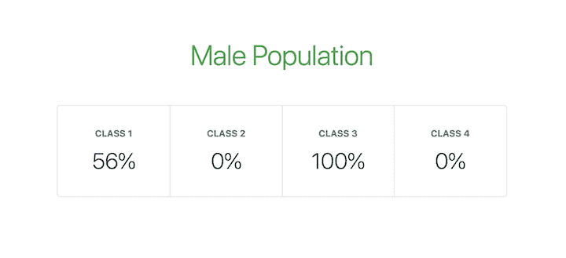
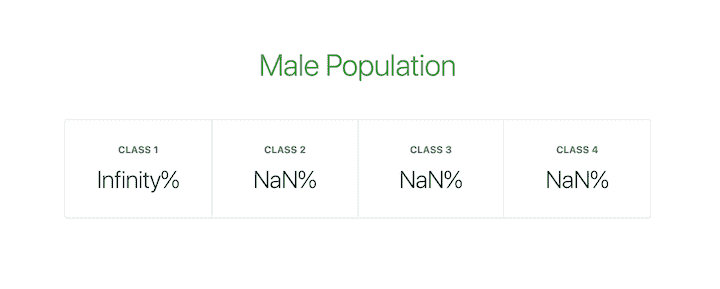
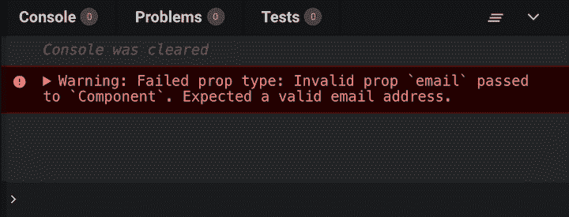

# 如何使用 PropTypes 验证 React props

> 原文：<https://blog.logrocket.com/validate-react-props-proptypes/>

***编者按**:本文最后更新于 2022 年 8 月 17 日，以验证代码准确性。*

Props 和 PropTypes 是在 React 组件之间传递只读属性的重要机制。

我们可以使用 React props(属性的缩写)将数据从一个组件发送到另一个组件。如果一个组件接收了错误类型的道具，它可能会导致你的应用程序出现 bug 和意外错误。

由于 JavaScript 没有内置的类型检查解决方案，许多开发人员使用像 [TypeScript 和 Flow](https://blog.logrocket.com/typescript-vs-flow/) 这样的扩展。然而，React 有一个用于验证属性的内部机制，叫做[属性类型](https://reactjs.org/docs/typechecking-with-proptypes.html)。在本文中，我们将学习如何用 React PropTypes 验证 props。

如果你更喜欢视觉学习，我推荐你看看下面的 React PropTypes 视频教程:

 [https://www.youtube.com/embed/SKqFMYOSy4g?version=3&rel=1&showsearch=0&showinfo=1&iv_load_policy=1&fs=1&hl=en-US&autohide=2&wmode=transparent](https://www.youtube.com/embed/SKqFMYOSy4g?version=3&rel=1&showsearch=0&showinfo=1&iv_load_policy=1&fs=1&hl=en-US&autohide=2&wmode=transparent)

视频

## React 道具是如何工作的？

使用 React props，当您调用组件时，您可以[向组件](https://blog.logrocket.com/the-beginners-guide-to-mastering-react-props-3f6f01fd7099/)发送数据，包括数字、字符串、函数、对象和数组。如果有多个组件，可以将数据从一个组件传递到另一个组件。

要在组件之间传递属性，可以在调用组件时添加它们，就像调用常规 JavaScript 函数时传递参数一样。

## 为什么要在 React 中验证道具？

在开发 React 应用程序时，您需要构建和定义您的 props，以避免 bug 和错误。就像函数可能有强制参数一样，React 组件可能需要定义一个属性，否则，它将无法正确呈现。忘记将一个必需的道具传递给一个需要它的组件可能会导致你的应用程序行为异常。

考虑下面的代码:

```
import React from 'react';
import ReactDOM from 'react-dom';

function PercentageStat({ label, score = 0, total = Math.max(1, score) }) {
  return (
    <div>
      <h6>{ label }</h6>
      <span>{ Math.round(score / total * 100) }%</span>
    </div>
  )
}

function App() {
  return (
    <div>
      <h1>Male Population</h1>
      <div>
        <PercentageStat label="Class 1" total={360} score={203} />
        <PercentageStat label="Class 2" total={206} />
        <PercentageStat label="Class 3" score={107} />
        <PercentageStat label="Class 4" />
      </div>
    </div>
  )
}

const rootElement = document.getElementById('root');
ReactDOM.render(<App />, rootElement);

```

在上面的代码中，`PercentageStat`组件需要三个道具来正确渲染，`label`、`score`和`total`。如果没有提供，`score`和`total`道具设置默认值。`PercentageStat`在`App`组件中渲染了四次，每次使用不同的道具。

下图显示了添加了一些额外的[引导](https://blog.logrocket.com/how-to-use-bootstrap-with-react-a354715d1121/)样式的应用程序的外观:



根据使用情况，`label`道具应该是`string`。同样，`score`和`total`需要是`numeric`值，因为它们用于计算`percent`。此外，`total`预计永远不会是`0`，因为它正被用作除数。

下面的代码显示了一个修改过的应用程序，它使用无效的属性来呈现`PercentageStat`组件:

```
function App() {
  return (
    <div>
      <h1>Male Population</h1>
      <div>
        <PercentageStat label="Class 1" total="0" score={203} />
        <PercentageStat label="Class 2" total={0} />
        <PercentageStat label="Class 3" score={f => f} />
        <PercentageStat label="Class 4" total={{}} score="0" />
      </div>
    </div>
  )
}

```

现在，应用程序视图如下图所示:



## 在 React 中使用属性类型

PropTypes 是 [React 为组件属性添加类型检查](https://blog.logrocket.com/the-modern-guide-to-react-prop-types/)的内部机制。React 组件使用一个名为`propTypes`的特殊属性来设置类型检查:

```
/**
 * FUNCTIONAL COMPONENTS
 */
function ReactComponent(props) {
  // ...implement render logic here
}

ReactComponent.propTypes = {
  // ...prop type definitions here
}

/**
 * CLASS COMPONENTS: METHOD 1
 */
class ReactComponent extends React.Component {
  // ...component class body here
}

ReactComponent.propTypes = {
  // ...prop type definitions here
}

/**
 * CLASS COMPONENTS: METHOD 2
 * Using the `static` class properties syntax
 */
class ReactComponent extends React.Component {
  // ...component class body here

  static propTypes = {
    // ...prop type definitions here
  }
}

```

当 props 被传递给 React 组件时，它们会根据在`propTypes`属性中配置的类型定义进行检查。为属性传递无效值时，JavaScript 控制台上会显示一条警告:


如果为 React 组件设置了[默认属性](https://blog.bitsrc.io/understanding-react-default-props-5c50401ed37d)，则在根据`propTypes`进行类型检查之前，首先解析这些值。因此，默认值也受属性类型定义的影响。

请记住，类型检查`propTypes`只能在开发模式下发生，这使您能够在将 React 应用程序发布到生产环境之前捕捉其中的 bug。

## 在 React 中使用`prop-types`库

在 React v15.5.0 之前，React 包中提供了一个名为`PropTypes`的实用程序，它为配置组件属性的类型定义提供了许多验证器。你可以用`React.PropTypes`来访问它。

然而，在 React 的更高版本中，这个实用程序被移到了一个名为`[prop-types](https://www.npmjs.com/package/prop-types)`的单独的包中。要访问`PropTypes`实用程序，您需要添加`prop-types`作为项目的依赖项:

```
npm install prop-types --save

```

您可以将它导入到项目文件中，如下所示:

```
import PropTypes from 'prop-types';

```

要了解更多关于如何使用`prop-types`以及它与使用`React.PropTypes`和所有可用验证器有何不同，请查看[官方`prop-types`文档](https://github.com/facebook/prop-types/blob/main/README.md)。

## 反应属性类型验证器

`PropTypes`实用程序导出了大量用于配置类型定义的验证器。下面，我们将列出基本、可渲染、实例、多重、集合和必需属性类型的可用验证器。

### 基本类型

以下是基本数据类型的验证器:

*   `PropTypes.any`:道具可以是任何数据类型
*   `PropTypes.bool`:道具应该是布尔值
*   `PropTypes.number`:道具应该是一个数字
*   `PropTypes.string`:道具应该是一根绳子
*   `PropTypes.func`:道具应该是一个函数
*   `PropTypes.array`:道具应该是一个数组
*   道具应该是一个物体
*   道具应该是一个符号

```
Component.propTypes = {
  anyProp: PropTypes.any,
  booleanProp: PropTypes.bool,
  numberProp: PropTypes.number,
  stringProp: PropTypes.string,
  functionProp: PropTypes.func,
  arrayProp: PropTypes.array,
  objectPerop: PropTypes.object,
  symbolProp: PropTypes.symbol,
}

```

### 可呈现类型

PropTypes 还导出以下验证器，以确保 React 可以呈现传递给 prop 的值。

*   道具应该是 React 可以渲染的任何东西，比如数字、字符串、元素、数组或者包含这些类型的片段
*   `PropTypes.element`:道具应该是一个 React 元素

```
Component.propTypes = {
  nodeProp: PropTypes.node,
  elementProp: PropTypes.element
}

```

`PropTypes.element`验证器的一个常见用途是确保一个组件只有一个子组件。如果组件没有子组件或有多个子组件，JavaScript 控制台上会显示一条警告:

```
Component.propTypes = {
  children: PropTypes.element.isRequired
}

```

### 实例类型

如果您需要一个 prop 作为特定 JavaScript 类的实例，您可以使用`PropTypes.instanceOf`验证器，它利用底层 JavaScript `instanceof`操作符:

```
Component.propTypes = {
  personProp: PropTypes.instanceOf(Person)
}

```

### 多种类型

PropTypes 还导出验证器，这些验证器允许一个属性的有限的一组值或多组数据类型。

*   `PropTypes.oneOf`:属性被限制为一组指定的值，将其视为枚举
*   属性应该是一组指定类型中的一个，就像类型的联合一样

```
Component.propTypes = {

  enumProp: PropTypes.oneOf([true, false, 0, 'Unknown']),

  unionProp: PropTypes.oneOfType([
    PropType.bool,
    PropType.number,
    PropType.string,
    PropType.instanceOf(Person)
  ])

}

```

## 集合类型

除了`PropTypes.array`和`PropTypes.object`验证器，`PropTypes`还为数组和对象的更好的验证提供了验证器。

### `PropTypes.arrayOf`

`PropTypes.arrayOf`确保 prop 是一个数组，其中所有项目都匹配指定的类型:

```
Component.propTypes = {

  peopleArrayProp: PropTypes.arrayOf(
    PropTypes.instanceOf(Person)
  ),

  multipleArrayProp: PropTypes.arrayOf(
    PropTypes.oneOfType([
      PropType.number,
      PropType.string
    ])
  )

}

```

### `PropTypes.objectOf`

`PropTypes.objectOf`确保道具是一个所有属性值都匹配指定类型的对象:

```
Component.propTypes = {

  booleanObjectProp: PropTypes.objectOf(
    PropTypes.bool
  ),

  multipleObjectProp: PropTypes.objectOf(
    PropTypes.oneOfType([
      PropType.func,
      PropType.number,
      PropType.string,
      PropType.instanceOf(Person)
    ])
  )

}

```

### `PropTypes.shape`

当需要对对象属性进行更详细的验证时，可以使用`PropTypes.shape`。它确保 prop 是包含一组具有指定类型值的指定键的对象:

```
Component.propTypes = {
  profileProp: PropTypes.shape({
    id: PropTypes.number,
    fullname: PropTypes.string,
    gender: PropTypes.oneOf(['M', 'F']),
    birthdate: PropTypes.instanceOf(Date),
    isAuthor: PropTypes.bool
  })
}

```

### `PropTypes.exact`

对于严格或精确的对象匹配，如果组件中存在额外的属性，`PropTypes.exact`将给出警告:

```
Component.propTypes = {
  subjectScoreProp: PropTypes.exact({
    subject: PropTypes.oneOf(['Maths', 'Arts', 'Science']),
    score: PropTypes.number
  })
}

```

### 必需的类型

到目前为止，我们研究的所有`PropTypes`验证器都允许道具是可选的。但是，您可以将`isRequired`链接到任何属性验证器，以确保每当没有提供属性时都会显示警告:

```
Component.propTypes = {

  requiredAnyProp: PropTypes.any.isRequired,
  requiredFunctionProp: PropTypes.func.isRequired,
  requiredSingleElementProp: PropTypes.element.isRequired,
  requiredPersonProp: PropTypes.instanceOf(Person).isRequired,
  requiredEnumProp: PropTypes.oneOf(['Read', 'Write']).isRequired,

  requiredShapeObjectProp: PropTypes.shape({
    title: PropTypes.string.isRequired,
    date: PropTypes.instanceOf(Date).isRequired,
    isRecent: PropTypes.bool
  }).isRequired

}

```

## 用于类型检查的自定义验证器反应属性

通常，您需要为组件 props 定义一些定制的验证逻辑，例如，确保向 prop 传递一个有效的电子邮件地址。`prop-types`允许您定义可用于类型检查道具的自定义验证函数。

### 基本自定义验证器

自定义验证函数有三个参数:

*   `props`:包含传递给组件的所有道具的对象
*   `propName`:要验证的道具名称
*   `componentName`:组件的名称

如果验证失败，它应该返回一个`Error`对象。不应引发该错误。此外，您不应该在自定义验证函数中使用`console.warn`:

```
const isEmail = function(props, propName, componentName) {
  const regex = /^((([^<>()[]\.,;:[email protected]"]+(.[^<>()[]\.,;:[email protected]"]+)*)|(".+"))@(([[0-9]{1,3}.[0-9]{1,3}.[0-9]{1,3}.[0-9]{1,3}])|(([a-zA-Z-0-9]+.)+[a-zA-Z]{2,})))?$/;

  if (!regex.test(props[propName])) {
    return new Error(`Invalid prop `${propName}` passed to `${componentName}`. Expected a valid email address.`);
  }
}

Component.propTypes = {
  email: isEmail,
  fullname: PropTypes.string,
  date: PropTypes.instanceOf(Date)
}

```



您也可以通过`PropTypes.oneOfType`使用自定义验证功能。下面的例子使用了前面代码片段中的`isEmail`自定义验证函数:

```
Component.propTypes = {
  email: PropTypes.oneOfType([
    isEmail,
    PropTypes.shape({
      address: isEmail
    })
  ])
}

```

该组件在以下两种情况下都有效:

```
<Component email="[email protected]" />
<Component email={{ address: '[email protected]' }} />

```

### 自定义验证器和集合

您还可以使用带有`PropTypes.arrayOf`和`PropTypes.objectOf`的自定义验证函数。以这种方式使用时，将为数组或对象中的每个键调用自定义验证函数。

自定义验证函数采用五个参数，而不是三个:

*   `propValue`:数组或对象本身
*   `key`:迭代中当前项的键
*   `componentName`:组件的名称
*   `location`:已验证数据的位置，通常为`prop`
*   `propFullName`:当前被验证项目的完全解析名称。对于一个数组，这将是`array[index]`；对于一个对象，它将是`object.key`

下面是用于集合类型的`isEmail`自定义验证函数的修改版本:

```
const isEmail = function(propValue, key, componentName, location, propFullName) {
  const regex = /^((([^<>()[]\.,;:[email protected]"]+(.[^<>()[]\.,;:[email protected]"]+)*)|(".+"))@(([[0-9]{1,3}.[0-9]{1,3}.[0-9]{1,3}.[0-9]{1,3}])|(([a-zA-Z-0-9]+.)+[a-zA-Z]{2,})))?$/;

  if (!regex.test(propValue[key])) {
    return new Error(`Invalid prop `${propFullName}` passed to `${componentName}`. Expected a valid email address.`);
  }
}

Component.propTypes = {
  emails: PropTypes.arrayOf(isEmail)
}

```

### 通用自定义验证器

考虑到我们所学的关于自定义验证函数的一切，让我们继续创建通用的自定义验证器，我们可以将其用作独立的验证器以及集合类型。

只需稍加修改，我们就可以使`isEmail`定制验证函数成为一个通用的验证函数。我们将添加一个返回`propFullName`或`key`的`prop`变量。这样，我们的自定义验证器既可以单独使用，也可以与集合一起使用:

```
const isEmail = function(propValue, key, componentName, location, propFullName) {
  // Get the resolved prop name based on the validator usage
  const prop = (location && propFullName) ? propFullName : key;

  const regex = /^((([^<>()[]\.,;:[email protected]"]+(.[^<>()[]\.,;:[email protected]"]+)*)|(".+"))@(([[0-9]{1,3}.[0-9]{1,3}.[0-9]{1,3}.[0-9]{1,3}])|(([a-zA-Z-0-9]+.)+[a-zA-Z]{2,})))?$/;

  if (!regex.test(propValue[key])) {
    return new Error(`Invalid prop `${prop}` passed to `${componentName}`. Expected a valid email address.`);
  }
}

Component.propTypes = {
  email: PropTypes.oneOfType([
    isEmail,
    PropTypes.shape({
      address: isEmail
    })
  ]),
  emails: PropTypes.arrayOf(isEmail)
}

```

## 在 React 中验证`PercentageStat`

下面的代码片段向我们在本教程开始时查看的`PercentageStat`组件添加了属性类型:

```
import React from 'react';
import PropTypes from 'prop-types';

// The PercentageStat component
function PercentageStat({ label, score = 0, total = Math.max(1, score) }) {
  return (
    <div>
      <h6>{ label }</h6>
      <span>{ Math.round(score / total * 100) }%</span>
    </div>
  )
}

// Checks if a value is numeric
// Either a finite number or a numeric string
function isNumeric(value) {
  const regex = /^(\+|-)?((\d*\.?\d+)|(\d+\.?\d*))$/;
  return Number.isFinite(value) || ((typeof value === "string") && regex.test(value));
}

// Checks if value is non-zero
// Value is first converted to a number
function isNonZero(value) {
  return +value !== 0;
}

// Takes test functions as arguments and returns a custom validation function.
// Each function passed in as argument is expected to take a value argument
// expected to accept a value and return a Boolean if it passes the validation.
// All tests must pass for the custom validator to be marked as passed.
function validatedType(...validators) {
  return function(props, propName, componentName) {

    const value = props[propName];

    const valid = validators.every(validator => {
      if (typeof validator === "function") {
        const result = validator(value);
        return (typeof result === "boolean") && result;
      }

      return false;
    });

    if (!valid) {
      return new Error(`Invalid prop \`${propName}\` passed to \`${componentName}\`. Validation failed.`);
    }

  }
}

// Set the propTypes for the component
PercentageStat.propTypes = {
  label: PropTypes.string.isRequired,
  score: validatedType(isNumeric),
  total: validatedType(isNumeric, isNonZero)
}

```

## 结论

在本教程中，我们学习了如何改进 React 组件，并确保它们使用适当的类型按预期工作。通过在我们的开发环境中用 prop 类型验证我们的 prop，我们可以防止错误和 bug 在应用程序部署后影响它。

如果你想了解更多关于在 React 中验证组件属性的知识，我[推荐你查看文档](https://reactjs.org/docs/typechecking-with-proptypes.html)。

## 使用 [LogRocket](https://lp.logrocket.com/blg/signup) 消除传统错误报告的干扰

[](https://lp.logrocket.com/blg/signup)

[LogRocket](https://lp.logrocket.com/blg/signup) 是一个数字体验分析解决方案，它可以保护您免受数百个假阳性错误警报的影响，只针对几个真正重要的项目。LogRocket 会告诉您应用程序中实际影响用户的最具影响力的 bug 和 UX 问题。

然后，使用具有深层技术遥测的会话重放来确切地查看用户看到了什么以及是什么导致了问题，就像你在他们身后看一样。

LogRocket 自动聚合客户端错误、JS 异常、前端性能指标和用户交互。然后 LogRocket 使用机器学习来告诉你哪些问题正在影响大多数用户，并提供你需要修复它的上下文。

关注重要的 bug—[今天就试试 LogRocket】。](https://lp.logrocket.com/blg/signup-issue-free)