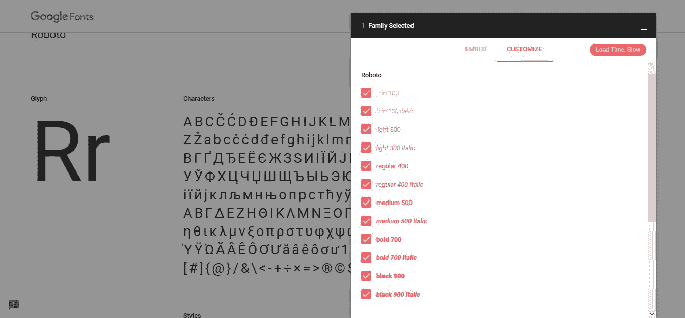
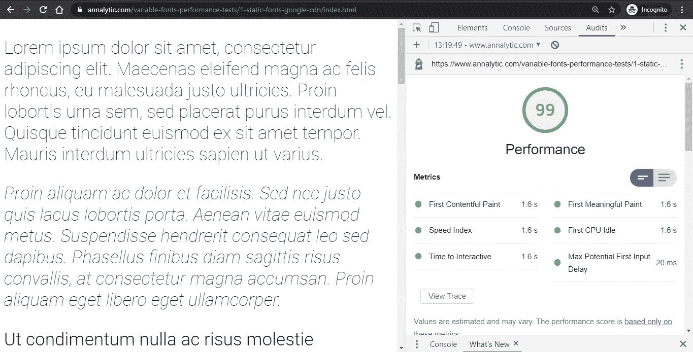
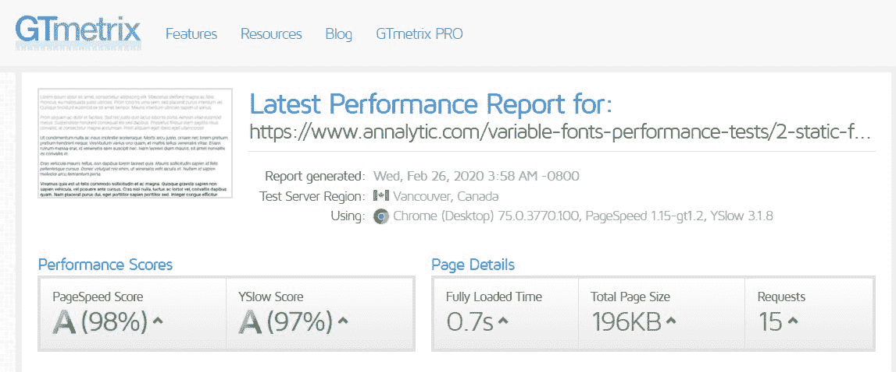
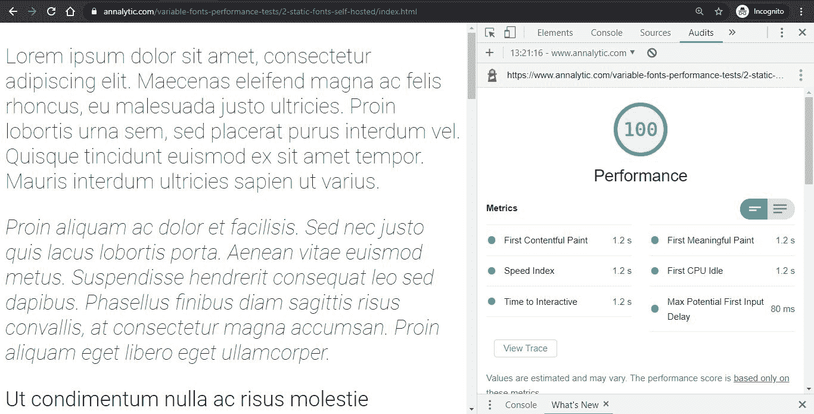
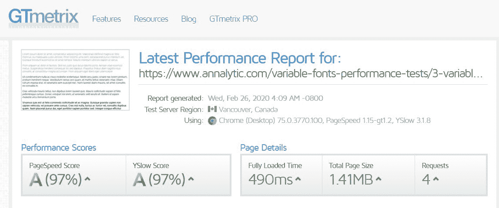
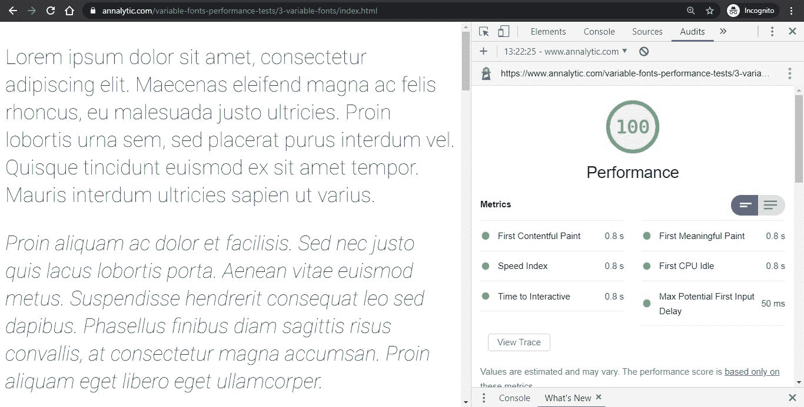
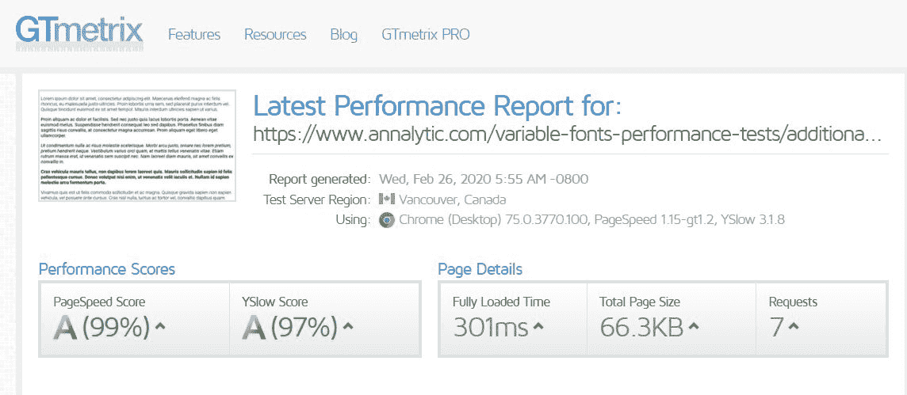
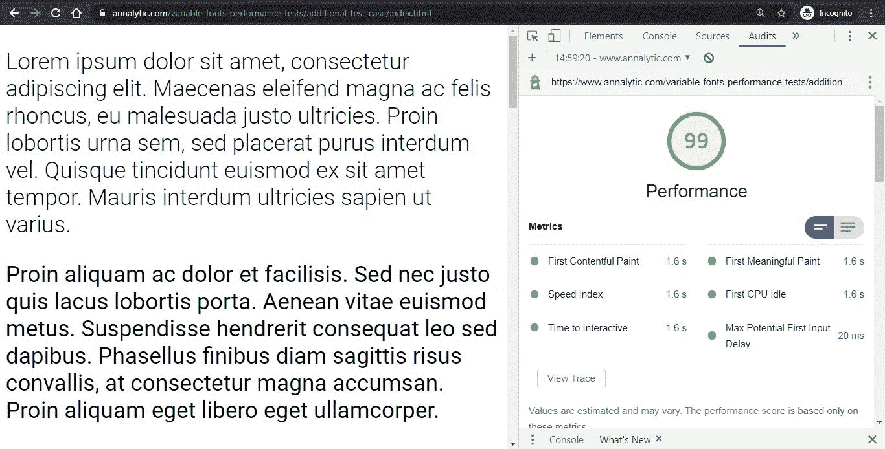
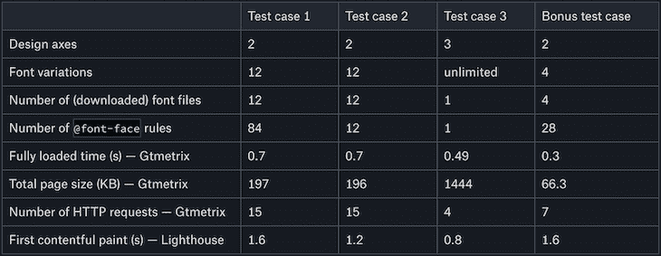

# 可变字体:性能权衡值得吗？- LogRocket 博客

> 原文：<https://blog.logrocket.com/variable-fonts-is-the-performance-trade-off-worth-it/>

可变字体受欢迎有两个原因:它们扩展了设计的可能性，提高了网站的性能。虽然前一种说法肯定是正确的，因为可变字体确实提供了无限的印刷选择，但后一种说法只在某些情况下成立。

在本教程中，我们将在一个实时服务器上进行性能测试，以更好地理解可变字体的性能权衡。

## 什么是可变字体？

由新的 [OpenType 字体规范](https://docs.microsoft.com/en-us/typography/opentype/spec/otvaroverview)定义的可变字体没有预设的字体样式，如粗体、斜体或细体。相反，它们由一个或多个设计轴组成，允许我们为宽度、重量、倾斜度等属性生成唯一的值。

设计轴总是由字体的创建者来选择，并且它们根据不同的字体而不同。但是，OpenType 字体变化规范标准化了五个注册轴:粗细(`wght`)、宽度(`wdth`)、斜体(`ital`)、倾斜(`slnt`)和光学大小(`opsz`)。除此之外，字体创建者可以用`[font-variation-settings](https://developer.mozilla.org/en-US/docs/Web/CSS/font-variation-settings)` CSS 属性注册任何用户可以访问的自定义轴。

要了解更多关于可变字体的信息，请查看 MDN 优秀的 [v](https://developer.mozilla.org/en-US/docs/Web/CSS/CSS_Fonts/Variable_Fonts_Guide) [可变字体指南](https://developer.mozilla.org/en-US/docs/Web/CSS/CSS_Fonts/Variable_Fonts_Guide)或在 [V 字体](https://v-fonts.com/)或 [Axis Praxis](https://www.axis-praxis.org/specimens/__DEFAULT__) 测试站点上进行试验。

## 可变字体如何影响性能

在我们进行性能测试之前，让我们看看可变字体是如何影响网站性能的。

通常，可变字体可以提高性能，因为您只需使用一个字体文件。静态字体需要一个不同的文件来对应你想在网站上使用的每个变体，而可变字体本质上是动态的。换句话说，它们在一个文件中包含了所有的可能性，这意味着只有一个 HTTP 请求，而不是多个。此外，您只需使用一个`[@font-face](https://developer.mozilla.org/en-US/docs/Web/CSS/@font-face)`规则，这将产生一个更小的 CSS 文件。

另一方面，可变字体文件非常大，因为它包含了所有的变化。例如，Roboto 可变字体在 TTF 格式中为 3.36MB，而静态 Roboto 字体变体在 TTF 格式中约为 165-175 kb。即使我们需要使用所有 12 种变体，总共也只有 2MB 左右。

最终，可变字体的性能权衡取决于这两个指标(HTTP 请求的数量和字体文件的总大小)如何相互平衡。

## 测试可变字体的挑战

测试可变字体可能很困难，因为大多数可变字体没有静态版本，反之亦然。字样通常是静态字体或可变字体，但不能同时是静态字体和可变字体。事实上，我只能找到一种既有静态版本又有可变版本的字体:Roboto。

在我们的可变字体性能测试中，我们将比较可以从谷歌字体下载的静态版 Roboto 和可以在 TypeNetwork 的 GitHub 库中找到的 [Roboto 可变字体](https://github.com/TypeNetwork/Roboto)。

Roboto 的静态版本有 12 种变化(数字代表`font-weight`值):

1.  瘦(100)
2.  细斜体(100)
3.  灯(300)
4.  轻斜体(300)
5.  常规(400)
6.  常规斜体(400)
7.  中等(500)
8.  中等斜体(500)
9.  粗体(700)
10.  粗体斜体(700)
11.  黑色(900)
12.  黑色斜体(900)

在可变字体方面，它沿着两个设计轴有 12 种静态字体变化:粗细(`wght`)和斜体(`ital`)。另一方面，Roboto 可变字体包括三个设计轴:粗细(`wght`)、宽度(`wdth`)和倾斜(`slnt`)。

为了准确地比较这两种字体类型，我们应该生成 Roboto 可变字体的 12 种变体，它们与静态版本的 12 种变体相同。但是尽管两个版本都包括`wght`轴，Roboto VF 使用`slnt`而不是`ital`。因此，我们将使用`slnt`设计轴来生成可变字体的斜体变体。然而，重要的是要记住这不是一回事。

`[ital](https://developer.mozilla.org/en-US/docs/Web/CSS/CSS_Fonts/Variable_Fonts_Guide#Italic)`轴有一个二进制值(0 或 1)。可以通过高级 [`font-style`](https://developer.mozilla.org/en-US/docs/Web/CSS/font-style) 或者低级`[font-variation-settings](https://developer.mozilla.org/en-US/docs/Web/CSS/font-variation-settings)`属性访问。如果两个属性都可用/受支持，您应该总是使用高级属性，这里是`font-style`。

```
font-style: italic;
font-variation-settings: 'ital' 1;

```

`[slnt](https://developer.mozilla.org/en-US/docs/Web/CSS/CSS_Fonts/Variable_Fonts_Guide#Slant)`轴的范围通常在 0 到 20 度之间。可以使用相同的 CSS 属性(`font-style`和`font-variation-settings`)来访问它，但是方式不同。

```
font-style: oblique 12deg;
font-variation-settings: 'slnt' 12;

```

由于 Roboto 可变字体的`slnt`轴在 0 到 12 之间，我们将使用它的最高值(12)来创建一个倾斜的字体变体，它或多或少可以与静态版本的斜体变体相媲美。

你可能也注意到了，静态版本使用两个设计轴，而不是像 Roboto VF 那样使用三个轴。然而，由于这些只是理论上的轴(我称它们为轴是为了使这两种字体具有可比性)，这不会扭曲测试结果。静态字体不包含任何轴；简单地绘制字符，而不向用户提供任何动态功能。

## 测试案例

我们将使用三个测试用例来分析可变字体的性能权衡。每个测试用例使用相同的 HTML 页面，该页面由 12 个“lorem ipsum”段落组成，每个段落以不同的 Roboto 字体显示。这三个测试案例是:

1.  Roboto 静态字体及其所有 12 种变体(每个字体文件都来自谷歌的 CDN)
2.  Roboto 静态字体及其所有 12 种变体(每个字体文件都在本地添加)
3.  机器人可变字体 12 种变化产生的一个单一的可变字体文件，我们在本地添加

此外，我们将探索一个额外的测试用例，它只有 Roboto 字体静态版本的四种变体。

你可以在这个 [GitHub repo](https://github.com/azaleamollis/variable-fonts-performance-tests) 中找到完整的性能测试，并在这个[演示网站](https://www.annalytic.com/variable-fonts-performance-tests/)上自己运行测试，在那里你还可以找到关于测试的更多信息。

所有的测试用例都使用 [WOFF2](https://developer.mozilla.org/en-US/docs/Web/Guide/WOFF) 压缩字体格式，并且不包括任何对旧浏览器的回退。尽管 Roboto VF 只有 TTF 格式，我还是用谷歌的 [woff2 CLI 工具](https://github.com/google/woff2)创建了一个 WOFF2 版本，它的大小从 3.36MB 减少到了 1.40MB

对于性能测试，我们将使用两个工具:

1.  [GTMetrix](https://gtmetrix.com/) ，计算 PageSpeed Insights 和 YSlow 得分
2.  [Lighthouse](https://chrome.google.com/webstore/detail/lighthouse/blipmdconlkpinefehnmjammfjpmpbjk?hl=es) ，它允许我们在 Chrome DevTools 中运行性能审计

### 测试用例 1: Roboto Static，托管在 Google CDN 上

我们可以通过将下面的代码添加到 HTML 页面的`<head>`部分，将 Roboto Static 从 Google 的 CDN 中提取出来。

```
&lt;link href="https://fonts.googleapis.com/css?family=Roboto:100,100i,300,300i,400,400i,500,500i,700,700i,900,900i&amp;display=swap" rel="stylesheet"&gt;

```

该链接指定了我们想要加载的字体变化——例如，100 代表 Roboto Thin，700i 代表 Roboto Bold Italic。在[谷歌字体](https://fonts.google.com/specimen/Roboto?selection.family=Roboto:100,100i,300,300i,400,400i,500,500i,700,700i,900,900i)上，通过选择定制标签下的变化，很容易生成这个定制链接。



该链接指向谷歌服务器上的一个 [CSS 文件](https://fonts.googleapis.com/css?family=Roboto:100,100i,300,300i,400,400i,500,500i,700,700i,900,900i&display=swap)，包括一堆`@font-face`规则——确切地说是 84 条。Google Fonts 为每个字符集(拉丁语、西里尔语、希腊语等)添加了一个`@font-face`规则。)，而且这是不可能改变的。然而，Google Fonts 只加载页面请求的字体文件(在我们的例子中，是拉丁字符集)。

在这个测试案例中，我们总共从 Google 的 CDN 中提取了 84 条`@font-face`规则和 12 个 WOFF2 文件。

注意:如果您使用旧版本的浏览器运行性能测试，Google 会为您加载 WOFF 或 TFF 格式——它总是加载用户浏览器支持的最新格式。

此外，我们在服务器上有两个本地文件— [`index.html`](https://github.com/azaleamollis/variable-fonts-performance-tests/blob/master/1-static-fonts-google-cdn/index.html) 和`[style.css](https://github.com/azaleamollis/variable-fonts-performance-tests/blob/master/1-static-fonts-google-cdn/style.css)`。

现在，让我们看看这个设置是如何执行的。首先，我们将运行 GTMetrix 应用程序中第一个测试案例的[演示页面](https://www.annalytic.com/variable-fonts-performance-tests/1-static-fonts-google-cdn/index.html)。


如您所见，我们有 197kB 的总页面大小和 15 个 HTTP 请求——12 个针对字体文件，一个针对`index.html`，一个针对`style.css`，还有一个针对包含 84 个`@font-face`规则的在线 CSS 文件。

灯塔的业绩报告是这样的:



总成绩 99，第一次内容丰富的油漆发生在 1.6 秒。让我们看看这些结果与其他测试案例相比如何。

### 测试用例 2:robot to Static，自托管

在这个测试案例中，我们将使用相同的`index.html`和`style.css`文件。您可以在 [GitHub repo](https://github.com/azaleamollis/variable-fonts-performance-tests/tree/master/2-static-fonts-self-hosted) 中查看这些文件。然而，这次我们将手动添加`@font-face`规则。因为我们想要加载 12 个字体文件，所以我们需要 12 个`@font-face`规则。

我们会尽量让它和 Google CDN 的(不可变)`@font-face`规则相似，但不会为我们不想用的字符集添加`@font-face`规则。尽管这有点扭曲了测试结果，但没有人会在真实的网站上使用这些字符集，我们的主要目标是确定哪种设置更好。

让我们来看看我们的一个`@font-face`规则(你可以在 GitHub 上查看整个 [`fonts.css`](https://github.com/azaleamollis/variable-fonts-performance-tests/blob/master/2-static-fonts-self-hosted/fonts.css) ):

```
@font-face {
    font-family: 'Roboto';
    font-style: normal;
    font-weight: 100;
    font-display: swap;
    src: local('Roboto Thin'), local('Roboto-Thin'),
         url('fonts/roboto-v20-latin-100.woff2') format('woff2');
     unicode-range: U+0000-00FF, U+0131, U+0152-0153, U+02BB-02BC, U+02C6, U+02DA, U+02DC, U+2000-206F, U+2074, U+20AC, U+2122, U+2191, U+2193, U+2212, U+2215, U+FEFF, U+FFFD;
  }

```

正如你所看到的，我们把 12 个 WOFF2 字体文件放到了 [`fonts/`](https://github.com/azaleamollis/variable-fonts-performance-tests/tree/master/2-static-fonts-self-hosted/fonts) 文件夹中。

下面是 GTMetrix 返回的内容:



页面加载时间(0.7s)和 HTTP 请求数量(15)都与前一种情况相同。但是，总的页面大小减少了 1KB，这一定是减少了`@font-face`规则数量的结果(12 个而不是 84 个)。

Lighthouse 的性能审计产生了以下指标。



第一幅令人满意的画只花了 1.2 秒，比 1.6 秒下降了 25%。因此，Lighthouse 的性能分数也高了一点:100 分而不是 99 分。这很可能是因为 Google Fonts 运行一些检查来决定加载哪种字体格式/文件，而我们的自托管 CSS 包含静态文件路径。

### 测试用例 3: Roboto 可变字体，自托管

在第三个测试案例中，我们将使用与之前相同的`[index.html](https://github.com/azaleamollis/variable-fonts-performance-tests/blob/master/3-variable-fonts/index.html)`文件来分析 Roboto 可变字体的性能。 [`style.css`](https://github.com/azaleamollis/variable-fonts-performance-tests/blob/master/3-variable-fonts/style.css) 文件几乎是相同的，但是，如前所述，由于 Roboto VF 没有斜体设计轴，所以斜体效果是通过使用斜轴来实现的。

我们将在本地加载`fonts.css`，类似于第二个测试用例，只是现在它只包含一个`@font-face`规则。

```
@font-face {
        font-family: 'Roboto VF';
        font-weight: 100 900;
        font-stretch: 75% 100%;
        font-style: oblique 0deg 12deg;
        font-display: swap;
        src: local('Roboto VF'), local('Roboto-VF'), 
             url('fonts/Roboto-VF.woff2') format('woff2-variations');
        unicode-range: U+0000-00FF, U+0131, U+0152-0153, U+02BB-02BC, U+02C6, U+02DA, U+02DC, U+2000-206F, U+2074, U+20AC, U+2122, U+2191, U+2193, U+2212, U+2215, U+FEFF, U+FFFD;  
}

```

我们定义了 Roboto VF 中所有三个设计轴的可用范围。这也是添加可变字体的推荐方式(更多细节见 [MDN 文档](https://developer.mozilla.org/en-US/docs/Web/CSS/CSS_Fonts/Variable_Fonts_Guide#Using_a_variable_font_font-face_changes))。

`font-weight`属性代表`wght`轴，范围从 100 到 900。`font-stretch`代表`wdth`轴，跨度从 75%到 100%——我们不会使用这个轴，因为 Roboto Static 没有不同字体宽度的变体。`font-style: oblique;`代表`slnt`轴，跨度从 0 度到 12 度(我们用这个轴的最大值代替斜体)。

注意，在生产中，我们将在 [`@supports`](https://developer.mozilla.org/en-US/docs/Web/CSS/@supports) 特征查询中使用这个`@font-face`规则，并添加 Roboto Static(或另一种字体)作为后备，因为许多浏览器仍然不支持可变字体。这在一定程度上扭曲了测试结果，因为我们使用的`fonts.css`文件比生产中的要小。然而，正如已经提到的，由于它们不同的性质，不可能百分之百准确地比较静态字体和可变字体。

对于第三个测试案例，GTmetrix 工具返回了以下结果。

* * *

### 更多来自 LogRocket 的精彩文章:

* * *



HTTP 请求的数量急剧减少，从 15 个减少到 4 个。这是因为我们只处理一个字体文件，而不是 12 个。另一方面，总页面大小显著增长，从 197/196KB 增长到 1.41MB，这是由于可变字体文件的巨大大小。

这两种价值观如何相互平衡？鉴于总的页面加载时间从 700 毫秒缩短到 490 毫秒——提高了 30%——在这种情况下，切换到可变字体似乎是一个不错的选择。

灯塔绩效审计还显示了改进的绩效指标。



第一个内容丰富的 paint 的速度是第一个测试案例的两倍(0.8s 比 1.6s)，比第二个测试案例快 1.5 倍(0.8s 比 1.2s)。

根据这些测试结果判断，当您想要加载 Roboto 静态版本的所有 12 种变体时，使用可变字体是一个不错的选择。尽管总的字体大小和页面大小要大得多，但是 HTTP 请求的显著减少(4 个对 15 个)仍然导致了更好的页面加载时间。

### 额外测试案例

这里出现了一个重要的问题:什么时候使用可变字体不再值得？为了回答这个问题，我们将研究一个额外的测试案例。

这个测试用例与第一个几乎相同。我们将从 Google 的 CDN 加载 Roboto Static，并在本地添加`index.html`和`style.css`。然而，我们没有添加所有 12 种静态变体，而是只使用了四种:Roboto Light、Roboto Regular、Roboto Regular Italic 和 Roboto Bold。 [`index.html`](https://github.com/azaleamollis/variable-fonts-performance-tests/blob/master/additional-test-case/index.html) 文件仍然由相同的 12 个段落组成，但是我们将在三个段落而不是一个段落上使用相同的字体变化。

下面的`<link>`标签将加载四种字体变体。

```
&lt;link href="https://fonts.googleapis.com/css?family=Roboto:300,400,400i,700&amp;display=swap" rel="stylesheet"&gt;

```

让我们看看这个额外的测试案例在 GTmetrix 中的表现如何:



正如所料，HTTP 请求的数量从 15 个减少到 7 个，因为我们加载了 4 个字体文件，而不是 12 个。显然，总的页面大小也比第一个测试用例小得多(66.3KB 对 197 kb)。

总的页面加载时间比之前的任何测试案例都要快得多。在前两个测试案例中，加载时间为 700 毫秒，而 Roboto 可变字体的加载时间为 490 毫秒。这一次，页面加载只用了 301 毫秒。

但是，灯塔绩效审计说了什么？



第一个内容丰富的油漆为 1.6s，与第一个测试案例中的结果相同，但比第二个(1.2s)和第三个(0.8s)都差。这很可能是因为字体是从 CDN 而不是本地下载的，而不是使用静态字体而不是可变字体或 HTTP 请求数。

总而言之，由于总的页面加载时间比可变字体的情况下快得多，我们可以说，如果您只想使用/加载四种字体，使用 Roboto VF 是不值得的。

## 结论

在得出最终结论之前，让我们一起来看看结果:



在性能方面，使用可变字体是否值得取决于 HTTP 请求的减少和总页面大小的增加如何相互平衡。

如果您想使用同一字样的几种变体，使用可变字体绝对是一个不错的选择。但是，如果您想以普通方式使用字体，例如粗体、斜体和粗斜体变体，您可能希望坚持使用静态版本。

现在，可变字体的性能权衡更多的是一个理论问题，而不是实际问题。由于绝大多数字体没有静态和可变版本，实际上，我们通常没有选择。然而，随着可变字体的发展和改进，这种情况将会改变。

最后，不要忘记，在评估可变字体的有用性时，性能方面只是一个考虑因素。设计灵活性同样重要。可变字体将网页排版的极限推向了一个新的高度，让我们能够创作出以前从未想过的网站设计。

## 你的前端是否占用了用户的 CPU？

随着 web 前端变得越来越复杂，资源贪婪的特性对浏览器的要求越来越高。如果您对监控和跟踪生产环境中所有用户的客户端 CPU 使用、内存使用等感兴趣，

[try LogRocket](https://lp.logrocket.com/blg/css-signup)

.

[](https://lp.logrocket.com/blg/css-signup)[https://logrocket.com/signup/](https://lp.logrocket.com/blg/css-signup)

LogRocket 就像是网络和移动应用的 DVR，记录你的网络应用或网站上发生的一切。您可以汇总和报告关键的前端性能指标，重放用户会话和应用程序状态，记录网络请求，并自动显示所有错误，而不是猜测问题发生的原因。

现代化您调试 web 和移动应用的方式— [开始免费监控](https://lp.logrocket.com/blg/css-signup)。