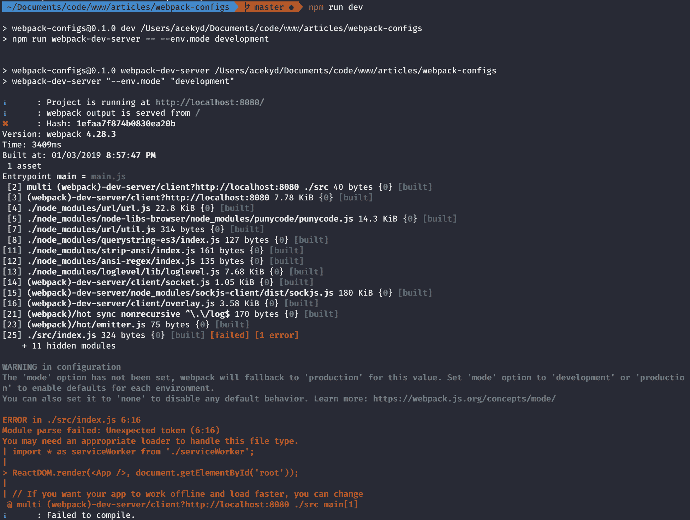
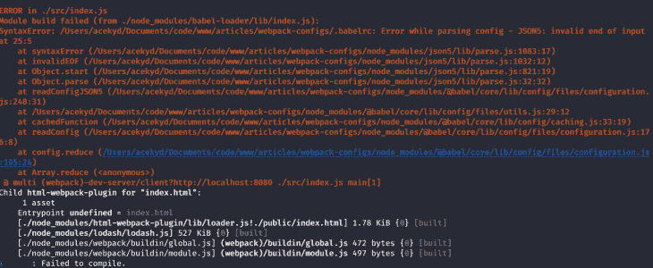
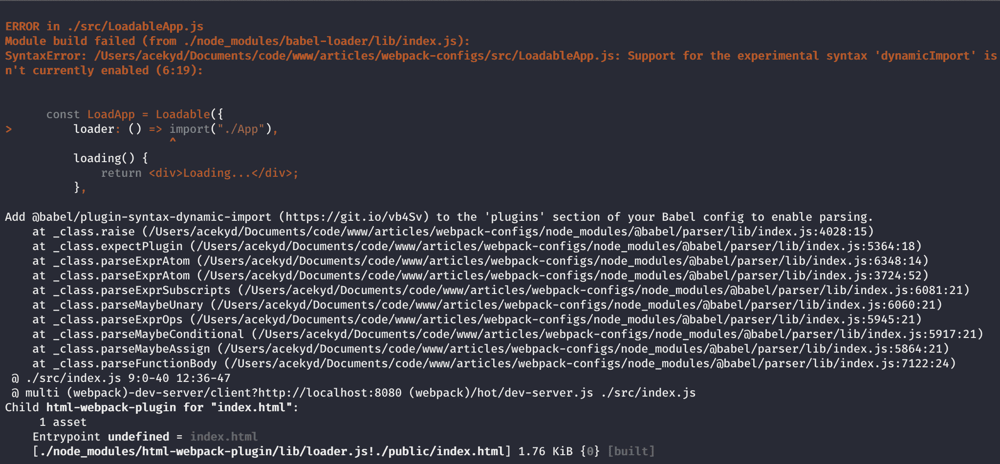

# React 应用程序的最佳 webpack 配置

> 原文：<https://blog.logrocket.com/versatile-webpack-configurations-react-application/>

***编者按:**这篇文章于 2021 年 8 月更新，提供了 webpack 5 和新代码块的相关信息，以最好地说明 React 的理想 webpack 配置。*

如果你和我一样，那么你一定在为你的 React 应用配置 webpack 时遇到了困难。Create React App (CRA)已经和 [webpack](https://webpack.js.org/concepts/) 一起发布，但是通常情况下，随着应用的增长，我们需要添加更多的配置。幸运的是，我们可以创建一个`webpack.config.js`文件并将我们的 webpack 配置放在那里。

在本文中，我们将涵盖:

*   我们应用的通用配置
*   仅特定于生产和开发的配置
*   脚本和样式表的捆绑和缩小
*   代码分割和延迟加载等优化

## 安装 webpack 的先决条件

要设置此配置，我们需要:

*   Javascript 和 ES6 到 ES8 语法的基础知识
*   React 的基础知识

> 💡终端中运行的代码将写成`$ npm install`

## 什么是 webpack？

Webpack 是一个广泛使用的 JavaScript 应用程序捆绑器，拥有强大的支持和优秀的团队来维护它。此外，它很容易设置。

它为我们提供了几个软件包:

*   webpack-cli :命令行工具，让我们可以访问一些 webpack 命令
*   webpack-dev-server :一个客户端服务器，能够单独为开发目的进行实时重新加载
*   html-webpack-plugin :这将为我们的应用程序生成并更新 html 模板
*   **HMR 插件**:支持应用程序热模块重载的插件

还有更多。Webpack 有许多插件简化了我们的开发过程。随着我们的发展，我们将会使用更多的 webpack 插件。

## 巴别塔是什么？

React 的当前版本使用 ES6 到 ES8 语法。我们需要 [Babel](https://babeljs.io/) 把用那些语法写的代码编译回旧浏览器能理解的代码。Babel 的存在是为了确保向后兼容。太棒了，对吧？我们可以用更新的更简洁的语法编写代码，让 Babel 去担心剩下的部分。

首先，我们必须设置我们的应用程序并安装一些开发依赖项。

## 建立巴别塔

首先，在终端中运行以下命令:

```
$ create-react-app webpack-configs
$ cd webpack-configs
```

如果你没有安装 CRA，不用担心！它现在随 Node.js 一起提供，所以继续运行以下命令来设置应用程序:

```
$ npx create-react-app webpack-configs
$ cd webpack-configs
```

现在，启动应用程序:

```
$ npm run start
```

现在在你喜欢的文本编辑器中打开你的 app 目录，删除`src`目录中的 CSS 和 SVG 文件。同样，打开`src/App.js`并删除其中的所有内容——我们希望它现在是空的。进入`src/index.js` ，删除导入的 CSS 和 SVG 文件。

```
// src/App.js
// Empty file
// src/index.js

 import React from 'react';
 import ReactDOM from 'react-dom';
 import App from './App';
import reportWebVitals from './reportWebVitals';

ReactDOM.render(
  <React.StrictMode>
    <App />
  </React.StrictMode>,
  document.getElementById('root')
);

// If you want to start measuring performance in your app, pass a function
// to log results (for example: reportWebVitals(console.log))
// or send to an analytics endpoint. Learn more: https://bit.ly/CRA-vitals
reportWebVitals();

```

> **devDependencies** 是仅用于开发的依赖项！因此，我们接下来要安装的所有东西都将作为 **devDependency** 。

## 安装 webpack 和 Babel

要设置 webpack 和 Babel，我们首先需要安装它们和一些初始设置所需的插件。在您的终端中运行以下命令:

```
$ npm i -D webpack webpack-cli webpack-dev-server html-webpack-plugin @babel/core @babel/preset-env babel-loader @babel/preset-react babel-plugin-transform-class-properties babel-plugin-transform-es2015-modules-commonjs
```

完成后，打开您的`package.json`文件，将以下内容添加到您的脚本中:

```
// package.json
...
  "scripts": {
    ...
    "webpack": "webpack",
    "webpack-dev-server": "webpack-dev-server",
    "dev": "npm run webpack-dev-server -- --env mode=development",
    "prod": "npm run webpack -- --env mode=production"

}
```

现在保存它，回到您的终端，我们将尝试测试新添加的代码。

运行:

```
$ npm run dev
```

我们的应用程序崩溃了，但这不是一个坏的错误消息。它只是告诉我们做错了什么。

我们添加到`package.json`中的脚本试图运行 webpack 配置。但是没有设置环境模式，所以坏了。



现在让我们为`webpack.config.js`文件和我们的`.babelrc`文件编写配置。

## **配置通天塔**

在根文件夹中，创建一个`.babelrc`文件来保存所有的配置。在终端中运行以下命令:

```
$ touch .babelrc
```

打开文件并添加如下所示的代码:

```
// .babelrc

{
    "presets": [
        "@babel/preset-react",
        [
            "@babel/preset-env",
            {
                "targets": {
                    "browsers": "last 2 versions"
                },
                "modules": false,
                "loose": false
            }
        ]
    ],
    "plugins": [
        "transform-class-properties"
    ],
    "env": {
        "test": {
            "plugins": [
                "transform-es2015-modules-commonjs"
            ]
        }
    }
}
```

如果你记得，我们安装了两个巴别塔预置。这些预设是我们在文件中添加的，所以巴贝尔可以阅读它们。

**预设功能:**

*   告诉 webpack 将所有语法编译成 ES5(浏览器能够理解)
*   `“babel-preset-react”`增加了对 jsx 语法的支持
*   `“transform-es2015-modules-commonjs”`和 `“transform-class-properties”` 是为了向后兼容

我们还需要一个文件来保存我们的应用程序的通用 webpack 配置。在您的终端中，运行:

```
$ touch webpack.config.js
```

将此配置添加到文件中:

```
// webpack.config.js

const path = require("path");
const HtmlWebpackPlugin = require("html-webpack-plugin");

module.exports = ({ mode } = { mode: "production" }) => {
    console.log(`mode is: ${mode}`);

    return {
            mode,
            entry: "./src/index.js",
            output: {
                publicPath: "/",
                path: path.resolve(__dirname, "build"),
                filename: "bundled.js"
            },
            plugins: [
                new HtmlWebpackPlugin({
                    template: "./public/index.html"
                }),
            ]
        }
};
```

让我们来分解上面的`webpack.config.js`文件中的代码。Webpack 接受一个对象或一个在其配置中返回对象的函数。我们将使用函数，因此我们可以将环境变量传递到配置文件中。这将告诉 webpack 运行哪个环境的配置。

该函数的一个示例如下所示:

```
module.exports = ({ mode } = { mode: "production" }) => {}
```

如果我们不能通过一个`env`来让 webpack 知道使用哪个`mode`来工作，它默认使用`production`。

所以这个函数返回一个属性对象。返回的属性包括:

*   **模式**:告诉 webpack 我们当前处于什么模式
*   **entry** :我们还设置了一个 entry 文件，它将成为`index.js`，因为它是 React 应用程序的顶层文件。它将应用程序呈现到 DOM 中，所以您希望从这里开始，这样 webpack 就可以向下遍历所有其他组件
*   **output** :告诉 webpack 如何称呼文件夹和捆绑的 JavaScript。这是在不添加此配置的情况下在幕后发生的。但是，通过配置，我们可以覆盖它
*   **插件**:与 webpack 配合使用，实现加载器无法实现的功能。有些插件是外部的，有些在 webpack 内部，比如 HMR 插件

## 配置 webpack 以加载 jsx 和静态文件

在我们的初始构建之后，webpack 抛出了一些错误。让我们添加配置来告诉 webpack 如何处理这些错误。为此，我们必须安装几个`devDependencies`。

要安装加载程序，请运行:

```
$ npm i -D babel-loader file-loader url-loader
```

让我们用已经安装的加载器为 webpack 编写一个配置。用下面的代码更新您的`webpack.config.js`文件:

```
// webpack.config.js

const path = require("path");
const HtmlWebpackPlugin = require("html-webpack-plugin");

module.exports = ({ mode } = { mode: "production" }) => {
    console.log(`mode is: ${mode}`);

    return {
            mode,
            entry: "./src/index.js",
            output: {
                publicPath: "/",
                path: path.resolve(__dirname, "build"),
                filename: "bundle.js"
            },
            module: {
                rules: [
                 {
                    test: /\.jpe?g|png$/,
                    exclude: /node_modules/,
                    use: ["url-loader", "file-loader"]
                },
                    {
                        test: /\.(js|jsx)$/,
                        exclude: /node_modules/,
                        loader: "babel-loader"
                    }
                ]
            },
            plugins: [
                new HtmlWebpackPlugin({
                    template: "./public/index.html"
                }),
            ]
        }
};
```

现在，保存它并在终端中运行:

```
$ npm run prod
```

它在我们的根文件夹中构建并创建一个`build`文件夹。打开文件夹，你会看到`bundle.js`和`index.html`文件。

现在，让我们运行应用程序:

```
$ npm run dev
```

如你所见，我们的应用程序运行。现在，进入`.babelrc`并注释掉文件中的所有代码。然后运行:

```
$ npm run dev
```

现在，我们得到编译错误:



这就是它断裂的原因:

*   首先，webpack 运行并在`App.js`中遇到 jsx 语法
*   然后进入`webpack.config.js`文件，让加载器告诉它如何处理 jsx
*   然后，它找到`babel-loader`，然后继续加载我们的`.babelrc`文件

取消对代码的注释，一切又变绿了！

现在，进入`App.js`并添加如下所示的代码:

```
// src/App.js

import React, { Component } from "react";

class App extends Component {
    state = {
        counter: 0
    };

    handleClick = () => {
        this.setState(prevState => {
            return { counter: prevState.counter + 1 };
        });
    };
    render() {
        return (
            <div className="App">
                <h1>I'm configuring setting up Webpack!!!</h1>
                <p>{`The count now is: ${this.state.counter}`}</p>
                <button onClick={this.handleClick}>Click me</button>
            </div>
        );
    }
}
export default App;
```

将以下代码也添加到`webpack.config.js`:

```
// webpack.config.js
...
devServer: {
  open: true
}
```

**该属性的作用:**

*   **打开**:如果为真，在浏览器中打开我们的应用程序

现在，每次我们运行`$ npm run dev`，我们的应用程序将在客户端服务器上打开并监听变化。

保存并运行:

```
$ npm run dev
```

它在`[http://localhost:8080/](http://localhost:8080/.)`编译并打开我们的应用。

## 设置热模块更换(HMR)

不过，我们有一个问题。每次我们做一个改变，服务器重新加载，我们失去了我们的状态。我们可以在配置中添加一个 webpack 附带的热模块替换插件来解决这个问题。更新`webpack.config.js`文件，如下所示:

```
// webpack.config.js

const path = require("path");
const webpack = require("webpack");
const HtmlWebpackPlugin = require("html-webpack-plugin");

module.exports = ({ mode } = { mode: "production" }) => {
    console.log(`mode is: ${mode}`);

    return {
            mode,
            entry: "./src/index.js",
            devServer: {
                hot: true,
                open: true
            },
            output: {
                publicPath: "/",
                path: path.resolve(__dirname, "build"),
                filename: "bundle.js"
            },
            module: {
                rules: [
                    {
                        test: /\.(js|jsx)$/,
                        exclude: /node_modules/,
                        loader: "babel-loader"
                    }
                ]
            },
            plugins: [
                new HtmlWebpackPlugin({
                    template: "./public/index.html"
                }),
                new webpack.HotModuleReplacementPlugin()
            ]
        }

};
```

**我们添加到文件中的内容:**

*   我们在`devServer`属性中将`hot`设置为`true`。如果为真，告诉 webpack 我们需要启用 HMR
*   HMR 插件到我们的插件阵列，实际上使我们的应用程序热模块重装

> 每次编辑`webpack.config.js`文件时，都必须重启服务器。

增加您的计数器，并更改我们的`App`组件中的标题文本。我们的应用程序重新呈现，但我们仍然会丢失应用程序状态。

嗯，webpack 的 HMR 不能保存我们的应用程序状态。为了保持这种状态，我们需要另一个名为 [react-hot-loader](https://github.com/gaearon/react-hot-loader) (RHL)的库。该库与 webpack 一起将 HMR 交付给我们的应用程序。

因此，让我们安装它并将其添加到我们的配置中。让我们崩溃服务器并安装库。

* * *

### 更多来自 LogRocket 的精彩文章:

* * *

要安装，首先运行以下命令使服务器崩溃:

```
ctrl + C
```

然后运行:

```
$ npm i -D react-hot-loader
```

现在更新`.babelrc`文件:

```
// .babelrc
{
  "presets": [
    "@babel/preset-react",
    [
     "@babel/preset-env",
      {
        "targets": {
          "browsers": "last 2 versions"
        },
        "modules": false,
        "loose": false
      }
    ]
  ],
  "plugins": [
    "transform-class-properties", "react-hot-loader/babel"
  ],
  "env": {
    "test": {
      "plugins": [
        "transform-es2015-modules-commonjs"
      ]
   }
  }
```

进入我们的`App.js`并更新代码:

```
// App.js
import React, { Component } from "react";
import { hot } from "react-hot-loader";
class App extends Component {
  state = {
    counter: 0
  };
  handleClick = () => {
    this.setState(prevState => {
      return { counter: prevState.counter + 1 };
    });
  };
  render() {
    return (
      <div className="App">
        <h1>I'm configuring setting up Webpack!!!</h1>
        <p>{`The count now is: ${this.state.counter}`}</p>
        <button onClick={this.handleClick}>Click me</button>
      </div>
    );
  }

export default hot(module)(App);
```

我们将上面的代码添加到我们的`App.js`中，因为它将是我们的父组件。因此，用`hot(module)`包装`App`将使 HMR 在树中的其他组件中可用。我们也必须更新我们的`index.js`来和 HMR 合作。

进入我们的`src/index.js`并更新代码:

```
   // src/index.js

import React from 'react';
import ReactDOM from 'react-dom';
import App from './App';
import reportWebVitals from './reportWebVitals';

const rootId = document.getElementById("root");

ReactDOM.render(
  <React.StrictMode>
    <App />
  </React.StrictMode>,
  rootId
);

// If you want to start measuring performance in your app, pass a function
// to log results (for example: reportWebVitals(console.log))
// or send to an analytics endpoint. Learn more: https://bit.ly/CRA-vitals
reportWebVitals();
if (module.hot && process.env.NODE_ENV === "development") {
  module.hot.accept("./App", () => {
    const NextApp = require("./App").default;
    ReactDOM.render(
      <React.StrictMode>
        <App />
      </React.StrictMode>,
      rootId
    );
  });
}

```

在我们的`index.js`中，我们有一个条件语句，它执行以下操作:

*   **module.hot** :检查应用程序是否有变化，如果有`true`则触发 render 方法
*   process.env.NODE_ENV :检查我们是否处于开发模式
*   **module.hot.accept** :指定如何处理变更

现在，重新启动服务器:

```
$ npm run dev
```

现在增加我们的计数器，回到`App.js`并编辑文本。维奥拉。国家并没有消失。

## 使用 webpack 处理样式

我们需要设计应用程序的样式，这样我们就可以定制 webpack 来处理它:

*   在您的`src`文件夹中创建`sass`文件夹
*   在您的`sass`文件夹中创建一个`app.scss`文件
*   将下面的代码复制到`app.scss`

```
// src/sass/app.scss
body{
  margin: 0
}
.App{
  display: flex;
  flex-direction: column;
  justify-content: center;
  align-items: center;
  background: rgba(gray, 0.2);
  height: 100vh
}
```

注意到什么都没发生吗？嗯，那是因为`src/app.scss`没有在任何组件中使用，所以 webpack 不会试图捆绑它。感谢 ES5 模块语法`(i.e. import and export)`，这是 webpack 的开箱即用。Webpack 不会捆绑未使用的文件，所以我们有更轻的捆绑包(更多关于[树摇动](https://webpack.js.org/guides/tree-shaking/#src/components/Sidebar/Sidebar.jsx))。

继续将`app.scss`导入到我们的`App.js`文件中:

```
// src/App.js
import React, { Component } from "react";
import { hot } from "react-hot-loader";
import './sass/app.scss';
```

它崩溃是因为 webpack 不知道该怎么处理。sass/。scss/。css 文件。我们必须添加一个加载器来告诉 webpack 如何处理我们正在使用的样式表。

让我们运行这个:

```
$ npm i -D sass-loader css-loader style-loader
```

我们将根据环境以不同的方式实现这些加载器。

## 设置特定于环境的 webpack 配置

在设置加载器之前，我们必须分割我们的配置。当运输到生产现场时，我们希望捆包尽可能轻。但是我们并不关心发展。所以我们会对两种模式的样式表区别对待。让我们创建特定于环境的配置。

运行:

```
$ mkdir build-utils
```

在`build-utils`文件夹中创建`webpack.development.js`和`webpack.production.js`。他们将持有特定于其模式的配置。

> `webpack.config.js`保存我们的通用配置。

为了传递特定于环境的配置，我们需要一个名为 [webpack-merge](https://www.npmjs.com/package/webpack-merge) 的实用程序包。如果你熟悉 [ES6 的 Object.assign()方法](https://developer.mozilla.org/en-US/docs/Web/JavaScript/Reference/Global_Objects/Object/assign)，webpack-merge 的工作方式是一样的。如果您不知道，不要担心，我稍后会介绍这个概念。

我们定义了通用配置以避免代码重复，这是一个很好的实践。现在，我们需要根据运行的脚本将特定的配置添加到通用配置中。为了实现这一点，我们需要一种方法来连接这两种配置。Webpack-merge 正是这样做的。如果在我们的`webpack.config.js`中有属性冲突，它将被引入的属性覆盖。

我们需要安装这个实用程序来将其添加到我们的配置中。

运行:

```
$ npm i -D webpack-merge
```

进入`webpack.config.js`并用下面的代码覆盖它:

```
  // webpack.config.js

    const path = require("path");
    const webpack = require("webpack");
    const { merge } = require("webpack-merge");
    const HtmlWebpackPlugin = require("html-webpack-plugin");
    const modeConfiguration = env => require(`./build-utils/webpack.${env}`)(env);

    module.exports = ({ mode } = { mode: "production" }) => {
        console.log(`mode is: ${mode}`);

        return merge(
            {
                mode,
                entry: "./src/index.js",
                devServer: {
                    hot: true,
                    open: true
                },
                output: {
                    publicPath: "/",
                    path: path.resolve(__dirname, "build"),
                    filename: "bundle.js"
                },
                module: {
                    rules: [
                        {
                            test: /\.(js|jsx)$/,
                            exclude: /node_modules/,
                            loader: "babel-loader"
                        }
                    ]
                },
                plugins: [
                    new HtmlWebpackPlugin({
                        template: "./public/index.html"
                    }),
                    new webpack.HotModuleReplacementPlugin()
                ]
            },
            modeConfiguration(mode)
        );
    };
```

这里，我们需要`webpack-merge`包，然后我们创建了一个函数`modeConfiguration`，它加载与我们所处的模式相匹配的配置。我们将把`modeConfiguration`作为第二个参数传递给`webpackMerge`。`Merge`然后将其中的配置添加到通用配置中。

现在我们已经有了流设置，让我们定义特定于环境的配置。

## 设置特定于开发的配置

当处于开发模式时，我们将为我们的萨斯/SCSS 文件定义一个加载器。

将以下代码添加到`webpack.development.js`文件中:

```
// build_utils/webpack.development.js
```

## 设置特定于生产的配置

在生产模式下，我们要做几件事:

*   定义一个加载器来提取我们的样式
*   禁用我们捆绑的 javascript 文件的源映射
*   优化我们的风格

要安装插件来提取我们的样式，运行:

```
$ npm i -D mini-css-extract-plugin
```

然后将以下代码添加到`build_utils/webpack.production.js`:

```
// build_utils/webpack.production.js

const MiniCssExtractPlugin = require("mini-css-extract-plugin");
module.exports = () => ({
    output: {
        filename: "production.js"
    },
    module: {
        rules: [
            {
                test: /\.sa?css$/,
                use: [MiniCssExtractPlugin.loader, "css-loader", "sass-loader"]
            }
        ]
    },
    plugins: [new MiniCssExtractPlugin()]
});
```

在上面的文件中，我们为我们的样式定义了一个加载器，webpack 从右到左读取它。

> sass-loader—-> CSS-loader—-> minicsextractplugin。

当进入生产阶段时，插件将我们的 CSS 从 JS 文件提取到一个单独的文件中。

我将生产环境的捆绑脚本命名为`production.js`。

要为生产而构建，请运行:

```
$ npm run prod
```

这样，我们可以在输出文件夹中看到我们的 CSS 文件，尽管它没有被优化。我们可以使用类似于[optimize-css-assets-web pack-plugin](https://github.com/NMFR/optimize-css-assets-webpack-plugin)和 [uglifyjs-webpack-plugin](https://www.npmjs.com/package/uglifyjs-webpack-plugin) 的插件来缩小 CSS。

要安装插件来优化我们的 CSS，运行:

```
$ npm i -D optimize-css-assets-webpack-plugin uglifyjs-webpack-plugin
```

用下面的代码更新`webpack.production.js`文件:

```
// build_utils/webpack.production.js

const MiniCssExtractPlugin = require("mini-css-extract-plugin");
const UglifyJsPlugin = require("uglifyjs-webpack-plugin");
const OptimizeCSSAssetsPlugin = require("optimize-css-assets-webpack-plugin");

module.exports = () => ({
    devtool: "nosources-source-map",
    output: {
        filename: "production.js"
    },
    optimization: {
        minimizer: [
            new UglifyJsPlugin({
                cache: true,
                parallel: true,
                sourceMap: true // set to true if you want JS source maps for css
            }),
            new OptimizeCSSAssetsPlugin({})
        ]
    },
    module: {
        rules: [
            {
                test: /\.sa?css$/,
                use: [MiniCssExtractPlugin.loader, "css-loader", "sass-loader"]
            }
        ]
    },
    plugins: [new MiniCssExtractPlugin()]
});
```

在配置中，我们禁用了 dev-tools 的源地图。它在我们的调试开发工具中为浏览器添加了元信息，但是代价是构建速度变慢。因此，我们可以在开发中使用它，但绝对不能在生产中使用。

删除`build`文件夹。然后运行命令 build，用一个缩小的 CSS 文件重新构建:

```
$ npm run prod
```

它现在用一个优化的 CSS 文件构建。干得好！

## 偷懒加载我们的应用程序

为了延迟加载 React 应用程序，我们使用一个名为 [react-loadable](https://github.com/jamiebuilds/react-loadable) 的库。它有一个称为可加载的高阶组件(HOC)。可加载的动态加载任何模块，然后将其渲染到您的应用程序中。

要将库作为依赖项安装，请运行:

```
$ npm i -D react-loadable
```

安装后，在`src`中创建一个名为`LoadableApp.js`的新文件

将下面的代码复制到其中:

```
// src/LoadableApp.js
import React, { Component } from "react";
import Loadable from "react-loadable";
const LoadApp = Loadable({
  loader: () => import("./App"),
  loading() {
    return <div>Loading...</div>;
  },
  timeout: 10000 // 10 seconds
});
export default class LoadableApp extends Component {
  render() {
    return <LoadApp/>
  }
}
```

让我解释一下上面的代码:

*   我们从 react-loadable 导入了可加载的特设
*   我们传入了一个对象来告诉 Loadable 做什么
*   loader :这告诉 Loadable 导入我们指定的组件
*   **loading** :可加载时显示给用户的消息是导入我们的组件
*   **timeout** :这将告诉 Loadable 在组件失败之前尝试加载多长时间。处理互联网连接缓慢的问题
*   我们将 Loadable 返回的组件赋给`LoadApp`
*   我们呈现返回的组件

现在，我们必须更新我们的`index.js`来呈现延迟加载和代码分割的组件。我们需要把所有提到的`App.js`都换成`LoadableApp.js`。

用下面的代码覆盖它:

```
// src/index.js 
import React from "react";
import ReactDOM from "react-dom";
import LoadableApp from "./LoadableApp";
import reportWebVitals from './reportWebVitals';

const rootId = document.getElementById("root");

ReactDOM.render(
  <React.StrictMode>
    <LoadableApp />
  </React.StrictMode>,
  rootId
);

// If you want to start measuring performance in your app, pass a function
// to log results (for example: reportWebVitals(console.log))
// or send to an analytics endpoint. Learn more: https://bit.ly/CRA-vitals
reportWebVitals();
if (module.hot && process.env.NODE_ENV === "development") {
  module.hot.accept("./App", () => {
    const NextApp = require("./LoadableApp").default;
    ReactDOM.render(
      <React.StrictMode>
        <LoadableApp />
      </React.StrictMode>,
      rootId
    );
  });
}

```

运行:

```
npm run dev
```

我们还没到那一步。我们的应用程序在控制台中抛出一个错误:



我们需要给我们的`.babelrc`添加一个插件来告诉 Babel 解析动态导入。

要安装插件，请运行:

```
$ npm i -D babel-plugin-syntax-dynamic-import
```

.babelrc to:

```
// .babelrc
"plugins": [
  "transform-class-properties",
  "react-hot-loader/babel",
  "syntax-dynamic-import"
]
```

我们的应用程序重新编译，没有抛出错误。同样在 webpack 2+中，每当您使用 `import()`语法时，webpack 会自动为您进行代码拆分。因此，我们现在不仅懒于加载组件，还对它们进行代码拆分。

## 结论

这就是使用 React 设置 webpack 以满足一般和特定配置需求的全部内容。如果你想进一步定制，你可以从 webpack [docs](https://webpack.js.org/concepts/) 中找到更多关于如何做的见解。你可以在 [GitHub](https://github.com/acekyd/react-webpack-config) 上找到这个项目的工作版本。

## 使用 LogRocket 消除传统反应错误报告的噪音

[LogRocket](https://lp.logrocket.com/blg/react-signup-issue-free)

是一款 React analytics 解决方案，可保护您免受数百个误报错误警报的影响，只针对少数真正重要的项目。LogRocket 告诉您 React 应用程序中实际影响用户的最具影响力的 bug 和 UX 问题。

[ ](https://lp.logrocket.com/blg/react-signup-general) [  ](https://lp.logrocket.com/blg/react-signup-general) [LogRocket](https://lp.logrocket.com/blg/react-signup-issue-free)

自动聚合客户端错误、反应错误边界、还原状态、缓慢的组件加载时间、JS 异常、前端性能指标和用户交互。然后，LogRocket 使用机器学习来通知您影响大多数用户的最具影响力的问题，并提供您修复它所需的上下文。

关注重要的 React bug—[今天就试试 LogRocket】。](https://lp.logrocket.com/blg/react-signup-issue-free)