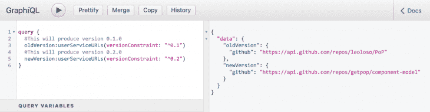
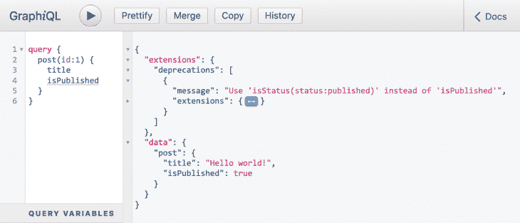
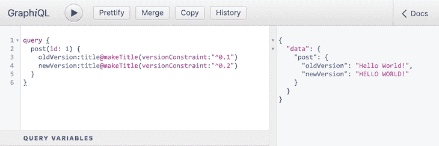
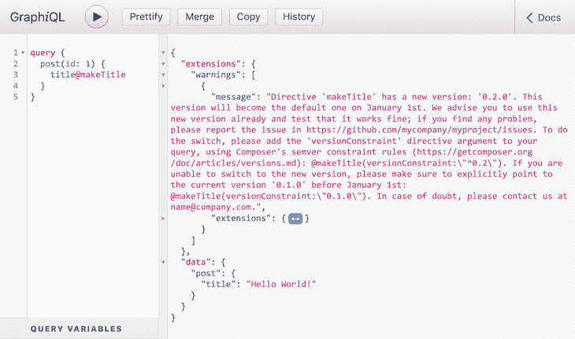

# GraphQL - LogRocket 博客中的版本控制字段

> 原文：<https://blog.logrocket.com/versioning-fields-graphql/>

随着应用程序的发展和用户需求的变化，为应用程序提供数据的 GraphQL API 也需要发展，引入对其模式的更改。每当变化是不间断的，比如当添加一个新的类型或字段时，我们可以直接应用它而不用担心副作用。但是当变化是一个突破性的变化时，我们需要确保我们没有在应用程序中引入错误或意外的行为。

重大更改是指删除类型、字段或指令，或者修改现有字段(或指令)的签名，例如:

*   重命名字段
*   更改现有字段参数的类型，或使其成为强制性的
*   向字段添加新的强制参数
*   向字段的响应类型添加不可为空的

为了处理突发变化，有两种主要策略:版本控制和进化，分别由 REST 和 GraphQL 实现。

REST API[指示要在端点 URL 上(比如`api.mycompany.com/v1`或`api-v1.mycompany.com`)或通过某个头(比如`Accept-version: v1`)使用](https://restfulapi.net/versioning/)的 API 版本。通过版本控制，突破性的改变被添加到 API 的新版本中，并且由于客户端需要显式地指向 API 的新版本，所以它们将意识到这些改变。

GraphQL 并不排斥使用版本控制，但是它鼓励使用演进。如 [GraphQL 最佳实践](https://graphql.org/learn/best-practices/#versioning)页所述:

> 虽然没有什么可以阻止 GraphQL 服务像任何其他 REST API 一样被版本化，但是 GraphQL 强烈主张通过为 GraphQL 模式的持续发展提供工具来避免版本化。

进化的表现不同，因为它不像版本控制那样每隔几个月就会发生一次。相反，它是一个持续的过程，如果需要的话甚至每天都会发生，这使得它更适合快速迭代。这种方法是由 [Principled GraphQL](https://principledgraphql.com) 制定的，这是一套指导 GraphQL 服务开发的最佳实践，[在其第五个原则](https://principledgraphql.com/agility#5-use-an-agile-approach-to-schema-development)中提出:

> **5。使用敏捷的方法进行模式开发:**模式应该基于实际需求逐步构建，并随着时间的推移平稳发展

## 发展模式

通过进化，具有突破性变化的领域必须经历以下过程:

1.  使用不同的名称重新实现该字段。
2.  弃用该字段，请求客户端改用新字段。
3.  每当该字段不再被任何人使用时，就将其从模式中删除。

让我们看一个例子。假设我们有一个类型`Account`，通过这个模式将一个帐户建模为一个有名字和姓氏的人(在这里[可以找到模式如何定义的解释](https://blog.logrocket.com/defining-types-for-your-graphql-api/)):

```
type Account {
  id: Int
  name: String!
  surname: String!
}
```

在这个模式中，`name`和`surname`字段都是强制的(这是在类型`String`后添加的`!`符号)，因为我们希望所有人都有名字和姓氏。

最终，我们也允许组织开户。但是，组织没有姓氏，所以我们必须更改`surname`字段的签名，使其成为非强制性的:

```
type Account {
  id: Int
  name: String!
  surname: String # This has changed
}
```

这是一个突破性的变化，因为应用程序不希望字段`surname`返回`null`，所以它可能不会检查这种情况，就像执行以下 JavaScript 代码时一样:

```
// This will fail when account.surname is null
const upperCaseSurname = account.surname.toUpperCase();
```

通过发展模式，可以避免由中断更改导致的潜在错误:

*   我们不修改`surname`字段的签名；相反，我们将它标记为已弃用，添加一条有用的消息来指示替换它的字段的名称(很可能通过应用于字段定义的[指令`@deprecated`](http://spec.graphql.org/June2018/#sec-Field-Deprecation)
*   我们向模式中引入一个新的字段名称`personSurname`(或`accountSurname`)

我们的`Account`类型现在看起来像这样:

```
type Account {
  id: Int
  name: String!
  surname: String! @deprecated(reason: "Use `personSurname`")
  personSurname: String
}
```

最后，通过收集来自客户的查询日志，我们可以分析他们是否已经转换到新的领域。每当我们注意到字段`surname`不再被任何人使用时，我们可以将它从模式中删除:

```
type Account {
  id: Int
  name: String!
  personSurname: String
}
```

## 进化的问题

上面描述的例子非常简单，但是它已经展示了发展模式的几个潜在问题:

| **问题** | **描述** |
| 字段名变得不那么整洁了 | 

我们第一次给字段命名的时候，可能会为它找到一个最优的名字，比如`surname`。但是，当我们需要替换它时，我们将需要为它创建一个不同的名称，这个名称可能不是最佳的(最佳名称已经被采用了！).上面例子中所有可能的替换都有问题:

*   `personName`明确表示账户是给一个人的，那么如果，以后，我们必须给一个没有姓氏的人开一个账户(不知道…火星人？)，那么我们将需要再次进化模式以保持一致的名称
*   `accountName`中的“account”位是完全多余的，因为类型已经是`Account`
*   否则，使用什么其他名称呢？`surname1`？`surnameNew`？或者更糟，`surnameV2`？

因此，更新后的模式更难理解，也更冗长。

 |
| 该模式可能会累积不推荐使用的字段 | 

弃田作为暂时的情况是最明智的；最终，我们真的希望在这些字段开始累积之前，从模式中删除它们，以清理它们。

然而，可能会有一些客户不修改他们的查询，仍然从过时的字段中获取信息。在这种情况下，我们的模式将缓慢但稳定地成为一种字段墓地，为相同的功能积累几个不同的字段。

 |

我们有办法解决这些问题吗？

## 版本控制字段

对 GraphQL 模式进行编码有两种不同的方法:代码优先和模式优先，正如我在[上一篇文章](https://blog.logrocket.com/code-first-vs-schema-first-development-graphql/)中所解释的。在上面的例子中，我使用模式优先的方法来定义模式，基于[模式定义语言(SDL)](https://www.howtographql.com/basics/2-core-concepts/) 。

当通过 SDL 定义模式时，在我看来没有办法克服我刚才提到的问题，因为模式的契约是明确的。由于新合同是不同的(不同的字段名，一个额外的`!`符号使其类型是强制性的，等等。)，除了以新的形式重写它，同时保持旧的形式之外，别无选择。

但是，使用代码优先的方法，模式可以变成动态的，根据上下文改变它的形状和属性。在我以前的文章“[加速对 GraphQL 模式](https://blog.logrocket.com/speeding-up-changes-to-the-graphql-schema/)的更改”中，我描述了这种策略是如何工作的，目标是允许公司中的不同团队为类型`Product`上的通用字段`discountedPrice`提供他们自己的实现。

策略是启用多个解析器来满足一个字段。通过询问链中的每个解析器是否可以处理查询，直到我们找到可以处理查询的解析器或者到达链的末端，基于上下文信息(例如产品类型、当前日期或其他信息)在运行时选择实现解析器。

我们可以将同样的策略应用于版本字段！我们可以用一个名为`version`的参数来创建我们的字段，通过它我们可以指定使用字段的哪个版本。

在这种情况下，我们仍然必须保留不赞成使用的字段的实现，因此我们在这方面没有改进。然而，它的契约变得隐藏起来:新字段现在可以保持它原来的名称(不需要将其从`surname`重命名为`personSurname`)，防止我们的模式变得过于冗长。

请注意，这个版本控制的概念与 REST 中的不同:

*   REST 建立了一种全有或全无的情况，在这种情况下，整个被查询的 API 具有相同的版本，因为要使用的版本是端点的一部分
*   在另一种方法中，每个字段都是独立版本化的

因此，我们可以访问不同字段的不同版本，如下所示:

```
query GetPosts {
  posts(version: "1.0.0") {
    id
    title(version: "2.1.1")
    url
    author {
      id
      name(version: "1.5.3")
    }
  }
}
```

此外，通过依靠[语义版本](https://semver.org/)，我们可以使用版本约束来选择版本，遵循 npm 用于声明包依赖关系的相同的[规则。然后，我们将字段参数`version`重命名为`versionConstraint`，并更新查询:](https://docs.npmjs.com/about-semantic-versioning)

```
query GetPosts {
  posts(versionConstraint: "^1.0") {
    id
    title(versionConstraint: ">=2.1")
    url
    author {
      id
      name(versionConstraint: "~1.5.3")
    }
  }
}
```

将这种策略应用到我们不赞成使用的字段`surname`，我们现在可以将不赞成使用的实现标记为版本`"1.0.0"`，将新的实现标记为版本`"2.0.0"`，甚至可以在同一个查询中访问这两个实现:

```
query GetSurname {
  account(id: 1) {
    oldVersion:surname(versionConstraint: "^1.0")
    newVersion:surname(versionConstraint: "^2.0")
  }
}
```

我已经在我自己的 GraphQL 服务器上实现了这个解决方案。在 GraphiQL 上查看对[这个问题的回复:](https://newapi.getpop.org/graphiql/?query=query%20%7B%0A%20%20%23This%20will%20produce%20version%200.1.0%0A%20%20oldVersion%3AuserServiceURLs(versionConstraint%3A%20%22%5E0.1%22)%0A%20%20%23This%20will%20produce%20version%200.2.0%0A%20%20newVersion%3AuserServiceURLs(versionConstraint%3A%20%22%5E0.2%22)%0A%7D)



Querying fields through version constraints.

## 定义字段的默认版本

当我们不指定`versionConstraint`参数时会发生什么？例如，下面查询中的字段`surname`应该解析到哪个版本？

```
query GetSurname {
  account(id: 1) {
    # Which version should be used? 1.0.0? 2.0.0?
    surname
  }
}
```

我们有两个担忧:

1.  当没有提供任何版本时，决定使用哪个版本作为默认版本
2.  通知客户有几个版本可供选择

让我们接下来解决这些问题。但在此之前，我们需要了解 GraphQL 在运行查询时提供上下文反馈的能力。

### 运行查询时提供上下文反馈

我现在需要指出 GraphQL 的一个不太理想的情况:它在运行查询时不能提供良好的上下文信息。这对于折旧来说是很明显的，通过查询`Field`和`Enum`类型上的字段`isDeprecated`和`deprecationReason`，折旧数据仅通过自检显示[:](http://spec.graphql.org/June2018/#sec-Deprecation)

```
{
  __type(name: "Account") {
    name
    fields {
      name
      isDeprecated
      deprecationReason
    }
  }
}
```

回应将是:

```
{
  "data": {
    "__type": {
      "name": "Account",
      "fields": [
        {
          "name": "id",
          "isDeprecated": false,
          "deprecationReason": null
        },
        {
          "name": "name",
          "isDeprecated": false,
          "deprecationReason": null
        },
        {
          "name": "surname",
          "isDeprecated": true,
          "deprecationReason": "Use `personSurname`"
        },
        {
          "name": "personSurname",
          "isDeprecated": false,
          "deprecationReason": null
        }
      ]
    }
  }
}
```

但是，当运行涉及不推荐使用的字段的查询时…

```
query GetSurname {
  account(id: 1) {
    surname
  }
}
```

…拒绝信息不会出现在响应中:

```
{
  "data": {
    "account": {
      "surname": "Owens"
    }
  }
}
```

这意味着执行查询的开发人员必须主动执行自省查询，以确定模式是否已升级以及任何字段是否已被否决。那可能会发生…很久才会发生一次？很可能永远不会？

如果 GraphQL API 在执行涉及不赞成使用的字段的查询时提供不赞成使用的信息，这对于修改过时的查询将是一个很大的改进。理想情况下，该信息可以在新的顶级条目`deprecations`下给出，出现在`errors`之后和`data`之前(遵循规范对[响应格式](http://spec.graphql.org/June2018/#sec-Response-Format)的建议)。

由于`deprecations`顶级条目不是规范的一部分，GraphQL 服务器实现者仍然可以通过使用通配符顶级条目`extensions`来添加对更好反馈的支持，这允许根据需要扩展协议。在[的 GraphQL by PoP](https://graphql-by-pop.com) 中，对 graph QL 上的[查询的响应如下所示:](https://newapi.getpop.org/graphiql/?query=query%20%7B%0A%20%20post(id%3A1)%20%7B%0A%20%20%20%20title%0A%20%20%20%20isPublished%0A%20%20%7D%0A%7D)



Deprecation information on the query response.

### 通过警告发布版本

我们刚刚了解到 GraphQL 服务器可以使用`extensions`顶级条目来提供弃用。我们可以使用相同的方法来添加一个`warnings`条目，其中我们通知开发人员一个字段已经被版本化。我们并不总是提供这些信息；仅当查询涉及已版本化的字段，并且没有`versionConstraint`参数时。

我们现在可以为字段的默认版本创建策略。

### 版本控制策略

我们可以采用几种方法，包括:

1.  强制执行`versionConstraint`
2.  默认情况下使用旧版本，直到某个日期，新版本成为默认版本
3.  默认情况下使用最新版本，并鼓励查询开发人员明确说明要使用哪个版本

让我们来研究这些策略，并在运行此查询时查看它们的响应:

```
query GetSurname {
  account(id: 1) {
    surname
  }
}
```

#### 1.强制执行`versionConstraint`

这是最明显的一个:通过强制字段参数，禁止客户端不指定版本约束。然后，每当没有提供时，查询将返回一个错误。

运行该查询将会得到以下响应:

```
{
  "errors": [
    {
      "message": "Argument 'versionConstraint' in field 'surname' cannot be empty"
    }
  ],
  "data": {
    "account": {
      "surname": null
    }
  }
}
```

#### 2.默认使用旧版本，直到某个日期*、*新版本成为默认

继续使用旧版本，直到某一天，新版本将成为默认版本。在这个过渡期内，要求查询开发人员通过查询中的新`extensions.warnings`条目在该日期之前向旧版本显式添加版本约束。

[运行查询](https://newapi.getpop.org/graphiql/?query=query%20%7B%0A%20%20userServiceURLs%0A%7D)将响应:

```
{
  "extensions": {
    "warnings": [
      {
        "message": "Field 'surname' has a new version: '2.0.0'. This version will become the default one on January 1st. We advise you to use this new version already and test that it works fine; if you find any problem, please report the issue in https://github.com/mycompany/myproject/issues. To do the switch, please add the 'versionConstraint' field argument to your query (using npm's semver constraint rules; see https://docs.npmjs.com/about-semantic-versioning): surname(versionConstraint:\"^2.0\"). If you are unable to switch to the new version, please make sure to explicitly point to the current version '1.0.0' before January 1st: surname(versionConstraint:\"^1.0\"). In case of doubt, please contact us at [email protected]",
    ]
  },
  "data": {
    "account": {
      "surname": "Owens"
    }
  }
}
```

#### 3.使用最新版本，并鼓励用户明确说明要使用哪个版本

每当未设置`versionConstraint`时，使用字段的最新版本，并鼓励查询开发人员明确定义必须使用哪个版本，通过新的`extensions.warnings`条目显示该字段的所有可用版本列表:

[运行查询](https://newapi.getpop.org/graphiql/?query=query%20%7B%0A%20%20userServiceData%0A%7D)将响应:

```
{
  "extensions": {
    "warnings": [
      {
        "message": "Field 'surname' has more than 1 version. Please add the 'versionConstraint' field argument to your query to indicate which version to use (using npm's semver constraint rules; see https://docs.npmjs.com/about-semantic-versioning). To use the latest version, use: surname(versionConstraint:\"^2.0\"). Available versions: '2.0.0', '1.0.0'.",
    ]
  },
  "data": {
    "account": {
      "surname": "Owens"
    }
  }
}
```

## 版本控制指令

因为指令也接收参数，所以我们也可以对版本指令实现完全相同的方法！

例如，当[运行这个查询](https://newapi.getpop.org/graphiql/?query=query%20%7B%0A%20%20post(id%3A%201)%20%7B%0A%20%20%20%20oldVersion%3Atitle%40makeTitle(versionConstraint%3A%22%5E0.1%22)%0A%20%20%20%20newVersion%3Atitle%40makeTitle(versionConstraint%3A%22%5E0.2%22)%0A%20%20%7D%0A%7D)时:

```
query {
  post(id: 1) {
    oldVersion:[email protected](versionConstraint: "^0.1")
    newVersion:[email protected](versionConstraint: "^0.2")
  }
}
```

它为指令的每个版本生成不同的响应:



Querying a versioned directive.

并且当[运行查询](https://newapi.getpop.org/graphiql/?query=query%20%7B%0A%20%20post(id%3A%201)%20%7B%0A%20%20%20%20title%40makeTitle%0A%20%20%7D%0A%7D)而不提供版本约束时:

```
query {
  post(id: 1) {
    [email protected]
  }
}
```

它假定使用一个默认版本，并为开发人员提供一条警告消息来修改查询:



Querying a versioned directive without version constraints.

## 结论

您可能会在互联网上找到比较 GraphQL 的文章，并根据它们的所有特征思考哪一个更好。当具体比较版本化和进化时，得到的回应(和往常一样)是:“两者都不是特别好；两者各有利弊，视语境而定或多或少合适。”

然而，更好的是能够将两种方法结合起来，并获得两个世界的最佳效果:API 本身是无版本的，并通过演进进行升级，但具有可以版本化的字段(和指令)。请注意，这里并不矛盾——拥有版本化的字段(和指令)并不会使 API 版本化，因为每个字段仍然是独立查询的。

在本文中，我们了解了这种策略是如何工作的，以及如何实现它。老实说，我不知道目前有多少 GraphQL 服务器支持完全实现这种策略，因为它涉及在执行查询时在响应的顶级`extensions`条目下发送定制数据。

然而，即使没有这种增强的反馈信息，我们也可以对模式中的字段(和指令)进行版本化，以避免像`personSurname`这样命名字段。

## 继续多看

本文是正在进行的关于概念化、设计和实现 GraphQL 服务器的系列文章的一部分。该系列的前几篇文章是:

1.  *[设计 GraphQL 服务器以获得最佳性能](https://blog.logrocket.com/designing-graphql-server-optimal-performance/)*
2.  *[简化 GraphQL 数据模型](https://blog.logrocket.com/simplifying-the-graphql-data-model/)*
3.  *[graph QL 中模式优先与代码优先的开发](https://blog.logrocket.com/code-first-vs-schema-first-development-graphql/)*
4.  *[加速对 GraphQL 模式的修改](https://blog.logrocket.com/speeding-up-changes-to-the-graphql-schema/)*

## 监控生产中失败和缓慢的 GraphQL 请求

虽然 GraphQL 有一些调试请求和响应的特性，但确保 GraphQL 可靠地为您的生产应用程序提供资源是一件比较困难的事情。如果您对确保对后端或第三方服务的网络请求成功感兴趣，

[try LogRocket](https://lp.logrocket.com/blg/graphql-signup)

.

[](https://lp.logrocket.com/blg/graphql-signup)[https://logrocket.com/signup/](https://lp.logrocket.com/blg/graphql-signup)

LogRocket 就像是网络和移动应用的 DVR，记录下你网站上发生的每一件事。您可以汇总并报告有问题的 GraphQL 请求，以快速了解根本原因，而不是猜测问题发生的原因。此外，您可以跟踪 Apollo 客户机状态并检查 GraphQL 查询的键值对。

LogRocket 检测您的应用程序以记录基线性能计时，如页面加载时间、到达第一个字节的时间、慢速网络请求，还记录 Redux、NgRx 和 Vuex 操作/状态。

[Start monitoring for free](https://lp.logrocket.com/blg/graphql-signup)

.