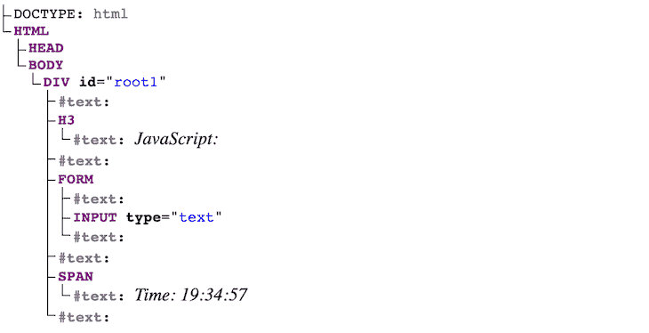
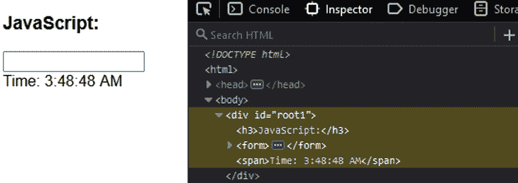
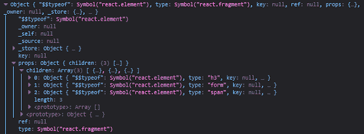
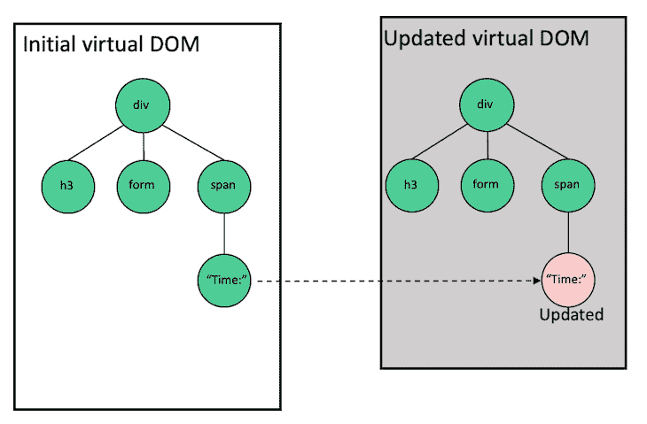
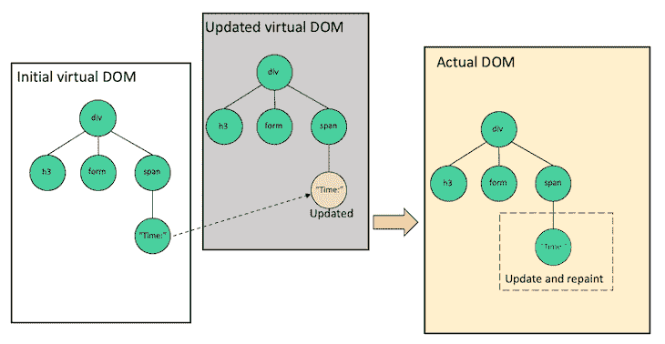
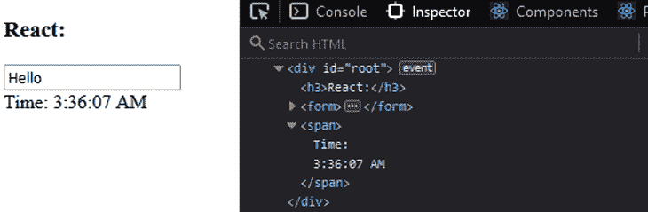
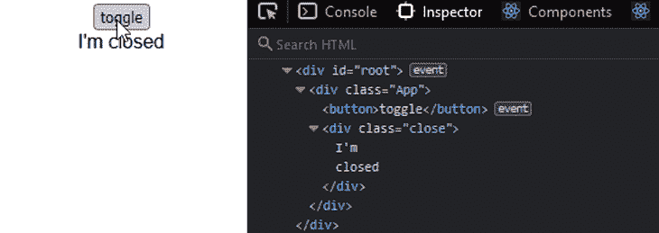
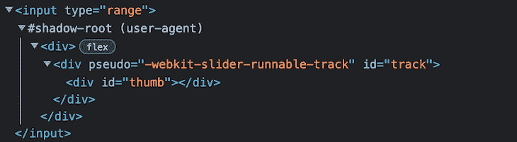

# React 中的虚拟 DOM 是什么？

> 原文：<https://blog.logrocket.com/virtual-dom-react/>

虚拟 DOM 是一个基本的 React 概念；如果您在过去几年中编写过 React 代码，您可能听说过它。但是，您可能不理解它是如何工作的以及 React 为什么使用它。

在本文中，我们将介绍什么是虚拟 DOM，探索它在 React 中的好处，并回顾一个实际例子。我们开始吧！

*向前跳转:*

## 什么是反作用？

为了理解虚拟 DOM 并了解 React 实现它的原因，让我们首先回顾一下什么是实际的浏览器 DOM。

通常，每当用户请求网页时，浏览器都会从服务器接收该页面的 HTML 文档。然后，浏览器从 HTML 构建一个逻辑的树状结构，在客户端向用户显示所请求的页面。

这种树状结构被称为文档对象模型，也称为 DOM。它是 web 文档作为节点和对象的结构化表示，在本例中是 HTML 文档。

DOM 充当 web 文档的接口，因此 JavaScript 和其他脚本语言可以访问、操作文档内容，并以编程方式与之交互。例如，开发人员可以使用 DOM APIs 来添加或删除元素，修改它们的外观，以及在 web 元素上执行用户操作。

## 重新渲染如何影响性能

DOM 操作速度非常快，是轻型操作。然而，当应用程序数据发生变化并触发更新时，重新渲染可能会非常昂贵。

让我们用下面的 JavaScript 代码模拟重新呈现一个页面:

```
const update = () => {
 const element = `
  <h3>JavaScript:</h3>
  <form>
   <input type="text"/>
  </form>
  <span>Time: ${new Date().toLocaleTimeString()}</span>
 `;

 document.getElementById("root1").innerHTML = element;
};

setInterval(update, 1000);

```

你可以在 CodeSandbox 上找到完整的代码[。表示文档的 DOM 树如下所示:](https://codesandbox.io/s/goofy-darwin-4g25ce?file=/src/index.js)



代码中的`setInterval()`回调让我们每秒钟触发一次 UI 的模拟重新呈现。如下面的 GIF 所示，文档 DOM 元素在每次更新时都被重新构建和重新绘制。由于这种重新呈现，UI 中的文本输入也会丢失其状态:



如上所述，当 UI 中发生更新时，文本字段会丢失输入值，这需要优化。

不同的 JavaScript 框架提供不同的解决方案和策略来优化重新渲染。然而，React 实现了虚拟 DOM 的概念。

## 探索 React 虚拟 DOM

顾名思义，虚拟 DOM 是对象形式的实际 DOM 的一个轻量级副本。虚拟 DOM 可以保存在浏览器内存中，不会直接改变用户浏览器上显示的内容。React 由其他几个前端框架实现，如 Vue，它的声明性方法是独一无二的。

### 虚拟的 DOM 和真实的 DOM 有什么不同？

一个常见的误解是，虚拟 DOM 比实际的 DOM 更快或更强，然而，这是不正确的。事实上，虚拟 DOM 的操作支持并补充了实际 DOM 的操作。实质上，虚拟 DOM 提供了一种机制，允许实际 DOM 在重新呈现 UI 时计算最少的 DOM 操作。

例如，当真实 DOM 中的元素发生变化时，DOM 将重新呈现该元素及其所有子元素。当构建具有大量交互性和状态变化的复杂 web 应用程序时，这种方法既慢又低效。

相反，在呈现过程中，React 使用虚拟 DOM 的概念，这符合其声明性方法。因此，我们可以指定我们希望 UI 处于什么状态，在这之后 React 使它发生。

虚拟 DOM 更新后，React 将其与更新前拍摄的虚拟 DOM 的快照进行比较，确定哪个元素发生了更改，然后只更新真实 DOM 上的那个元素。这是虚拟 DOM 用来优化性能的一种方法。我们稍后会详细讨论。

虚拟 DOM 将手动 DOM 操作从开发人员手中抽象出来，帮助我们编写更可预测和更轻松的代码，以便我们可以专注于创建组件。

多亏了虚拟 DOM，您不必担心状态转换。一旦更新了状态，React 就会确保 DOM 与该状态相匹配。例如，在我们的最后一个例子中，React 确保每次重新渲染时，只有`Time`在实际的 DOM 中得到更新。因此，当 UI 更新发生时，我们不会丢失输入字段的值。

### 虚拟 DOM 对象

让我们考虑下面的渲染代码，它代表了我们之前的 JavaScript 示例的 React 版本:

```
// ...
const update = () => {
 const element = (
  <>
   <h3>React:</h3>
   <form>
    <input type="text" />
   </form>
   <span>Time: {new Date().toLocaleTimeString()}</span>
  </>
 );
 root.render(element);
};

```

为了简洁起见，我们删除了一些代码。你可以在 CodeSandbox 上看到完整的代码。我们也可以用简单的 React 编写 JSX 代码，如下所示:

```
const element = React.createElement(
 React.Fragment,
 null,
 React.createElement("h3", null, "React:"),
 React.createElement(
  "form",
  null,
  React.createElement("input", {
   type: "text"
  })
 ),
 React.createElement("span", null, "Time: ", new Date().toLocaleTimeString())
);

```

请记住，您可以通过在一个[巴别塔 REPL 编辑器](https://babeljs.io/repl)中粘贴 JSX 元素来获得 JSX 代码的 React 等价物。

现在，如果我们在控制台中记录 React 元素，我们将得到如下图所示的结果:

```
 const element = (
  <>
   <h3>React:</h3>
   <form>
    <input type="text" />
   </form>
   <span>Time: {new Date().toLocaleTimeString()}</span>
  </>
 );
 console.log(element)

```



如上所述，对象是虚拟 DOM。它代表用户界面。

### React 如何实现虚拟 DOM

为了理解虚拟 DOM 策略，我们需要理解其中涉及的两个主要阶段，渲染和协调。

当我们呈现一个应用程序用户界面时，React 会创建一个表示该用户界面的虚拟 DOM 树，并将其存储在内存中。在下一次更新时，或者换句话说，当呈现应用程序的数据发生变化时，React 将自动为更新创建一个新的虚拟 DOM 树。

为了进一步解释这一点，我们可以直观地将虚拟 DOM 表示如下:



左边的图像是初始渲染。随着`Time`的改变，React 用更新的节点创建一个新的树，如右侧所示。

记住，虚拟 DOM 只是一个表示 UI 的对象，所以屏幕上不会绘制任何东西。

React 创建了新的虚拟 DOM 树后，它使用一种叫做 reconciliation】的差分算法将它与之前的快照[进行比较，以确定需要进行哪些更改。](https://reactjs.org/docs/reconciliation.html#the-diffing-algorithm)

在协调过程之后，React 使用像 ReactDOM 这样的渲染器库[，它利用不同的信息来更新渲染的应用程序。这个库确保实际的 DOM 只接收和重画更新的节点:](https://blog.logrocket.com/managing-dom-components-reactdom/)



如上图所示，在实际的 DOM 中，只有数据发生变化的节点被重新绘制。下面的 GIF 进一步证明了这个说法:



当 UI 中发生状态变化时，我们不会丢失输入值。

总之，在每次渲染时，React 都会将虚拟 DOM 树与以前的版本进行比较，以确定哪个节点得到了更新，从而确保更新后的节点与实际的 DOM 相匹配。

### 反应扩散过程

当 React 区分两个虚拟 DOM 树时，它首先比较两个快照是否具有相同的根元素。如果它们有相同的元素，就像在我们的例子中，更新的节点是相同的`span`元素类型，那么 React 继续移动并在属性上递归。

在这两个快照中，`span`元素上没有出现或更新任何属性。React 然后在孩子们身上重复这个过程。一旦看到`Time`文本节点已经改变，React 将只更新真实 DOM 中的实际节点。

另一方面，如果两个快照有不同的元素类型，这在大多数更新中很少见，React 将销毁旧的 DOM 节点并构建一个新的。例如，从`span`到`div`，如下面相应的代码片段所示:

```
<span>Time: 04:36:35</span> 

```

```
<div>Time: 04:36:38</div>

```

在下面的示例中，我们呈现了一个简单的 React 组件，该组件在单击按钮后更新组件状态:

```
import { useState } from "react";

const App = () => {
 const [open, setOpen] = useState(false);

 return (
  <div className="App">
   <button onClick={() => setOpen((prev) => !prev)}>toggle</button>
   <div className={open ? "open" : "close"}>
    I'm {open ? "opened" : "closed"}
   </div>
  </div>
 );
};
export default App;

```

更新组件状态会重新呈现组件。然而，如下所示，在每次重新渲染时，React 只知道更新类名和更改的文本。此更新不会伤害渲染中未受影响的元素:



参见 CodeSandbox 上的[代码和演示。](https://codesandbox.io/s/stupefied-sanderson-dgq4t9?file=/src/App.js)

### 如何应对不同的列表

当我们修改一个条目列表时，React 如何改变列表取决于条目是添加在列表的开头还是末尾。考虑以下列表:

```
<ul> 
  <li>item 3</li>
  <li>item 4</li>
  <li>item 5</li>
</ul>

```

在下一次更新时，让我们在末尾添加一个`item 6`，就像这样:

```
<ul> 
  <li>item 3</li>
  <li>item 4</li>
  <li>item 5</li>
  <li>item 6</li>
</ul>

```

React 从顶部开始比较项目。它匹配第一、第二和第三项，并且只知道插入最后一项。这种计算对于 React 来说很简单。

但是，让我们在开头插入`item 2`，如下:

```
<ul> 
  <li>item 2</li>
  <li>item 3</li>
  <li>item 4</li>
  <li>item 5</li>
</ul>

```

同样，React 从顶部开始比较，立刻意识到`item 3`与更新树的`item 2`不匹配。因此，它认为这是一个全新的名单，需要重建。

我们不需要重建整个列表，而是希望 DOM 只通过添加`item 2`来计算最少的操作。React 让我们给[添加一个`key`道具，唯一地标识物品](https://reactjs.org/docs/reconciliation.html#keys)，如下所示:

```
<ul> 
  <li key="3">item 3</li>
  <li key="4">item 4</li>
  <li key="5">item 5</li>
</ul>

<ul> 
  <li key="2">item 2</li>
  <li key="3">item 3</li>
  <li key="4">item 4</li>
  <li key="5">item 5</li>
  <li key="6">item 6</li>
</ul>

```

有了上面的实现，React 就会知道我们已经预先考虑了`item 2`并附加了`item 6`。因此，它可以保留已经可用的项目，只在 DOM 中添加新的项目。

如果我们在映射渲染项目列表时省略了`key`属性，React 会在浏览器控制台中提醒我们。

## 虚拟 DOM 和阴影 DOM 有什么不同？

在我们结束之前，这里有一个经常出现的问题。影子 DOM 和虚拟 DOM 一样吗？简而言之，他们的行为是不同的。

影子 DOM 是一个实现 web 组件的工具。以 HTML `input`元素`range`为例:

```
<input type="range" />

```

这给了我们以下结果:


如果我们使用浏览器的开发工具来检查元素，我们只会看到一个简单的`input`元素。然而，在内部，浏览器封装并隐藏了组成输入滑块的其他元素和样式。

使用 Chrome DevTools，我们可以从`Settings`启用`Show user agent shadow DOM`选项来查看阴影 DOM:



在上图中，`input`元素中的`#shadow-root`元素的结构化树被称为阴影 DOM 树。它提供了一种将组件(包括样式)从实际的 DOM 中分离出来的方法。

因此，我们确信一个小部件或组件的风格，就像上面的`input`范围，无论在哪里呈现都会被保留。换句话说，它们的行为或外观永远不会受到真实 DOM 中其他元素样式的影响。

## 对比图:真实 DOM vs .虚拟 DOM vs .影子 DOM

下表总结了真实 DOM、虚拟 DOM 和影子 DOM 之间的差异:

| 真正的 DOM | 虚拟 DOM | 阴影 DOM | 描述 |
| --- | --- | --- | --- |
| 网络文档的接口；允许脚本与文档交互 | 实际 DOM 的内存副本 | 一个实现 web 组件的工具，或者一个实际 DOM 中的隔离 DOM 树，用于确定作用域 | 与开发者的相关性 |
| 开发人员手动执行 DOM 操作来操纵 DOM | 开发人员不必担心状态转换；虚拟 DOM 将 DOM 操作从开发人员手中抽象出来。 | 开发人员可以创建可重用的 web 组件，而不用担心宿主文档的样式冲突 | 谁使用它们 |
| 在浏览器中实现 | 由 React、Vue 等库和框架使用。 | 由 web 组件使用 | 项目复杂性 |
| 适合没有复杂交互的简单的中小型项目 | 适合具有高度交互性的复杂项目 | 适合简单到中等规模的项目，交互性不太复杂 | CPU 和内存使用情况 |
| 与虚拟 DOM 更新相比，真实 DOM 使用更少的 CPU 和内存 | 与真实的 DOM 更新相比，虚拟 DOM 使用更多的 CPU 和内存 | 与虚拟 DOM 更新相比，影子 DOM 使用更少的 CPU 和内存 | 包装 |
| 不支持封装，因为组件可以在其范围之外进行修改 | 支持封装，因为组件不能在其范围之外被修改 | 支持封装，因为组件不能在其范围之外被修改 | 结论 |

## React 使用虚拟 DOM 作为策略，在重新呈现 UI 时计算最少的 DOM 操作。它不与真正的 DOM 竞争或比它更快。

虚拟 DOM 提供了一种机制，将手动 DOM 操作从开发人员手中抽象出来，帮助我们编写更可预测的代码。它通过比较两个渲染树来确定到底发生了什么变化，只更新实际 DOM 中必要的内容。

和 React 一样， [Vue 也采用了这个策略](https://blog.logrocket.com/how-the-virtual-dom-works-in-vue-js/)。然而， [Svelte 提出了另一种方法](https://blog.logrocket.com/how-to-build-simple-svelte-js-app/)来确保应用程序得到优化，将所有组件编译成独立的微型 JavaScript 模块，使脚本运行起来非常轻便快捷。

我希望你喜欢阅读这篇文章。如果你有问题或贡献，请务必在评论区分享你的想法。

[LogRocket](https://lp.logrocket.com/blg/react-signup-general) :全面了解您的生产 React 应用

## 调试 React 应用程序可能很困难，尤其是当用户遇到难以重现的问题时。如果您对监视和跟踪 Redux 状态、自动显示 JavaScript 错误以及跟踪缓慢的网络请求和组件加载时间感兴趣，

.

[try LogRocket](https://lp.logrocket.com/blg/react-signup-general)

LogRocket 结合了会话回放、产品分析和错误跟踪，使软件团队能够创建理想的 web 和移动产品体验。这对你来说意味着什么？

[ ](https://lp.logrocket.com/blg/react-signup-general) [](https://lp.logrocket.com/blg/react-signup-general) 

LogRocket 不是猜测错误发生的原因，也不是要求用户提供截图和日志转储，而是让您回放问题，就像它们发生在您自己的浏览器中一样，以快速了解哪里出错了。

不再有嘈杂的警报。智能错误跟踪允许您对问题进行分类，然后从中学习。获得有影响的用户问题的通知，而不是误报。警报越少，有用的信号越多。

LogRocket Redux 中间件包为您的用户会话增加了一层额外的可见性。LogRocket 记录 Redux 存储中的所有操作和状态。

现代化您调试 React 应用的方式— [开始免费监控](https://lp.logrocket.com/blg/react-signup-general)。

Modernize how you debug your React apps — [start monitoring for free](https://lp.logrocket.com/blg/react-signup-general).