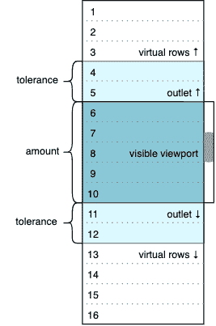
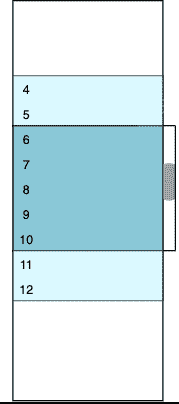
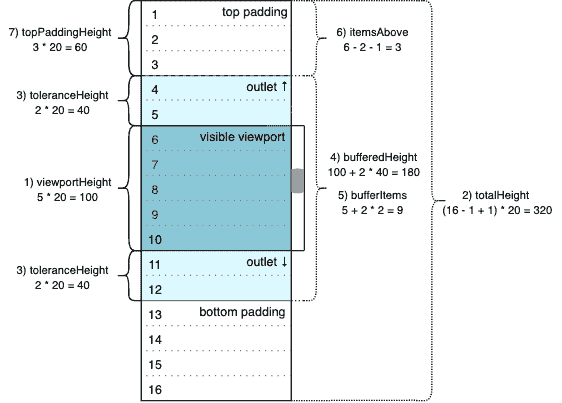

# 虚拟滚动:React 的核心原理和基本实现

> 原文：<https://blog.logrocket.com/virtual-scrolling-core-principles-and-basic-implementation-in-react/>

什么是虚拟滚动，我们为什么需要它？假设您有一个包含 100，000 或更多项的数据集，您希望将它显示为不带分页的可滚动列表。渲染这么多行将污染 DOM，消耗太多内存，并降低应用程序的性能。

相反，您希望在给定时间只向用户显示一小部分数据。其他项目应该通过顶部和底部填充元素进行模拟(虚拟化)，这些填充元素是空的，但具有提供一致的滚动条参数所需的高度。每当用户滚动出可见项目集时，内容都被重建:新的项目被获取和呈现，旧的被销毁，填充元素被重新计算，等等。

简而言之，这就是虚拟滚动核心原理。在本教程中，我们将复习基础知识，学习如何创建一个可重用的 React 组件来解决最简单的虚拟滚动问题。

你可以在我的 [GitHub](https://github.com/dhilt/react-virtual-scrolling/tree/basics) 上查看完整的演示库，我已经在 [CodeSandbox](https://codesandbox.io/s/react-virtual-scrolling-basics-u1svg) 中同步了一个应用程序，以便在运行时使用它。

## 第 1 部分:基础设施

虽然虚拟滚动有无数的使用案例和需求，但今天我们将重点了解核心原则，并构建一个小组件来满足一些非常基本的需求。让我们定义开始的条件:

*   我们想要虚拟化的数据集中的项目数量是已知且固定的
*   单行的高度是恒定的
*   从我们的应用程序到 scroller 组件的同步数据流是有保证的

任何界面开发的第一步都是想象它最终会如何被使用。假设我们已经有了一个名为`VirtualScroller` **的组件。**要使用它，我们需要做三件事:

1.  传递虚拟化设置
2.  提供数据流机制
3.  定义行模板

```
<VirtualScroller settings={SETTINGS} get={getData} row={rowTemplate}/>
```

### 设置

我们可以将设置作为一组单独的 HTML 属性来提供，但是我们将定义一个单独的静态对象。它的字段应该确定期望的行为并反映初始条件。让我们从最小值开始(我们总是可以将`maxIndex`增加到 100，000)。

```
const SETTINGS = {
  minIndex: 1,
  maxIndex: 16,
  startIndex: 6,
  itemHeight: 20,
  amount: 5,
  tolerance: 2
}

```

`amount`和`tolerance`需要特别注意。`amount`定义我们希望在视口中可见的项目数量。`tolerance`确定视口的出口，其中包含将被渲染但对用户不可见的附加项目。下图显示了`SETTINGS`对象的选定值，动画 gif 演示了滚动时初始状态如何变化。

 

彩色窗口包含实际数据行(最初从 4 到 12)。深蓝色区域表示视口的可见部分；其高度是固定的，等于`amount` * `itemHeight`。浅蓝色插座具有真实但不可见的行，因为它们在视口之外。上方和下方的白色区域是两个空容器；它们的高度对应于我们不希望出现在 DOM 中的虚拟化行。我们可以如下计算虚拟行的初始数量。

```
(maxIndex - minIndex + 1) - (amount + 2 * tolerance) = 16 - 9 = 7

```

Seven 分为顶部的三个虚拟行和底部的四个虚拟行。

每次我们上下滚动时，图像都会改变。例如，如果我们滚动到最顶端(零)位置，视口的可见部分将有 1 到 5 行，底部出口将有 6 到 7 行，底部填充容器将虚拟化 8 到 16 行，顶部填充容器将接受零高度，顶部出口将不存在。这种转换的逻辑将在下面讨论，我们将在第二部分讨论`VirtualScroller`组件。

### 数据流

我们定义了`get`属性，并将其传递给带有`getData`值的`VirtualScroller`组件。什么是`getData`？这是一种向`VirtualScroller`提供部分数据集的方法。滚动器将通过这个方法请求数据，所以我们需要用适当的参数对它进行参数化。姑且称之为`offset`和`limit`。

```
const getData = (offset, limit) => {
  const data = []
  const start = Math.max(SETTINGS.minIndex, offset)
  const end = Math.min(offset + limit - 1, SETTINGS.maxIndex)
  if (start <= end) {
    for (let i = start; i <= end; i++) {
      data.push({ index: i, text: `item ${i}` })
    }
  }
  return data
}

```

`getData(4, 9)`调用意味着我们想要接收从索引 4 开始的 9 个项目。这个特定的调用与上图相关联:需要 4 到 12 个项目来在开始时用插座填充视口。在`Math.min`和`Math.max`的帮助下，我们将把请求的数据部分限制在由最大/最小索引设置定义的数据集边界内。这也是我们生成项目的地方；一个项目是具有`index`和`text`属性的对象。`index`是唯一的，因为这些属性将参与行模板。

我们可以从其他地方请求数据，甚至从远程数据源请求数据，而不是生成项目。我们可以返回 [`Promise`](https://developer.mozilla.org/en-US/docs/Web/JavaScript/Reference/Global_Objects/Promise) 来处理异步数据源请求，但是现在我们将关注虚拟化而不是数据流，以保持实现尽可能简单。

### 行模板

一个仅显示`text`属性的非常简单的模板可能如下所示:

```
const rowTemplate = item =>
  <div className="item" key={item.index}>
    { item.text }
  </div>

```

行模板取决于应用程序的独特需求。复杂度可能不同，但必须与`getData`返回的内容一致。行模板的`item`必须与每个`data`列表项具有相同的结构。还需要 [`key`](https://reactjs.org/docs/lists-and-keys.html#keys) 属性，因为`VirtualScroller`创建行列表，我们需要为元素提供稳定的标识。

让我们再看一看:

```
<VirtualScroller settings={SETTINGS} get={getData} row={rowTemplate}/>

```

我们已经成功地传递了我们想要传递给`VirtualScroller`的三样东西。通过这种方式，`VirtualScroller`不需要知道它正在处理的数据的任何信息。这些信息将通过`get`和`row`属性来自滚动器的外部，这是组件可重用性的关键。我们也可以将刚刚建立的 scroller 属性协议视为我们未来的组件 API。

现在已经完成了一半的工作，进入第二阶段:构建一个虚拟滚动组件来满足我们在上一节中开发的 API。这听起来有点像[如何画猫头鹰](https://www.reddit.com/r/pics/comments/d3zhx/how_to_draw_an_owl/)，但是我保证，我们真的已经成功了一半。

### 提供；给予

回到上一节的图片，显然我们需要以下 DOM 元素:

*   具有受约束的`height`和`overflow-y: auto`样式的视口元素
*   两个无内容但具有动态`height`的填充元素
*   用行模板包装的缓冲的`data`项的列表

```
render() {
  const { viewportHeight, topPaddingHeight, bottomPaddingHeight, data } = this.state
  return (
    <div className='viewport' style={{ height: viewportHeight }}>
      <div style={{ height: topPaddingHeight }}></div>
      { data.map(this.props.row) }
      <div style={{ height: bottomPaddingHeight }}></div>
    </div>
  )
}
```

这就是 render 方法可能的样子。四个状态属性反映了我们为 DOM 结构设置的需求:三个高度和数据的当前部分。此外，我们看到`this.props.row`，它只是从外部传递的行模板，因此`data.map(this.props.row)`将根据我们的 API 呈现当前数据项的列表。在添加滚动之前，我们需要定义状态属性。

### 状态

现在该初始化内部组件的状态了。让我们尝试基于第一部分中讨论的`settings`对象实现一个返回初始状态对象的纯函数。除了渲染中的四个状态属性，我们还需要一些其他的滚动属性，这样当状态对象的属性比渲染所需的多一点时，我们就不会感到惊讶了。话虽如此，我们这一部分的主要目标是强制第一个渲染绘制初始图片。

```
const setInitialState = ({
  minIndex, maxIndex, startIndex, itemHeight, amount, tolerance
}) => {
  // 1) height of the visible part of the viewport (px)
  const viewportHeight = amount * itemHeight
  // 2) total height of rendered and virtualized items (px)
  const totalHeight = (maxIndex - minIndex + 1) * itemHeight
  // 3) single viewport outlet height, filled with rendered but invisible rows (px)
  const toleranceHeight = tolerance * itemHeight
  // 4) all rendered rows height, visible part + invisible outlets (px)
  const bufferHeight = viewportHeight + 2 * toleranceHeight
  // 5) number of items to be rendered, buffered dataset length (pcs)
  const bufferedItems = amount + 2 * tolerance
  // 6) how many items will be virtualized above (pcs)
  const itemsAbove = startIndex - tolerance - minIndex
  // 7) initial height of the top padding element (px)
  const topPaddingHeight = itemsAbove * itemHeight
  // 8) initial height of the bottom padding element (px)
  const bottomPaddingHeight = totalHeight - topPaddingHeight
  // 9) initial scroll position (px)
  const initialPosition = topPaddingHeight + toleranceHeight
  // initial state object
  return {
    settings,
    viewportHeight,
    totalHeight,
    toleranceHeight,
    bufferHeight,
    bufferedItems,
    topPaddingHeight,
    bottomPaddingHeight,
    initialPosition,
    data: []
  }
}

```

让我们来看看更新后的图片:



计算式(8)和(9)不在图上。scroller 在初始化时不会在缓冲区中有任何项目；缓冲区保持为空，直到第一个`get`方法调用返回非空结果。这也是为什么我们看到一个空数组`[]`作为`data`状态属性的初始值。因此，最初，视口应该只包含两个空白填充元素，底部的元素应该填充顶部元素之后剩余的所有空间。因此，320–60 = 260(px)将是我们示例中`bottomPaddingHeight`的初始值。

最后，`initialPosition`决定开始时滚动条的位置。它应该与`startIndex`值一致，所以在我们的示例中滚动条的位置应该固定在第六行，顶部坐标。这相当于 60 + 40 = 100 (px)的值。

### 初始化

状态的初始化放在 scroller 组件构造函数中，同时创建 viewport [元素引用](https://reactjs.org/docs/refs-and-the-dom.html)，这是手动设置滚动位置所必需的。

```
constructor(props) {
  super(props)
  this.state = setInitialState(props.settings)
  this.viewportElement = React.createRef()
}

```

这使我们能够用两个填充元素初始化我们的视口，其中累积高度对应于我们将要显示/虚拟化的所有数据的量。此外，应该更新 render 方法以分配 viewport 元素引用。

```
  return (
    <div className='viewport'
         style={{ height: viewportHeight }}
         ref={this.viewportElement}
    > ... </div>
  )

```

在第一次渲染完成并且填充元素初始化之后，将视口滚动条位置设置为初始值。 [`DidMount`生命周期方法](https://reactjs.org/docs/state-and-lifecycle.html#adding-lifecycle-methods-to-a-class)是最合适的地方。

```
componentDidMount() {
  this.viewportElement.current.scrollTop = this.state.initialPosition
}

```

现在我们必须处理滚动。`runScroller`方法将负责获取`data`项并调整填充元素。我们将立即实现它，但是首先让我们[将它与渲染时 viewport 元素的滚动事件](https://reactjs.org/docs/handling-events.html)绑定。

```
  return (
    <div className='viewport'
         style={{ height: viewportHeight }}
         ref={this.viewportElement}
         onScroll={this.runScroller}
    > ... </div>
  )

```

第一次渲染完成后，调用`DidMount`方法。将`initialPosition`值赋给视口的`scrollTop`属性将隐式调用`runScroller`方法。这样，初始数据请求将被自动触发。

还有一种边缘情况，初始滚动位置为 0，`scrollTop`不变；这在技术上与`minIndex`等于`startIndex`的情况相关。在这种情况下，应该显式调用`runScroller`。

```
componentDidMount() {
  this.viewportElement.current.scrollTop = this.state.initialPosition
  if (!this.state.initialPosition) {
    this.runScroller({ target: { scrollTop: 0 } })
  }
}

```

我们需要模拟`[event](https://developer.mozilla.org/en-US/docs/Web/API/Event/target)`对象，但是`scrollTop`是`runScroller`处理程序唯一要处理的东西。现在我们已经到了最后一条逻辑。

```
runScroller = ({ target: { scrollTop } }) => {
  const { totalHeight, toleranceHeight, bufferedItems, settings: { itemHeight, minIndex }} = this.state
  const index = minIndex + Math.floor((scrollTop - toleranceHeight) / itemHeight)
  const data = this.props.get(index, bufferedItems)
  const topPaddingHeight = Math.max((index - minIndex) * itemHeight, 0)
  const bottomPaddingHeight = Math.max(totalHeight - topPaddingHeight - data.length * itemHeight, 0)

  this.setState({
    topPaddingHeight,
    bottomPaddingHeight,
    data
  })
}

```

`runScroller`是 scroller 组件的一个[类属性](https://reactjs.org/docs/faq-functions.html#how-do-i-bind-a-function-to-a-component-instance)(参见我在 [TC39 repo](https://github.com/tc39/proposal-class-fields/issues/293) 中创建的这个问题)，它通过`this`访问它的`state`和`props`。它根据作为参数传递的当前滚动位置和在正文第一行中构造的当前状态进行一些计算。

第 2 行和第 3 行用于获取数据集的新部分，这将是一个新的滚动数据项缓冲区。第 4 行和第 5 行用于获取顶部和底部填充元素的新高度值。结果转到`state`，然后`render`更新视图。

数学上的几句话。根据我们在第一部分中开发的 API，`get`方法需要两个参数来回答下面的问题。

* * *

### 更多来自 LogRocket 的精彩文章:

* * *

*   应该请求多少项(`limit`自变量，也就是`bufferedItems`)？
*   什么索引应该是结果数组的第一个(`offset`自变量，也就是`index`)？

计算`index`时要记住顶部出口，这样会减去之前设置的`toleranceHeight`值。除以`itemHeight`会在`index`之前给我们留下一些行，我们希望它们是缓冲区中的第一个。添加的`minIndex`将行数转换为索引。滚动位置(`scrollTop`)可以出现在随机行的中间，这样，可能不是`itemHeight`的倍数。这就是为什么我们需要对除法的结果进行四舍五入— `index`必须是整数。

顶部填充元素的高度是在`index`乘以行的已知高度之前通过许多行获得的。`Math.max`表达式确保结果不是负的。我们可以将这种保护转移到`index`步骤(比如，`index`不能小于`minIndex`)，但结果是一样的。同样值得注意的是，我们已经在`getData`实现中加入了这样的限制。

底部填充元素的高度考虑了为 scroller 缓冲区(`data.length` *** `itemHeight`)检索的新项目的高度。我不相信在这个实现中它会是负的，但是我们现在不用担心这个。逻辑是非常基本的，我们试图专注于方法本身。因此，一些细节可能不是 100%完美。

## 摘要

虚拟卷轴工程在前端开发中的历史可以追溯到 2010 年代早期，可能更早。我的个人虚拟滚动之旅始于 2014 年。今天，我维护了两个角度宇宙回复——`[angular-ui-scroll](https://github.com/angular-ui/ui-scroll)`和[`ngx-ui-scroll`](https://github.com/dhilt/ngx-ui-scroll)——我用 React 开发了这个简单的演示。

假设行高不变，我们刚刚实现的`VirtualScroller`组件可以虚拟化固定大小的数据集。它使用开发人员负责实现的特殊方法来消费数据。它还接受影响视图和行为的模板和静态设置属性。

这篇文章并不自称是绝对真理的来源；这只是一种方法，适合最简单情况的许多可能的解决方案之一。在这个或那个框架的基础上构建了许多包罗万象的解决方案，包括 React，但它们都有其局限性，没有一个真正涵盖所有可能的需求。一个图书馆总能做一些另一个图书馆做不到的事情——这是常见的情况。

从零开始构建解决方案的选项增强了我们应用虚拟滚动技术的能力。这不是神圣的知识，但它是我们可以继续前进的东西。

说到需求，我们还能提出什么其他的发展来使我们的实现更好呢？

*   检查所有输入参数，抛出有意义的错误
*   默认设置:一个普通的 lib 用户为什么要考虑`tolerance`？
*   缓存:不要两次请求相同的数据
*   允许无限数据集:`min`和`max`索引可以是未知的
*   异步数据流:滚动器在更新状态之前必须等待数据
*   动态数据源设置:比如我们决定数据源准备多提供 100 项，为什么不增加`maxIndex` *？*
*   动态视口设置:我们可能想要在飞行中改变视口的高度

*   让应用程序访问一些只读数据:当前在缓冲区中有多少项，以及第一个/最后一个可见项，滚动器正在加载(如果是异步数据源)？
*   提供操作滚动器运行时的方法:按需删除或添加项目(无需滚动)，重新加载视口，滚动到边框，滚动到特定索引，重新加载到索引
*   N ew 设置:s croll 事件潜伏期 (do 不会过于频繁地触发 scroller 逻辑)、 反向选项 (滚动 排名靠前的结果以指数递增) 、 无剪辑选项
*   允许水平滚动模式
*   动画挂钩

这绝不是一个完整的列表，上面的大多数特性都有自己的边缘情况、各种实现方法以及性能和可用性问题。我们甚至不要开始测试。

此外，每个单独的鼠标、触摸板、电话和浏览器可能会有不同的行为，特别是在惯性领域。有时候我就想哭。但是，尽管虚拟滚动令人沮丧，开发它还是很有趣，也很有收获。因此，今天就开始吧，帮助将虚拟滚动的旗帜带入一个新时代！

## 使用 LogRocket 消除传统反应错误报告的噪音

[LogRocket](https://lp.logrocket.com/blg/react-signup-issue-free)

是一款 React analytics 解决方案，可保护您免受数百个误报错误警报的影响，只针对少数真正重要的项目。LogRocket 告诉您 React 应用程序中实际影响用户的最具影响力的 bug 和 UX 问题。

[ ](https://lp.logrocket.com/blg/react-signup-general) [  ](https://lp.logrocket.com/blg/react-signup-general) [LogRocket](https://lp.logrocket.com/blg/react-signup-issue-free)

自动聚合客户端错误、反应错误边界、还原状态、缓慢的组件加载时间、JS 异常、前端性能指标和用户交互。然后，LogRocket 使用机器学习来通知您影响大多数用户的最具影响力的问题，并提供您修复它所需的上下文。

关注重要的 React bug—[今天就试试 LogRocket】。](https://lp.logrocket.com/blg/react-signup-issue-free)