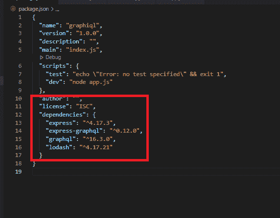
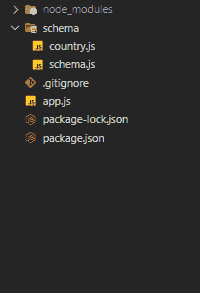
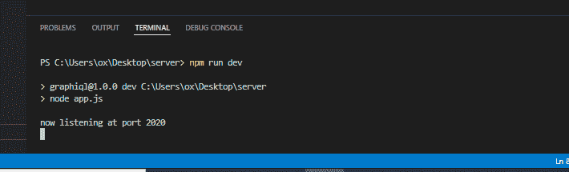
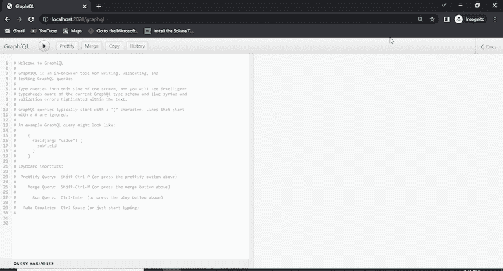
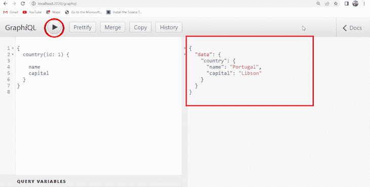

# 用 GraphQL-log rocket 博客可视化 graph QL 模式

> 原文：<https://blog.logrocket.com/visualizing-graphql-schema-with-graphiql/>

当有更好更简单的选择时，你需要使用复杂的方法吗？为什么在做最基本的事情时总是坚持命令行界面？

是的，了解事情如何在引擎盖下工作往往有它的好处，但并不总是如此。你不需要把事情弄得太复杂，而且，现在即使是极客也倾向于使用图形用户界面。

在本教程中，看看如何使用[GraphQL](https://github.com/graphql/graphiql)来辅助 graph QL 开发。让我们直接跳进来吧！

## GraphQL 是什么？

在我们谈论 GraphQL 之前，让我们先来谈谈它有什么帮助——graph QL。

GraphQL 是一种用于应用编程接口(API)的开源数据查询和操作语言，也是一种用现有数据完成查询的运行时语言。

GraphQL 是脸书在 2012 年内部开发的，2015 年向公众发布。

相比与 API 交互的表述性状态转移(REST)方法，开发人员更倾向于使用它，但是我们会注意不要在这篇文章中讨论 RESTful 方法和 GraphQL 的优缺点——我们将把它留给另一篇文章。

## 什么是 GraphiQL？

现在，如果你熟悉 RESTful APIs，你可能会知道像 Postman 和失眠症这样的工具，因为它们不仅在快速可视化方面帮助我们开发 API，而且还帮助我们更快地完成工作。

现在，我要你把 GraphiQL 想象成邮递员或者失眠。GraphQL 是 graph QL 集成开发环境(IDE)。

这是一个强大的工具。一个帮助你可视化构建 GraphQL 查询的工具。

## 先决条件

在我们继续深入之前，我们必须记下更好地理解该主题所需的知识:

*   对 Node.js 有一个基本的了解。这是节点包管理器(npm)附带的
*   了解基本 express 服务器设置。在本教程中，我们将使用 [express.js](https://expressjs.com/) 来启动服务器
*   代码编辑器(我使用 Visual Studio 代码)

## 设置项目

我们正在构建一个 express.js 服务器，这是一个 Node.js 应用程序——我们将创建一个文件夹来存放我们的项目文件。

进入新创建或所需的文件夹后，在命令行界面(CLI)上运行以下命令:

`npm init -y`

这将在您所在的文件夹中创建一个 package.json 文件。

接下来要做的是安装我们项目所需的必要包。为此，运行:`npm install graphql express-graphql express`。

您应该将`"dev": "node app.js"`添加到 **package.json** 文件中的脚本对象中。

全部安装后，您的 package.json 文件应该如下所示:



现在让我解释一下下面的包是做什么的。

我们需要`graphql`，因为这是我们正在构建的，这个包本身为我们提供了所有需要的方法——除了我们想要在`express.js`服务器上运行，并且开箱即用，`express.js`不知道如何与`graphql`通信。

正因为如此，我们需要另一个包；`express-graphql`。

请注意，当您安装这些包时，它创建了 **node_modules** 文件夹，所有必需的文件和依赖项都存储在这里。每当我们[需要](https://nodejs.org/en/knowledge/getting-started/what-is-require/)一个包时，它就会查看这个文件夹。

在您的文件夹中，创建一个名为“app.js”的文件，并粘贴以下代码:

```
//js 
const express = require('express');
const { graphqlHTTP } = require('express-graphql');
const schema = require('./schema/schema');
const app = express();
// bind express with graphql
app.use('/graphql', graphqlHTTP({
    schema,
    graphiql: true
}));
app.listen(2020, () => {
    console.log('now listening at port 2020');
});

```

这是我们的切入点。在第 2 行，我们需要`express`并放入一个变量；快递**。**在第 3 行，我们为`express-graphql`做了类似的事情；唯一的区别是我们使用析构来获得一个特定的方法，`graphqlHTTP`——这是`express-graphql`中的一个属性。

在第 4 行，我们需要一个自定义路径 schema.js。

* * *

### 更多来自 LogRocket 的精彩文章:

* * *

然后第 5 行是我们实例化 express 函数并将其放入变量的地方；app **。**

从第 7 行到第 10 行，我们从调用 app.use()开始，它允许我们在 express.js 中注册中间件。

我们给 GraphiQL 一个值“true ”,因为这是本教程的要点——我们希望能够以图形方式看到正在发生的事情(可视化☺️)。

然后从第 11 行到第 13 行，如果前面的代码一切顺利，我们将在端口 2020 监听，并且控制台记录“现在正在端口 2020 监听”。

现在，在项目的文件夹中创建一个文件夹。调用文件夹 **schema** ，然后在刚刚创建的文件夹( **schema** 内，创建一个名为“schema . js”**的文件。**你应该知道，我们决定在这个项目中使用的文件夹和文件名只是个人选择，你并不局限于此。

将以下代码粘贴到 schema.js 文件中:

```
//js
const graphql = require("graphql");
const _ = require("lodash");
const { countries } = require("./country");
const { GraphQLObjectType, GraphQLString, GraphQLSchema, GraphQLID } = graphql;
const CountryType = new GraphQLObjectType({
  name: "Country",
  fields: () => ({
    id: { type: GraphQLID },
    name: { type: GraphQLString },
    capital: { type: GraphQLString },
  }),
});
const RootQuery = new GraphQLObjectType({
  name: "RootQueryType",
  fields: {
    country: {
      type: CountryType,
      args: { id: { type: GraphQLID } },
      resolve(parent, args) {
        return _.find(countries, { id: args.id });
      },
    },
  },
});
module.exports = new GraphQLSchema({
  query: RootQuery,
});

```

我在这里使用的一个包是 Loadash，之前没有安装，所以继续运行:`npm intsall loadash`。

在 **schema** 文件夹中，创建另一个名为 country.js 的文件，并粘贴以下代码:

```
var countries = [
    { name: 'Portugal', capital: 'Libson', id: '1' },
    { name: 'Canada', capital: 'Ontario', id: '2' },
    { name: 'Nigeria', capital: 'Abuja', id: '3' },
];
module.exports = {countries};

```

最后，项目的文件夹应该如下所示:



现在，回到 **schema/schema.js *中发生的事情。*** 从第 2 行到第 5 行，这是我们成功创建一个符合**模式** / **country.js.** 中的结构的 GraphQL 服务器所需的所有内容

从第 6 行到第 13 行，变量 CountryType 由 GraphQLObjectType()方法实例化，该方法来自`graphql`。其中有两个属性:**名称**和**字段**。

**name** 的值为“Country”，其中**字段**作为属性也是隐式返回对象(id；名大写)。

从第 14 行到第 25 行，我们有一个 GraphQLObjectType()的新实例，它被放在变量 RootQuery *中。*我们看到，我们使用 Loadash 来返回 id 表示的国家。

如果一切正常，您应该能够在 GraphQL 界面中运行您的 graph QL。

运行`npm run dev`:



然后，在你的浏览器中，进入**[http://localhost:2020/graph QL](http://localhost:2020/graphql)**，你应该会看到这个:



是的，现在您可以使用 GraphiQL 接口测试您的 API 了。您可以尝试通过在您的浏览器中粘贴以下内容来获取我们 country.js 中某个国家的名称和首都:

```
{
  country(id: 1) {
    name
    capital
  }
}

```

完成后，点击“Play”图标，您应该会在屏幕的另一侧看到如下回应:



这个项目位于这个 [github 仓库](https://github.com/bigpreshy/graphgl)中。

## 结论

我们已经完成了关于如何用 GraphQL 可视化 graph QL 模式的教程，graph QL 的默认可视化工具。

我们首先建立一个新项目并安装必要的包，然后探究每个包的用途。

我们已经看到，GraphQL 提供了一种很好的方式来查询 API 中的某些内容，并且仍然尽可能地减少资源——也就是说，您可以从更大的资源中寻找特定的资源。

## 监控生产中失败和缓慢的 GraphQL 请求

虽然 GraphQL 有一些调试请求和响应的特性，但确保 GraphQL 可靠地为您的生产应用程序提供资源是一件比较困难的事情。如果您对确保对后端或第三方服务的网络请求成功感兴趣，

[try LogRocket](https://lp.logrocket.com/blg/graphql-signup)

.

[](https://lp.logrocket.com/blg/graphql-signup)[https://logrocket.com/signup/](https://lp.logrocket.com/blg/graphql-signup)

LogRocket 就像是网络和移动应用的 DVR，记录下你网站上发生的每一件事。您可以汇总并报告有问题的 GraphQL 请求，以快速了解根本原因，而不是猜测问题发生的原因。此外，您可以跟踪 Apollo 客户机状态并检查 GraphQL 查询的键值对。

LogRocket 检测您的应用程序以记录基线性能计时，如页面加载时间、到达第一个字节的时间、慢速网络请求，还记录 Redux、NgRx 和 Vuex 操作/状态。

[Start monitoring for free](https://lp.logrocket.com/blg/graphql-signup)

.