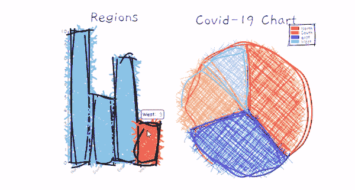
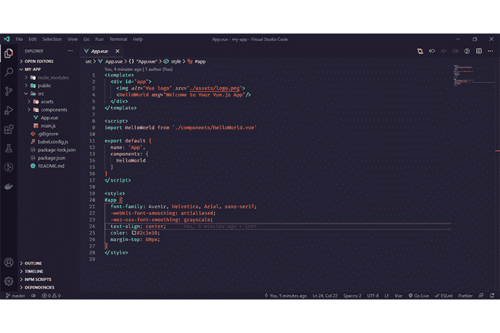
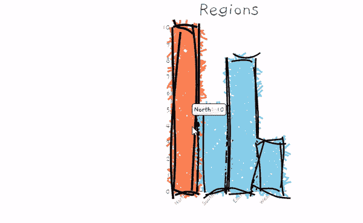
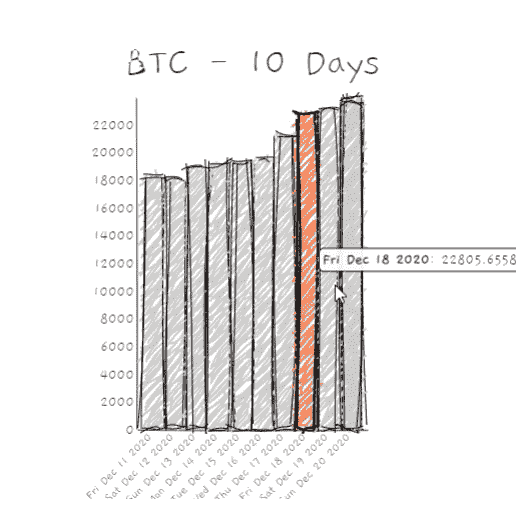

# 使用 roughViz - LogRocket 博客在 Vue.js 中可视化草图

> 原文：<https://blog.logrocket.com/visualizing-sketched-charts-in-vue-js-with-roughviz/>

## **简介**

图表是数据的图形表示，用于使数据集更易于阅读，更易于区分其各个部分。虽然大多数用户习惯于看到简洁正式的图表，但是一些用户更喜欢手绘的图表。这就是 roughViz 的用武之地。

roughViz 是一个基于 D3.js 和 Rough.js 构建的 JavaScript 库。该库旨在帮助构建看似草图或手绘的图表，如下例所示。



在本指南中，您将学习如何使用 vue-roughviz 在[您的 Vue.js 应用](https://blog.logrocket.com/methods-optimizing-vue-js-applications/)中显示类似草图的图表，以及如何使用 vue-cli **配置 Vue 应用。**

### **先决条件**

本教程假设以下先决条件:

## **项目设置**

如果您尚未安装 vue-cli，请运行以下命令安装最新版本。

```
npm install -g @vue/cli
# OR
yarn global add @vue/cli

```

现在，创建新的 vue 应用程序:

```
vue create my-app

```

**注意:**这个过程可能需要几分钟。完成后，我们可以进入新的应用程序根目录:

```
cd my-app

```

上面详述的过程创建了一个新的 Vue.js 应用程序。为了确保一切都设置好了，运行`npm run serve`。当您访问 [http://localhost:8080](http://localhost:8080) 时，您应该会看到浏览器中显示的“欢迎来到您的 Vue.js 应用程序页面”。

### **add view-roughviz**

`vue-roughviz`是 roughViz.js 的 Vue.js 包装器。这使得库可以作为组件访问，这允许在基于 Vue.js 的项目中无缝重用。

要将`vue-roughviz`包含在我们的项目中，运行:

```
npm install vue-roughviz

```

### **vue-roughViz 组件**

vue-roughviz 为所有 roughviz 的图表样式提供了组件，包括:

*   `roughBar`–roughViz 条形图组件
*   `roughBarH`–roughViz 水平条形图组件
*   `roughDonut`–roughViz 圆环图组件
*   `roughPie`–roughViz 饼图
*   `roughLine`–roughViz 折线图组件
*   `roughScatter`–roughViz 散点图组件
*   `roughStackedBar`–roughViz 堆叠条形图组件

### **用途**

一旦将`vue-roughviz`添加到项目中，下一步就是在您喜欢的文本编辑器中打开项目文件夹。

当您打开`src/App.vue`文件时，初始内容应该类似于下图:



src/App.vue file

如果您的视图看起来如上，继续删除它的所有内容，并用以下代码替换:

```
<template>
  <div id="app">
    <rough-bar
      :data="{
        labels: ['North', 'South', 'East', 'West'],
        values: [10, 5, 8, 3],
      }"
      title="Regions"
      roughness="8"
      :colors="['red', 'orange', 'blue', 'skyblue']"
      stroke="black"
      stroke-width="3"
      fill-style="cross-hatch"
      fill-weight="3.5"
      class="d-inline"
    />
  </div>
</template>

<script>
import { RoughBar } from "vue-roughviz";
export default {
  name: "App",
  components: {
    RoughBar,
  },
};
</script>

```

#### **代码解释**

*   `import ...`–该生产线用于从我们之前安装的 vue-roughviz 中导入 roughBar 组件。
*   `export default {}`–该块用于使之前导入的组件(roughBar)可在我们的应用程序中使用。
*   这里是我们调用外部 roughBar 组件的地方。这些组件中指定的属性是必需的属性。如果你不熟悉单个文件组件，你可能想看看这个指南。

#### vista-roughviz props

唯一需要的道具是`data`，它指的是用来构建图表的数据。这可以是字符串，也可以是对象。

如果选择一个对象，该对象必须包含标签和值键。如果使用字符串，该字符串必须是 csv 或 tsv 文件的 url。在该文件中，您还必须将标签和值指定为代表每一列的单独属性。

其他有用的道具包括:

*   `title`–指定图表标题
*   `roughness`–图表的粗糙程度
*   `stroke` –线条的颜色
*   `stroke-width`–杆行程的大小
*   `fill-weight`–指定内部路径颜色的权重。
*   `fill-style`–条形填充样式，可以是下列样式之一:
    *   `dashed`
    *   `solid`
    *   `zigzag-line`
    *   `cross-hatch`
    *   `hachure`
    *   `zigzag`

访问[此处](https://github.com/jwilber/roughViz#api)查看所有支持道具的列表。

### **运行**

要预览我们的应用，请运行`npm run serve`。如果你正确地遵循了上面的步骤，访问 [http://localhost:8080](http://localhost:8080) 应该可以让你看到浏览器中显示的图表。



## **从外部 API 加载数据**

让我们做一个小实验，在图表中显示过去 10 天比特币的价格历史。对于这个实验，我们将使用 Coingecko API。

**为什么是 Coingecko？**与其他加密货币 API 不同，Coingecko 是免费的，不需要 API 密匙就可以上手，非常适合我们的实验。

继续用下面的代码替换`src/App.vue`

```
<template>
  <div id="app">
    <div class="d-inline-block">
      <rough-bar
        v-if="chartValue.length > 0"
        :data="{
          labels: chartLabel,
          values: chartValue,
        }"
        title="BTC - 10 Days"
        roughness="3"
        color="#ccc"
        stroke="black"
        stroke-width="1"
        fill-style="zig-zag"
        fill-weight="2"
      />
    </div>
  </div>
</template>

<script>
import { RoughBar } from "vue-roughviz";
export default {
  name: "App",
  components: {
    RoughBar,
  },
  data() {
    return {
      chartLabel: [],
      chartValue: [],
    };
  },
  methods: {
    async loadData() {
      await fetch(
        "https://api.coingecko.com/api/v3/coins/bitcoin/market_chart?vs_currency=usd&days=10&interval=daily"
      )
        .then((res) => res.json())
        .then((rawData) => {
          console.table(rawData.prices);
          rawData.prices.map((data) => {
            let date = new Date(data[0]).toDateString();
            let rPrice = data[1];
            console.log(`Price of 1btc on ${date} is ${rPrice}`);
            this.chartLabel.push(date);
            this.chartValue.push(rPrice);
          });
        })
        .catch((err) => console.error("Fetch error -> ", err));
    },
  },
  beforeMount() {
    this.loadData();
  },
};
</script>

```

新的变化是——我们创建了一个异步方法`loadData()`,它从 coingecko API 中获取比特币价格历史，并遍历返回的数据，我们将日期和价格分开，使用返回的*日期*作为我们的图表标签，使用*价格*作为我们的图表值。并且`beforeMount()`也就是说，在我们的应用程序被安装到视图中之前，我们调用了我们之前创建的`loadData()`函数。

运行我们的应用程序，您应该会看到图表的新变化，如下所示:



## **结论**

本文解释了图表及其用途，向您展示了使用 vue-cli 创建 Vue 应用程序的过程，并展示了如何使用 vue-roughviz 在您的 Vue.js 应用程序中显示类似草图的图表。

## **进一步探索**

如果您有兴趣了解更多关于 roughViz 的信息或为其做出贡献，请访问 GitHub 上的 [roughViz](https://github.com/jwilber/roughViz) 或 [vue-roughviz](https://github.com/jolo-dev/vue-roughviz) 项目。这个教程的源代码也可以在 GitHub [这里](https://github.com/asaoluelijah/vue-roughviz-tutorial)找到。

## 像用户一样体验您的 Vue 应用

调试 Vue.js 应用程序可能会很困难，尤其是当用户会话期间有几十个(如果不是几百个)突变时。如果您对监视和跟踪生产中所有用户的 Vue 突变感兴趣，

[try LogRocket](https://lp.logrocket.com/blg/vue-signup)

.

[](https://lp.logrocket.com/blg/vue-signup)[https://logrocket.com/signup/](https://lp.logrocket.com/blg/vue-signup)

LogRocket 就像是网络和移动应用程序的 DVR，记录你的 Vue 应用程序中发生的一切，包括网络请求、JavaScript 错误、性能问题等等。您可以汇总并报告问题发生时应用程序的状态，而不是猜测问题发生的原因。

LogRocket Vuex 插件将 Vuex 突变记录到 LogRocket 控制台，为您提供导致错误的环境，以及出现问题时应用程序的状态。

现代化您调试 Vue 应用的方式- [开始免费监控](https://lp.logrocket.com/blg/vue-signup)。