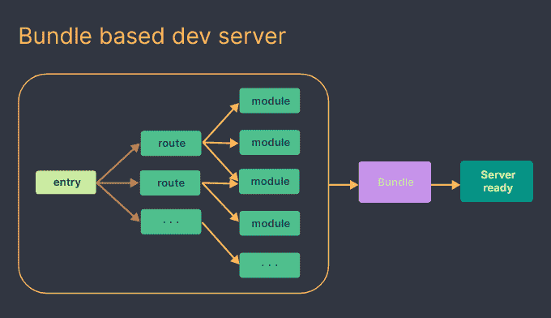
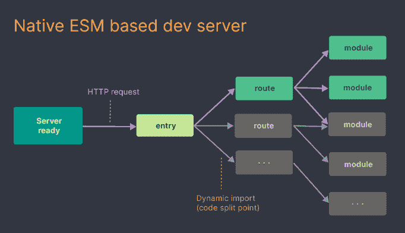
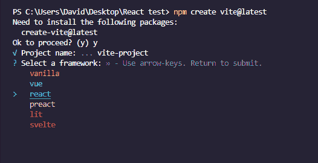
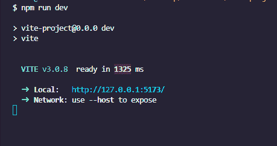
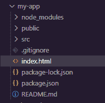
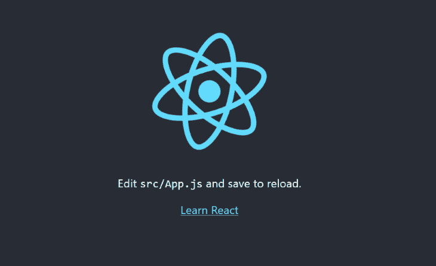
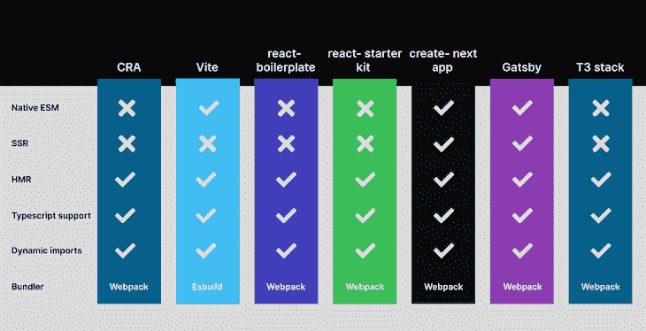

# vite 3.0 vs . Create React App-log rocket 博客

> 原文：<https://blog.logrocket.com/vite-3-vs-create-react-app-comparison-migration-guide/>

Create React App (CRA)在 React 强大的社区和生态系统的发展中发挥了关键作用。当谈到心血来潮构建本地 React 开发环境时， [Create React App](https://create-react-app.dev/) 是所有技能集的开发人员的首选工具。

CRA 拥有几个令人难以忽视的突出特性，其中最突出的是其本地开发服务器、热模块替换(HMR)和产品捆绑。但是 Create React App 确实有一个明显的缺点，就是渐进速度和性能恶化。

随着应用程序的规模和复杂性的增长，Create React App 的性能往往会下降。启动开发服务器所需的时间显著增加，使得 Create React App 不适合生产。

在本指南中，我们将介绍基于 esbuild 的构建工具 [Vite。我们将涵盖开始使用 Vite 构建 React 应用程序所需的一切，回顾 Vite 和 CRA 之间的差异，并演示如何从 Create React 应用程序迁移到 Vite。最后，我们将提到 CRA 和 Vite 的几个值得注意的竞争对手。我们开始吧！](https://blog.logrocket.com/getting-started-with-vite/)

*向前跳转:*

## 先决条件

要跟随本教程，您需要以下内容:

*   Node.js ≥v14.18
*   支持本地 ES 模块(ESM)和动态导入的浏览器；大多数现代浏览器都有这个
*   一个包管理器，如 npm 或 Yarn

## Vite 是什么？

Vite 是一个构建工具，它在当前和下一代 web 开发之间架起了一座桥梁，为开发人员和现代 web 项目提供了更快、更高效的体验。

Vite 建立在 esbuild 之上，esbuild 是一个用 Go 编写的 JavaScript 捆绑器，它捆绑依赖项的速度比基于 JavaScript 的捆绑器快 10 到 100 倍。

由 Vue 的创始人尤雨溪创建的 Vite 是平台无关的，这意味着你可以用它来开发 JavaScript 和类型脚本应用程序，并支持像 React、Svelte、Preact 甚至 vanilla JavaScript 这样的流行库。

Vite 利用浏览器的本地 ESM 来解析和编译浏览器请求的代码。然后，它使用类似于 [Koa](https://koajs.com/) 、一个[轻量级 Node.js web 服务器](https://blog.logrocket.com/comparing-top-node-js-frameworks-frontend-developers/#koa-js)的插件来提供源文件。它创建了一个支持热模块替换的开发服务器，以更新提供的模块并为生产构建进行汇总。

## Vite 和 Create React App 是如何工作的？

Vite 和 Create React App 并没有你想象的那么不同。从本质上来说，这两个工具做的几乎是一样的事情，服务于本地开发服务器和捆绑代码用于生产。主要区别在于代码在开发中的服务方式以及支持哪些模块。

Create React App 是一个开发环境，通过让开发人员专注于他们的代码而不是配置构建工具，有助于加快开发过程。在幕后，Create React App 使用一个名为 [webpack](https://webpack.js.org/) 的第三方构建工具来处理其核心功能。真的，这就是 Vite 要面对的。

那么，[什么是 webpack](https://blog.logrocket.com/transpile-es-modules-with-webpack-node-js/) ？webpack 和 Vite 一样是一个 JavaScript 模块捆绑器。但是，与 Vite 不同，webpack 支持多个开箱即用的模块:

*   ESM
*   CommonJS
*   异步模块定义(AMD) API

webpack 使用任何这些 JavaScript 模块系统将资产和模块组合成一个或多个静态资产。然后，它使用 Express web 服务器和 [webpack-dev-server](https://webpack.js.org/configuration/dev-server/) 从支持 HMR 的捆绑资产中提供内容。

为了客观地看待问题，我们将分析这两种工具在开发中如何处理这些功能。

## 在开发中创建 React 应用程序

当您第一次开始 Create React 应用程序开发时，webpack 使用应用程序的入口点`index.js`文件来创建项目中所有模块的依赖关系树。

然后，它使用 Babel 传输代码，将代码捆绑在一起，并使用 Express web 服务器提供服务。最后，它设置了处理热模块更换的插座。

尽管这种方法更快，并且让您专注于代码，但是它有一个很大的缺点。每当代码发生变化时，webpack 都会重复绑定过程。结果，随着您的源代码变得越来越大，一切都变得缓慢，服务于开发服务器和构建您的项目所需的时间也显著增加。

以下是 CRA 发展过程的直观描述:



## 发展中的 Vite

另一方面，Vite 仅在您第一次开始开发时使用 esbuild 预捆绑您的依赖项，然后才开始为您的应用程序提供服务。

在启动一个开发服务器之前，Vite 不需要捆绑整个 app 或者 transpile 模块和代码；运输是按需完成的，比 CRA 快得多。

在服务应用程序后，Vite 没有像 CRA 那样重建和重新加载整个页面，而是使用基于路径的代码分割来确定需要加载哪部分代码。然后，它使用浏览器从应用程序的入口点解析本地 es 模块。

浏览器将读取代码中的`import`和`export`语句，并为每次导入向服务器发出 HTTP 请求。然后，开发服务器拦截请求，并在必要时执行代码转换。

没有任何改变的模块将返回 304 `not modified`状态码，所以浏览器忽略它们。因此，浏览器不必重新加载，应用程序保持其状态。

以下是 Vite 开发流程的直观描述:



## 为什么要用 Vite？

之前，我们回顾了使用 Vite 进行 React 应用程序开发的一些优势。现在，让我们仔细看看 Vite 的好处。

### 性能优越

在预捆绑过程中，Vite 会将作为 CommonJS 或 UMD 提供的依赖项转换为 ESM。发生这种转换是因为默认情况下，Vite 仅支持 ESM 并提供本机 ESM 代码。

为了提高页面加载性能，Vite 可以将许多内部模块的依赖关系转换成一个模块。这些模块倾向于同时触发数百个请求，这可能会造成浏览器拥塞，并对加载时间产生负面影响。但是，通过将这些依赖项预先捆绑到一个文件中，它们只需要发送一个请求，从而提高了整体性能。

* * *

### 更多来自 LogRocket 的精彩文章:

* * *

### 广泛的插件兼容性

Vite 利用 Rollup 插件接口来改善开发者的体验；换句话说，Vite 兼容大多数现成的 Rollup 插件。

### 更快的更新

我们之前解释了在基于捆绑的服务器中，随着应用程序规模的增加，HMR 速度会显著下降。

在 Vite 中，HMR 是通过本地 ESM 执行的。当接受热更新的模块发生变化时，Vite 只需要精确地使模块失效。无论应用程序的大小如何，这都会加快 HMR 更新的速度。

### 更快的构建时间

为了构建用于生产的应用程序，Vite 使用预配置的 Rollup，这是一个比 webpack 更有效的捆绑器。因此，Vite 的建造时间往往比 CRA 更快，并且它的产量也更小。

## 使用 Vite 3.0 设置 React 项目

要创建 Vite 应用程序，请转到您机器的终端，`cd`到一个首选文件夹，并运行以下命令:

```
npm create [email protected]

```

运行命令后，CLI 将提示您选择项目名称。在我们的例子中，我们将使用默认名称`vite-project`。然后，我们将从可用模板列表中选择 **react** 。这通常需要 10 秒或更短时间:



或者，您可以在命令中指定您所选择的模板，而不需要查看提示。

您可以通过添加一个`--template`标志，后跟框架的名称来实现:

```
npm init [email protected] vite-project --template react

```

接下来，`cd`进入项目文件夹，安装必要的依赖项，并使用以下命令启动 dev 服务器:

```
cd vite-project
npm install
npm run dev

```

在这些命令运行之后，开发服务器将在`port 5173`启动并运行。通常，Vite 只需 1325 毫秒即可为一个应用程序提供服务:



现在，打开你的浏览器，输入`localhost:5173`。您将看到一个与下图类似的页面，带有典型的计数按钮:


就是这样！我们已经成功地建立了一个 Vite React 开发环境！接下来，我们将了解如何将 Create React 应用程序项目迁移到 Vite。

## 将 Create React 应用程序项目迁移到 Vite

如果您有一个现有的 CRA 项目，将其迁移到 Vite 是非常简单的。首先，打开项目文件夹中的`package.json`文件，并从依赖项列表中删除`react-scripts`:

```
  "dependencies": {
    ...
    "react-scripts": "5.0.1",
    ...
  },  

```

接下来，用下面的代码添加`"devDependencies"`:

```
  "devDependencies": {
    "@vitejs/plugin-react": "^2.0.1",
    "vite": "^3.0.7"
  },  

```

现在，分别用下面的代码片段替换下面的脚本:

```
  "scripts": {
    "start": "react-scripts start",
    "build": "react-scripts build",
    "test": "react-scripts test",
    "eject": "react-scripts eject"
  },

```

```
  "scripts": {
    "start": "vite",
    "build": "vite build",
  },  

```

转到`Public`文件夹中的`index.html`文件，删除链接路径中的每个`%PUBLIC_URL%/`前缀:

```
<link rel="icon" href="%PUBLIC_URL%/favicon.ico" />

<link rel="apple-touch-icon" href="%PUBLIC_URL%/logo192.png" />

<link rel="manifest" href="%PUBLIC_URL%/manifest.json" />

```

用以下内容替换删除的前缀:

```
<link rel="icon" href="./public/favicon.ico" />
 ...
<link rel="apple-touch-icon" href="./public/logo192.png" />
 ...
<link rel="manifest" href="./public/manifest.json" />

```

然后，在`body`元素中添加一个入口点脚本，就在`root` div 的下面:

```
<script type="module" src="/src/index.jsx"></script>

```

在此之前，将每个包含 React 代码的`.js`文件重命名为`.jsx`文件。例如，您可以将`index.js`文件重命名为`index.jsx`。

然后，将`index.html`文件移动到根文件夹:



接下来，我们将创建一个 Vite 配置文件，删除节点模块文件夹，并重新安装依赖项。首先在根文件夹中创建一个`vite.config.js`文件，并添加以下代码:

```
import { defineConfig } from "vite";
import react from "@vitejs/plugin-react";

export default defineConfig({
  plugins: [react()],
})

```

接下来，转到根文件夹，删除`node_modules`文件夹。然后，运行以下命令来重新安装依赖项并启动开发服务器:

```
npm install
npm start

```

现在，如果您打开浏览器并转到`localhost:5173`，开发服务器应该会成功启动:



## Create React App 和 Vite 的区别

我们已经了解了 CRA 和 Vite 是如何工作的，并且回顾了使用 Vite 比使用 CRA 的一些好处。现在，让我们来看看这些工具之间的一些差异。

### 绝对进口

当你开始用 Vite 开发时，你可能注意到的第一件事就是路径解析的不同。与 CRA 不同，Vite 没有内置的路径。因此，不用使用以下代码在 React 应用程序中导入文件和组件:

```
import Cards from "components/cards";

```

您需要按如下方式导入它们:

```
import Cards from “/src/components/cards.jsx”

```

幸运的是，这种路径解析有一个修复方法。转到项目的根文件夹，打开`vite.config.js`文件，用以下代码块替换现有代码:

```
import { defineConfig } from "vite";
import react from "@vitejs/plugin-react";

export default defineConfig({
  plugins: [react()],
});
```

```
import { defineConfig } from "vite";
import react from "@vitejs/plugin-react";

export default defineConfig({
  resolve: {
    alias: [
      {
        find: "common",
        replacement: resolve(__dirname, "src/common"),
      },
    ],
  },

  plugins: [react()],
});

```

保存代码，现在您应该能够在项目中使用绝对路径了。

### 环境变量

Create React App 和 Vite 的另一个区别是环境变量命名约定。如果您在项目中使用环境变量，您将希望用`VITE_`替换`REACT_APP_`前缀:

```
//Instead of this 
REACT_APP_ API_KEY = 1234567890..
//Use this
VITE_API_KEY = 1234567890..

```

一个接一个地改变变量可能是一件痛苦的事情，尤其是如果在`.env`文件中有很多变量的话。幸运的是，[vite-plugin-env-compatible](https://www.npmjs.com/package/vite-plugin-env-compatible)包让我们不用改变环境变量的名字就可以使用它们。

使用以下命令安装与 vite-plugin-env 兼容的软件包:

```
npm i vite-plugin-env-compatible

```

接下来，转到项目根文件夹中的`vite.config.js`文件，并添加以下代码:

```
import envCompatible from 'vite-plugin-env-compatible';

export default defineConfig({
    ...
  envPrefix: 'REACT_APP_',

  plugins: [
    react(),
    envCompatible
  ],
});

```

属性将告诉 Vite 使用带有前缀的变量。现在，您可以在项目中使用环境变量，而无需更改名称。然而，您仍然需要在代码中用`import.meta.env`替换`process.env`。

您可以使用 IDE 中的搜索功能来快速查找和替换代码库中的每个`process.env`。

## CRA 和维特的替代品

当您需要快速设置应用程序时，Create React App 和 Vite 并不是唯一可用的选项。让我们快速回顾几个，将它们的内部流程与 CRA 和维特的工作方式进行比较。

### 反应样板

react-boilerplate 是一个预配置的模板，用于构建可扩展和可维护的 react 应用程序。它提供了一套现成的预构建工具和最佳实践，使其成为开发人员快速入门的最佳选择之一，而不必从头开始设置和配置开发环境。

### 反应启动器套件

与前者一样， [react-starter-kit](https://github.com/kriasoft/react-starter-kit) 是一组预配置的样板代码。通常，它提供了基本的文件和文件夹结构、常用的库和工具，以及帮助开发人员开始项目的初始代码。

### 创建下一个应用程序

[create-next-app](https://nextjs.org/docs/api-reference/create-next-app) 是一个快速设置 Next.js 应用的命令行工具。create-next-app 类似于 Create React App，但它是专门为 Next.js 设计的。

### 盖茨比（姓）

Gatsby 是一个基于 React 的开源框架，允许开发者构建快速高效的网站和网络应用。它使用静态站点生成器(SSG)方法，在构建时预先构建站点的 HTML、CSS 和 JavaScript，而不是在用户请求页面时即时生成。

这种方法使得 Gatsby 站点速度极快，性能极高，并且易于扩展。Gatsby 还提供了一组丰富的功能和插件，可以轻松添加图像和视频、离线支持和分析等功能。

### T3 堆栈

[T3](https://create.t3.gg/) 栈是 web 开发技术的组合，用于创建全栈、类型安全的 React 应用程序。它的核心组件是 Next.js 和 TypeScript，同时也经常包含 Tailwind CSS 和 tRPC。该堆栈采用模块化设计，使得各个组件可以根据项目要求进行互换。

在为您的项目选择 React starter kit 之前，您应该比较所有可用备选方案的功能，以做出最佳决定:



## 结论

在本文中，我们介绍了 Vite，将它的核心概念与 Create React App 的核心概念进行了比较，并了解了这两种工具在开发中是如何工作的。我们还研究了使用 Vite 的好处，并演示了如何将 Create React 应用程序项目迁移到 Vite。

希望这篇文章能让您更好地了解在您的个人项目中应该使用什么工具。如果你学到了什么或有问题，请留下评论。

## 使用 LogRocket 消除传统反应错误报告的噪音

[LogRocket](https://lp.logrocket.com/blg/react-signup-issue-free)

是一款 React analytics 解决方案，可保护您免受数百个误报错误警报的影响，只针对少数真正重要的项目。LogRocket 告诉您 React 应用程序中实际影响用户的最具影响力的 bug 和 UX 问题。

[ ](https://lp.logrocket.com/blg/react-signup-general) [  ](https://lp.logrocket.com/blg/react-signup-general) [LogRocket](https://lp.logrocket.com/blg/react-signup-issue-free)

自动聚合客户端错误、反应错误边界、还原状态、缓慢的组件加载时间、JS 异常、前端性能指标和用户交互。然后，LogRocket 使用机器学习来通知您影响大多数用户的最具影响力的问题，并提供您修复它所需的上下文。

关注重要的 React bug—[今天就试试 LogRocket】。](https://lp.logrocket.com/blg/react-signup-issue-free)