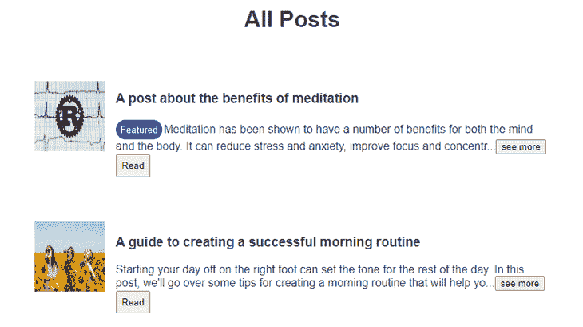

# 使用 vue-clamp 在 vue 应用程序中截断文本

> 原文：<https://blog.logrocket.com/vue-clamp-truncate-text-vue-apps/>

在 Vue.js 应用程序中，截断文本有助于在有限的空间中显示大量文本，例如在列表或卡片中。截断文本有助于提高内容的可读性和布局，因为它不会占用太多的空间，也不会让用户感到不知所措。

要在 Vue.js 应用程序中截断文本，可以使用 [`vue-clamp`](https://www.npmjs.com/package/vue-clamp) 库。这个库提供了一个简单的轻量级组件，它添加了一个“阅读更多”链接来显示指定区域的全文。这使得用户可以选择是阅读全文还是只阅读删节版。

在本文中，我们将了解如何使用`vue-clamp`库在 Vue.js 应用程序中截断文本。

向前跳:

## `vue-clamp`简介

如简介中所述，`vue-clamp`是一个 npm 库，有助于在 Vue 应用中截断文本。

在 Vue.js 应用中使用`vue-clamp`截断文本有几个好处:

1.  易于使用:`vue-clamp`是一个简单易用的库，具有简单明了的 API，允许您快速设置文本截断
2.  可定制:`vue-clamp`提供了许多定制选项，比如设置截断前应该显示的最大行数，以及“阅读更多”链接的文本和样式
3.  响应式:`vue-clamp`设计为响应式，因此它可以根据可用的屏幕大小自动调整文本的截断
4.  轻量级:`vue-clamp`是一个轻量级的库，对你的 Vue 应用的性能影响极小

为了展示详细的`vue-clamp`实例，我们将构建一个小的 Vue 应用程序来显示几篇博客文章。

*注意事项* *。，*我们将使用 Vue 2 构建这个应用程序，因为`[vue-clamp](https://www.npmjs.com/package/vue-clamp)`包与 Vue 2 兼容。还有一个与 Vue 3 兼容的不同包: [`vue3-text-clamp`](https://www.npmjs.com/package/vue3-text-clamp) 。

首先，让我们通过运行以下命令来安装 [Vue-](https://cli.vuejs.org/#getting-started) [CLI](https://cli.vuejs.org/#getting-started) :

```
npm install -g @vue/cli

```

安装完成后，我们可以通过运行以下命令创建一个新的 Vue 项目:

```
vue create v-clamp-tut

```

照常进行并选择您想要的选项，确保在询问 Vue 版本时选择 **2.x** 。

在`router/index.js`文件中，更新其内容，如下所示:

```
import Vue from "vue";
import VueRouter from "vue-router";
// import HomeView from "../views/HomeView.vue";
import PostView from "../views/PostView.vue";
import SinglePost from "../views/SinglePost.vue";
Vue.use(VueRouter);
const routes = [
  {
    path: "/post",
    name: "home",
    component: PostView,
  },
  {
    path: "/post/:id",
    name: "singlePost",
    component: SinglePost,
  },
];

const router = new VueRouter({
  mode: "history",
  base: process.env.BASE_URL,
  routes,
});
export default router;

```

上面几行代码负责我们的 Vue 应用程序中的路由。

接下来，在`store`目录中创建一个`index.js`文件，并将以下代码行放入其中:

```
export const posts = [
  {
    id: "1",
    author: "Jane Doe",
    description: "A post about the benefits of meditation",
    content:
      "Meditation has been shown to have a number of benefits for both the mind and the body. It can reduce stress and anxiety, improve focus and concentration, and even help to lower blood pressure. In this post, we'll explore some of the science behind meditation and how you can get started with a daily practice.",
    photo: "https://blog.logrocket.com/wp-content/uploads/2020/11/rust-grpc-tonic.png",
    featured: true,
  },
  {
    id: "2",
    author: "John Smith",
    description: "A guide to creating a successful morning routine",
    content:
      "Starting your day off on the right foot can set the tone for the rest of the day. In this post, we'll go over some tips for creating a morning routine that will help you feel energized, productive, and ready to tackle the day ahead. From exercise and meditation to making your bed and setting goals, we've got you covered.",
    photo: "https://images.unsplash.com/photo-1591035897819-f4bdf739f446?ixlib=rb-4.0.3&ixid=MnwxMjA3fDB8MHxzZWFyY2h8MTB8fGhhcHB5fGVufDB8fDB8fA%3D%3D&auto=format&fit=crop&w=500&q=60",
    featured: false,
  },
  {
    id: "3",
    author: "Sara Johnson",
    description: "The importance of self-care for busy professionals",
    content:
      "In today's fast-paced world, it's easy to get caught up in the hustle and forget to take care of ourselves. But self-care is crucial for maintaining our physical, mental, and emotional health. In this post, we'll explore some simple self-care strategies that busy professionals can incorporate into their daily routines. With cold and flu season in full swing, it's important to take steps to boost our immune systems. In this post, we'll go over five natural ways to support your body's natural defenses, including eating a healthy diet, getting enough sleep, and reducing stress. By following these tips, you can help keep yourself healthy and feeling your best.",
    photo: "https://images.unsplash.com/photo-1524250502761-1ac6f2e30d43?ixlib=rb-4.0.3&ixid=MnwxMjA3fDB8MHxzZWFyY2h8MTZ8fGhhcHB5fGVufDB8fDB8fA%3D%3D&auto=format&fit=crop&w=500&q=60",
    featured: true,
  },
  {
    id: "4",
    author: "Emily Williams",
    description: "5 ways to boost your immune system naturally",
    content:
      "With cold and flu season in full swing, it's important to take steps to boost our immune systems. In this post, we'll go over five natural ways to support your body's natural defenses, including eating a healthy diet, getting enough sleep, and reducing stress. By following these tips, you can help keep yourself healthy and feeling your best.",
    photo: "https://images.unsplash.com/photo-1489710437720-ebb67ec84dd2?ixlib=rb-4.0.3&ixid=MnwxMjA3fDB8MHxzZWFyY2h8MTd8fGhhcHB5fGVufDB8fDB8fA%3D%3D&auto=format&fit=crop&w=500&q=60",
    featured: false,
  },
  {
    id: "5",
    author: "Alex Thompson",
    description: "The benefits of journaling for mental health",
    content:
      "Journaling has long been recognized as a powerful tool for self-reflection and personal growth. In this post, we'll look at the science behind why journaling is so beneficial for mental health and provide some tips for getting started with your own journaling practice.",
    photo: "https://images.unsplash.com/photo-1519834785169-98be25ec3f84?ixlib=rb-4.0.3&ixid=MnwxMjA3fDB8MHxzZWFyY2h8MjF8fGhhcHB5fGVufDB8fDB8fA%3D%3D&auto=format&fit=crop&w=500&q=60",
    featured: true,
  },
  {
    id: "6",
    author: "Laura Davis",
    description: "The best plant-based protein sources",
    content:
      "If you're trying to incorporate more plant-based protein into your diet, you're in luck! There are plenty of delicious and nutritious options to choose from. In this post, we'll go over some of the best plant-based protein sources, including beans, lentils, tofu, and more. Plus, we'll include some tasty recipe ideas to help you get started.",
    photo: "https://images.unsplash.com/photo-1657664073337-31394d7e5c7a?ixlib=rb-4.0.3&ixid=MnwxMjA3fDB8MHxzZWFyY2h8NXx8aGFwcHl8ZW58MHx8MHx8&auto=format&fit=crop&w=500&q=60",
    featured: false,
  },
];

```

这个文件将帮助我们处理在 Vue 前端呈现的数据，因为我们不会进行任何真正的 API 调用。

最后，在`views`文件夹中创建两个文件:`PostView.vue`和`SinglePost.vue`。

在`PostView.vue`文件中，添加以下代码:

```
<template>
  <div class="home">
    <h1>All Posts</h1>
  </div>
</template>

<style>
</style>

<script>
import { posts } from "../store/articles.js";
export default {
  name: "PostView",
  components: {},
  data: function () {
    return {};
  },
  methods: {},
  computed: {},
};
</script>

```

在`SinglePost.vue`文件中，添加以下代码:

```
<template>
  <div class="home">
    <div class="homeContainer">
      <h1>Single Post</h1>
      <hr />
    </div>
  </div>
</template>
<style>
</style>
<script>
import { posts } from "../store/articles.js";
export default {
  name: "SinglePost",
  components: {
  },
  data: () => {
    return {};
  },
  methods: {},
  created() {},
};
</script>

```

## 在 Vue 应用程序中导入和安装`vue-clamp`

首先，让我们从安装`vue-clamp`库开始。您可以通过在终端中运行以下命令来实现这一点:

```
npm install vue-clamp

```

一旦安装了这个库，我们需要将它导入到 Vue 组件中。我们可以通过向组件的脚本标记添加以下行来实现这一点:

```
import VClamp from "vue-clamp";

export default {
...
  components: {
    VClamp,
  },
...
}

```

最后，我们在组件的模板中使用了`v-clamp`组件:

```
<v-clamp></v-clamp>

```

## 使用`vue-clamp`截断文本

现在我们已经安装了`vue-clamp`库，让我们看看如何使用它在 Vue 应用程序中执行基本的文本截断。

首先，用下面几行代码更新 PostView.vue 文件的内容:

```
<template>
  <div class="home">
    <h1>All Posts</h1>
    <div class="homeContainer">
      <div v-for="(post, i) of articles" :key="i" class="articles">
        
        <div class="text-content">
          <h3>{{ post.description }}</h3>
          <!-- clamping post content -->
          <v-clamp autoresize :max-lines="max_lines" ellipsis="..." location="end">
            {{ post.content }}
          </v-clamp>
          <router-link :to="`/post/${post.id}`">
            <button class="button">Read</button>
          </router-link>
        </div>
      </div>
    </div>
  </div>
</template>
<style>
.homeContainer {
  width: 60%;
  margin: 0px auto;
  /* border: 1px solid black; */
}
.articles {
  display: flex;
  flex-direction: row;
  margin: 2em;
  align-items: center;
}
.thumbnail {
  width: 100px;
  height: 100px;
  display: inline;
}
.text-content {
  text-align: left;
  margin: 0 0 0 1em;
}
.button {
  padding: 0.5em;
}
.tags {
  background-color: rgb(33, 33, 180);
  border-radius: 50px;
  border: 0px;
  color: white;
  padding: 0.5em;
  margin-right: 2px;
}
</style>
<script>
import VClamp from "vue-clamp";
import { posts } from "../store/articles.js";
export default {
  name: "PostView",
  components: {
    VClamp,
  },
  data: function () {
    return {
      articles: posts,
      max_lines: 2,
     };
  }
};
</script>

```

上面的代码片段遍历`store/articles.js`中的文章，然后显示适当的数据。显示在`<v-clamp>`标签之间的文本被适当地截断。

`vue-clamp`允许使用道具修改截断文本的显示。以下是一些允许的道具及其功能:

| 支柱 | 使用 | 默认 | 价值观念 |
| --- | --- | --- | --- |
| `max-line` | 允许我们指定希望截断的文本跨越多少行 | 任何数字 | `ellipsis` |
| 允许我们指定我们希望用来指定截断文本的特定省略号 | '…' | 任何字符串 | `location` |
| 指定应从何处截断文本 | “开始” | “开始” | 使用`vue-clamp`定制截断的高级技术 |

## 时间

### `vue-clamp`也允许我们使用插槽修改夹钳的行为。`vue-clamp`提供`before`和`after`插槽。在固定文本之前可以看到`before`槽的效果，在固定文本之后可以看到`after`槽的结果。

为了查看这些插槽的场景，让我们将插槽添加到我们的`PostView.vue`和`singlePost.vue`视图中的`<v-clamp>`中。

在`PostView.vue`中，按如下方式更新`<v-clamp>`标签:

上述代码的结果可以在下图中看到:

```
...
<v-clamp
  autoresize
  :max-lines="max_lines"
  ellipsis="..."
  location="end"
>
  {{ post.content }}
  <template v-if="post.featured" #before>
    <button class="tags">Featured</button>
  </template>
  <template #after="{ toggle, clamped }">
    <button @click="toggle">
      {{ clamped == true ? "see more" : "see less" }}
    </button>
  </template>
</v-clamp>
...

```



使用`before`槽显示`Featured`标签，而使用`after`槽显示`see more/see less`按钮。

插槽范围

### 插槽范围允许将状态从父插槽传递到插槽。`vue-clamp`有几个插槽，允许我们在`before`和`after`插槽中使用母夹钳的状态:

这些插槽范围非常有用，因为我们可以获得每个被箝位文本的状态数据。因此，我们可以在不影响其他文本的情况下切换单个文本的箝位状态，并更改单个箝位文本的扩展按钮的内容。简而言之，这些插槽范围有助于将事件范围扩展到每个被夹住的文本。

```
...
  <template #after="{ toggle, clamped, expanded, expand, collapse }">
    ...
  </template>
...

```

在`SinglePost.vue`中，用以下代码更新其全部内容:

在上面的代码块中，使用`created()`生命周期方法，我们获取了一个帖子并显示了其内容。在`<v-clamp>`中，我们使用一个`after`插槽来检查文本的箝位状态，然后显示适当的按钮。

```
<template>
  <div class="home">
    <div class="homeContainer">
      <h1>{{ post.description }}</h1>
      
      <div class="text-content">
        <v-clamp autoresize :max-lines="max_lines">
          {{ post.content }}
          <template #after="{ toggle, clamped, expanded }">
            <button v-if="clamped == true || expanded == true" @click="toggle">
              {{ clamped == true ? "see more" : "see less" }}
            </button>
          </template>
        </v-clamp>
      </div>
      <hr />
    </div>
  </div>
</template>
<style>
.homeContainer {
  width: 60%;
  margin: 0px auto;
  /* border: 1px solid black; */
}
.text-content {
  text-align: left;
  margin: 2em 0 0 1em;
}
.button {
  padding: 0.5em;
}
</style>
<script>
import VClamp from "vue-clamp";
import { posts } from "../store/articles.js";
export default {
  name: "SinglePost",
  components: {
    VClamp,
  },
  data: () => {
    return {
      max_lines: 3,
    };
  },
  methods: {},
  created() {
    this.id = this.$route.params.id;
    this.post = posts.find((el) => el.id == this.id);
  },
};
</script>

```

`Clampchange`事件

### `vue-clamp`提供一个`clampchange`事件，允许我们在夹具状态从`clamped`变为`expanded`时执行一个动作，反之亦然。它根据当前的箝位状态给出一个带有布尔值的箝位回调:

在上面的代码片段中，我们在`<v-clamp>`标签中`console.log`了文本的当前箝位状态，以便查看它返回了什么。如果箝位状态被切换，其新状态将被打印到控制台。

```
...
  <v-clamp autoresize :max-lines="max_lines" @clampchange="changed">
  ...
  </v-clamp>
...

//inside your script
...
  methods: {
      changed(clamped) {
        console.log("clamped", clamped);
      },
    },
...

```

我们做到了！我们能够使用`vue-clamp`构建一个博客应用程序，并了解高级技术，包括插槽、插槽范围和事件。

结论

## 在本文中，我们学习了如何使用`vue-clamp`库简化在 Vue 应用中截断文本的过程。

总的来说，截断文本在 Vue.js 应用程序中很有用，原因如下:

改善应用程序的布局:截断文本可以帮助你在更小的空间里容纳更多的内容，从而更容易设计出整洁有序的布局

1.  提高可读性:截断长文本块可以让用户更容易浏览和阅读页面内容
2.  提高性能:截断文本也可以提高 Vue.js 应用程序的性能，因为它减少了需要在页面上加载和呈现的内容量
3.  查看包含本文完整代码的 GitHub repo 。

像用户一样体验您的 Vue 应用

## 调试 Vue.js 应用程序可能会很困难，尤其是当用户会话期间有几十个(如果不是几百个)突变时。如果您对监视和跟踪生产中所有用户的 Vue 突变感兴趣，

.

[try LogRocket](https://lp.logrocket.com/blg/vue-signup)

LogRocket 就像是网络和移动应用程序的 DVR，记录你的 Vue 应用程序中发生的一切，包括网络请求、JavaScript 错误、性能问题等等。您可以汇总并报告问题发生时应用程序的状态，而不是猜测问题发生的原因。

[](https://lp.logrocket.com/blg/vue-signup)[https://logrocket.com/signup/](https://lp.logrocket.com/blg/vue-signup)

LogRocket Vuex 插件将 Vuex 突变记录到 LogRocket 控制台，为您提供导致错误的环境，以及出现问题时应用程序的状态。

现代化您调试 Vue 应用的方式- [开始免费监控](https://lp.logrocket.com/blg/vue-signup)。

Modernize how you debug your Vue apps - [Start monitoring for free](https://lp.logrocket.com/blg/vue-signup).