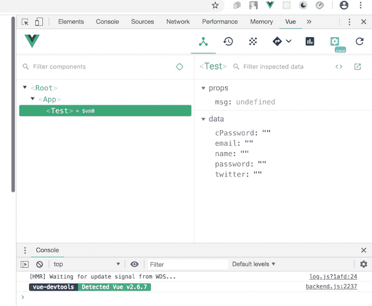
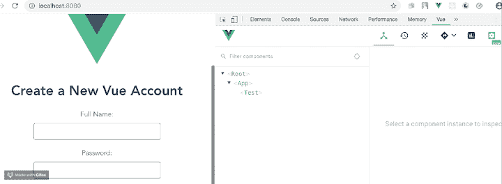
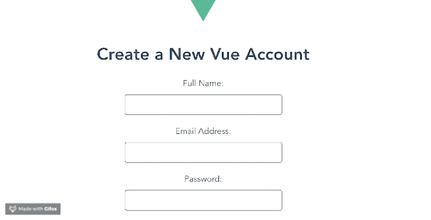

# 使用 watchers 的 Vue 表单输入验证

> 原文：<https://blog.logrocket.com/vue-form-input-validation-watchers/>

***编者按**:这篇文章最后更新于 2022 年 6 月 3 日，以反映 Vue 3 中所做的更改，并包括之前暗示的* *教程步骤。*

构建表单时，开发人员能够监视和控制用户输入表单域的内容是很重要的，这称为验证。为了保证质量，您应该在应用程序的客户端和服务器端进行验证。

为了帮助验证，HTML input 标记有一个占位符选项，您可以使用它将用户引导到您需要的确切信息。然而，占位符本身不足以在用户输入无效信息时提醒用户。因此，开发人员经常编写脚本来提示用户避免输入无效字符。

Vue 允许开发人员使用 JavaScript 方法来验证 Vue 组件中的表单输入。在本文中，我们将使用一个名为`watch` 的 [Vue 实例选项来实现表单输入验证。你可以在](https://vuejs.org/guide/essentials/watchers.html) [GitHub](https://github.com/viclotana/vue_validate) 上找到本教程的完整代码。我们开始吧！

## 先决条件

在 Vue 中，开发人员可以像使用 HTML5 一样创建表单，这意味着使用普通 HTML 在任何组件的 Vue 模板部分构建表单几乎不需要额外的技能。

本教程适合所有阶段的开发人员，包括初学者。您需要安装 Node.js ≥v10.x。您可以通过在终端或命令提示符下运行以下命令来验证是否安装了它:

```
node -v
```

你还需要一个代码编辑器，比如 VS Code， [Vue 全局安装在你的机器上](https://vuejs.org/guide/quick-start.html)，最后，Vue CLI 3.0 安装在你的机器上。为此，请先卸载旧版本的 CLI:

```
npm uninstall -g vue-cli
```

然后，安装新的:

```
npm install -g @vue/cli

```

继续下载一个 [Vue starter 项目](https://github.com/viclotana/vue-canvas)，或者用 git `git clone`如下克隆它:

```
[email protected]:viclotana/vue-canvas.git
```

解压缩下载的项目，然后从终端内部导航到解压缩的文件或克隆的项目。运行下面的命令以保持所有依赖项最新:

```
npm install

```

运行开发服务器，在浏览器中查看`localhost:8080`上的项目:

```
npm run serve

```

## Vue 里有哪些守望者？

Vue 附带了`watch`选项，就像计算方法和数据选项一样。[观察器是对给定元素中的数据变化](https://blog.logrocket.com/define-properties-vue-property-decorator-typescript/#defining-watchers)做出响应的一种很好的方式。`watch`选项也是进行表单验证的一个非常强大的工具。

在整个教程中，我们将使用 [vue-devtools](https://github.com/vuejs/vue-devtools) 检查我们的代码，这是一个浏览器扩展，开发人员使用它来调试他们的 vue 项目。使用 vue-devtools，您可以过滤组件，选择 UI 中的组件，检查 DOM，并过滤检查的数据。

该扩展还附带了一些很酷的切换选项卡，让您可以切换到，例如，Vuex、组件、事件、路由、性能和设置。继续下载用于 Chrome 浏览器或 T2 火狐浏览器的 vue-devtools:



## 构建我们的表单

为了说明如何使用 Vue `watch`选项来处理表单输入验证，我们将构建一个用于创建新帐户的表单。我们的表单将包含用户输入他们的`email`和`password`的字段。

您应该已经下载了 canvas 项目。在 IDE 中打开项目，进入`component`文件夹，用下面的代码块替换`Test.vue`文件的内容:

```
<template>
  <div id="visa">
    <h1>Create a New Vue Account</h1>
    <form>
      <label for="full name">Full Name:</label>
      <input type="text" v-model="name" required>
      <br>
      <label for="email">Email Address:</label>
      <input type="text" v-model="email" required>
      <br>
      <label for="password">Password:</label>
      <input type="text" v-model="password" required>

      <label for="twitter">Twitter Handle:</label>
      <input type="text" v-model="twitter" required>

    </form>
</div>
</template>
<script>
export default {
  name: 'Test',
  props: {
    msg: String
  },
  data(){
    return {
      name: '',
      password: '',
      email: '',
      twitter: ''
    }
  }
}
</script>
<style scoped>
#visa {
  margin: 20px auto;
  max-width: 700px;
  margin-bottom: 28px;
}
label{
  display: block;
  margin: 20px 0 10px;
}
span {
  padding-top: 0px;
  margin-top: 0px;
  font-size: 12px; color:red;
}
input {
  font-size: 30px;
  border: 1px double rgb(102, 97, 96) ;
  border-radius: 4px;
}
</style>

```

上面的代码创建了带有 [Vue 输入绑定](https://blog.logrocket.com/an-imperative-guide-to-forms-in-vue-js-2/)的表单。您可以使用 vue-devtools 扩展在浏览器中看到它的运行:



## 电子邮件验证

对于`email`输入，我们只希望用户输入有效的电子邮件地址，比如`[[email protected]](/cdn-cgi/l/email-protection)`。幸运的是，有 JavaScript 函数可以检查有效的电子邮件地址。我们将使用`watch`选项来触发检查输入的功能。用下面的代码块替换您的`template`部分:

```
<template>
  <div id="visa">
    <h1>Create a New Vue Account</h1>
    <form>
      <label for="full name">Full Name:</label>
      <input type="text" v-model="name" required>
      <br>
      <label for="email">Email Address:</label>
      <input type="text" v-model="email" required> <br>
      <span v-if="msg.email">{{msg.email}}</span>
<label for="password">Password:</label>
      <input type="text" v-model="password" required><br>
      <span v-if="msg.password">{{msg.password}}</span>
      <br>
      <label for="twitter">Twitter Handle:</label>
      <input type="text" v-model="twitter" required>

    </form>
</div>
</template>

```

我们首先添加了`span`元素，它将包含我们稍后创建的提示，然后添加了`msg`数组来存储用户输入的值。

将以下代码块复制到`script`部分:

```
<script>
export default {
  name: 'Test',
  data(){
    return {
      name: '',
      password: '',
      email: '',
      msg: [],
      twitter: ''
    }
  },
  watch: {
    email(value){
      // binding this to the data value in the email input
      this.email = value;
      this.validateEmail(value);
    }
  },
  methods:{
    validateEmail(value){
      if (/^\w+([\.-]?\w+)*@\w+([\.-]?\w+)*(\.\w{2,3})+$/.test(value))
  {
    this.msg['email'] = '';
  } else{
    this.msg['email'] = 'Invalid Email Address';
  } 
    }
  }
}
</script>

```

在上面的代码中，我们为`email`创建了一个观察器，并将其绑定到`email`数据。当数据发生变化时，观察器可以执行`validateEmail`函数，这是我们在方法中编写的。

在开发服务器中运行应用程序。它应该是这样的:



## 密码验证

我们希望验证密码至少有八个字符长。如果它包含的字符少于八个，我们将提示用户将其设为八个。

用下面的代码块替换`test.vue`组件的脚本部分:

```
<script>
export default {
  name: 'Test',
  data(){
    return {
      name: '',
      password: '',
      email: '',
      msg: [],
      twitter: ''
    }
  },
  watch: {
    email(value){
      // binding this to the data value in the email input
      this.email = value;
      this.validateEmail(value);
    },
    password(value){
      this.password = value;
      this.validatePassword(value);
    }
  },
  methods:{
    validateEmail(value){
      if (/^\w+([\.-]?\w+)*@\w+([\.-]?\w+)*(\.\w{2,3})+$/.test(value))
  {
    this.msg['email'] = '';
  } else{
    this.msg['email'] = 'Invalid Email Address';
  } 
    },
    validatePassword(value){
      let difference = 8 - value.length;
      if (value.length<8) {
        this.msg['password'] = 'Must be 8 characters! '+ difference + ' characters left' ;
      } else {
         this.msg['password'] = '';
      }
    }
  }
}
</script>

```

保存 IDE 中的更改，然后再次运行应用程序。它应该是这样的:


## 添加提交按钮

现在，让我们添加一个提交按钮！我们的按钮将具有以下属性:

*   如果电子邮件和密码未通过验证，提交按钮将被禁用
*   验证将被一个`disabled`数组跟踪。如果有`true`，提交按钮应被禁用
*   我们将更新我们的验证函数，以更新数组是否满足验证

不要忘记在`form`标签上添加事件处理程序。请参见下面的更新组件:

```
<template>
  <div id="visa">
    <h1>Create a New Vue Account</h1>
    <form @submit.prevent="handleSubmission">
      <label for="full name">Full Name:</label>
      <input type="text" v-model="name" required>
      <br>
      <label for="email">Email Address:</label>
      <input type="text" v-model="email" required> <br>
      <span v-if="msg.email">{{msg.email}}</span>
<label for="password">Password:</label>
      <input type="text" v-model="password" required><br>
      <span v-if="msg.password">{{msg.password}}</span>
      <br>
      <label for="twitter">Twitter Handle:</label>
      <input type="text" v-model="twitter" required>
      <input type="submit" :disabled="!disabled.every(i => i === false)" />
    </form>
</div>
</template>

<script>
export default {
  name: 'Test',
  data(){
    return {
      name: '',
      password: '',
      email: '',
      msg: [],
      twitter: '',
      disabled: [true, true]
    }
  },
  watch: {
    email(value){
      // binding this to the data value in the email input
      // this.email = value;
      this.validateEmail(value);
    },
    password(value){
      // this.password = value;
      this.validatePassword(value);
    }
  },
  methods:{
    validateEmail(value){
      if (/^\w+([\.-]?\w+)*@\w+([\.-]?\w+)*(\.\w{2,3})+$/.test(value))
  {
    this.msg['email'] = '';
    this.disabled = [false, this.disabled[1]]
  } else{
    this.msg['email'] = 'Invalid Email Address';
    this.disabled = [true, this.disabled[1]]
  } 
    },
    validatePassword(value){
      let difference = 8 - value.length;
      if (value.length<8) {
        this.msg['password'] = 'Must be 8 characters! '+ difference + ' characters left' ;
        this.disabled = [this.disabled[1], true]
      } else {
         this.msg['password'] = '';
         this.disabled = [this.disabled[1], false]
      }
    },
    handleSubmission(){
      alert(`Email: ${this.email} Password: ${this.password}`)
    }
  }
}
</script>

```

## 结论

现在，您知道了如何使用`watch`选项在 Vue 中执行表单验证。在构建表单、提高用户提供的信息质量时，验证是至关重要的。我们介绍了一个简单的例子，它为新帐户的`email`和`password`字段提供验证，确保有效的电子邮件地址和足够长的密码，但是您可以使用本教程中的信息作为更复杂的表单验证的基础。

## 像用户一样体验您的 Vue 应用

调试 Vue.js 应用程序可能会很困难，尤其是当用户会话期间有几十个(如果不是几百个)突变时。如果您对监视和跟踪生产中所有用户的 Vue 突变感兴趣，

[try LogRocket](https://lp.logrocket.com/blg/vue-signup)

.

[](https://lp.logrocket.com/blg/vue-signup)[https://logrocket.com/signup/](https://lp.logrocket.com/blg/vue-signup)

LogRocket 就像是网络和移动应用程序的 DVR，记录你的 Vue 应用程序中发生的一切，包括网络请求、JavaScript 错误、性能问题等等。您可以汇总并报告问题发生时应用程序的状态，而不是猜测问题发生的原因。

LogRocket Vuex 插件将 Vuex 突变记录到 LogRocket 控制台，为您提供导致错误的环境，以及出现问题时应用程序的状态。

现代化您调试 Vue 应用的方式- [开始免费监控](https://lp.logrocket.com/blg/vue-signup)。