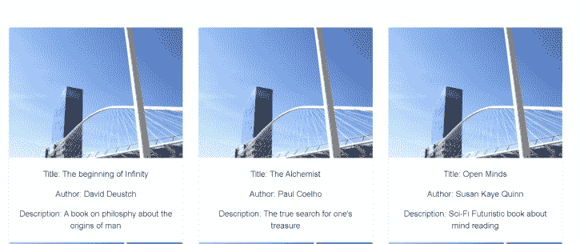
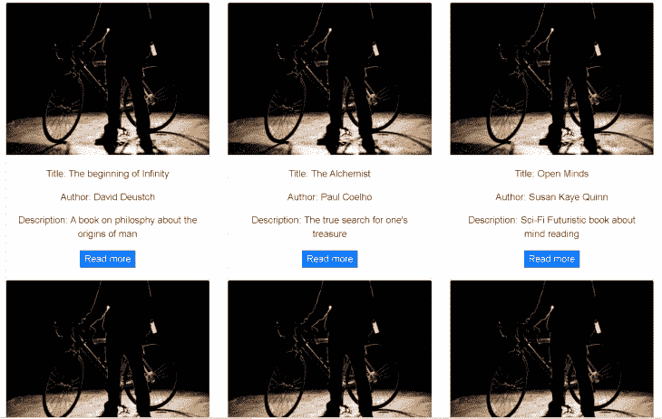
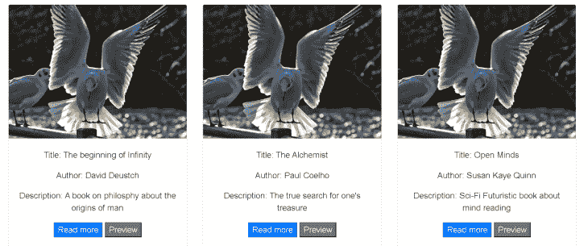
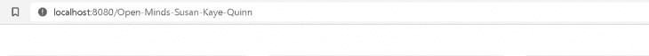

# Vue.js 简化版:组件、道具和插槽

> 原文：<https://blog.logrocket.com/vue-js-simplified-components-props-and-slots/>

在本文中，我们将使用 Vue.js、Vue CLI 和 Bootstrap CSS。

## 装置

要安装 Vue.js(如果您还没有的话)，运行以下命令:

```
npm install vue
```

要安装 Vue CLI，请运行以下命令:

```
npm install -g @vue/cli
```

现在，我们可以通过运行以下命令，使用 Vue CLI 启动一个项目(我们称之为 bookapp ):

```
vue create bookapp
```

我们的项目目录如下所示:

```
|-- node_modules/
|-- public/
|-- src/
   |-- assets/
   |-- components/
   |-- App.vue
   |-- main.js
|-- .gitignore
|-- babel.config.js
|-- package.json
|-- README.md
|-- yarn.lock
```

要安装引导 CSS，请运行:

```
npm install [email protected]
```

然后，我们可以将它导入 main.js 文件，如下所示:

```
import 'bootstrap';
import 'bootstrap/dist/css/bootstrap.min.css';
```

### 什么是组件？

"组件是封装在一个组中的元素的集合，可以通过单个元素访问该组。"莎拉·德拉斯纳

组件帮助我们使代码块可重用。这意味着每当我们需要一个先前已经实现的功能时，我们不需要重复相同的代码块来复制这样的功能。

在这篇文章中，我们将关注于制作单个文件组件。

插槽和道具通过使动态改变组件的内容变得容易来帮助我们实现这一点。

## 什么是道具？

简单地说，props 是组件中填充了数据的开口。这意味着当一个组件有一个属性时，它期望从另一个组件或视图中获取数据，该组件或视图被导入到该组件或视图中。这另一个组件可以被称为父组件。

使用我们之前创建的应用程序 bookapp，我们将制作这样的应用程序，以便我们可以有一个图书列表(卡片)。每张卡片都是图书列表中可重用的组件。

因此，假设我们创建了一个名为`BookList.vue`的组件，并在其中导入了另一个名为`BookCard.vue`的组件。`BookList.vue`将被称为父组件。因此，`BookCard.vue`将被称为子组件。

查看下面的代码示例:

```
<!--BookList.vue-->
<template>
    <div class="container">
        <div>
            <div class="row">
                <div class="col-md-4">
                    <BookCard />
                </div>
            </div>
        </div>
    </div>
</template>

<script>
import BookCard from './BookCard.vue'

export default {
    components: {
        BookCard
    },
</script>
```

因此,`src/`文件夹的目录结构应该如下所示:

```
|-- src/
   |-- assets/
   |-- components/
       |-- BookCard.vue
       |-- BookList.vue
   |-- App.vue
   |-- main.js
```

Props 是为将数据从父母传递到孩子而构建的。它们是为单向数据流设计的。

让我们用之前的例子`BookList.vue`和`BookCard.vue`来看看道具的作用。

在`BookCard.vue`中，假设我们想要接受一个我们称之为`bookData`的道具，它将包含关于某本书的信息。

```
<!--BookCard.vue-->
<template>
    <div>
        <div class="card">
            
            <div class="card-body">
                <p class="card-text">Title: {{bookData.title}}</p>
                <p class="card-text">Author: {{bookData.author}}</p>
                <p class="card-text">Description: {{bookData.description}}</p>
                <slot></slot>
                <slot name="button"></slot>
            </div>
        </div>
    </div>
</template>

<script>
export default {
    props: {
        bookData: {
            type: Object,
            required: true,
            default: () => {}
        }
    }
}
</script>
```

请注意道具是如何定义的。类型和所需属性用于属性验证。如上所示，属性也可以有默认值。字符串和数字可以直接传递。但是，数组和对象默认值必须作为函数传递。

如果不需要验证，我们也可以简单地这样做:

```
<script>
export default {
    props: ['bookData']
}
</script>
```

现在我们已经修改了子组件(`BookCard.vue`)来接受一个名为`bookData`的道具。我们现在必须将数据从父组件传递给子组件，在本例中是`BookList.vue`。

首先，我们需要有一个要传递给组件的项目(数据)列表。这些数据可能来自数据库或 API。出于写作的目的，我将对一些书籍数据进行硬编码。

```
<!--BookList.vue-->
<script>
import BookCard from './BookCard.vue'

export default {
    components: {
        BookCard
    },
    data(){
        return {
            books: [
                {
                    'author': 'David Deustch',
                    'title': 'The beginning of Infinity',
                    'description': 'A book on philosphy about the origins of man',
                    'img_url': 'https://placeimg.com/640/480/any'
                },
                {
                    'author': 'Paul Coelho',
                    'title': 'The Alchemist',
                    'description': 'The true search for one\'s treasure',
                    'img_url': 'https://placeimg.com/640/480/any'
                },
                {
                    'author': 'Susan Kaye Quinn',
                    'title': 'Open Minds',
                    'description': 'Sci-Fi Futuristic book about mind reading',
                    'img_url': 'https://placeimg.com/640/480/any'
                },
                {
                    'author': 'Robert Kiyosaki',
                    'title': 'Rich Dad, Poor Dad',
                    'description': 'Motivational book on wealth building',
                    'img_url': 'https://placeimg.com/640/480/any'
                },
                {
                    'author': 'Dan Brown',
                    'title': 'The Da Vinci Code',
                    'description': 'Conspiracy theories about secrets of the holy grail',
                    'img_url': 'https://placeimg.com/640/480/any'
                },
                {
                    'author': 'Arthur Hailey',
                    'title': 'The money changers',
                    'description': 'Travel back in time and experience the banking system',
                    'img_url': 'https://placeimg.com/640/480/any'
                },
            ]
        }
    }
}
</script>
```

在标记方面，我们需要做的就是用一个`v-for`遍历数据，并通过 prop 将每个对象传递给子组件(`BookCard`)。让我们看看这是怎么做到的。

**注**:在 Vue.js 中，`camelCase`或`PascalCase`中命名的组件自动转换为标记中的烤肉串盒。所以我们可以写`<book-card/>`，而不是写`<BookCard/>`。

道具也是如此。虽然我们已经将我们的道具命名为`bookData`，但是我们可以在标记中将其引用为`book-data`:

```
<!--BookList.vue-->
<template>
    <div class="container">
        <div>
            <div class="row">
                <div class="col-md-4" v-for="(book, i) in books" :key="i">
                    <book-card :book-data="book" />
                </div>
            </div>
        </div>
    </div>
</template>
```

最后，为了能够查看我们构建的这个简单应用程序，我们将调用 App.vue 文件中的`BookList`组件，如下所示:

```
<!--App.vue-->
<template>
  <div id="app">
    <book-list/>
  </div>
</template>

<script>
import BookList from './components/BookList.vue'

export default {
  name: 'App',
  components: {
    BookList,
  }
}
</script>
```

现在，如果我们查看我们的应用程序，它应该看起来像这样:



每张卡都是相同的组件，但包含动态加载的不同内容。

当传递的数据预计会动态变化时，传递给组件的 Props 只需要绑定到组件。这意味着我们通过将数据绑定到 prop 来传递 books prop，就像这样:

```
:book-data="book"
```

这里的绑定是添加到属性`book-data`的冒号(`:`)符号(这是`v-bind:`的缩写)。

如果在我们不需要数据动态变化的情况下，那么就不需要绑定。我们可以只说`book-data="book"`，这将把字符串“book”传递给道具，而不是一个对象。

但是我们的 prop 验证会在浏览器控制台中抛出错误，指出一个对象是所期望的，而不是一个字符串。

### 什么是老虎机？

简单来说，插槽是类似于道具的组件中的开口。与道具不同，它们不仅接受数据，还可以接受其他标记，甚至其他组件。

更清楚地说，他们的主要区别是，使用 props，父母只能将数据传递给孩子，而不能控制数据的呈现方式。但是有了插槽，父元素可以准确地决定数据应该如何呈现，甚至可以传递另一个组件。

让我们继续我们的 bookapp 项目。

我们将所有书籍的信息都呈现在卡片中，但是我们想为每本书添加一个按钮，以便查看每本书的更多信息。为此，我们可以决定在`BookCard`组件上开一个槽，如下所示:

```
<!--BookCard.vue-->
<template>
    <div>
        <div class="card">
            
            <div class="card-body">
                <p class="card-text">Title: {{bookData.title}}</p>
                <p class="card-text">Author: {{bookData.author}}</p>
                <p class="card-text">Description: {{bookData.description}}</p>
                <slot></slot> <!--Slot opening-->
            </div>
        </div>
    </div>
</template>
```

现在从我们的父组件(`BookList.vue`)中，我们可以把我们想要的传递给子组件的槽:

```
<template>
    <div class="container">
        <div>
            <div class="row">
                <div class="col-md-4" v-for="(book, i) in books" :key="i">
                    <book-card :book-data="book">
                        <template v-slot> <!--Accessing slot-->
                            <button class="btn-primary">Read more</button>
                        </template>
                    </book-card>
                </div>
            </div>
        </div>
    </div>
</template>
```

我们的按钮没有任何链接或动作，但它现在应该在界面上可见:



### 命名插槽

在前面的 slot 例子中，我们使用了一个没有名字的`<slot></slot>`。所以当我们在父组件中引用它时，我们只做了`<template v-slot></template>`而没有指定任何名称。

在我们需要不止一个插槽的情况下，命名插槽会很方便。

使用我们的示例项目，让我们为另一个按钮添加另一个插槽，我们称之为`preview`按钮:

```
<!--BookCard.vue-->
<template>
    <div>
        <div class="card">
            
            <div class="card-body">
                <p class="card-text">Title: {{bookData.title}}</p>
                <p class="card-text">Author: {{bookData.author}}</p>
                <p class="card-text">Description: {{bookData.description}}</p>
                <slot></slot> <!--Slot opening-->
                <slot name="preview"></slot>
            </div>
        </div>
    </div>
</template>
```

然后，在父组件(`BookList.vue`)中，我们可以传递另一个按钮。只是这一次，用一个名字。

```
<template>
    <div class="container">
        <div>
            <div class="row">
                <div class="col-md-4" v-for="(book, i) in books" :key="i">
                    <book-card :book-data="book">
                        <template v-slot>
                            <button class="btn-primary">Read more</button>
                        </template>
                        <template v-slot:preview> <!--Accessing the preview slot-->
                            <button class="btn-secondary">Preview</button>
                        </template>
                    </book-card>
                </div>
            </div>
        </div>
    </div>
</template>
```

现在我们有了这个:



我们使用`<**template** v-slot:preview>`访问插槽。我们也可以使用它的简写形式，比如`<**template** #preview>`。这只有命名插槽才有可能，这是 Vue 2.6 和更高版本的新增功能。

### 作用域插槽

虽然 props 是为单向数据流设计的，但是使用作用域槽，我们也可以将数据从子进程传递回父进程。让我们看看这是怎么做到的。

使用我们之前的示例项目，假设我们有一个计算属性，我们将在`BookCard`组件中将其命名为`previewSlug`。这段代码需要作为一个`href`链接传递给我们的预览按钮。让我们看看如何用作用域槽来实现这一点。

在子组件(`BookCard.vue`)中，我们已经包含了一些新的属性:方法和计算的。方法属性允许我们定义一个函数，计算属性允许我们拥有动态值。

在本例中，我们有一个计算属性:`previewSlug`，我们希望将它传递给父组件。

```
<!--BookCard.vue-->
<script>
export default {
    props: {
        bookData: {
            type: Object,
            required: true,
            default: () => {}
        }
    },
    methods: {
        computePreviewSlug(){
            return this.bookData.title.split(' ').join('-') +'-'+ this.bookData.author.split(' ').join('-')
        },
    },
    computed: {
        previewSlug(){
            return this.computePreviewSlug()
        },
    }
}
</script>
```

现在，从命名槽中，我们可以像这样绑定一个新属性:

```
<!--BookCard.vue-->
<template>
    <div>
        <div class="card">
            
            <div class="card-body">
                <p class="card-text">Title: {{bookData.title}}</p>
                <p class="card-text">Author: {{bookData.author}}</p>
                <p class="card-text">Description: {{bookData.description}}</p>
                <slot></slot> 
                <slot name="preview" :previewSlug="previewSlug"></slot>
```

```
<!--Binding previewSlug Property to Slot-->
```

```
            </div>
        </div>
    </div>
</template>
```

这将使`previewSlug`数据在父组件中可用。我们可以立即像这样使用它:

```
<!--BookList.vue-->
<template>
    <div class="container">
        <div>
            <div class="row">
                <div class="col-md-4" v-for="(book, i) in books" :key="i">
                    <book-card :book-data="book">
                        <template v-slot>
                            <button class="btn-primary">Read more</button>
                        </template>
                        <template v-slot:preview="slotProps"> 
                          <a :href="slotProps.previewSlug"><button class="btn-secondary">Preview</button></a>
                          <!--Using the previewSlug data by accessing the slot prop-->
                        </template>
                    </book-card>
                </div>
            </div>
        </div>
    </div>
</template>
```

这里我们将`previewSlug`绑定到`href`属性。这将把独特的 slug 链接添加到我们的预览按钮。
点击按钮会显示链接，如下所示:



## 结论

可重用性是编码中的标准实践，它使我们的代码更加简洁，更易于维护。Vue.js 组件通过为我们提供一种使用 props 和 slots 进行动态数据绑定的途径来帮助我们实现这一点。

这里是我们在本文中使用的虚拟项目 Github 资源库的链接:[https://github.com/IDTitanium/dummy-bookapp](https://github.com/IDTitanium/dummy-bookapp)

## 像用户一样体验您的 Vue 应用

调试 Vue.js 应用程序可能会很困难，尤其是当用户会话期间有几十个(如果不是几百个)突变时。如果您对监视和跟踪生产中所有用户的 Vue 突变感兴趣，

[try LogRocket](https://lp.logrocket.com/blg/vue-signup)

.

[](https://lp.logrocket.com/blg/vue-signup)[https://logrocket.com/signup/](https://lp.logrocket.com/blg/vue-signup)

LogRocket 就像是网络和移动应用程序的 DVR，记录你的 Vue 应用程序中发生的一切，包括网络请求、JavaScript 错误、性能问题等等。您可以汇总并报告问题发生时应用程序的状态，而不是猜测问题发生的原因。

LogRocket Vuex 插件将 Vuex 突变记录到 LogRocket 控制台，为您提供导致错误的环境，以及出现问题时应用程序的状态。

现代化您调试 Vue 应用的方式- [开始免费监控](https://lp.logrocket.com/blg/vue-signup)。