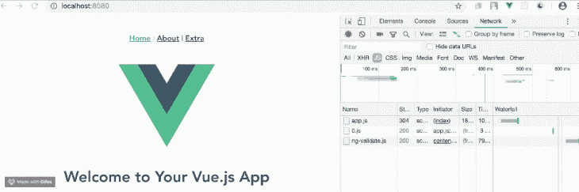

# Vue.js 中的延迟加载组件和代码拆分

> 原文：<https://blog.logrocket.com/vue-lazy-loading-components-code-splitting/>

***编者按**:这个 Vue 懒加载教程最后一次更新是在 2021 年 4 月 29 日。*

在这个 Vue 延迟加载教程中，我们将演示如何延迟加载 Vue.js 应用程序中的组件。本演示的目的是帮助您理解 Vue.js 如何借助 webpack 代码分割在抽象的路由级别处理延迟加载。

以下是我们将要介绍的内容:

## Vue.js 是什么？

Vue.js 是一个非常进步的 JavaScript 框架，由[尤雨溪](https://twitter.com/youyuxi?lang=en)和 Vue 核心团队创建，来自超过 [230 个开源社区成员](https://github.com/vuejs/vue)的贡献。在撰写本文时，Vue.js 在 GitHub 上拥有超过[18.3 万颗星。它由一个只关注视图层的可接近的核心库和一个支持库的生态系统组成，旨在帮助您处理大型单页面应用程序中的复杂性。](https://github.com/vuejs/vue)

## Vue.js 中的懒加载是什么？

[惰性加载](https://blog.logrocket.com/understanding-lazy-loading-in-javascript/)是一种模式，旨在延迟元素和对象的初始化，直到需要它们的时候。惰性加载意味着相对于父 DOM 元素的目标 DOM 元素被加载，并且只有当用户在网页上滚动它们时才变得可见(当两个元素之间有交集时，基于设置的阈值)。

要理解延迟加载，首先必须理解急切加载。急切加载是将 JavaScript 代码加载到 [DOM](https://blog.logrocket.com/8-dom-features-you-didnt-know-existed-ec2a0a28fd89/) 的默认方式。对于 Vue.js，这意味着使用 import 语句将一个组件引入到`app.vue`文件中。延迟加载是指在应用程序启动时，所有的脚本都不会加载到 DOM 上。相反，它们只在被请求时才被加载，这使得 JavaScript 包在初始加载时非常小。

Vue.js 用 routes 处理组件的延迟加载，所以在 DOM 上，只有在需要时才可以通过 routes 加载组件。这是通过将每个路由的组件分割成独立于初始化时加载的主块的块来实现的。这可以防止发送到 DOM 的包变得太大。Vue.js 结合了[异步组件特性](https://vuejs.org/guide/components.html#Async-Components)和 [webpack 的代码分割特性](https://webpack.js.org/guides/code-splitting-async/)来延迟加载路由组件。

## 为什么说懒加载很重要？

随着 Vue.js 项目的规模和复杂性的增长，急切加载的方法使得 js 包变得非常麻烦。对于可能在移动设备上或没有高速互联网连接的情况下访问您的应用程序的最终用户来说，这可能会成为一个问题。

惰性加载保证您的 JavaScript 包按照从最需要的组件到最不需要的组件的重要性顺序被提供给 DOM。这种方法确保您可以控制用户的整个体验，包括资源加载到 DOM 时的最初等待时间。

## Vue.js 延迟加载示例

为了演示 Vue.js 中的延迟加载，我们将使用 [Vue CLI](https://cli.vuejs.org/) 构建一个示例 Vue.js 应用程序，并在配置阶段添加路由。

我们还将手动添加第三条路线，向不熟悉 Vue CLI 的开发人员展示该过程。也就是说，使用 Vue CLI 总是可取的，因为默认情况下，次要路由已经配置为延迟加载。

### 启动 Vue.js 项目

在您选择的目录中打开一个终端，并使用以下命令创建一个新项目:

```
vue create test_project
```

你会看到这样一份后续调查问卷:

```
? Please pick a preset: Manually select features
? Check the features needed for your project: 
 ◉ Babel
 ◯ TypeScript
 ◯ Progressive Web App (PWA) Support
❯◉ Router
 ◯ Vuex
 ◯ CSS Pre-processors
 ◉ Linter / Formatter
 ◯ Unit Testing
 ◯ E2E Testing
```

确保使用空格键选择路由器选项，就像上面选择的一样。然后，为了节省空间，您可以选择将所有配置存储在`package.json`文件中。项目创建完成后，您会看到一条成功消息。此时，将目录更改为新的项目文件夹，并在开发环境中运行应用程序:

```
cd test_project
npm run serve
```


它有一个`about`组件，可以在视图中进行路线导航。应用程序一初始化，两个组件`Home.vue`和`About.vue`就被加载到 DOM 中。这是标准过程，对于资产最少的小型项目非常好，但是在有很多组件的大型应用程序中，加载速度可能非常慢。这就是代码拆分的作用。

打开`router.js`文件。它看起来应该是这样的:

```
import Vue from 'vue'
import Router from 'vue-router'
import Home from './views/Home.vue'
import About from './views/About.vue'
Vue.use(Router)
export default new Router({
  routes: [
    {
      path: '/',
      name: 'home',
      component: Home
    },
    {
      path: '/about',
      name: 'about',
      component: About
    }
  ]
})
```

对于`about`组件部分，这可能看起来有所不同，因为 Vue CLI 包括了次要路由的延迟加载，例如我们示例中的`about`组件。

## 手动添加新路线

您现在有两条路线:一条是指向主视图的`home`路线，另一条是指向关于视图的`about`路线。让我们添加第三个视图，然后为它注册一条路线。

在您的`views`文件夹中，创建一个新文件，并将其命名为`extra.vue`。然后，将`about.vue`文件的内容复制到`extra.vue`文件中。它应该是这样的:

```
<template>
<div class=”about”>
<h1>This is an extra page</h1>
</div>
</template>
```

要注册该路线，打开您的`router.js`文件并在 routes 数组下添加额外的代码块:

```
export default new Router({
  routes: [
    {
      path: '/',
      name: 'home',
      component: Home
    },
    {
      path: '/about',
      name: 'about',
      component: About
    },
   {
      path: '/extra',
      name: 'extra',
      component: Extra
    }
  ]
})
```

让它显示在 DOM 中的最后一步是用一个`router-link`将它添加到主`App.vue`文件中。

打开您的`app.vue`文件，将模板部分更改为下面的代码块:

```
<template>
<div id=”app”>
<div id=”nav”>
<router-link to=”/”>Home</router-link> |
<router-link to=”/about”>About</router-link> |
<router-link to=”/extra”>Extra</router-link>
</div>
<router-view/>
</div>
</template>
```

## 如何延迟加载 Vue.js 组件

既然在我们的示例 Vue.js 应用程序中已经设置了所有的路由，那么是时候将所有的路由配置为按需延迟加载了。

打开您的`router.js`文件，将下面的代码块复制/粘贴到其中:

```
import Vue from 'vue'
import Router from 'vue-router'
Vue.use(Router)
function lazyLoad(view){
  return() => import(`@/views/${view}.vue`)
}
export default new Router({
  mode: 'history',
  base: process.env.BASE_URL,
  routes: [
    {
      path: '/',
      name: 'home',
      component: lazyLoad('Home')
    },
    {
      path: '/about',
      name: 'about',
      component: lazyLoad('About')
    },
    {
      path: '/extra',
      name: 'extra',
      component: lazyLoad('extra')
    }
  ]
})

```

下面是为使这些视图延迟加载所做的工作:

### 删除导入语句

最初，您可能已经注意到了 Vue.js、Router、Home、About 和 extra 的 import 语句。这些语句是驱动组件急切加载的主要因素，所以当您更改为延迟加载方法时，您必须删除那些导入语句。

### `lazyLoad`功能

创建 Vue `lazyLoad`函数是为了使导入语句变得清晰。如果没有这个函数，每个组件都会有一个很长的 import 语句。有了它，您可以简单地调用该函数，并将路由作为参数传入。

### webpack 导入语句

告诉 webpack 延迟加载组件的 import 语句必须嵌入到 routes 部分，而不是脚本开头的 import 部分。

要测试加载策略，请在开发中再次运行应用程序:

```
npm run serve
```

在浏览器中的 [http://localhost:8080/](http://localhost:8080/) 打开它，并打开开发者工具。单击网络部分，然后选择 JS 选项卡。



正如您所看到的，加载到 DOM 上的 JavaScript 块按时间顺序分成若干个数字，其中第一个(`0.js`)是主视图，第二个(`1.js`)是关于视图，只在点击时才添加到 DOM 中，第三个(`2.js`)是额外视图，也可以根据请求添加到 DOM 中。

在这个阶段，您还可以通过使用以下命令构建生产应用程序来验证延迟加载是否有效:

```
npm run build
```

这三个块将由 webpack 适时地表示为单独的、独立的、延迟加载的块。

## 结论

本入门教程旨在向您展示 Vue.js 如何借助 webpack 代码分割在抽象的路由级别处理延迟加载。在小型 Vue.js 项目中，延迟加载组件的重要性可能并不明显，但是随着您的项目变得越来越复杂，在您的工作流中实现延迟加载对于提高效率和优化资源使用来说是明智的。

## 像用户一样体验您的 Vue 应用

调试 Vue.js 应用程序可能会很困难，尤其是当用户会话期间有几十个(如果不是几百个)突变时。如果您对监视和跟踪生产中所有用户的 Vue 突变感兴趣，

[try LogRocket](https://lp.logrocket.com/blg/vue-signup)

.

[](https://lp.logrocket.com/blg/vue-signup)[https://logrocket.com/signup/](https://lp.logrocket.com/blg/vue-signup)

LogRocket 就像是网络和移动应用程序的 DVR，记录你的 Vue 应用程序中发生的一切，包括网络请求、JavaScript 错误、性能问题等等。您可以汇总并报告问题发生时应用程序的状态，而不是猜测问题发生的原因。

LogRocket Vuex 插件将 Vuex 突变记录到 LogRocket 控制台，为您提供导致错误的环境，以及出现问题时应用程序的状态。

现代化您调试 Vue 应用的方式- [开始免费监控](https://lp.logrocket.com/blg/vue-signup)。