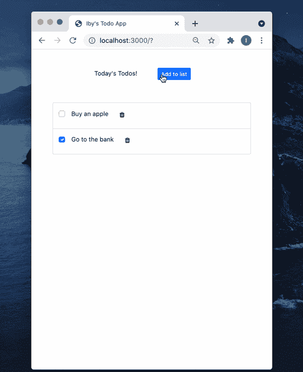

# 使用 vue-loader 创建单页应用程序

> 原文：<https://blog.logrocket.com/vue-loader-tutorial/>

单页应用程序现在非常流行。这些应用程序通过在用户交互时更改页面内容来动态地对用户做出反应，而不是用新数据加载新页面。由于它们的速度、性能和跨平台功能，它们越来越受欢迎。

Vue.js 是几个可以构建单页面应用程序的 JavaScript 框架之一。在本教程中，我们将探索使用`vue-loader`设置一个 Vue.js 单页应用程序。

你会问，`vue-loader`是什么？它是一个 webpack 加载器，支持在称为单文件组件(sfc)的单个文件中定义 Vue.js 组件。这些文件的扩展名为`.vue`，`vue-loader`将它们转换成 JavaScript，以便浏览器能够理解。

为了理解如何使用`vue-loader`，我们将构建一个简单的待办事项应用程序。

## 教程先决条件

要继续操作，您需要安装以下软件:

## 设置我们的新 Vue.js 项目

要启动我们的项目，通过运行以下命令创建一个项目目录:

```
~$ mkdir todo-list

```

接下来，进入项目目录，使用`npm init`初始化 npm，并按照提示进行操作。这创建了我们的`package.json`文件，它存储项目元数据并跟踪我们项目的依赖项。

现在我们有了`package.json`，我们必须安装我们的依赖项。我们将从我们的主要依赖项 Vue 开始，运行以下代码:

```
# ~/todo-list

$ yarn add vue

```

然后，我们必须运行我们的开发依赖项:

```
# ~/todo-list

$ yarn add -D vue-loader babel-loader @babel/core @babel/preset-env css-loader vue-style-loader vue-template-compiler webpack webpack-cli webpack-dev-server

```

请注意，我们在`yarn add`命令中添加了`-D`标志，以指示这些库应该作为开发依赖项安装。我们只在开发时需要它们将我们的代码转换成一个单独的 JavaScript 包。

现在，让我们花一点时间来理解我们的依赖性以及它们在项目中的重要性。

*   `vue-loader`和`vue-template-compiler`将 Vue 文件转换成 JavaScript
*   将 ES6 代码转换成浏览器友好的 ES5 代码
    *   使用扩展浏览器 Javascript 功能的`@babel/preset-env`和`@babel/core`聚合填充
*   `css-loader`解释并解析`@import`和`url()` CSS 导入
*   将 CSS 作为样式标签注入到 SFCs 中
*   `[webpack](https://blog.logrocket.com/changes-coming-to-webpack-in-2021/)` [转换并捆绑 JavaScript 文件](https://blog.logrocket.com/changes-coming-to-webpack-in-2021/)以在浏览器中使用
*   是为 webpack 项目运行命令的 CLI
*   `webpack-dev-server`提供一个基本的网络服务器和使用实时重装的能力

现在我们已经安装了依赖项，我们可以在`webpack.config.js`配置文件中配置我们的 webpack 项目:

```
# ~/todo-list
$ touch webpack.config.js

```

在我们的`webpack.config.js`中，我们必须设置所有已安装的插件，并配置它们来构建我们的 Vue 项目。配置是我们如何设置我们希望我们的插件工作的文件，以及我们希望我们的最终 JavaScript 构建如何输出:

```
# ~/todo-list/webpack.config.js

const path = require("path");
const { VueLoaderPlugin } = require('vue-loader')

module.exports = {
    mode: 'development',
    entry: './src/main.js',
    module: {
      rules: [
        {
          test: /\.vue$/,
          loader: 'vue-loader'
        },
        // this will apply to both plain `.js` files
        // AND `<script>` blocks in `.vue` files
        {
          test: /\.js$/,
          exclude: /node_modules/,
          loader: 'babel-loader',
          options: {
            presets: [
              ['@babel/preset-env', { targets: "defaults" }]
            ]
          }
        },
        // this will apply to both plain `.css` files
        // AND `<style>` blocks in `.vue` files
        {
          test: /\.css$/,
          use: [
            'vue-style-loader',
            'css-loader'
          ]
        }
      ]
    },
    // Where to compile the bundle
    // By default the output directory is `dist`
    output: {
        path: path.join(__dirname, "dist"),
        filename: "bundle.js",
        publicPath: '/dist/'
    },
    devServer: {
        static: {
            directory: path.join(__dirname, 'public'),
            watch: true,
        },
        port: 3000,
        compress: true,
    },
    plugins: [
        // make sure to include the plugin for the magic
        new VueLoaderPlugin()
    ]
  }

```

在`webpack.config.js`文件中，我们引用了一个用于捆绑 JavaScript 的`dist`目录和一个作为项目入口点的`public`目录。我们将在本文中创建这些目录。

## 创建我们的目录和 Vue.js 文件

此时，我们已经安装了项目依赖项，因此我们可以设置我们的目录。

我们必须创建三个目录，`src`、`dist`和`public`，分别保存我们的 Vue 组件的代码、构建的 JavaScript 文件和项目条目(`index.html`):

```
$ mkdir src
$ mkdir dist
$ mkdir public

```

在我们的`src`目录中，创建`main.js`作为我们项目的起点。在其中，初始化 Vue 并注册我们的父组件:

```
// main.js

import Vue from 'vue'
import App from './App.vue'

Vue.config.productionTip = false

new Vue({
  render: h => h(App),
}).$mount('#app')

```

我们的父组件是顶层组件，`App.vue`。通过这种方式，可以根据用户的交互将其他组件添加到页面中。接下来，在`public`目录中创建我们的入口 HTML 页面，它将加载我们的 Vue 应用程序:

```
// public/index.html

<html>
  <head>
    <title>Iby's Todo App</title>
  </head>
  <body>
    <div id="app"></div>
    <script src="../dist/bundle.js" type="text/javascript"></script>
  </body>
</html>

```

通过将我们的`index.html`放在`public`目录中，我们可以在不暴露我们的 Vue 代码的情况下从其中提供我们的应用程序。

有了我们的应用程序框架，我们可以向我们的`package.json`添加一些构建命令，以便在浏览器中运行和查看应用程序。在`package.json`的`scripts`部分，添加以下内容:

```
// package.json

...
"scripts": {
    "build": "webpack --mode production",
    "start": "webpack-dev-server --mode development"
},

```

现在我们可以使用`yarn run start`运行我们的应用程序，并使用 [http://localhost:3000/](http://localhost:3000/) 在浏览器上访问它。

请注意，我们的`start`脚本在开发模式下运行我们的应用程序，这提供了热重载，即当我们编辑代码时无需重启就能重载应用程序的能力。

## 添加待办事项功能

我们现在有了一个框架 Vue.js 单页应用程序，可以在浏览器中访问。但是，停在那里有什么意思呢？相反，让我们把这个框架变成一个简单的待办事项列表应用程序。

### 创建 sfc

待办事项列表是一个简单的文本列表，通常包含复选框来指示哪些项目已经完成。由于我们的待办事项列表将有几个文本和复选框项目，我们将为每个项目创建一个组件。

让我们在`src`中创建一个`components`目录，并创建我们的`TodoItem`组件:

```
// src/components/TodoItem.vue

<template>
    <li class="list-group-item">
        <div class="d-flex form-check pt-2">
            <input class="form-check-input" type="checkbox" v-model="isChecked" />
            <p class="px-3">{{text}}</p>

            <!-- Button to delete item -->
            <span class="btn align-right" @click="$emit('removeTodo', index)">
                <i class="fa fa-trash"></i>
            </span>
        </div>
    </li>
</template>
<script>
export default {
    name: 'TodoItem',
    props: {
        index: Number,
        text: String,
        checked: Boolean, 
    },
    data: () => {
        return {
            isChecked: false
        }
    },
    watch: {
        isChecked(value) {
            this.$emit('updateTodo', {value, index: this.index})
        }
    },
    mounted() {
        this.isChecked = this.checked
    },
    updated() {
        this.isChecked = this.checked
    }
}
</script>

```

在这里，我们的`TodoItem` SFC 具有显示、检查完成或删除待办内容的功能。

记住，当使用`vue-loader`时，我们可以创建一个文件来存放我们组件的功能，通过我们的插件，我们可以将我们的组件构建成浏览器可以理解的简单 JavaScript。

### 连接组件

接下来，让我们通过父组件`App.vue`将`TodoItem`组件添加到页面中:

```
// src/App.vue

<template>
    <div class="container pt-5 text-center">
        <div class="row">
            <div class="col-md-8">
                <p class="d-inline-block">Today's Todos!</p>
                <!-- Button to add new todo -->
                <button class="btn btn-sm btn-primary mx-5" @click="addTodo">Add to list</button>
            </div>
        </div>
        <div class="row">
            <div class="col-md-8">
                <div class="justify-content-md-center pt-5">
                    <ul class="list-group">
                        <todo-item v-for="(todo, index) in todos" 
                            :key="index" :index="index" :checked="todo.checked" 
                            :text="todo.text" @removeTodo="removeTodo" @updateTodo="updateTodo"/>
                    </ul>
                </div>
            </div>
        </div>

        <!-- Using our modal component -->
        <modal name="new-todo-modal">
            <div class="container">
                <div class="row mt-5">
                    <div class="col-md-12">
                        <form @submit.prevent="" autocomplete="off">
                            <div class="mb-3">
                                <label for="newTodoText" class="form-label">Type your todo</label>
                                <input type="text" class="form-control" id="newTodoText" v-model="newTodo">
                            </div>
                            <button @click="saveTodo" class="btn btn-primary">Save</button>
                        </form>
                    </div>
                </div>
            </div>
        </modal>
    </div>
</template>
<script>
import TodoItem from './components/TodoItem.vue'
export default {
    name: 'App',
    components: { TodoItem },
    data: () => {
        return {
            todos: [{text: 'Buy an apple', checked: false}, {text: 'Go to the bank', checked: true}],
            newTodo: '',
        }
    },
    methods: {
        removeTodo(index) {
            this.todos.splice(index, 1)
        },
        updateTodo({index, value}) {
            const updatedTodo = this.todos[index]
            updatedTodo.checked = value
            this.todos.splice(index, 1, updatedTodo)
        },
        addTodo() {
            this.$modal.show('new-todo-modal')
        },
        saveTodo() {
            this.todos.push({ text: this.newTodo, checked: false })
            this.newTodo = ''
            this.$modal.hide('new-todo-modal')
        }
    }
}
</script>

```

为了实现输入新待办事项的模态，我们将安装 [vue-js-modal](https://github.com/euvl/vue-js-modal) ，它为我们提供了`VModal`组件。然后，我们必须通过添加以下内容将`VModal`注册为我们的`main.js`中的全局组件:

```
import Vue from 'vue'
...
import VModal from 'vue-js-modal'

Vue.use(VModal)
...

```

这给了我们一个`VModal`全局组件，我们用它来输入新的待办事项。

当我们运行我们的应用程序时，我们会看到我们使用`vue-loader`构建的全功能待办事项清单！



## 结论

在本文中，我们从头开始用 webpack 设置了一个 Vue 应用程序，并注册了我们的加载器。这让我们更清楚地了解 Vue.js 应用程序是如何转换成 JavaScript 并通过`vue-loader`在浏览器上提供给用户的。

你可以在这里找到这篇文章的完整代码。

我希望这篇文章对你有用。请在评论区分享你的想法或问题！

## 像用户一样体验您的 Vue 应用

调试 Vue.js 应用程序可能会很困难，尤其是当用户会话期间有几十个(如果不是几百个)突变时。如果您对监视和跟踪生产中所有用户的 Vue 突变感兴趣，

[try LogRocket](https://lp.logrocket.com/blg/vue-signup)

.

[](https://lp.logrocket.com/blg/vue-signup)[https://logrocket.com/signup/](https://lp.logrocket.com/blg/vue-signup)

LogRocket 就像是网络和移动应用程序的 DVR，记录你的 Vue 应用程序中发生的一切，包括网络请求、JavaScript 错误、性能问题等等。您可以汇总并报告问题发生时应用程序的状态，而不是猜测问题发生的原因。

LogRocket Vuex 插件将 Vuex 突变记录到 LogRocket 控制台，为您提供导致错误的环境，以及出现问题时应用程序的状态。

现代化您调试 Vue 应用的方式- [开始免费监控](https://lp.logrocket.com/blg/vue-signup)。