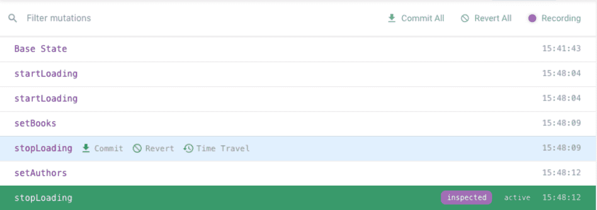

# Vuex 摊牌:突变与行动

> 原文：<https://blog.logrocket.com/vuex-showdown-mutations-vs-actions/>

***编者按**:这篇文章在 2021 年 9 月被审查和更新，以提供关于 Vuex 中突变和动作的使用的更新信息和更大的清晰度。*

突变和动作是 Vuex 的核心。它们不仅允许你改变你的状态，而且在整个 Vuex 中起到组织和结构的作用。

Vuex 突变和动作的唯一问题是，在确定何时以及如何使用它们时会很混乱。这可能导致不必要的样板文件，使用反模式，以及其他不良后果。

因此，让我们深入研究一下突变和动作，看看您应该在什么时候使用它们！

## Vuex 中的突变和作用

在 Vuex 中，突变是改变存储状态的唯一方法。它们相对简单，为所有 Vuex 用户所熟知。

当你把行动混在一起时，混乱就开始了。学习 Vuex 时，可能需要一段时间才能清楚动作和突变之间的区别。通常，开发人员可能会看到这样的代码:

```
mutations: {
  setName(state, name) {
    state.name = name;
  },
},
actions: {
  setName({ commit }, name) {
    commit('setName', name);
  },
},

```

想想:为什么有这么多样板文件？

Vuex 医生说:

> 动作类似于突变，不同之处在于:
> 
> *   动作提交突变，而不是改变状态
> *   动作可以包含任意的异步操作

所以在很多例子中，我们看到一个 API 调用在一个动作中，这导致了一个变异的提交:

```
actions: {
  loadBooks({ commit }) {
    commit('startLoading');
    get('/api/books').then((response) => {
      commit('setBooks', response.data.books);
      commit('stopLoading');
    });
  },
},

```

不看任何突变，仍然应该相当清楚发生了什么:

1.  在 API 调用开始之前，设置加载标志
2.  然后，调用使用承诺异步返回
3.  然后，调用将提交响应数据，随后是`stopLoading`，这很可能会取消加载标志

上面的代码中有一个值得注意的设计选择:它使用了两个突变，其中一个就足够了。`startLoading` / `stopLoading`突变可以用一个具有布尔有效载荷的单个突变(`setLoading`)代替，然后`stopLoading`可以改为`commit(‘setLoading’, false)`。

上面的例子需要两个突变，这意味着需要维护更多的代码。这个推理与建议相同，即 [CSS 类不要根据它们应用的样式命名为](https://blog.logrocket.com/5-things-to-consider-when-creating-your-css-style-guide-7b85fa70039d/)，而要根据样式的含义命名——也就是说，不要称之为`redAndBold`，而要称之为`activeMenuItem`。

通过调用变异`set<Property>`，意味着接口什么都不抽象；对实现的任何更改都可能意味着对接口的更改。我们将很快看到一个例子，在这个例子中，突变抽象得到了回报。

保持突变只关注特定的任务是一个好的实践。由于历史跟踪和 [Vue DevTools](https://blog.logrocket.com/5-vue-devtools-hacks/) ，在调试全局状态以查找 bug 时，这成为一个很大的优势。

## Vuex 历史跟踪和时间旅行调试

现代状态管理工具的驱动需求之一是可追溯性。在前几代状态管理中，当系统进入不一致的状态时，很难弄清楚它是如何进入这种状态的。

使用[Vue dev tools](https://blog.logrocket.com/5-useful-development-tools-for-vue-js/)，可以看到应用于单个全局状态的突变的清晰历史。

就拿上面的`loadBooks`例子来说吧。一个周五的晚上，一个叫 Alex 的开发人员开始开发在书籍旁边加载和显示作者的功能。作为起点，他们复制并粘贴已有的动作，只做了微小的修改。

```
actions: {
  loadBooks({ commit }) {
    commit('startLoading');
    get('/api/books').then((response) => {
      commit('setBooks', response.data.books);
      commit('stopLoading');
    });
  },
  loadAuthors({ commit }) {
    commit('startLoading');
    get('/api/authors').then((response) => {
      commit('setAuthors', response.data.authors);
      commit('stopLoading');
    });
  },
},

```

经过一些快速的开发人员测试后，它工作了，Alex 高兴地部署到 staging。第二天，出现了一个错误报告，指出在使用该数据的页面上，首先会看到一个微调器，但随后它会消失，显示一个未对齐的空白屏幕。然后，几秒钟后，内容出现，一切正常。

亚历克斯试图重现这个问题，不幸的是，这是零星的。几次尝试后，问题再次出现，Vue DevTools 显示如下:



Alex 使用时间旅行调试来循环过去的突变，并返回到导致视觉故障的状态。他们意识到简单的布尔加载标志对多个异步请求不起作用；历史清楚地表明，这两个行动有交错的突变。

不管你是否认为这是你在代码中发现的错误，Vuex 提供的时间旅行调试肯定是一个非常强大的跟踪工具。由于它的突变概念，它可以提供一个有意义的状态修改事件序列。

### 为什么突变不能访问 getters？

突变的另一个有助于其事务性质的方面是，它们旨在成为纯函数。突变旨在仅通过其有效载荷接收输入，而不会在其他地方产生副作用。虽然动作有一个完整的上下文来处理，但是变异只有`state`和`payload`。

在 Vue DevTools 中调试时，如果突变列表没有给出问题来源的线索，也会显示突变的有效负载。这是可能的，因为它们是纯函数。

### 抽象的修正

让我们回到亚历克斯的问题上来。我们必须对代码进行一些修改，以支持多个并发 API 请求。下面是相关的突变现在的样子:

```
state: { loading: false },
mutations: {
  startLoading(state) {
    state.loading = true;
  },
  stopLoading(state) {
    state.loading = false;
  },
},

```

以下是一个不需要对操作进行任何更改的解决方案:

```
state: { loading: 0 },
mutations: {
  startLoading(state) {
    state.loading += 1;
  },
  stopLoading(state) {
    state.loading -= 1;
  },
},

```

如果这个变异的接口是`setLoading`，如前所述，这可能意味着修复必须改变动作中的提交代码，或者忍受一个混淆底层功能的接口。

这可能不是一个严重的反模式，但值得指出的是，如果一个开发人员将突变视为一个没有抽象的层，它会降低该层的责任，并且更有可能代表纯粹的样板文件，而不是任何有价值的东西。如果每个变异都是带有`set<Property>`名称的单个赋值，那么本文顶部的`setName`示例将是许多商店代码的样子，开发人员将会感到沮丧。

为了确保这种情况不会发生，请始终记住，行动也应该服务于功能角色。如果你的行为可以通过一个简单的突变来完成，就保持这样。仅当您的状态更改代码:

*   超越了突变
*   需要按照一定的顺序进行一些突变
*   处理异步代码

## 找到合适数量的突变抽象

考虑这篇文章开头的`setName`例子:

```
mutations: {
  setName(state, name) {
    state.name = name;
  },
},
actions: {
  setName({ commit }, name) {
    commit('setName', name);
  },
},

```

从 Vuex 开始时出现的一个问题是，“突变应该被包装在动作中吗？”有什么好处？首先，store 提供了一个外部的`commit` API，使用它并不会否定 DevTools 中突变的好处。那为什么要包起来呢？

如前所述，突变是纯函数和同步的。仅仅因为现在需要的任务可以通过突变来处理，并不意味着下个月的特性不需要比一个突变所能提供的更多。将突变包装在动作中是一种实践，它为未来的开发留出了空间，而不需要更改所有的调用代码——这与 Alex 的修复中的突变抽象概念非常相似。

当然，知道它为什么在那里并不能消除样板代码给开发者带来的挫败感。

* * *

### 更多来自 LogRocket 的精彩文章:

* * *

### 减少样板文件

针对这个样板文件的一个非常简洁的解决方案是 [Vuex Pathify](https://davestewart.github.io/vuex-pathify/#/) 提供的:它试图使用尽可能少的代码创建一个商店，这是一个简洁的 API，采用了许多开发人员所推崇的约定胜于配置的方法。简介中最引人注目的陈述之一是:

```
make.mutations(state)

```

这直接从状态中自动生成了`set<Property>`样式的突变，这当然去除了样板文件，但是也去除了突变层可能具有的任何值。

## Vuex 行动的好处

动作是一个非常开放的逻辑层；没有什么事情是在商店之外做不到的，简单地说，行动都集中在商店里。

动作和您可能在商店外声明的任何类型的函数之间的一些差异:

1.  无论是在调度动作时，还是在动作可用的上下文中，动作的范围都可以是模块
2.  可以通过`subscribeAction`商店 API 拦截动作
3.  默认情况下，动作是承诺的，就像异步函数一样

这种功能的大部分属于方便和约定的范畴。

### async/await 在这里适合做什么？

Async/await 可以很好地处理动作。下面是前面用 async/await 实现的`loadBooks`示例的样子:

```
actions: {
  async loadBooks({ commit }) {
    commit('startLoading');
    const response = await get('/api/books');
    commit('setBooks', response.data.books);
    commit('stopLoading');
  },
},

```

然而这在功能上是不等价的；有一个微妙的区别。相反，上述内容在功能上等同于以下内容:

```
actions: {
  loadBooks({ commit }) {
    commit('startLoading');
    return get('/api/books').then((response) => {
      commit('setBooks', response.data.books);
      commit('stopLoading');
    });
  },
}

```

需要注意的关键是`return`语句。这意味着动作返回的承诺正在等待内心的承诺完成。接下来，它还检测返回的承诺何时实现，并在`dispatch`调用中使用它。

```
store.dispatch('loadBooks').then(() => {
  // ...
})

```

## 变异粒度

如果大多数(但不是全部)变异都是单行函数，那么原子的、事务性的变异可能只是一个单一的变异语句(例如赋值)。DevTools 中的变化轨迹可能如下所示:

```
state.loading = true;
state.loading = true;
state.books = […];
state.loading = false;
state.authors = […];
state.loading = false;

```

然而，由于大量的操作并行运行，这可能会令人困惑，而且没有突变目前提供的有意义的名称，可能很难调试。

最近 Vue DevTools 增加了在 DevTools 时间线中查看动作的功能，就在突变旁边，在这种情况下肯定会有帮助。

## 融合这些概念:一个实验

作为一个发人深省的实验，让我们尝试将突变和动作合二为一。这可以让我们更好地理解为什么这两个概念应该(或者不应该)分开。

这是我们的新创造，或“变异”，可能看起来像:

```
mutactions: {
  async loadBooks({ state }) {
    state.loading += 1;
    const response = await get('/api/books');
    state.books = response.data.books;
    state.loading -= 1;
  },
}

```

如果没有单独的动作，单个突变(也称为“变动作”)负责管理状态和异步请求。虽然这在表面上可能工作得很好，但我们需要一些额外的修补来使这个概念适应 Vue DevTools。

### 利用反应魔法

利用反应做一些聪明的事情总是好的——在这里能做吗？动作通常不是反应性的。在 Vue 生态系统中，只有以下功能是反应式功能:

*   组件的渲染
*   一个观察者
*   计算出来的财产
*   商店吸货员

它们将在每次运行时被“记录”,如果它们的依赖项触发，它们将被“回放”。反应性就像一个捕鼠器，一放就弹起。

反应性的记录阶段可能是我们可以效仿的模式。但这里有一个可能不会立即显现的巨大挑战:反应性记录是同步的。

那是什么意思？好吧，这里有一个测试代码笔:

参见 [CodePen](https://codepen.io) 上迈克尔加拉格尔( [@mikeapr4](https://codepen.io/mikeapr4) )
的 Pen [异步守望者](https://codepen.io/mikeapr4/pen/WWEmEj)。

以上是对一些反应数据的两位观察者。两个观察器是相同的，除了一个有异步的获取器。正如您所观察到的，这个观察器没有触发，而同一个同步观察器触发了。为什么？

反应性目前基于依赖函数的全局堆栈工作。好奇的话可以翻看`[/observer/dep.js](https://github.com/vuejs/vue/blob/dev/src/core/observer/dep.js)`看看。要做到这一点，反应必须是同步的。

### 一些代理魔术？

Vue 3 使用`Proxy`类来获得更透明的反应。这个功能是否给了我们任何可以用来完成异步记录的东西？

首先，让我们暂时把性能问题放在一边，因为我们认为运行 DevTools 的是一个*开发者*，而不是一个用户。如果手头有更多的调试选项，资源的增加和性能的下降是允许的。

这里有一个模拟 Vuex 商店的例子。它包括亚历克斯的`loadBooks`和`lookAuthor`动作与突变合并在一起成为一个单一的“变异动作”。

参见 [CodePen](https://codepen.io) 上阿雷克·纳沃([@阿雷克那沃](https://codepen.io/areknawo) )
的笔 [变招](https://codepen.io/areknawo/pen/NWvGYYN)。

控制台日志是低粒度突变可追溯性的基本起点，由调用它们的动作分组。此外，操作的开始和结束也按时间顺序记录。

那么代码中发生了什么呢？

如前所述，我们不可能全局跟踪一个异步堆栈，并且在发生突变时访问调用堆栈的选项也不多——您可以抛出并捕获一个错误，或者使用不推荐的/禁止的`arguments.caller`。

然而，当我们将`state`对象传递给动作时，我们知道“突变动作”，并且我们知道所有的突变都将通过该对象。因此，我们将`state`(一个全局单实例)包装在一个特殊的自定义`Proxy`中，并引用了“mutaction”

如果子属性被读取，代理会自我传播，并最终为任何写入触发一个日志。这个示例代码显然是为简单、愉快的路径功能编写的，但它证明了这个概念。这里有一个内存开销，但是这些自定义代理将和“mutaction”执行一样长。

“mutactions”使用 async/await，并且必须等待所有异步功能，确保返回的承诺只有在动作真正完成时才会解析/拒绝。这里可能有一个拒绝的警告，拒绝不会等待所有潜在的承诺完成。

## 时间旅行

这种粒度突变的缺点是，如果对每个突变都继续执行时间旅行调试步骤，那么每次保存整个状态的开销将会非常大。

然而，反应性可以在这里提供一个范例，因为默认情况下，它在触发观察者之前等待`nextTick`。如果 DevTools 在存储状态快照之前做了同样的事情，这意味着这些步骤可能会围绕今天的突变概念。

该显示每个节拍只会重新渲染一次，因此提供更低粒度的时间旅行步骤没有多大意义。

## 结论

突变提供了简单性和可追溯性、更少的样板文件、灵活性和组合性。它们可以添加到 Vuex 中，同时仍然保持向后兼容性，以便逐渐采用。

## 像用户一样体验您的 Vue 应用

调试 Vue.js 应用程序可能会很困难，尤其是当用户会话期间有几十个(如果不是几百个)突变时。如果您对监视和跟踪生产中所有用户的 Vue 突变感兴趣，

[try LogRocket](https://lp.logrocket.com/blg/vue-signup)

.

[](https://lp.logrocket.com/blg/vue-signup)[https://logrocket.com/signup/](https://lp.logrocket.com/blg/vue-signup)

LogRocket 就像是网络和移动应用程序的 DVR，记录你的 Vue 应用程序中发生的一切，包括网络请求、JavaScript 错误、性能问题等等。您可以汇总并报告问题发生时应用程序的状态，而不是猜测问题发生的原因。

LogRocket Vuex 插件将 Vuex 突变记录到 LogRocket 控制台，为您提供导致错误的环境，以及出现问题时应用程序的状态。

现代化您调试 Vue 应用的方式- [开始免费监控](https://lp.logrocket.com/blg/vue-signup)。