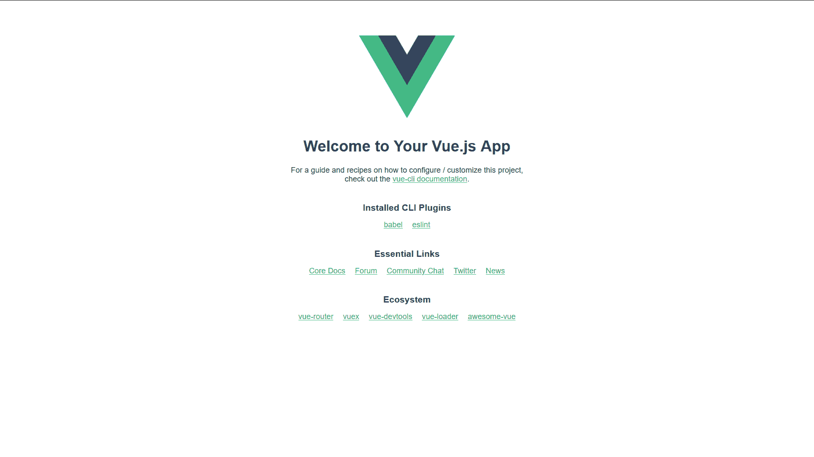
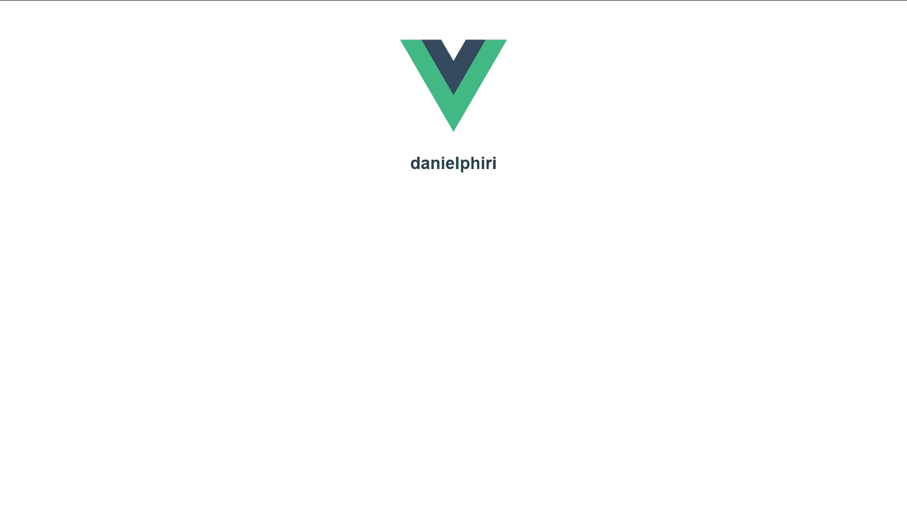
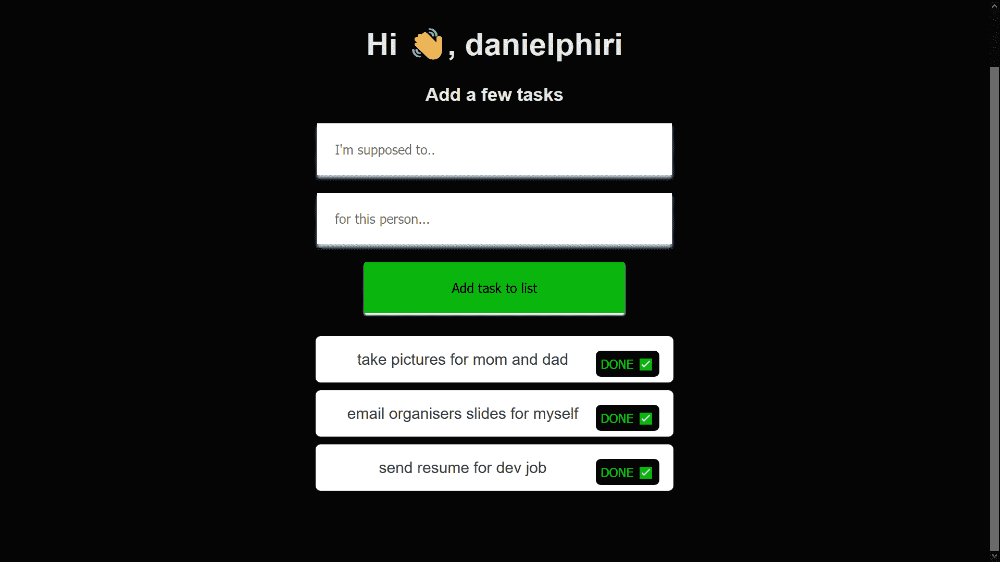
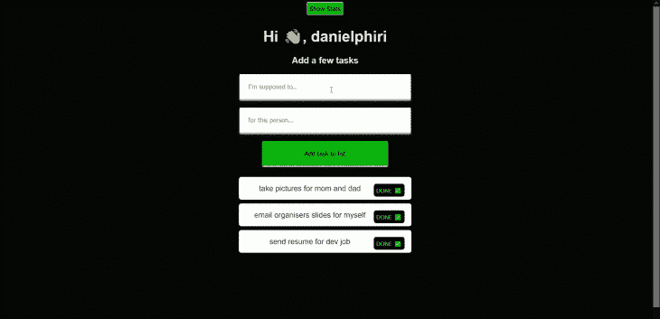

# Vuex:为什么我们需要 SPA 状态管理

> 原文：<https://blog.logrocket.com/vuex-why-we-need-spa-state-management/>

Vue.js 最好的一点是它给现代 web 开发带来了相对的简单性。有了 Vue，构建单页面应用程序(spa)变得前所未有的简单。

像 Vue 这样的 JavaScript 框架带有基于组件的设计模式。

整个 web 应用程序只是共享数据的单个部分(组件)的集合。应用程序越大，数据就越难在每个组件中保持一致和可管理。

这些数据通常被称为应用程序状态。

对于 Vue.js 来说，Vuex 是使用最广泛的状态管理库。今天，我们将向 Vue.js 应用程序中添加和集成 Vuex。

Vuex 不仅作为应用程序状态的中央存储，而且还设置规则来确保数据以预期的方式改变。

Vuex 确保您的视图与您的应用数据保持一致。如果现在这还没有意义，请不要担心——随着我们的继续和构建，这些都将汇集在一起。

作为一个半定期参加会议和活动的人，我倾向于会见一些人，并同意在未来做一些事情，但当时间到来时，我经常忘记这些事情。所以我们要做一个除了我之外没人会用的东西——一个提醒(或者美化的待办事项)应用。

在我们开始之前，这里有一些你需要的东西:

*   Vue.js 的基础知识
*   Node.js 和 Yarn 已安装

我们已经介绍了 Vuex 的作用以及它的重要性。

现在我们需要建立我们的项目。打开你的终端，输入`vue create <project-name>`。

为此，您需要安装 Vue CLI。

如果你没有安装，你可以在这里得到它。

选择默认项目设置。一旦一切都完成了，我们已经初始化了我们的项目，运行`cd <project-name>`和`yarn serve`。

您应该会看到您通常的 Vue 开始页面。



运行之后，我们需要将 Vuex 添加到我们的项目中。

在您的终端中，键入`vue add vuex`。之后，您应该会看到您的目录结构发生了很大的变化。

与大多数状态管理工具一样，Vuex 有一个中央存储/单一状态树来存储应用程序状态。

我们的在`src`文件夹里。你会得到一个`store.js`文件或者一个带有`index.js`文件的`store`文件夹。如果没有，您可以创建它们并粘贴到以下代码中:

```
import Vue from 'vue'
import Vuex from 'vuex'
Vue.use(Vuex)
export default new Vuex.Store({
  state: {
  },
  mutations: {
  },
  actions: {
  }
})
```

随着我们导入商店，您还会看到`src/main.js`的变化。如果没有，请粘贴以下代码:

```
import Vue from 'vue'
import App from './App.vue'
import store from './store'
Vue.config.productionTip = false
new Vue({
  store,
  render: h => h(App)
}).$mount('#app')
```

此时，看着你的商店，你可能想知道所有的部分是干什么用的。在深入研究我们的项目之前，我们将简要回顾一下它们。

* * *

### 更多来自 LogRocket 的精彩文章:

* * *

**状态**:应用程序状态是你的应用程序使用的数据。

**突变**:改变存储状态的同步方法，直接提交改变状态。

**动作**:提交突变，为异步操作让路。

### 奖金

**Getters** :从存储状态导出的计算属性。

我们刚刚将 Vuex 添加到我们的项目中——现在我们必须测试它。

我们将从为我们的商店定义一些数据开始。

在您的商店中，您将通过将`username: "danielphiri"`粘贴到商店的 state 部分来定义一个名为 username 的新数据属性。

我们想在我们的网页上制作这个节目。清除`<template>`标签并粘贴如下内容:

```
<template>
  <div>
    <h1> {{ username }} </h1>
  </div>
</template>
```

在同一个文件的`<script>`部分，我们需要添加`import mapState from` `'vuex'`并粘贴如下:

```
computed: {
    ...mapState(["username"])
  }
```

然后，我们应该会在屏幕上看到我们保存在商店中的价值。



现在我们进入了我们想要构建的提醒应用程序的核心。我们将需要能够输入任务的细节，以及我们需要为谁执行每个任务的细节。

我们还应该能够驳回所有任务或单个任务。

我们需要为状态概念化一个数据模型，这样我们就知道我们在应用程序的 HTML 部分使用了什么数据。在您的商店中，粘贴以下代码:

```
state: {
    username: "danielphiri",
    tasks: [
      { taskName: "take pictures", taskReciever: "mom and dad" },
      { taskName: "email organisers slides", taskReciever: "myself" },
      { taskName: "send resume", taskReciever: "dev job" },
    ]
  },
  mutations: {
    ADD_TASK: (state, task) => {

      state.tasks.push(task);
    },
    REMOVE_TASK: (state, task) => {
      state.tasks.splice(task, 1);
    },
  actions: {
    removeTask: (context, task) => {
      context.commit("REMOVE_TASK", task);
    },
  }
```

在我们的状态中，我们定义了一个用户名和一个数组来保存我们的任务和相关数据。

我们定义了两种变化:`ADD_TASK`，它通过向 tasks 数组添加任务来改变状态，以及`REMOVE_TASK`，它从 tasks 数组中删除一个任务。

最后，我们定义一个动作:`removeTask`为我们提供了使用一些定制逻辑异步删除任务的选项。

您会注意到`context`对象是`removeTask`中的第一个参数。Vuex 中的动作使用`context`，这使它们能够访问存储属性和方法，如`context.commit()`，用于提交变异。

首先，我们将创建一个组件，它允许我们输入任务、显示任务以及删除任务。

姑且称之为`Main.vue`。我们将在`<script>`部分粘贴以下代码:

> 不要忘记将您的`Main`组件添加到您的`App.vue`文件中。

```
<script>
import { mapState, mapMutations, mapActions } from "vuex";
export default {
  name: "Main",
  data() {
    return {
      taskName: "",
      taskReciever: "",
    };
  },
  computed: {
    ...mapState(["tasks", "username"])
  },
  methods: {
    ...mapMutations(["ADD_TASK"]),
    ...mapActions(["removeTask"]),
    addTask: function() {
      let newTask = Object.create(null);
      newTask["taskName"] = this.taskName;
      newTask["taskReciever"] = this.taskReciever;
      this.ADD_TASK(newTask);
      this.taskReciever = "";
      this.taskName = "";
    },
    removeTasks: function(task) {
      this.removeTask(task);
    }
  }
};
</script>
```

在文件的顶部，您会注意到我们导入了几个助手函数。

它们在功能上都非常相似——例如,`mapState`帮助我们将存储状态映射到本地(组件)计算属性。

所以`mapMutations`对存储突变做同样的事情，`mapActions`对存储动作做同样的事情。

我们还将使用`mapState`来显示组件中的“用户名”和“任务”。

我们还在 methods 属性中使用了`mapMutations`,这样我们就可以像定义`addTask()`时一样，用带参数的函数调用存储突变，我们用它来执行突变，同时将`newTask`对象作为参数传递。

在我们的`Main.vue`的`<template>`部分，我们将粘贴以下代码:

```
<template>
  <div class="home">
    <div class="hello center">
      <div >
        <h1 class="header-text"> Hi 👋, {{ username }}</h1>
        <h3 class="header-text"> Add a few tasks</h3>
        <form @submit.prevent="addTask">
          <input class="input" type="text" placeholder="I'm supposed to.." v-model="taskName" />
          <input class="input" type="text" placeholder="for this person..." v-model="taskReciever" />
          <button class="add-button" type="submit" placeholder="Add task to list">Add task to list</button>
        </form>
        <ul>
          <li v-for="(task, index) in tasks" v-bind:key="index">
            {{ task.taskName }} for {{task.taskReciever}}
            <button
              v-on:click="removeTasks(index)"class="remove">Done ✅</button>
          </li>
        </ul>
      </div>
      <div class></div>
    </div>
  </div>
</template>
```

我们可以直接从 store 中插入我们的用户名，因为我们使用`mapState`将它映射为一个计算属性。

任务也是如此:我们使用`v-for`来遍历来自我们存储的任务数组，并显示我们任务的所有属性，即`taskName`和`taskReciever`。

我们还使用一个表单将任务变异到我们的存储中。

在 submit ( `@submit`)，也就是我们在填充任务后按下按钮时，我们调用`addTask`方法，然后它通过将我们输入的内容添加到任务数组来改变我们的状态。

或者，您可以通过粘贴以下内容来添加样式部分:

```
<style>
html,
#app,
.home {
  height: 100%;
}
body {
  background-color: #050505;
  margin: 0;
  height: 100%;
}
input {
  border: none;
  padding: 5%;
  width: calc(100% - 40px);
  box-shadow: 0 3px 3px lightgrey;
  margin-bottom: 5%;
  outline: none;
}
.header-text {
  color: #e9e9e9;
}
.add-button {
  border: none;
  border-radius: 2px;
  padding: 5%;
  background-color: #0cf50cbb;
  box-shadow: 0 2px 2px #fff;
  width: calc(100% - 100px);
  margin-bottom: 2%;
  outline: none;
}
.main {
  display: grid;
  grid-template-columns: repeat(2, 50%);
  grid-template-rows: 100%;
  height: 100%;
}
.center {
  display: flex;
  justify-content: center;
}
.left,
.right {
  padding: 30px;
}
ul {
  list-style-type: none;
  padding: 0;
}
ul li {
  padding: 4%;
  background: white;
  margin-bottom: 8px;
  border-radius: 5px;
}
.right {
  grid-area: right;
  background-color: #e9e9e9;
}
.remove {
  float: right;
  text-transform: uppercase;
  font-size: 0.8em;
  background: #050505;
  border: none;
    border-radius: 5px;
  padding: 5px;
  color: #00ff88de;
  cursor: pointer;
}
</style>
```

保存您的工作，运行它，您应该会看到:



现在我们有一些基本的 Vuex 操作在工作，但你真的不知道我们为什么使用 Vuex。我们只用了一种成分。

让我们创建另一个名为`Stats.vue`的组件。我们将使用它来显示一些统计数据，并展示如何正确使用 Vuex 操作。

首先，我们希望能够显示我们拥有的未决任务的数量。

在我们的存储中，我们可以定义一个 getter 来完成这项工作，方法是将以下文本粘贴到 state 对象下面:

```
getters: {
    taskCount: state => {
      return state.tasks.length;
    }
  },
```

然后我们向存储中添加另一个突变:

```
REMOVE_ALL: state => {
      state.tasks = [];
    },
```

这让我们可以清除列表中的每个任务。

最后，在我们的状态中，我们通过添加下面的代码将另一个动作添加到存储中的`removeTask`的正下方:

```
removeAll({ commit }) {
      return new Promise((resolve) => {
        setTimeout(() => {
          commit("REMOVE_ALL");
          resolve();
        }, 2000);
      });
    }
```

你会注意到我们定义了一个承诺，并使用一个`setTimeout`函数在提交`REMOVE_ALL`变异之前增加了一点延迟(2 秒)。

因此 Vuex 动作的异步特性。

我们可以随意摆弄决定我们如何行动的逻辑。这可以用在购物车、交易网站或聊天应用程序中——它有很多用途。

回到我们的`Stats.vue`文件，我们在`<scripts>`部分粘贴以下内容:

```
<script>
import { mapGetters, mapActions, mapMutations, mapState } from 'vuex'
export default {
  name: 'Stats',
  computed: {
    ...mapGetters(['taskCount']),
    ...mapState(["username"])
  },
  data() {
    return {
      message: ""
    }
  },
  methods: {
    ...mapMutations(['REMOVE_ALL']),
    ...mapActions(['removeAll']),
    removeAllTasks() {
      this.removeAll().then(() => {
        this.message = 'Self care - tasks are gone'
      });
    }
  }
}
</script>
```

在 **Stats.vue** 中，就像我们说过的，我们希望能够计算我们有多少未完成的任务。

我们使用`mapGetters`助手来显示计算出的属性。

在方法中，我们初始化了我们的`removeAll`动作和`REMOVE_ALL`变异，并定义了`removeAllTasks`，它有一个承诺，一旦承诺实现，就让我们使用`then()`原型来显示文本。

在 **Stats.vue** 的`<template>`部分，粘贴以下代码:

```
<template>
  <div class="stats">
    <h3 class="header-text">Here are your numbers, {{username}} 😬 </h3>
    <p class="header-text">You need to perform {{ taskCount }} tasks fam</p>
    <button class="" v-on:click="removeAllTasks">Nope, can't even..</button>
    <p class="header-text">{{ message }}</p>
  </div>
</template>
```

这里我们有一个删除所有任务的按钮和一个当我们的承诺实现时显示的消息。

运行您的应用程序，您应该有一个非常漂亮的 web 应用程序，如下所示:



## 结论

我们讨论了为什么我们需要 Vuex、Vuex 操作和助手。我们还成功地用它构建了一个应用程序。

我们有一个实用的网络应用程序，你可以测试一下。我们看到了如何使用 Vuex 操作单个数据源并避免不一致。我们还构建了一个多组件应用程序，并在它们之间共享数据。

如果您想更深入地了解这个主题，我推荐以下资源:

在 [GitHub](https://github.com/malgamves/vuex-remindrr-app) 或 [CodeSandbox](https://codesandbox.io/s/vuex-remindrr-app-cvf9u) 上查看完整版本。

我希望你喜欢这一点，如果你有任何问题或想打招呼，请随时向我发推文。

## 像用户一样体验您的 Vue 应用

调试 Vue.js 应用程序可能会很困难，尤其是当用户会话期间有几十个(如果不是几百个)突变时。如果您对监视和跟踪生产中所有用户的 Vue 突变感兴趣，

[try LogRocket](https://lp.logrocket.com/blg/vue-signup)

.

[](https://lp.logrocket.com/blg/vue-signup)[https://logrocket.com/signup/](https://lp.logrocket.com/blg/vue-signup)

LogRocket 就像是网络和移动应用程序的 DVR，记录你的 Vue 应用程序中发生的一切，包括网络请求、JavaScript 错误、性能问题等等。您可以汇总并报告问题发生时应用程序的状态，而不是猜测问题发生的原因。

LogRocket Vuex 插件将 Vuex 突变记录到 LogRocket 控制台，为您提供导致错误的环境，以及出现问题时应用程序的状态。

现代化您调试 Vue 应用的方式- [开始免费监控](https://lp.logrocket.com/blg/vue-signup)。