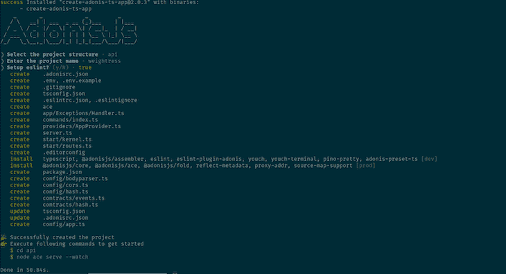
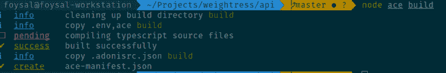
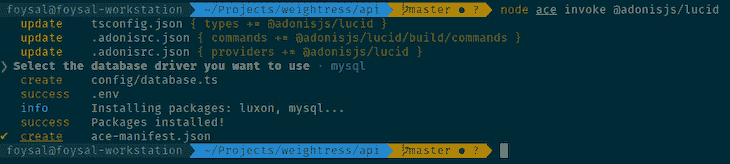
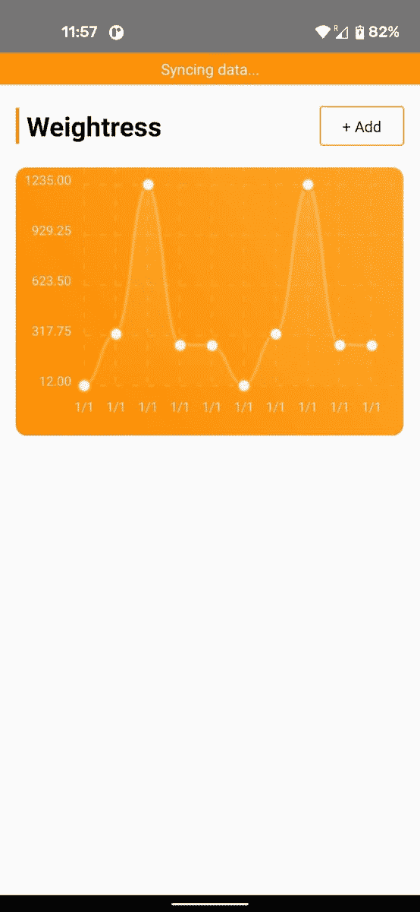

# 使用 WatermelonDB 进行离线数据同步

> 原文：<https://blog.logrocket.com/watermelondb-offline-data-sync/>

## 概述

这篇文章可以被看作是上一篇文章的续篇，在上一篇文章中，我写道[用 React Native](https://blog.logrocket.com/offline-app-react-native-watermelondb/) 构建了一个离线体重追踪应用。然而，这并不意味着你需要先阅读整篇文章。

我们将使用我们在那篇文章中编写的代码作为这篇文章的起点，但这篇文章的目标是演示如何将 WatermelonDB 的同步功能与 AdonisJs 服务器端 API 应用程序连接起来。

## 探索 WatermelonDB 的离线功能

如上所述，作为起点，我们将使用我们在另一篇博文中构建的应用程序。在我们继续之前，让我们创建一个包含 React Native 和 AdonisJs 应用程序的文件夹，然后请从这里克隆存储库[并检查**分支 v1** :](https://github.com/foysalit/weightress-app-blog/tree/v1)

```
mkdir weightress && cd $_
git clone <https://github.com/foysalit/weightress-app-blog.git> app && cd $_
git checkout v1
yarn
```

一旦您安装了代码及其所有依赖项，您应该能够使用您的设备或仿真器在您选择的平台上启动应用程序。我正在使用一个物理 Android 设备进行测试，所以我将写下这种特殊情况下的步骤，但是其他情况下的步骤应该也是类似的。

连接设备后，只需在终端的一个窗口中运行`yarn start`,在另一个窗口中运行`yarn android`。这将在您的设备上启动应用程序。

如果你已经有了一个用 WatermelonDB 构建的应用程序，并希望与它同步数据，请随意使用，但请记住，你的数据结构将与我们的不同。同样地，表、模式等。将需要进行相应的调整。

总结一下目前的情况，我们有一个应用程序，让我们将一些数据输入到一个名为`weights`的表中，我们希望通过 REST API 调用将这些数据与某个服务器同步。由于这是离线应用程序的一个非常常见的要求——能够在设备外部保持数据同步——WatermelonDB 自带了这个功能。

让我们看看如何利用它。让我们在`data/`文件夹中创建一个名为`sync.ts`的文件，并放入以下代码:

```
import {synchronize} from '@nozbe/watermelondb/sync';
import {database} from './database';
// your_local_machine_ip_address usually looks like 192.168.0.x
// on *nix system, you would find it out by running the ifconfig command
const SYNC_API_URL = 'http://<your_local_machine_ip_address>:3333/sync';
export async function sync() {
  await synchronize({
    database,
    pullChanges: async ({lastPulledAt}) => {
      const response = await fetch(SYNC_API_URL, {
        body: JSON.stringify({lastPulledAt}),
      });
      if (!response.ok) {
        throw new Error(await response.text());
      }

      const {changes, timestamp} = await response.json();
      return {changes, timestamp};
    },
    pushChanges: async ({changes, lastPulledAt}) => {
      const response = await fetch(
        `${SYNC_API_URL}?lastPulledAt=${lastPulledAt}`,
        {
          method: 'POST',
          body: JSON.stringify(changes),
        },
      );
      if (!response.ok) {
        throw new Error(await response.text());
      }
    },
  });
}
```

我们使用来自 WatermelonDB 的`synchronize`函数(需要一个数据库实例)、一个`pullChanges`函数和一个`pushChanges`函数。数据库实例已经从`database.ts`文件中导出，所以我们导入并传递它。

`pullChanges`从远程数据源引入数据，并用远程数据更新本地数据库。在函数体中，我们使用 WatermelonDB 提供的`lastPulledAt`时间戳向`SYNC_API_URL`端点发出一个`GET`请求。该 URL 指向`<your_local_machine_ip_address>:3333/sync`，一旦我们构建出 Adonis 应用程序，就可以使用它。

> **注意**:我们不能在 React 本地代码中使用`localhost:3333`，因为我们的应用程序将在不同的设备上运行，而该设备的本地主机与运行 Adonis 应用程序的机器的本地主机不同。这就是为什么你必须使用 IP 地址。

请注意，在请求响应中，我们期望收到一个带有更改和时间戳属性的对象。这是我们*必须*从`pullChanges`函数调用返回的内容，以便与 WatermelonDB 的同步实现兼容。

`pushChanges`是将本地数据发送到远程数据源的函数。自然，我们向我们的`SYNC_API_URL`发出一个`POST`请求，在请求体中，我们附加了 WatermelonDB 提供给我们的`changes`变量。

注意，我们没有从函数中返回任何东西，但是如果 API 请求没有返回 OK 状态，我们将抛出一个错误。这是至关重要的，因为通过抛出一个错误，我们可以确保如果推送在服务器端以某种方式中断，WatermelonDB 会做它的事情来确保数据完整性得到维护。

## 使用 AdonisJs 生成我们的 API 应用程序

Adonis 附带了一个方便的样板生成器命令。要运行它，确保您在`weightress/`文件夹中并运行命令`yarn create adonis-ts-app api`。你会得到几个问题；提供如下的答案，你将会看到一个名为`api`的目录。



Adonis 使用一个名为 Ace 的包来构建和运行 CLI 命令。然而，要开始使用它，您需要首先编译代码。不要担心——这就像运行一个 yarn 命令一样简单。只需运行`cd api && yarn build`，您应该会看到如下输出:



现在，我们在这个应用程序中需要做的第一件事是将我们在 WatermelonDB 中的数据结构复制到我们的服务器数据库中。在这种情况下，我选择 MySQL 作为数据库，Lucid 作为与数据库通信的 ORM。

同样，AdonisJs 可以方便地引导与数据库相关的所有东西。运行以下命令将这一切整合在一起:

```
yarn add @adonisjs/[email protected]
node ace invoke @adonisjs/lucid
yarn build
```

第二个命令将要求您选择一个数据库提供者。我选择 MySQL，但是你也可以随意选择你喜欢的数据库，因为它在这篇文章中不会有太大的不同。这是我的终端窗口的输出，供参考:



现在，为了连接到 MySQLdb，我们需要添加凭证作为 env 变量。阿多尼斯让处理这些变得很容易。打开。env 文件，您应该会看到类似这样的内容:

```
DB_CONNECTION=mysql
DB_HOST=127.0.0.1
DB_USER=lucid
DB_PASSWORD=
DB_NAME=lucid
```

调整这些变量的值，以匹配您的本地或远程 MySQL 数据库的凭证，以确保应用程序可以连接到它。

在我们开始编写应用程序代码之前，让我们确保我们的数据库已经设置好，可以支持来自应用程序的数据。说到模式管理，通过迁移来做总是更好更容易，所以我们将从创建其中一个开始:`node ace make:migration weights`。这将在`database/migrations/`文件夹中放置一个新文件。打开该文件，并用以下代码替换内容:

```
import BaseSchema from '@ioc:Adonis/Lucid/Schema'

export default class Weights extends BaseSchema {
  protected tableName = 'weights'

  public async up () {
    this.schema.createTable(this.tableName, (table) => {
      table.increments('id')
      table.double('weight')
      table.string('note')
      table.timestamps(true)
    })
  }

  public async down () {
    this.schema.dropTable(this.tableName)
  }
}
```

当迁移运行时，这将在我们的 MySQL 数据库中创建一个名为`weights`的新表，其中有一个自动递增的`id`列；一个可以保存浮点数的`weight`列；名为`note`的字符串列；以及一个名为`timestamps`的栏目，由美少年自动添加名为`created_at`和`updated_at`的栏目。

如您所见，这与我们在 WatermelonDB 中的`weights`表模式几乎完全相同，除了一些 MySQL 特有的东西，如`PRIMARY KEY`列。您可以将它与 React 本机应用程序代码中的`data/schema.ts`文件中的模式代码进行匹配。

最后，不要忘记`run yarn build && node ace migration:run`以便在您的数据库上运行这个迁移。

现在，为了从 Adonis 应用程序中交流/操作这些数据，我们需要一个模型。让我们通过运行`node ace make:model weight`来实现这一点，这将在`app/models/Weight.ts`中生成一个新文件。将该文件中的代码替换为:

```
import { DateTime } from 'luxon'
import { BaseModel, column } from '@ioc:Adonis/Lucid/Orm'

export default class Weight extends BaseModel {
  @column({ isPrimary: true })
  public id: number

  @column()
  public weight: number

  @column()
  public note: string

  @column.dateTime({ autoCreate: true })
  public createdAt: DateTime

  @column.dateTime({ autoCreate: true, autoUpdate: true })
  public updatedAt: DateTime
}
```

唯一的新行是`weight`和`note`列定义。这确保了这两个属性都可以在该模型的代码中公开访问。这也非常类似于我们对 WatermelonDB 的模型定义；你可以把它和文件`data/weight.ts`进行比对。

## 为同步构建我们的 REST API 端点

到目前为止，我们已经在 API 中构建了“引擎盖下的机器”。现在是时候使用这种机制来构建我们的 REST API 同步端点了，这也是我们对 React 原生应用程序的期望。如果您还记得，我们只需要一个位于`/sync`的端点，但是它必须能够服务于`GET`和`POST`请求。

* * *

### 更多来自 LogRocket 的精彩文章:

* * *

我们从在`start/routes.ts`文件中添加这两行开始:

```
Route.get('sync', 'SyncsController.push');
Route.post('sync', 'SyncsController.pull');
```

这告诉 Adonis 使`/sync`端点可用，并对`GET`请求使用`push`方法，对`POST`请求使用`pull`方法，这两个方法都来自一个神秘的`SyncsController`类。我们将马上讨论控制器，但是注意这里的命名可能有点混乱。

但是，如果从 API 服务器的数据库角度来看，`GET`请求是由来自 WatermelonDB 的`pullChanges`调用生成的，WatermelonDB 是来自该数据库的 POV 的远程数据。因此，从这方面来说，这与将数据从这方面推送到远程源是一样的。

类似地，来自 WatermelonDB 的`pushChanges`调用生成一个`POST`请求，这类似于来自服务器数据库的 POV 的一个`pull`动作。有点晕，不用想太多。

现在我们来看看`SyncsController`。当在路由定义中的指定端点接收到请求时，控制器方法被触发。让我们通过运行`node ace make:controller sync`来生成我们的同步控制器，这将在`app/Controllers/Http/SyncsController.ts`创建一个新文件。

现在打开文件，放入以下代码:

```
import { DateTime } from 'luxon'
import {RequestContract} from '@ioc:Adonis/Core/Request'
import { HttpContextContract } from '@ioc:Adonis/Core/HttpContext'
import Weight from 'App/Models/Weight'

const getSafeLastPulledAt = (request: RequestContract) => {
  const lastPulledAt = request.input('lastPulledAt')
  if (lastPulledAt !== 'null') {
    return DateTime.fromMillis(parseInt(lastPulledAt)).toString()
  }
  return DateTime.fromMillis(1).toString()
}

export default class SyncsController {
  public async pull ({ request }: HttpContextContract) {
    const changes = request.input('changes')

    if (changes?.weights?.created?.length > 0) {
      await Weight.createMany(changes.weights.created.map(remoteEntry => ({
        note: remoteEntry.note,
        weight: remoteEntry.weight,
        watermelonId: remoteEntry.id,
        createdAt: DateTime.fromMillis(parseInt(remoteEntry.created_at)),
      })))
    }

    if (changes?.weights?.updated?.length > 0) {
      const updateQueries = changes.weights.updated.map(remoteEntry => {
        return Weight.query().where('watermelonId', remoteEntry.id).update({
          note: remoteEntry.note,
          weight: remoteEntry.weight,
        })
      })
      await Promise.all(updateQueries)
    }

    if (changes?.weights?.deleted?.length > 0) {
      await Weight.query().where('watermelon_id', changes.weights.deleted).exec()
    }
  }
  public async push ({request}: HttpContextContract) {
    const lastPulledAt = getSafeLastPulledAt(request)
    const created = await Weight.query().where('created_at', '>', lastPulledAt).exec()
    const updated = await Weight.query().where('updated_at', '>', lastPulledAt).exec()
    return {
      changes: {
        weights: {
          created,
          updated,
          deleted: [],
        },
      },
      timestamp: Date.now(),
    }
  }
}
```

好了，这里发生了很多事情，所以让我们一次解开一个方法。`pull`方法接收一个属性名为`changes`的对象，它是一个对象。该对象将包含自上次同步以来发生的所有数据库更改，以每个表/集合的名称为关键字。

所以在我们这种情况下，应该看到关键`weights`。对于每个表，我们有三个数组属性:`created`，包含所有的新条目；`updated`，包含所有修改的条目；和`deleted`，包含自上次同步以来所有删除的条目(在我们的例子中，来自`weights`表)。

因此，如果在`created`输入中有任何条目，我们映射数组中的所有条目，并使用`Weight.createMany()`方法，将所有这些条目插入到我们的服务器端数据库中。

注意，我们正在将`created_at`转换成一个`DateTime`实例；WatermelonDB 时间戳是只包含数字的 Unix 时间戳，与 Lucid ORM 的`datetime`字段不直接兼容。注意，我们还插入了来自 WatermelonDB 的`id`字段，并且我们看到了为什么在接下来的行中需要它。

在服务器端更新时，我们在客户机条目和服务器条目之间的唯一参考点是 WatermelonDB 生成的 ID，这就是为什么我们在同步创建的条目时将它保存在服务器端 DB 上。因此，为了更新，我们遍历`updated`输入数组中的所有条目，并使用`Weight.query().where('watermelonId', remoteEntry.id).update`更新条目。

这里有一点性能问题，因为对于更新数组中的每个条目，我们都要对数据库运行一次更新查询。随着用户群的增长，这可能会很快堵塞我们的数据库，所以请密切关注。最后，我们使用`Promise.all`等待所有这些查询完成。

删除有点不同。WatermelonDB 只发送被删除条目的 id，所以我们要做的就是删除所有匹配这些 id 的条目。

`push`端点有一个类似于`pull`的接口。它必须返回一个`changes`属性和一个`timestamp`属性。`timestamp`属性非常重要，因为在从客户端成功拉取之后，它将被 WatermelonDB 保存。

下一次它请求另一个 pull 时，它将发送先前保存的时间戳，让我们的服务器知道上一次成功同步发生的时间。这就是为什么当请求 pull 时，WatermelonDB 会发送一个`'lastPulledAt'`输入。对于第一次同步，它将被设置为`null`，所以为了翻译这个输入，我们有一个叫做`getSafeLastPulledAt`的帮助函数。

在`changes`中，我们数据库中的每个表/集合应该有一个属性；所以，在我们的例子中，它只包含`weights`。其中的每一个都将包含`created`、`updated`和`deleted`属性。出于本文的目的，由于我们的用户界面还不允许删除应用程序中的条目，我们将只处理`created`和`updated`同步。

使用`lastPulledAt`时间戳，我们查询数据库中的所有条目，以找到自那以后更新或创建的条目，并在响应中发送它。这就是我们的服务器端应用程序所需要的一切。

## 实现同步指示器 UX

在这篇文章的开始，我们只定义了触发同步过程的`sync`函数。然而，为了使所有这些工作，我们仍然需要通过调用`sync`函数来触发流程。这可以通过多种方式实现——按需、自动或两者结合。

出于本文的目的，我们将仅通过在每次打开应用时触发`sync`来构建自动方法。当同步发生时，我们还应该向用户显示某种同步正在进行的指示。我们将在一个组件中构建所有这些。在`components/sync-indicator.tsx`中创建一个新文件，并放入以下代码:

```
import React, {useEffect, useState} from 'react';
import {View, Text} from 'react-native';
import {syncStyles} from './styles';
import {sync} from '../data/sync';

const SyncIndicator = () => {
  const [syncState, setSyncState] = useState<string>('Syncing data...');

  useEffect(() => {
    sync()
      .then(() => setSyncState(''))
      .catch(() => setSyncState('Sync failed!'));
  });

  if (!syncState) {
    return null;
  }

  return (
    <View style={syncStyles.container}>
      <Text style={syncStyles.text}>{syncState}</Text>
    </View>
  );
};

export default SyncIndicator;
```

这是一个非常简单的组件，只有一个本地状态，`syncState`。它最初被设置为**同步数据……**，因为在打开时，这个组件每次都会被加载，我们会触发同步。

一旦组件被加载到视图中，我们就使用`useEffect`启动`sync()`函数，当它没有错误地完成时，我们将`syncState`设置为一个空字符串来标记它完成。如果同步承诺抛出错误，我们将`syncState`设置为*同步失败！*让用户知道。

按照这个逻辑，如果`syncState`为空，我们干脆什么都不渲染。否则，我们用从`styles.ts`文件导入的一些样式显示`syncState`文本。让我们来看看风格的定义:

```
export const syncStyles = {
  container: {
    paddingVertical: 5,
    alignItems: 'center',
    backgroundColor: primaryColor,
  },
  text: {
    color: '#FFFFFF',
  },
};
```

这将在同步状态文本上设置一个背景颜色，使其易于看到。现在我们要做的就是把这个组件放到我们的应用程序中。打开`App.tsx`文件并在`[ScrollView](https://blog.logrocket.com/common-bugs-react-native-scrollview/)`区域的顶部呈现组件:

```
import Creator from './components/creator'; 
// import the sync indicator
import SyncIndicator from './components/sync-indicator';
// … previous code
<StatusBar /> 
<SafeAreaView>
  // render the sync indicator
  <SyncIndicator />
  <ScrollView contentInsetAdjustmentBehavior="automatic">
```

现在，如果你打开应用程序并留意运行 AdonisJs 应用程序的终端窗口，你应该会在屏幕顶部看到一些小文本，上面写着**同步数据……**，它最终会消失，这意味着同步成功。你也可以把你的`SYNC_API_URL`改成一个随机的 URL 来模拟同步失败。在这种情况下，您会看到一个**同步失败！**消息。

这是我的设备截图:



## 测试离线同步行为

是时候试驾一下了。离线支持的应用程序有点难以测试，尤其是因为在各种场景中可能会出现很多边缘情况。以下是测试和验证基本离线行为是否正常的方法。

打开飞行模式以切断设备上的所有网络连接。然后添加一个新的体重条目，并确认该条目显示在图表上。这也会触发**同步失败！**出现错误，因为它试图将新条目与服务器同步。

现在关闭你的应用程序，关闭飞行模式，然后重新打开应用程序。您应该会在同步指示器中看到**正在同步数据…** 消息，该消息最终会消失。在服务器端，如果检查数据库，在飞行模式下添加的条目应该是可见的。

整个 AdonisJs 应用[可以在这里](https://github.com/foysalit/weightress-app-server)找到。

## 从这里去哪里

首先，恭喜你！您现在是一个体重跟踪应用程序的所有者，该应用程序具有完全的离线支持。然而，你可能会同意，这可能不会击败谷歌健康或苹果健康。幸运的是，有很多东西可以完善这一点，以与专业建造的体重跟踪平台竞争。

这里有一些小点子，你可以把它们加入到这个应用中来改进它:

1.  离线同步很容易出错。仅仅告诉你的用户同步失败是没有任何帮助的。您可以构建一个详细的错误查看器，向用户显示同步过程中出现了什么错误，以及他们如何克服错误来同步他们的数据。
2.  对于离线应用程序，与服务器同步是不错的，但最终，你必须假设用户会想把他们的数据带回家，而不是保存在某个地方的服务器上。因此，建立一种方法来导出他们的所有数据，并将其导入到应用程序中。
3.  有时，同步可能会部分失败。例如，如果用户在离线模式下添加了五个条目，出于某种原因，在同步期间，其中四个可能会保存在数据库中，但一个可能会失败。拥有一个失败条目的列表可能是有益的，因为您可以要求用户只为失败的条目触发同步，或者要求他们重新插入那些失败的条目。

如果你在应用程序中构建了以上的一个或任何一个——甚至更多——请随意[给我一声](https://twitter.com/foysalit?lang=en),我会很乐意审查你的代码。一路平安！

## [LogRocket](https://lp.logrocket.com/blg/react-native-signup) :即时重现 React 原生应用中的问题。

[](https://lp.logrocket.com/blg/react-native-signup)

[LogRocket](https://lp.logrocket.com/blg/react-native-signup) 是一款 React 原生监控解决方案，可帮助您即时重现问题、确定 bug 的优先级并了解 React 原生应用的性能。

LogRocket 还可以向你展示用户是如何与你的应用程序互动的，从而帮助你提高转化率和产品使用率。LogRocket 的产品分析功能揭示了用户不完成特定流程或不采用新功能的原因。

开始主动监控您的 React 原生应用— [免费试用 LogRocket】。](https://lp.logrocket.com/blg/react-native-signup)