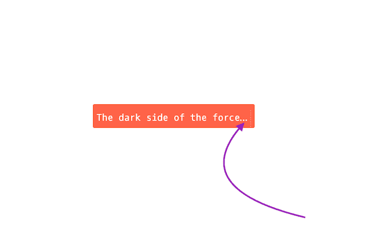

# 用 CSS 截断文本的不同方法

> 原文：<https://blog.logrocket.com/ways-truncate-text-css/>

CSS 棒极了；我们都知道。它有许多独特的功能，使我们能够在网络上实现[难以置信的响应](https://blog.logrocket.com/new-css-style-queries/)。你有没有想过你在一些热门网站上看到的省略号`(...)`是怎么产生的(如下图所示)？

那么，在本文中，我们将探索如何使用语言 [web JavaScript](https://logrocket.com/for/javascript) 在 CSS 中实现多行截断。我们走吧！



*向前跳转:*

## 什么是截断？

在 CSS 中截断文本意味着在一个句子的末尾添加一个省略号，以表明还有更多文本需要阅读。不幸的是，在使用 CSS 时，没有任何截断属性可以实时截断文本。那么，如何用 CSS 截断文本呢？

幸运的是，有一些混合的 [CSS 属性](https://blog.logrocket.com/deep-dive-css-individual-transform-properties/)来完成这项工作。值得注意的是，这些属性只有在对元素或您选择截断的单词一起使用时才起作用。

### CSS 属性

以下属性将帮助我们截断 CSS 中的文本:

*   `White-Space: nowrap;`:这个属性强制单词排成一行，不换行

*   `Overflow: hidden;`:这个属性使单词包含在它们的父容器中

*   `Text-overflow: ellipsis;`:该属性在单词末尾添加一个省略号

当我们在任何文本上一起使用这三个 CSS 属性时，我们可以创建一个单行截断。这种方法被认为是用 CSS 截断句子的传统方法。

## 如何创建多行截断

使用 CSS 属性可以很好地处理单行文本和跨越两行以上的多行文本。然而，这也可以通过使用 [JavaScript](https://blog.logrocket.com/16-useful-typescript-javascript-shorthands-know/) 来实现。

现在，我们将看看使用 CSS 或 JavaScript 进行多行截断的两种技术。这样，您可以确定哪种技术适合您。

### 用 CSS 截断多行文本

所以，让我们看看多行截断的 CSS 技术。首先要做的是设置盒子或元素本身的高度。接下来，我们计算在截断之前要忽略的行数，然后乘以`line-height`得到`max-height`。

下面是怎么做的:`Max-height: calc(line-height * the number of the line we want to ignore);`。

我们将把`Overflow`设置为`hidden`。我们还会将`max-height`设置为我们喜欢的高度，和`line-height`一样。

然后，我们将`-webkit-box-orient`设置为`vertical`、`-webkit-line-clamp`，将`text-overflow`设置为`ellipsis`。我们还会将`display`设置为`box`:

```
.paragraph {
  Overflow:hidden;
  max-height: 6rem;
  line-height: 2.5rem;
  -webkit-box-orient: vertical;
  -webkit-line-clamp: 5;
  text-overflow: ellipsis;
  display: block;
}

```

### 使用 JavaScript 进行截断

接下来，让我们看看如何使用 JavaScript 来实现这一点。首先，让我们创建一个名为`truncate`的函数，并将要截断的单词作为参数传入。我们还会给出一个`max-length Parameter`:

```
Const truncate (words, maxlength)=>{}

```

现在，我们将使用`[slice](https://blog.logrocket.com/using-javascript-at-method/#:~:text=Learn%20more%20%E2%86%92-,The%20slice()%20method,-Developers%20can%20also)`方法来截断我们的文本，并且我们还将从我们的`truncate`函数中返回截断的文本。

> 注意:我们将赋予`slice`方法一个初始值零`(0)`，因为我们将不得不从单词的开头截断到我们希望停止的指定区域:

```
Const truncate (words, maxlength)=>{
return `${words.slice(0, maxlength)} …`
}

```

接下来，对于最后一步，让我们通过将`words`和`maxlength`作为参数来完成它:

```
Const words = "You are learning text truncation with javascript which is done with these three steps" 

Const truncate (words, maxlength)=>{
return `${words.slice(0, maxlength)} …`
}

truncate(words, 20)

```

在这种情况下，`maxLength`处理我们想要截断的字符串不够长而无法被截断的特殊情况。

这里，我们希望返回原始字符串而不截断它。然而，在满足这个条件的情况下，我们想要截断并在字符串的末尾添加省略号。

## 在省略号后添加元素

在某些情况下，我发现自己想要在省略号后添加一个元素，比如一个图标。但是，当行变得太长时，元素会被省略号截断。这里的挑战是让元素停留在省略号之后。

那么，我们如何在省略号后添加元素呢？假设我们有下面的 HTML:

```
<div class="parent-box box"> 
    <div class="child-box"> 
        You are learning text truncation with javascript which is done with these three steps 
    </div> 
</div> 

<div class="parent-box box"> 
    <div class="child-box no-max-width"> 
        You are learning text truncation with javascript which is done with these three steps 
    </div> 
</div>

```

为了实现这一点，我们将 [`::after`伪元素](https://blog.logrocket.com/css-before-after-custom-animations-transitions/)设置为父元素`.box`。然后，我们用类`.child-box`设置`nest` div，并给它一个`inline-block`的显示。这允许`.parent-box`的伪元素出现在`.child-box`的宽度之后。

如果超过定义的`max-width`，那么设置为`hidden`的`overflow`开始起作用。这使得我们能够拥有`ellipsis`和`.parent-box`的元素，如果有`text-overflow`的话。

> 注意:这里的技巧是不要将伪元素声明为我们声明了`overflow`和`width`的元素。应该对父元素执行此操作，一旦达到最大宽度，父元素将在某个时候删除内容:

```
.parent-box .child-box { 
    text-overflow: ellipsis; 
    display: inline-block; 
    max-width: 70%; 
    width: auto; 
    white-space: nowrap; 
    overflow: hidden; 
} 

.parent-box .child-box.no-max-width { 
max-width: none; 
} 

.parent-box .child-box::before { 
display: none; 
} 

.parent-box .box::after { 
    content: 'X'; 
    display: inline-block; 
}

```

要了解更多关于伪元素的信息，请查看我们的[CSS 伪元素指南](https://blog.logrocket.com/css-pseudo-elements-guide/)。

## 结论

在本文中，我们回顾了如何使用几种 CSS 和 JavaScript 技术截断 CSS 中的文本。我们还研究了如何在省略号后添加元素，这在很多情况下很难实现。

我希望您喜欢这篇文章，并随时建议我可能错过的其他模式。感谢您花时间阅读这篇文章，即使它很短，并继续编码！

## 你的前端是否占用了用户的 CPU？

随着 web 前端变得越来越复杂，资源贪婪的特性对浏览器的要求越来越高。如果您对监控和跟踪生产环境中所有用户的客户端 CPU 使用、内存使用等感兴趣，

[try LogRocket](https://lp.logrocket.com/blg/css-signup)

.

[](https://lp.logrocket.com/blg/css-signup)[https://logrocket.com/signup/](https://lp.logrocket.com/blg/css-signup)

LogRocket 就像是网络和移动应用的 DVR，记录你的网络应用或网站上发生的一切。您可以汇总和报告关键的前端性能指标，重放用户会话和应用程序状态，记录网络请求，并自动显示所有错误，而不是猜测问题发生的原因。

现代化您调试 web 和移动应用的方式— [开始免费监控](https://lp.logrocket.com/blg/css-signup)。