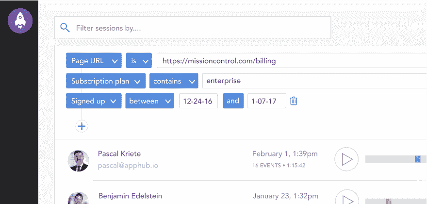
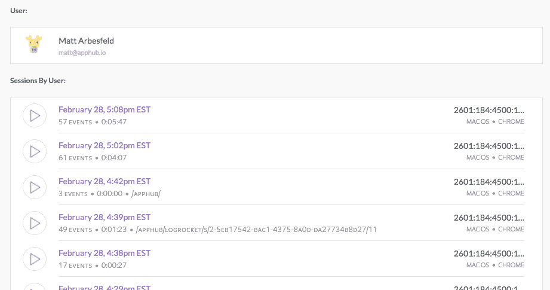

# 会话过滤器，NPM 包，用户会话

> 原文：<https://blog.logrocket.com/we-are-excited-to-announce-a-handful-of-improvements-to-logrocket-that-are-available-today-b6f90fec6c12/>

# 会话过滤器，NPM 软件包，用户会话

## 

2017 年 3 月 2 日 37 秒读 175

我们一直在努力对 LogRocket 进行一些重大改进，使其更容易找到相关的用户会话。

### 会话过滤器和搜索



希望观察包含特定错误的会话？或者试图找到从某一页开始的会话？LogRocket 现在支持一组广泛的过滤器，允许您通过各种参数(如 URL 或 Redux 操作)来限制会话。我们将在接下来的几周内推出大量改进，所以请告诉我们您想看到什么！

### NPM 套餐

```
import LogRocket from 'logrocket'
```

LogRocket 现在可以通过 NPM 安装了！这允许您将 LogRocket 片段捆绑到您的应用程序中，以便进行更干净的安装。有关升级的信息，请参见此处的文档[。](https://docs.logrocket.com/docs/upgrading-from-script-to-npm)

### 用户会话

当从支持集成访问时，您现在可以直接从应用程序中在用户会话之间跳转:



感谢您的热情和反馈！让我们知道您希望看到的下一个功能/改进🙂

## 使用 [LogRocket](https://lp.logrocket.com/blg/signup) 消除传统错误报告的干扰

[](https://lp.logrocket.com/blg/signup)

[LogRocket](https://lp.logrocket.com/blg/signup) 是一个数字体验分析解决方案，它可以保护您免受数百个假阳性错误警报的影响，只针对几个真正重要的项目。LogRocket 会告诉您应用程序中实际影响用户的最具影响力的 bug 和 UX 问题。

然后，使用具有深层技术遥测的会话重放来确切地查看用户看到了什么以及是什么导致了问题，就像你在他们身后看一样。

LogRocket 自动聚合客户端错误、JS 异常、前端性能指标和用户交互。然后 LogRocket 使用机器学习来告诉你哪些问题正在影响大多数用户，并提供你需要修复它的上下文。

关注重要的 bug—[今天就试试 LogRocket】。](https://lp.logrocket.com/blg/signup-issue-free)