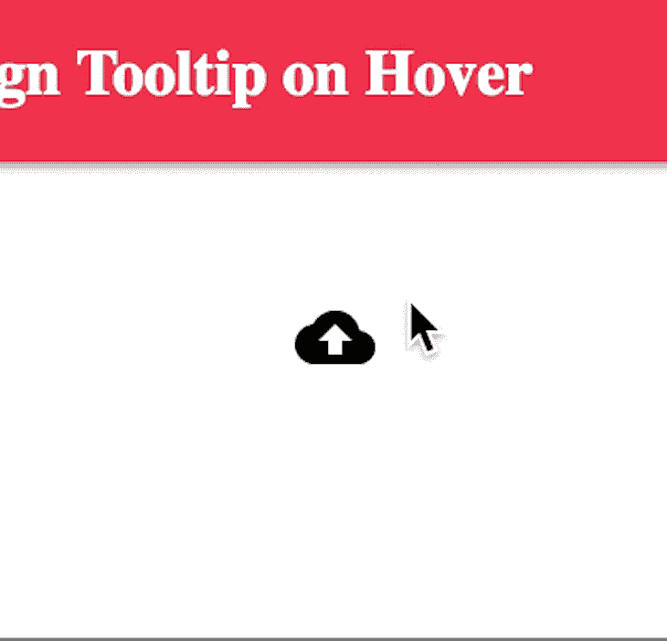
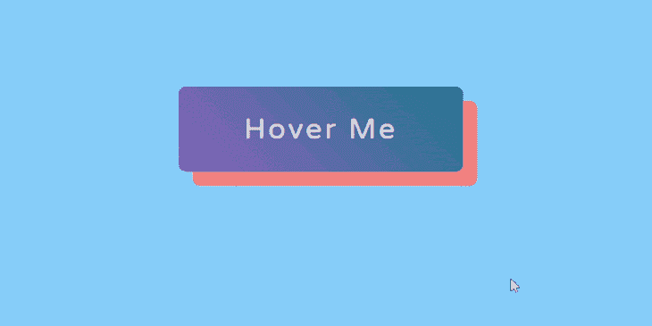
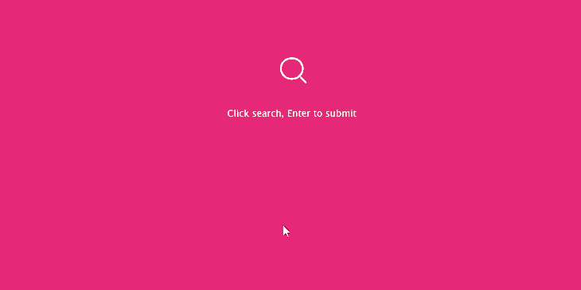
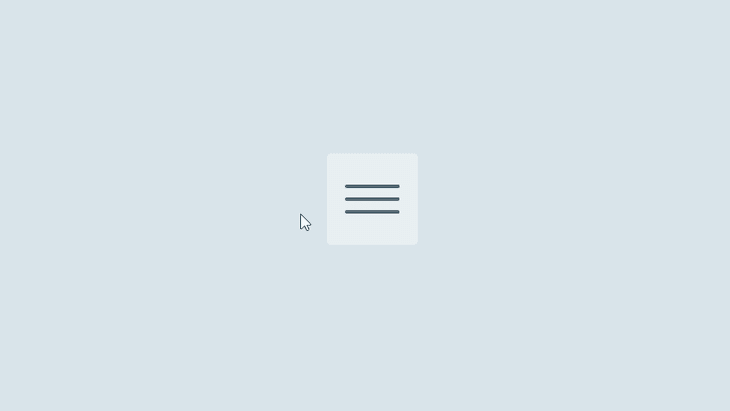
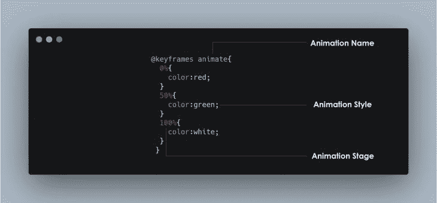

# HTML，CSS 和 JavaScript 的网页动画

> 原文：<https://blog.logrocket.com/web-animation-with-html-css-and-javascript/>

## 介绍

许多年前，网站更多地关注于向用户显示信息，而没有考虑如何创建视觉体验来使网站更加用户友好。在过去的几年里，许多事情都发生了变化:网站所有者现在正在创造视觉体验，以保持用户在他们的网站上。

开发人员发现，人类更倾向于关注移动的物体，这是因为我们对运动的自然反射。

推而广之，在你的网站或应用程序中添加动画是一种非常重要的方法，可以将用户的注意力吸引到网站的重要区域，并展示更多关于产品的信息。

> **注意**:有效的动画能够在用户和屏幕上的内容之间建立强有力的联系。

## 什么是网页动画？

网络动画基本上就是让事物在网络上移动。

网页动画对于创建引人注目的网站，实现更好的转化率，吸引用户在你的网站上点击、浏览和购物是必要的。

做得好的话，动画可以增加有价值的交互，增强用户的情感体验，给你的界面增添个性。

目前，有数百个库、工具和插件可用于创建从简单到复杂的动画。有了 CSS 动画，就没有必要使用插件来降低网站的速度，因为用 CSS 可以很容易地制作动画。

在本文中，我将向您展示一些可以用 HTML、CSS 和 JavaScript 实现的动画。

## 我可以制作什么 CSS 属性的动画？

知道怎么动画是一回事，知道动画什么是另一回事。

有些 CSS 属性是可以制作动画的，这意味着它们可以在动画和过渡中使用。

这些属性可以从一个值逐渐变为另一个值，如大小、颜色、数字、形状、百分比等

我们可以动画属性，如背景，背景色，边框颜色，过滤器，伸缩和字体。

你可以在这里得到一个你可以制作动画[的所有属性的综合列表。](https://developer.mozilla.org/en-US/docs/Web/CSS/CSS_animated_properties)

## 不同种类的动画

有许多不同种类的动画在网站中被广泛使用，在用户体验中扮演着非常重要的角色。

其中包括:

### 工具提示

工具提示是当用户悬停、聚焦或触摸某个元素时出现的文本标签。

换句话说，它是当用户与图形用户界面(GUI)中的元素交互时出现的一条简短的信息性消息。

工具提示可能包含关于其功能的简短帮助文本:



### 盘旋

hover 伪类用于在鼠标经过某个元素时为其添加特殊效果。这样，当用户将鼠标悬停在某个项目上时，它就有能力抓住用户的注意力。

这是一种显示哪些元素是可点击的有用方式。



### 装货

加载是非常必要的，因为它们有助于让用户在加载时保持娱乐。它们还会通知用户进度水平，或者离加载完成还有多长时间。


### 输入

输入动画很棒，经常与工具提示和验证结合在一起。通过输入，用户能够快速修复错误并填写缺失的字段以完成表单。



### 菜单

菜单上的动画在 UI/UX 中起着很大的作用。菜单是一种让用户感到惊奇的动画，让他们保持互动，让他们看到整个页面的所有内容。

> **注**:还有很多其他的动画比如页面过渡，视差等等。



## CSS 动画

到目前为止，我们已经看到了这么多不同种类的可以用 CSS 实现的动画，但是我还没有解释它是如何实现的。

CSS 允许我们在不使用 JavaScript 的情况下制作 HTML 元素的动画。

要使用 CSS 动画，您必须首先为动画指定一些关键帧。关键帧保存元素在特定时间将具有的样式。

为了正确理解，我将解释我们将使用的基本属性。

CSS 动画由两个基本构件组成:

### `@keyframes`

关键帧用于指示动画的开始和结束(以及开始和结束之间的任何中间步骤)。



它由三个基本要素组成:

*   **动画名称**:这只是给动画起的名字，如上图所示。
*   **动画阶段**:表示动画的阶段。多以百分比表示，如上图所示。
*   **动画风格或 CSS 属性**:这些是在动画过程中预期会改变的属性。

### 动画属性

一旦定义了`@keyframes`,必须添加动画属性才能让你的动画运行。

这主要用于定义动画应该如何发生。

动画属性被添加到要制作动画的 CSS 选择器(或元素)中。

有两个属性对于注意动画的效果非常重要。他们是`animation-name`和`animation-duration`。

还有其他属性，如:

*   `animation-timing-function`:定义动画的速度曲线或速度。您可以使用以下预定义的定时选项来指定定时:`ease`、`linear`、`ease-in`、`ease-out`、`ease-in-out`、`initial`、`inherit`。
*   `animation-delay`:该属性定义动画开始的时间。该值以秒(s)或毫秒(ms)为单位定义。
*   `animation-iteration-count`:该属性指定动画应该播放的次数。
*   这个 CSS 属性设置一个动画是应该向前播放，向后播放，还是在向前和向后播放之间来回切换。
*   `animation-fill-mode`:这个属性指定了当动画不播放时(开始之前，结束之后，或者两者都有)元素的样式。
*   `animation-play-state`:该属性指定动画是运行还是暂停。

您脑海中的下一个大问题是:当我想激活一个元素时，我必须指定所有这些属性吗？

其实没有。

我们有动画速记属性。每个动画属性都可以单独定义，但是为了代码更简洁、更快，建议您使用动画简写。

所有动画属性都按以下顺序添加到同一个 animation:属性中:

```
animation: [animation-name] [animation-duration] [animation-timing-function] 
[animation-delay] [animation-iteration-count] [animation-direction] 
[animation-fill-mode] [animation-play-state];
```

> **注意**:为了让动画正常工作，您需要遵循正确的速记顺序，并至少指定前两个值。

请看 [CodePen](https://codepen.io) 上 Olawanle Joel([@ olawanlejoel](https://codepen.io/olawanlejoel))
的笔 [简单落地](https://codepen.io/olawanlejoel/pen/LYNmBdP)。

这是一个非常简单的衬衫商店的登录页面。

我决定在衬衫上添加一个很小的动画，这样当用户访问这个链接时，它就能吸引用户的注意力。

我所做的就是应用 transform 属性并垂直平移它(上下)。你可以慢慢检查代码。

## 为什么是 JavaScript？

当您通读时，您可能会问自己为什么 JavaScript 会包含在这个主题中。你现在会明白为什么了！

那么，为什么是 JavaScript 呢？

我们利用 JavaScript 来控制 CSS 动画，用一点代码就能做得更好。

见 [CodePen](https://codepen.io) 上 Olawanle Joel([@ olawanlejoel](https://codepen.io/olawanlejoel))
用 Html、Css & Javascript 进行的 Pen [表单验证。](https://codepen.io/olawanlejoel/pen/XWdVOZy)

在上面的代码中，我创建了一个收集用户详细信息的表单，但是如果没有输入，我希望表单字段会抖动。

在 CSS 的帮助下，我可以让他们动摇:

```
@keyframes inputMove {
    0% {
        transform: translateX(5px);
    }
    25% {
        transform: translateX(-5px);
    }
    50% {
        transform: translateX(5px);
    }
    75% {
        transform: translateX(-5px);
    }
    100% {
        transform: translateX(0px);
    }
}
```

在上面的代码中，输入字段将来回移动(从左到右)5px，然后最终返回到 100%的初始位置(我们使用 CSS transform 属性来实现这一点，如上面的代码所示)。

然后，我们将动画属性添加到 CSS 选择器错误:

```
.form-control.error input {
    border: 2px solid red;
    animation-name: inputMove;
    animation-duration: .5s;
}
```

下一件事是:我如何知道这些字段是否为空，用户是否点击了提交按钮？

这就是 JavaScript 的用武之地。我们使用 JavaScript 来控制我们的动画。

**第一步**:检查表单提交按钮是否被点击。
T5 第二步:选择所有表单字段。
**第三步**:检查输入栏是否为空。
**第四步**:使用 JavaScript `classList`属性添加 CSS 选择器。你可以在这里阅读更多关于`classList`房产[的信息。](https://dev.to/olawanle_joel/manipulating-css-classes-with-classlist-dom-563g)

> **注**:我在嵌入式 codepen 中对 JavaScript 和 CSS 代码做了适当的添加注释，这样你就可以很容易地理解代码了。

一旦提交了包含所有适当信息的表单，一些气泡将开始向上滑动。这是用 CSS 动画实现的。

## 结论

这些只是你需要知道的关于网络动画的一些事情。请记住，这是一个非常广泛的话题，但我知道你看到了动画的重要性，以及为什么你应该考虑在你的项目中使用 CSS 动画。

## 通过理解上下文，更容易地调试 JavaScript 错误

调试代码总是一项单调乏味的任务。但是你越了解自己的错误，就越容易改正。

LogRocket 让你以新的独特的方式理解这些错误。我们的前端监控解决方案跟踪用户与您的 JavaScript 前端的互动，让您能够准确找出导致错误的用户行为。

[](https://lp.logrocket.com/blg/javascript-signup)

LogRocket 记录控制台日志、页面加载时间、堆栈跟踪、慢速网络请求/响应(带有标题+正文)、浏览器元数据和自定义日志。理解您的 JavaScript 代码的影响从来没有这么简单过！

[Try it for free](https://lp.logrocket.com/blg/javascript-signup)

.