# 使用 Selenium 和 Python 实现 Web 自动化

> 原文：<https://blog.logrocket.com/web-automation-selenium-python/>

大家好！👋我最近搬到了华盛顿州的雷德蒙，并试图参加一些能让我保持活跃和运动的运动。四处看了一下后，我意识到这里有一半的人都打羽毛球，所以对我来说报名当地的羽毛球学院是一个很容易的决定。

然而，在报名后，我意识到大多数球场在黄金时段(下午 4-8 点)已经被预订了。我发现球场的预约在周六上午 10 点左右开始，接下来一整周的好时段在前 15-20 分钟就被预订了。

我做了任何一个正常的程序员都会做的事情，开始思考如何自动化整个预订过程。这篇文章将向您介绍手动预订流程，并解释我是如何实现自动化的。

你可以从 GitHub 下载机器人[的源代码。](https://github.com/yasoob/nwba-booking-bot)

## **手动预约流程**

在尝试自动化任何事情之前，充分探索手动工作流总是很重要的。我们将自动化西北羽毛球学院预订系统。这是他们的预订页面。

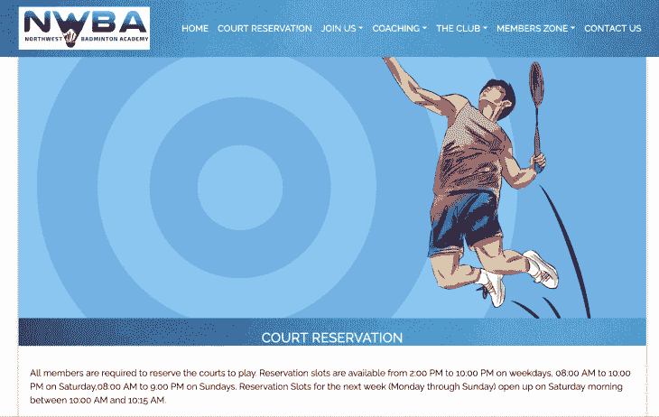

此页面列出了所有的法院预订规则。记住这些对我们来说很重要，因为它们将在我们如何自动化预订中发挥作用。重要的规则是:

1.  我们每天只能预订 1 个位置
2.  我们只能在工作日(周一至 Fri)预订 3 个座位
3.  我们可以在周六和周日每天预订一个时段

在页面底部，他们还链接到带有[完整日历](https://northwestbadmintonacademy.sites.zenplanner.com/calendar.cfm)的预订页面。点击后，您将被重定向到此页面:

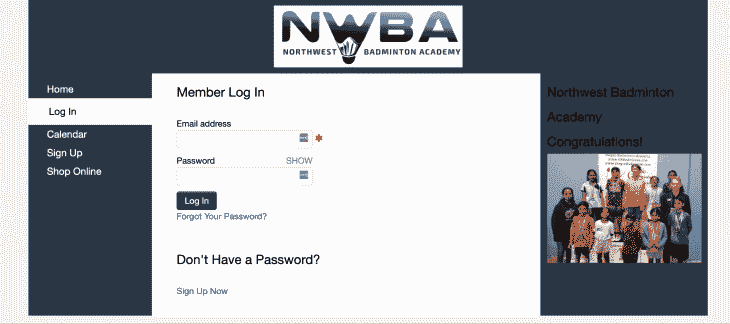

有趣的是，预订并不是由 NWBA 自己主持的。他们外包给 Zen Planner。因此，本质上，我们将自动化 Zen Planner 预订。这也意味着最终的自动化应该也适用于大多数使用 Zen Planner 的地方。

登录后，您可以进入[日历页面](https://northwestbadmintonacademy.sites.zenplanner.com/calendar.cfm):

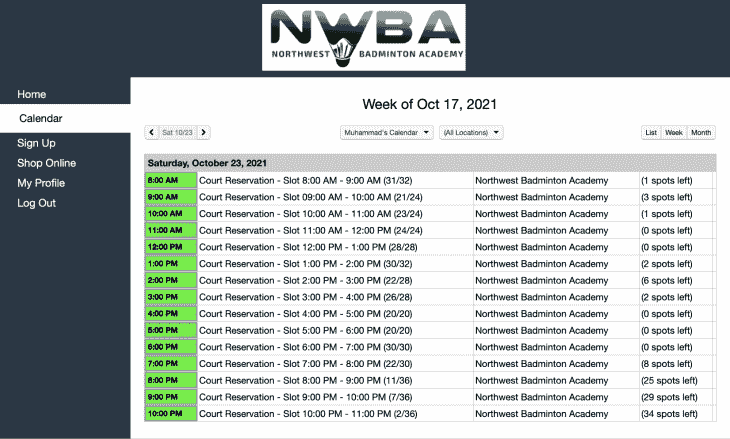

日历显示了哪些时间段是空闲的。您可以点击任何有几个开放时段的时间，它会将您带到时段预订页面:

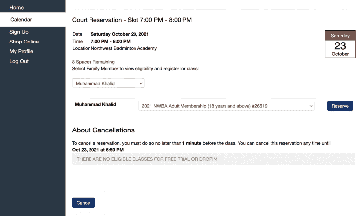

在这里，您可以点击**预订**，页面会刷新并告诉您预订成功。

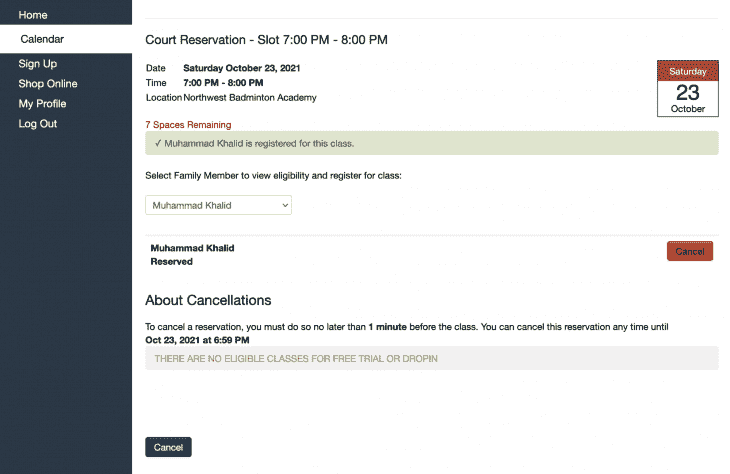

在遵守预订规则的同时，我们每周可以预订总共 5 个时段，其中 3 个在工作日，2 个在周末。

现在我们知道了手动预订流程，让我们来看看如何实现自动化。

## **准备好工具**

我们将在这个项目中使用 Python 3.9。我们将依靠 Selenium 来实现自动化。让我们首先创建一个全新的文件夹，在其中创建一个虚拟环境，并安装 Selenium:

```
$ mkdir booking_bot
$ cd booking_bot
$ python -m venv venv
$ source venv/bin/activate
$ pip install selenium

```

根据你使用的操作系统，你还需要下载相应的 Chrome 网络驱动。我们将使用 ChromeDriver 和 Selenium。你可以去[官方 ChromeDriver 网站](https://chromedriver.chromium.org/)下载你操作系统的最新稳定版。您将得到一个 zip 文件，这个 zip 文件将包含一个名为`chromedriver`的二进制文件。将这个二进制文件放在`booking_bot`文件夹中。

现在我们可以开始实际的编码了。

## **编码入门**

我通常打开 Python REPL，并在后台保持一个`app.py`文件打开。我在 REPL 中以交互方式测试新代码，然后将代码复制到`app.py`文件中。这使得迭代循环变得非常快，我不需要在每一个小的变化中不断地重新运行`app.py`代码。

我们将在这里做同样的事情。在`booking_bot`文件夹中创建一个`app.py`文件，然后在终端中运行 Python。

让我们从导入 Selenium 开始，启动一个 Chrome 实例，并在其中打开 NWBA 登录页面:

```
from selenium import webdriver

url = "https://northwestbadmintonacademy.sites.zenplanner.com/login.cfm"

browser = webdriver.Chrome(executable_path='./chromedriver')
browser.get(url)

```

根据终端中运行 Python 的文件夹以及保存`chromedriver`可执行文件的位置，可执行文件的路径可能会有所不同。相应地修改路径。

如果一切顺利，你现在应该有一个 Chrome 窗口打开，上面写着“Chrome 正由自动化测试软件控制。”

## **自动登录**

Selenium 的自动化工作方式是，我们需要告诉 Selenium 我们想要与哪些 HTML 标签交互，以及我们想要用它们做什么。自动化登录包括告诉 Selenium 页面上的哪些字段是用户名和密码字段，我们希望传递给它们什么值，然后告诉 Selenium 哪个按钮是提交按钮。

我们可以通过多种方式帮助 Selenium 找到页面上的相关标签。我们可以使用以下任何一种方法:

*   `find_element_by_id`
*   `find_element_by_name`
*   `find_element_by_xpath`
*   `find_element_by_link_text`
*   `find_element_by_partial_link_text`
*   `find_element_by_tag_name`
*   `find_element_by_class_name`
*   `find_element_by_css_selector`

你可以在这里找到这些方法[的完整文档。](https://selenium-python.readthedocs.io/locating-elements.html)

此时，我们可以在 Chrome 中打开开发者工具，检查输入字段，看看哪种方法最适合我们的需求。

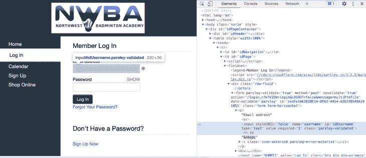

基于输入字段的 HTML 代码，我们似乎可以使用输入标签的`name`属性来惟一地标识它:

```
user_block = browser.find_element("name", "username")
pw_block = browser.find_element_by_name("password")

```

我们可以使用`send_keys`方法传入这些字段的值:

```
user_block.send_keys("your_email")
pw_block.send_keys("your_password")

```

现在我们需要在按钮中唯一地标识**日志。我将向你展示如何使用我最喜欢的方法来做到这一点。**

我们将使用 XPath。它们从未让我失望过，而且用途广泛，可以在任何地方使用。XPath 是一种用于在 XML 文档中定位节点的语言，它在 HTML 中同样适用。您需要学习一点语法，但是大多数情况下，在 Google 上快速搜索特定用例就足够了。

**登录**按钮的类型为`SUBMIT`，我们将根据该类型定位它。这方面的代码是:

```
submit_button = browser.find_element_by_xpath("//input[@type='SUBMIT']")

```

与`find_elements_by_xpath`相比，我们在这里使用`find_element_by_xpath`方法。这只返回一个元素。至于 XPath，`//`告诉 Selenium 找到输入标签，不管它在文档中嵌套得有多深。`type`告诉它只查找那些类型为`SUBMIT`的输入标签。

点击提交按钮现在就像:

```
submit_button.click()

```

如果一切顺利，这将把我们重定向到配置文件视图。

## **自动化日历交互**

我们需要弄清楚如何从个人资料视图到日历页面。谢天谢地，侧边栏中有一个方便的`Calendar`按钮。

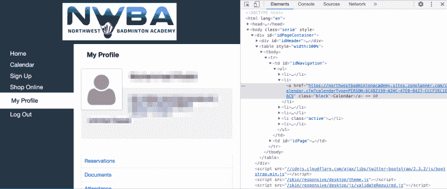

我们可以使用 XPath 以多种方式定位这个按钮。我将在这里演示其中的两个，向您展示 XPath 的强大功能。第一个是:

```
calendar_btn = browser.find_element_by_xpath("//td[@id='idNavigation']//li[2]/a")

```

*   `//td[@id='idNavigation']`返回 id 为`idNavigation`的`td`标签
*   `//li[2]`选择嵌套在`td`标签下的第二个`li`(在 XPath 中从 1 开始计数)
*   `/a`选择`li`的直接`a`子节点

第二种方法是:

```
calendar_btn = browser.find_element_by_xpath("//a[text()='Calendar']")

```

这将选择包含文本`Calendar`的 HTML 文档中的`a`标签。

您可以使用您喜欢的任何一个，并添加单击按钮的后续代码:

```
calendar_btn.click()

```

这将把我们带到日历页面。

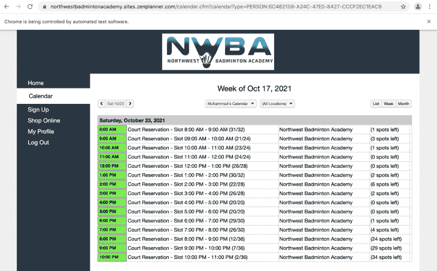

这只显示了一个日期，但是我们想要导航到我们想要的任何日期。还有两种方法可以做到这一点。我们可以单击日期旁边的箭头图标，也可以找出日期的 URL 模式，然后自己重新创建。只是为了一点挑战，我会选择后者。

继续，复制当前的网址，导航到不同的日期，比较两个网址，看看有什么变化。

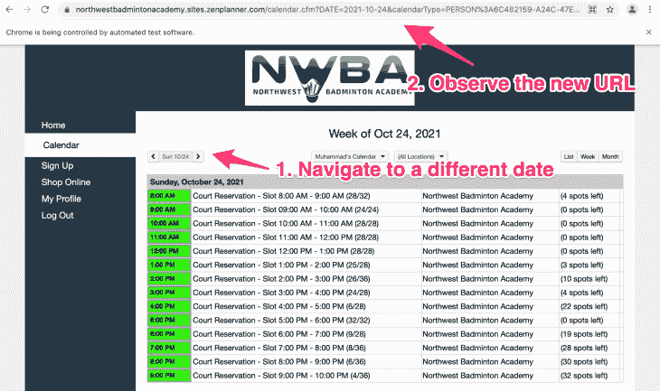

最初的 URL 是:

```
https://northwestbadmintonacademy.sites.zenplanner.com/calendar.cfm?calendarType=PERSON:6C482159-B1D5-47E0-8427-CCCF2EC1DAC9

```

新的 URL 是:

```
https://northwestbadmintonacademy.sites.zenplanner.com/calendar.cfm?DATE=2021-10-25&calendarType=PERSON:6C482159-B1D5-47E0-8427-CCCF2EC1DAC9&VIEW=LIST&PERSONID=6C482159-B1D5-47E0-8427-CCCF2EC1DAC9

```

看起来 URL 有两个动态部分。第一个是日期，第二个是一个`PERSON`标识符。我想知道我们是否可以从 HTML 文档中获得`PERSON`标识符。标识符也是初始 URL 的一部分，所以看起来日历按钮已经有了它。我们可以很容易地提取标识符:

```
user_id = calendar_btn.get_attribute('href').split('=')[-1].split(':')[-1]

```

我们已经找到了日历按钮。我们只需要那个标签的 HREF 属性，Selenium 使得从标签中提取属性变得非常容易。

我们不需要整个 HREF，所以我们在`=`分了它:

```
['https://northwestbadmintonacademy.sites.zenplanner.com/calendar.cfm?calendarType', 'PERSON:6C482159-B1D5-47E0-8427-CCCF2EC1DAC9']

```

然后我们取后一半，在`:`处分割，并从返回列表中取最后一个元素:

```
['PERSON', '6C482159-B1D5-47E0-8427-CCCF2EC1DAC9']

```

现在，我们可以自己重新创建具体的日期 URL:

```
query_date = "2021-10-24"
calendar_date_link = f"https://northwestbadmintonacademy.sites.zenplanner.com/calendar.cfm?DATE={query_date}&calendarType=PERSON:{user_id}&VIEW=LIST&PERSONID={user_id}"

```

现在，让我们创建一个单独的方法来返回接下来的 7 个日期:

```
import datetime

def next_7_dates():
    today = datetime.datetime.today()
    date_list = []
    for x in range(0,7):
        new_date = today + datetime.timedelta(days=x)
        date_list.append(new_date.strftime('%Y-%m-%d'))
    return date_list

```

我们使用`[datetime](https://docs.python.org/3/library/datetime.html)`库获取今天的日期，然后使用`timedelta`向其中添加更多的天数，最后使用`strftime`从其中提取年(`%Y`)、月(`%m`)和日(`%d`)。

现在让我们来看看日历本身。我们可以点击任何有几个空位的绿色日期，然后进入最终预订页面:

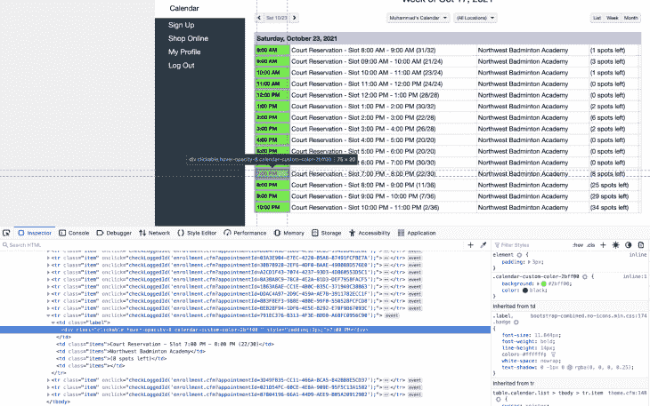

我通常更喜欢在下午 6 点玩，所以我们可以添加一些逻辑，让我们的自动化机器人查看可用时间，并计算出我们最喜欢的时间是否可用。如果不可用，它将转到下一页。这很容易编码:

```
booking_link = browser.find_element_by_xpath("//div[text()='6:00 PM']")
full = 'sessionFull' in booking_link.get_attribute('class')
if not full:
    booking_link.click()

```

我们正在利用我们已经学过的积木。我们定位到将我们需要的时间作为`text`的`div`标签。然后我们通过`div`标签上的`sessionFull`类检查是否有可用的插槽。如果时间段没有满，我们点击预订链接。

## **最终预订自动化**

单击其中一个时间段链接后，我们现在应该会被重定向到最终的预订页面。在这里，我们只需点击`Reserve`按钮，然后确认我们已预订。

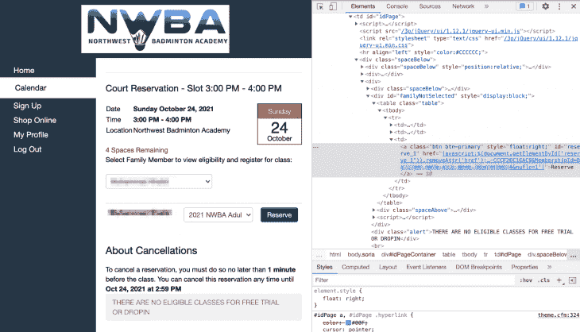

我们可以使用以下代码点击`Reservation`按钮:

```
browser.find_element_by_xpath("//a[text()='Reserve']").click()

```

之后，页面应该会刷新，您应该会看到以下确认屏幕:


我们可以检查`Reserved` div 的存在，以确认我们的预订顺利通过:

```
reserved = "Reserved" in browser.find_element_by_xpath("//div[@class='bold green']").text

```

现在我们有了所有需要的部分，我们只需要把它们放到我们的`app.py`文件中，并给它们一些结构。

## **最终代码**

最终的代码看起来像这样:

```
import datetime
from selenium import webdriver
from selenium.webdriver.support import expected_conditions
from selenium.webdriver.support.ui import WebDriverWait
from selenium.webdriver.common.by import By

def next_7_dates():
    today = datetime.datetime.today()
    date_list = []
    for x in range(0,7):
        new_date = today + datetime.timedelta(days=x)
        date_list.append(new_date.strftime('%Y-%m-%d'))
    return date_list

def login(browser):
    print("[+] Logging in.")
    browser.find_element("name", "username").send_keys("your_email")
    browser.find_element("name", "password").send_keys("your_password")
    browser.find_element("xpath", "//input[@type='SUBMIT']").click()

def reserve_time(browser, favorite_times):
    for fav_time in favorite_times:
        booking_link = browser.find_element("xpath", f"//div[text()='{fav_time}']")
        full = 'sessionFull' in booking_link.get_attribute('class')
        if not full:
            booking_link.click()
        else:
            continue
        browser.find_element("xpath", "//a[text()='Reserve']").click()
        reserved = "Reserved" in browser.find_element("xpath", "//div[@class='bold green']").text
        if reserved:
            return True, fav_time
    return False, None

def main():
    browser = webdriver.Chrome(executable_path=r'/usr/local/bin/chromedriver')
    url = "https://northwestbadmintonacademy.sites.zenplanner.com/login.cfm"
    browser.get(url)

    login(browser)

    timeout_secs = 20
    calendar_btn = WebDriverWait(browser, timeout_secs)\
                        .until(expected_conditions.presence_of_element_located((By.XPATH, "//td[@id='idNavigation']//li[2]//a")))
    user_id = calendar_btn.get_attribute('href').split('=')[-1].split(':')[-1]
    calendar_btn.click()

    favorite_times = ["5:00 PM", "6:00 PM"]
    booked_details = []
    for count, date in enumerate(next_7_dates()):
        if len(booked_details) == 3 and count <= 5:
            print(f"[+] Already booked 3 weekdays. Skipping {date}")
            continue
        print(f"[+] Trying to look for timeslots on {date}")
        calendar_date_link = (f"https://northwestbadmintonacademy.sites.zenplanner.com/calendar.cfm?"
            f"DATE={date}&calendarType=PERSON:{user_id}&VIEW=LIST&PERSONID={user_id}")
        browser.get(calendar_date_link)
        reserved, reservation_time = reserve_time(browser, favorite_times)
        if reserved:
            booked_details.append((date, reservation_time))

    print("[+] I was able to successfully reserve the following date/times:")
    for date, reservation_time in booked_details:
        print(f"\t{date}: {reservation_time}")

if __name__ == "__main__":
    main()

```

代码分为四个功能，其中大部分都是不言自明的。

然而，这里有一些我们在上面没有讨论的东西。在运行最终的`app.py`时，我发现`find_element_by_*`方法已被弃用，我应该使用`find_element`方法。

此外，我在 HTML 中定位日历按钮时遇到了`StaleElementReferenceException`。[这个 StackOverflow 的回答](https://stackoverflow.com/a/44914767)对这个异常给出了非常好的解释，也给出了解决方案。发生的情况是，当浏览器仍在完成登录过程时，我们正在定位日历按钮，当我们试图访问日历按钮时，它就变得陈旧了。

为了克服这个问题，在登录过程已经开始之后，我们必须等待 calendar 元素出现在页面上。这样，Selenium 会等待进程完成，并确保日历按钮在我们尝试访问它之前不会变得陈旧。

这方面的代码是:

```
from selenium.webdriver.support import expected_conditions
from selenium.webdriver.support.ui import WebDriverWait
from selenium.webdriver.common.by import By

# ....

calendar_btn = WebDriverWait(browser, timeout_secs)\
                        .until(expected_conditions.presence_of_element_located((By.XPATH, "//td[@id='idNavigation']//li[2]//a")))

```

Selenium 一直等到预期的条件变为真，然后才继续执行其余的代码。

我们也可以通过添加一个显式的`time.sleep(10)`来解决这个问题，但是这样做的问题是元素可能会在十秒钟之前变得可用，但是在整个十秒钟过去之前我们将无法做任何事情。

至于代码流，我们从 main 方法开始执行。它会创建浏览器窗口并让我们登录。然后，它在接下来的七天中循环，每天它都试图预定我们最喜欢的时间。在预订了一天的一个时间段后，它会转移到第二天，并跳过当天任何其他可用的时间段。在进入第二天之前，它还验证了我们在进入下一个工作日之前没有预订超过三个工作日。最后，它打印它能够预订的插槽。

您可能需要更改这段代码中的两个细节。一个是用户名和密码值，另一个是`favorite_times`列表。

现在，只要预订开始，您就可以在周六早上运行这个脚本，您应该有希望能够抢到一些好的时间段。

## **结论**

这是一个有趣的项目，探索了一些关于硒的知识，我希望你能从中学到一些新的东西。我喜欢给人们留下一些关于如何进一步开发辅导项目的提示。有很多方法可以改善这一点，我想到的一些方法是:

1.  让 Chrome 以无头模式运行，这样屏幕上就不会打开任何窗口
2.  让它在周六自动运行，这样你甚至不用醒来(查看 crontab 或[预定的 GitHub 动作](https://yasoob.me/posts/github-actions-web-scraper-schedule-tutorial/)
3.  添加更好的错误处理，可能会产生多个 Selenium 进程，这样就可以并行检查多天

可能性是无限的！我希望你喜欢这个教程。你可以从 GitHub 下载机器人[的完整源代码。如果你喜欢这篇文章，你可以在](https://github.com/yasoob/nwba-booking-bot)[我的博客](https://yasoob.me)上读到类似有趣的内容。回头见！