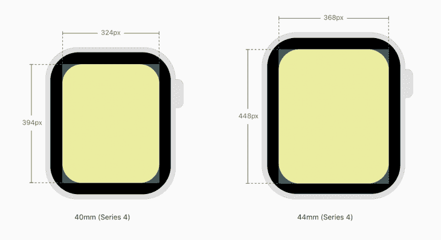
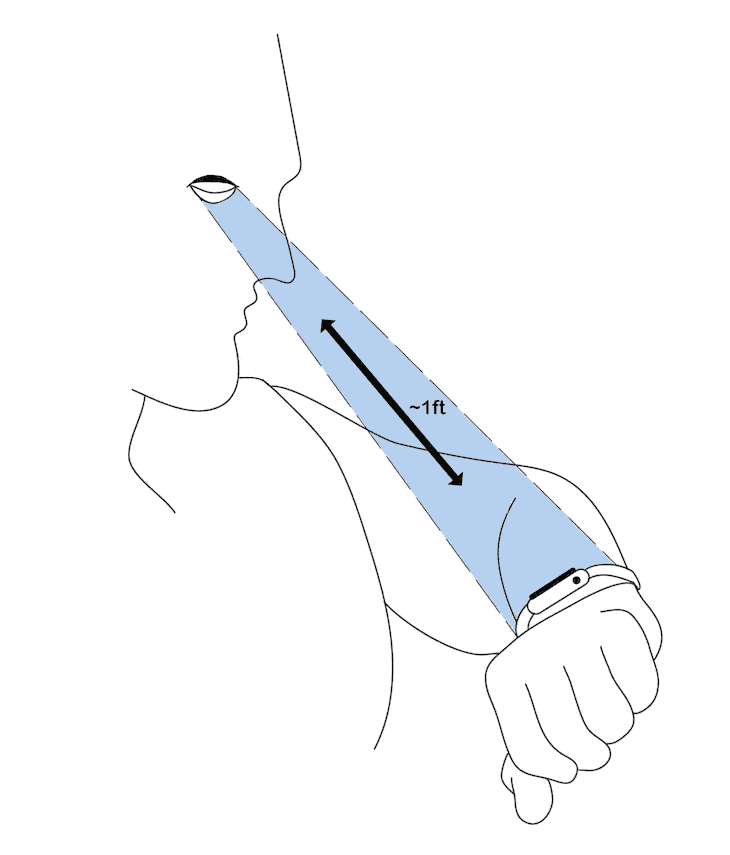

# 苹果手表的网页设计

> 原文：<https://blog.logrocket.com/web-design-for-apple-watch-toucaan-css/>

这是我为 LogRocket 写的第一篇文章，也是我关于 Toucaan CSS 的系列文章的第三篇，Toucaan CSS 是一种面向 2020 年及以后的 web 应用程序的可变设计系统。我希望你会觉得它很有趣，并帮助我与你有见地的评论，以建立一个更好的系统。

## 快速回顾一下

在[的第一篇文章](https://bubblin.io/blog/toucaan-introduction)中，我们介绍了 Toucaan Switch 媒体查询(TSMQ)，它允许我们根据设备方向隔离我们的 web 设计。方向测试只是“环境决定”的第一个层次，我们打算为这个层次做网页设计，事先了解它有助于我们独立地、确定地为每个初始渲染状态选择正确的布局模型。

在[的第二篇文章](https://bubblin.io/blog/baseline-css)中，我们继续为本质上可伸缩的 web 应用程序开发了一种全新的基线重置和块范围排版。内在的网页设计和反应式网页设计略有不同，但是我们会在后面的文章中讨论。

## “先看手表”而不是先看手机

很有可能，你现有的网络应用程序或网站已经是移动友好的，反应灵敏的了。好消息！苹果将在 Apple Watch 上正确地渲染它，将它缩小 0.49 倍，以避免水平滚动。

苹果这样做是为了让你的移动内容适应这种新的外形。它在很大程度上是可行的，但坦率地说，即使是移动用户界面在手表上也太复杂了。该设备的物理尺寸只有大约一英寸，如果能让手表用户[通过 WebKit](https://developer.apple.com/documentation/webkit) 查看你的页面获得更好的体验——一个本质上属于手表的界面，那会好得多。

在这篇文章中，我们将了解如何使用 Toucaan Switch 媒体查询来组织我们的 CSS，并为 Apple Watch Series 5 设计一个实用且易于访问的网页。然后，我们可以在我们的用户界面上向上发展，例如，分别为手机、平板电脑、桌面、电视等开发设计。，按此顺序。

首先，Toucaan 交换机媒体查询如下所示:

```
/* Portrait ⇋ landscape Toucaan Switch Media Query. */

@import url('path/to/css/app/portrait/portrait.css') only screen and (orientation: portrait);

@import url('path/to/css/app/landscape/landscape.css') only screen and (orientation: landscape);

@media only screen and (orientation: portrait) {
    :root {
        --bu: calc(100vw/100); /* Base Unit (bu) for the device. */
    }
}

@media only screen and (orientation: landscape) {
    :root {
        --bu: calc(100vh/100);
    }
}

/* Other resets and variables go below */
```

在上面的代码中，两个外部 CSS 文件(`portrait.css`或`landscape.css`)通过 switch 语句导入，但是根据浏览器的方向，我们的应用程序只获取这两个文件中的一个。

如果用户在手表或智能手机上打开网站，他们只能看到我们应用布局的`portrait.css`部分。类似地，如果用户在桌面上打开站点，他们只能看到应用程序布局的横向部分。交付给客户端的 CSS 数量总是与浏览器窗口的上下文相关。

注意，我们使用标准的异步`@import`调用来请求 CSS，而不是 SCSS！

由于横向模式总是与纵向模式正交，我们的应用程序没有理由在网络上的每个设备和客户端上提供两倍的代码量。同样，由于 Apple Watch Series 5 上的 WebKit 仅在纵向模式下呈现页面，我们将仅在`portrait.css`上编写所有 CSS 代码。我们不必担心网站在其他屏幕更大、分辨率更高或处于横向模式的客户端上会如何出现或表现。

```
/* vi path/to/css/app/portrait/portrait.css */

/* Notice the use of `in` (inches) in the media query below
instead of pixels. Physical size of the watch is too small
to arrive at a correct layout using pixels. Hardcoding pixel
values on @media-query breakpoints is an antipattern that
should be avoided. */

/* Read more at https://bubblin.io/blog/toucaan-introduction */

@media only screen and (max-width: 2in) {
  body{
    /*  All the style for smart watch or really
          tiny mobile screens goes in here. */
  }
}

@media only screen and (min-width: 2.000000000001in) and (max-width: 4in) {
  body{
    /* Smartphones and phablets in portrait mode.*/
  }
}

@media only screen and (min-width: 4.000000000001in) and (max-width: 8in) {
  body{
    /* Tablets and pro tablets in portrait mode.*/
  }
}

/* and so on…*/
```

是厨房水槽文件，我们可以用它将我们的应用程序 UI 从苹果的 watchOS 扩展到 LG 的 webOS 以及两者之间的任何东西——特别是在纵向模式下。屏幕的大小和类型以可用空间的物理英寸为目标，并与使用案例、细分市场或受众相匹配。这是一个很好的方法，只封装掉一类特定设备上需要的 CSS。

接下来让我们为 WatchOS 做第一次封装。

## 苹果手表的微优化

在我看来，TSMQ 是一种组织所有应用 CSS 的非常干净和模块化的方法。它没有限制我们遵循 10 年前的设计模式，那时网络是一个非常不同的地方，但它使我们有可能使用最适合我们的应用程序的设计模式。因此，一个变异的 CSS 框架。

在许多方面，TSMQ 就像 CSS 的“微服务管理器”,它根据用户设备(即渲染环境)的方向、物理大小、空间和分辨率为特定的视口提供布局。

因为我喜欢把我所有的特定于环境的风格放在一个地方，所以我们将创建`watch.css`来存放我们所有的特定于手表的风格。像这样导入到`portrait.css`中:

```
/* vi path/to/css/app/portrait/portrait.css */

/*  All watch specific styles goes inside watch.css. */
@import url('path/to/css/app/portrait/watch.css') only screen and (max-width: 2in);

@media only screen and (min-width: 2.000000000001in) and (max-width: 4in) {
  body{
    /* Smartphones and phablets in portrait mode.*/
  }
}

@media only screen and (min-width: 4.000000000001in) and (max-width: 8in) {
  body{
    /* Tablets and desktops in portrait mode…*/
  }
}
/* and so on… */
```

## 关于 Apple Watch 设计的一些提示和注意事项

关于为网络上最小的外形设计，有一些重要的事情需要注意。

### 1.极端简约主义

为 Apple Watch 设计网页(或应用程序)的第一件事情是，它是通过一个像样的浏览器连接到网络的最小的屏幕。尽管 Apple Watch 的分辨率在绝对像素上与手机相似，但例如一款小巧的 Apple Watch 只有 40 毫米大小——对角线大约为 1.57 英寸。

因此，在为手表设计时，要运用极端简约主义。更一般地说:

*   避免一次在屏幕上显示太多信息
*   创建可视分组来帮助用户找到他们想要的信息
*   使用屏幕的整个宽度
*   尽可能使用带有圆形提示的菜单来代替按钮
*   避免在界面上使用并排控件
*   如果文本过多，将内容和 HTML 元素左对齐

### 2.仅纵向模式

Apple Watch 显示屏只有在纵向模式下才会亮起，但这种情况在未来可能会改变，手表也可能会在横向模式下显示内容。这不是问题，因为我们有 TSMQ 来轻松处理这种情况。我们的 Toucaan 交换机媒体查询面向未来—耶！



The real estate on an Apple Watch in portrait orientation. The dimensions are the same for the Apple Watch Series 5.

### 3.像素不再缩放

小型 Apple Watch 的分辨率为 324 x 394px。它的分辨率与第一代 iPhones 差不多，但不要搞错了:在 Apple Watch 上使用像素这种老式的放大方式不会产生最佳效果。

如果不小心执行，几乎所有的用户界面都会变得很小，几乎不可访问。我们不能忽视一个事实，即手表上的可视区域只有大约 1.18 x 1.25 英寸，基于像素的用户界面在这个水平上无法正常缩放。

实际上，由于 Apple Watch Series 5 的圆角以及观看距离和观看角度很容易使内容变得模糊，Apple Watch 上的发光区域甚至小于 34 x 40mm 毫米。

### 4.观看距离短，注意力持续时间短

Apple Watch 的观看距离大约是 7-12 英寸，取决于用户的偏好。相比之下，智能手机通常在一英尺半以外观看。



General viewing distance of an Apple Watch.

一般来说，你要优化较短的观看距离和较短的注意力持续时间。使用大字体向用户展示最小的功能集。如果你的页面有大量的文字，即使是大小合适的字体，也允许用户缩放。

### 5\. No web fonts

避免使用谷歌字体或任何类型的托管排版。Toucaan 建议在大多数网络应用程序中使用系统字体。在 Apple Watch 上，这个提示变得相当强制性。

```
/* Use system fonts. */
body {
    font-family: system-ui, -apple-system, BlinkMacSystemFont, Segoe UI, Roboto, Oxygen, Ubuntu, Cantarell, Droid Sans, Helvetica Neue, Fira Sans, sans-serif!important;
}
```

有趣的是，Apple [推荐](https://developer.apple.com/design/human-interface-guidelines/watchos/visual-design/display-sizes/)使用相对大小和动态类型来确保项目自然扩展或收缩以适应可用空间。这很棒，因为我们在 Toucaan 上用[块范围排版](https://bubblin.io/blog/baseline-css)做到了这一点！

### 6.添加 WatchOS meta 标记

要控制您的网站在 Apple Watch 上的显示方式，请在您的页面顶部添加以下 meta 标签:

```
<meta name="disabled-adaptations" content="watch">
```

WebKit 现在知道它不需要缩小你的内容，它会按照你的指示渲染页面。

总的来说，苹果推荐给你的内容和你手机上的一样，不管显示屏大小如何——这正是在响应式网页设计概念出现之前，移动网页最初的规模。这在很大程度上是可行的，但远非理想，因为即使是手机用户界面在手表上也可能相当复杂。

除非你的应用程序是专门为手表设计的，否则苹果会自动将你的移动布局缩小 0.49 倍，以适应内容的原样，无需水平滚动或重排。

### 7.没有服务人员

没有 PWA，所以 Apple Watch 上没有离线优先的增强功能——目前还没有。事实上，您可能也想尽量减少 JavaScript 代码。最近，我开始完全避免 React 和 Vue.js 生态系统，以减少我的网络应用程序上的 JavaScript 污染。但是也有一些好消息。

苹果在他们的 WatchOS 文档中提到 webkit“目前不支持服务人员。”这可能意味着这款手表将来可能会支持离线优先的网络应用。手指交叉，但就目前而言，使用维修人员对 series 5 Apple Watch 进行渐进增强是不可能的。

### 8.无在线视频播放

Apple watch 目前不支持视频。

### 9.处理图像

在整个屏幕宽度上使用单个自动缩放图像。同一个图像的多个版本将需要更多的空间，这通常不建议在手表上使用。

```

```

### 10.表单处理和可访问性

除非绝对必要，否则避免通过 watch 界面提交表单。但是，如果您必须了解，有些表单元素已经针对手表进行了优化，这取决于您使用这些新的、特定类型的表单类型控件来利用这些字段。

Apple Watch 支持数字(`type="tel"`)、日期(`type="date"`)和选择(`<select>`)类型，使用这些 ARIA 标签将通知 WebKit 为用户提供正确的界面。

正如手表小巧外形所预期的那样，表单控件让您在每次输入时进入全屏模式。这意味着正确标记表单元素并为字段附加适当的 ARIA 角色非常重要，以便用户在填写表单时知道他们在做什么。

适当的时候用菜单代替按钮。菜单提供了一个专门的地方来列出动作，您可以通过删除按钮并用菜单替换它们来释放 UI 上的空间。在大多数情况下，选择极端简约主义。

## 结论

现在你对 Apple Watch 有了更好的了解，你可以在 Apple Watch 上为你的用户设计一个更好看的页面。去争取吧，因为有了这额外的一英里和一个自然属于手表的酷设计，你的用户只会为此感谢你！

欢迎在 [Twitter](https://twitter.com/marvindanig) 或 [GitHub](https://github.com/marvindanig) 上关注我，感谢了不起的 [Somya Garg](https://bubblin.io/somyagarg-somya-garg) 帮助我在苹果手表的观看距离上制作艺术品。

## 你的前端是否占用了用户的 CPU？

随着 web 前端变得越来越复杂，资源贪婪的特性对浏览器的要求越来越高。如果您对监控和跟踪生产环境中所有用户的客户端 CPU 使用情况、内存使用情况等感兴趣，

[try LogRocket](https://lp.logrocket.com/blg/css-signup)

.

[](https://lp.logrocket.com/blg/css-signup)[https://logrocket.com/signup/](https://lp.logrocket.com/blg/css-signup)

LogRocket 就像是网络和移动应用的 DVR，记录你的网络应用或网站上发生的一切。您可以汇总和报告关键的前端性能指标，重放用户会话和应用程序状态，记录网络请求，并自动显示所有错误，而不是猜测问题发生的原因。

现代化您调试 web 和移动应用的方式— [开始免费监控](https://lp.logrocket.com/blg/css-signup)。