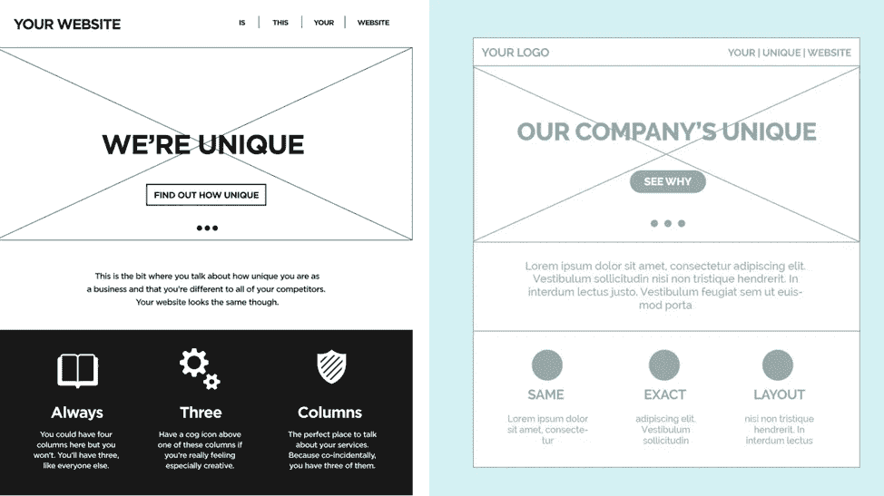
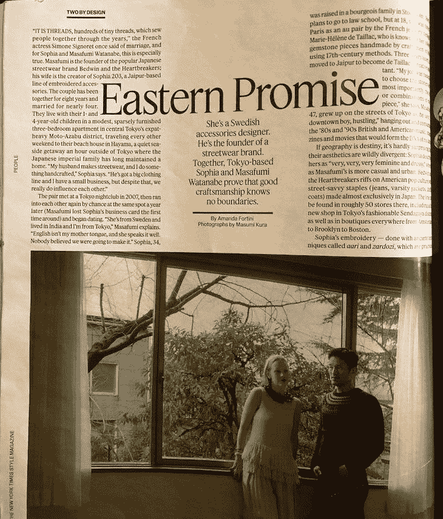
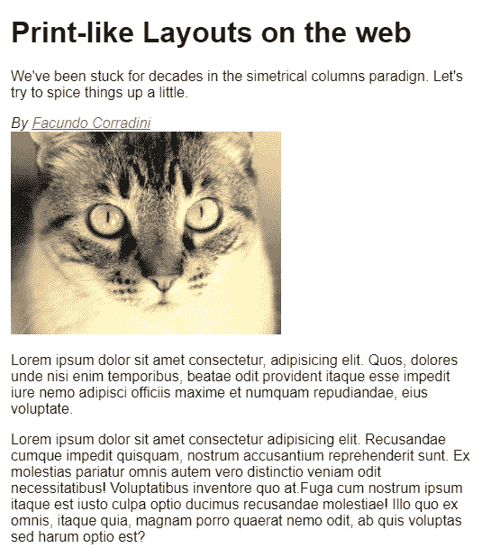
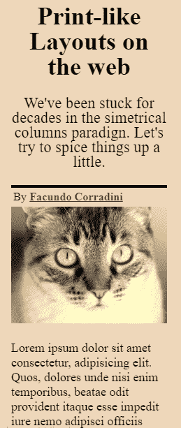
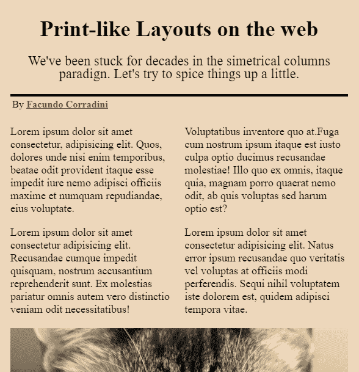
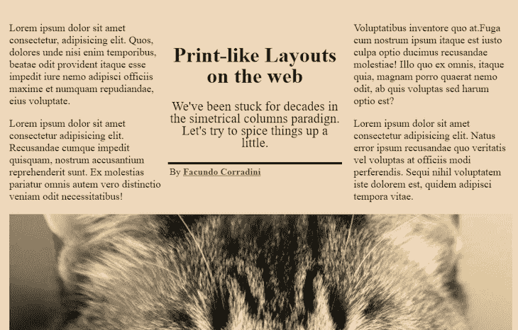
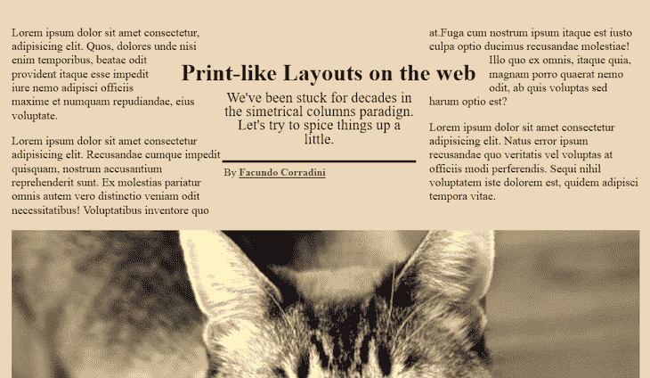

# 网络布局就像 2020 年的博客

> 原文：<https://blog.logrocket.com/web-layouts-like-its-2020/>

如果你觉得设计师和开发者来自不同的世界，你应该看看 10 年或 20 年前是什么样子。在互联网的早期，我们在建立网站的同时试图弄清楚网站是什么以及它应该如何工作。

来自印刷背景的设计师习惯了已知尺寸画布的特征(和限制)，并试图在本质上设计为*而不是*的媒介中复制它们。开发人员正在与早期 CSS 极其有限的功能进行激烈的斗争，试图在彼此完全不同的浏览器中实现这些设计。

在所有这一切当中，用户得到的是一种很难访问、很难使用、很不美观的网络体验。

随着时间的推移，我们同意了一个核心规则集，该规则集基于对称列的概念，如 [960.gs](https://960.gs/) ，后来在许多流行的框架中实现，包括 Bootstrap。这简化了流程，提供了一种通用的*语言*，让设计者、开发者和用户感到舒适。

但是我确信我不是唯一一个感到网页布局从此停滞不前的人。我们都见过那些“所有网站看起来都一样”的模仿，以至于所有的模仿看起来都一样了。



CSS 自早期以来已经走过了漫长的道路，开发周期在过去几年中大大加快。最后，web 布局不再是一个黑客了(浮动最初只是为了让文本在图像周围浮动)。

我们拥有 multicol、flex 和 grid，让我们获得了前所未有的自由度。我们终于可以打破那种对称的列范式，使用各种各样的[效果](https://blog.logrocket.com/new-in-chrome-76/)和我们做梦也想不到的功能。我们已经不是 21 世纪初了。

新的规范允许我们构建几年前因为不可用或缺乏响应性而被丢弃的布局。所以我认为是时候重新审视这些概念了。也许我们可以以一种适应未知的网络画布的方式，带回一些类似印刷的布局。

今年早些时候，Jenn Simmons 发布了这些杂志布局作为灵感，想知道它们如何能为网络服务。我继续将它们转化为代码，这样我们就可以探索构建一个与众不同的 web 布局的核心概念。以下是如何构建像 2020 年一样的网页布局。

> 不工作。不工作。今天是星期天。在咖啡店放松一下。随意看杂志。啊…哦，等等，我们能在 CSS 中这样做吗？受此启发的演示能让我走多远？天哪，我们需要实现/改进排除规范。注册-停止工作！！但是我们来做演示吧！

## 思维敏捷，渐进式布局

根据定义，为网络设计就是为未知的画布设计。人们可以从各种尺寸完全不同的设备上，通过各种浏览器访问网络——从微型移动设备甚至手表到巨大的 4K 智能电视，更不用说各种甚至不是基于图形显示的替代方法了。

因此，将杂志版式转换为网络版的第一个挑战是考虑如何适应任何访问它的设备。这种方法不再有效的界限在哪里？替代方案应该是什么样的？浏览器在实现时会遇到哪些技术限制？

考虑到这种布局，我确定了具有挑战性的部分。



1.  多栏布局可以在更宽的设备上工作，但它肯定不适用于较小的屏幕尺寸。
2.  大多数浏览器不知道如何处理带有“中心浮动”的标题本身。
3.  专栏之间的介绍段落可能有些棘手

幸运的是，如果我们从一开始就考虑一个渐进的增强方法，这个解决方案就很好地解决了。我们可以将所有不同的层视为渐进增强:通过使用媒体查询从不同视口大小的布局，通过功能查询以安全的方式添加新功能，甚至添加可访问性好东西，如[偏好-减少运动](https://blog.logrocket.com/new-in-chrome-74-prefers-reduced-motion-media-query-50cd89d3e769/)或[黑暗模式和偏好-配色方案](https://blog.logrocket.com/whats-new-in-firefox-67-prefers-color-scheme-and-more-195be81df03f/)。每一层都可以覆盖上一层，为给定的设备创造最佳的用户体验。

就我个人而言，我喜欢从网站在完全不加载 CSS 的情况下应该是什么样子开始。这意味着只按合理的顺序使用语义标记。这将确保 web 是可用的，即使我们把它一直剥离到浏览器的默认样式。

```
<article class="print-like">
  <header class="intro">
    <h1 class="title">Print-like Layouts on the web</h1>
    <p class="summary">We've been stuck for decades in the simetrical columns paradign. Let's try to spice things up a little.</p>
    <address class="author">By <a rel="author" href="https://twitter.com/fcorradini">Facundo Corradini</a><br/>
    </address>
  </header>
  
  <section class="main-text">
    <p>...</p>
    <p>...</p>
    <p>...</p>
  </section>  
</article>
```



Even without any CSS, the document structure ensures the browser provides a somewhat usable default.

逻辑顺序的语义标记意味着我们可以去掉顶部的标题、介绍、段落，然后逐步增强更宽屏幕和不同功能的布局。

最好的一点是，移动布局通常与浏览器默认布局没有太大区别。当然，我们在排版、间距等方面投入了大量精力，但除了传统的块状布局(元素一个接一个地流动)之外，移动内容很少出现在任何格式中。



A little bit of styling provides a decent layout for small mobile devices.

然后我们可以考虑稍微大一点的屏幕尺寸。如果视窗足够宽，可以容纳两列，但是不够宽，不能容纳整个布局，该怎么办？

将标题和简介放在首位是有意义的，但是要将段落分成两列，宽度可变，根据需要增长。

在媒体查询中，只需将文本容器转换为多列布局即可。

```
@media screen and (min-width: 600px){
  .print-like{
    display: grid;
  }
  .main-image{
    grid-row: 3/4;    
  }
  .main-text{
    column-count: 2;
  }
  .main-text :first-child{
    margin-top:0;
  }
  .main-text :last-child{
    margin-bottom: 0;
  }
}
```



Multicolumn + CSS grid to move the image to the bottom.

当视口变得足够大，可以容纳所有列(包括中间的容器)时，我们可以使用 column-gap 属性清除中间的空间，用于标题和简介，然后在容器中用一个简单的网格声明放置元素。虽然最初的设计是基于三等分的，但我选择保持中间的列为固定宽度，让旁边的列适应容器，这只是一个实验，看看当我们打破对称列范式时会发生什么。

```
@media screen and (min-width: 900px){
  .print-like{
    grid-template-columns: 1fr 300px 1fr;
    align-items: center;
  }
  .intro{
    grid-row:1;
    grid-column: 2/3;
    max-width: 0px;
  }
  .main-text{
    column-gap: 310px;
    grid-row: 1;
    grid-column: 1/4;
  }
  .main-image{
    grid-column: 1 / -1;
    margin: 0 auto;
  }
}
```



A CSS grid declaration allows us to position the title and intro in the space cleared by the grid-gap.

最后一点——也是布局的关键——是环绕标题的文字。不幸的是，我们需要使用 CSS 排除来创造这种效果，因为没有所谓的`float: center`。这意味着只有 IE11 和 Edge 会提供那种体验，这是相当讽刺的。但是其他浏览器仍然提供了完美可用的布局，当他们最终决定实现该特性时，代码很可能会工作(如果规范发生变化，可能会进行一些小的调整)。

```
@media screen and (min-width: 900px){
  @supports (-ms-wrap-flow: both){
    .title{
      -ms-wrap-flow: both; /* CSS exclusions! */
      position: absolute;
      right: 25%;
      padding: 10px 20px;
    }
  }
}
```



Visualization in a browser that supports grid, multicol, and exclusions (MS Edge).

对于所有这些层，最终布局将如下所示:

在 [CodePen](https://codepen.io) 上看到法库多·科拉迪尼([@法库多科拉迪尼](https://codepen.io/facundocorradini) )
的的笔 [在网页上打印般的布局。](https://codepen.io/facundocorradini/pen/abzozVe)

结论

## 让我们明确一点:我并不是说当前的模式是错误的，也绝对不是说网站应该看起来像杂志——甚至不是为 multicol 的使用辩护。我只是觉得一点点的创新可能会让我们的布局与众不同。我们终于有了合适的工具，让我们让网页布局更加多样化！

确保布局按预期渲染

## 无论您选择哪种布局方法，确保应用程序中的组件和元素按照您的预期呈现是非常重要的。如果您对监视和跟踪与浏览器渲染相关的问题感兴趣，并想了解用户如何与特定组件交互，[请尝试 LogRocket](https://logrocket.com/signup/) 。


LogRocket 就像是网络应用的 DVR，记录下你网站上发生的每一件事。不用猜测你的应用或网站在特定浏览器中的表现，你可以确切地看到用户体验到了什么。使用 LogRocket，您可以了解用户如何与元素进行交互，并显示与没有正确呈现的元素相关的任何错误。

[](https://logrocket.com/signup/)

此外，LogRocket 记录 Redux 存储中的所有操作和状态。LogRocket 让你的应用程序记录带有标题和正文的请求/响应。它还记录页面上的 HTML 和 CSS，甚至可以重建最复杂的单页面应用程序的像素级完美视频。现代化您调试应用和站点的方式— [开始免费监控](https://logrocket.com/signup/)。

你的前端是否占用了用户的 CPU？

## 随着 web 前端变得越来越复杂，资源贪婪的特性对浏览器的要求越来越高。如果您对监控和跟踪生产环境中所有用户的客户端 CPU 使用情况、内存使用情况等感兴趣，

.

[try LogRocket](https://lp.logrocket.com/blg/css-signup)

LogRocket 就像是网络和移动应用的 DVR，记录你的网络应用或网站上发生的一切。您可以汇总和报告关键的前端性能指标，重放用户会话和应用程序状态，记录网络请求，并自动显示所有错误，而不是猜测问题发生的原因。

[](https://lp.logrocket.com/blg/css-signup)[https://logrocket.com/signup/](https://lp.logrocket.com/blg/css-signup)

现代化您调试 web 和移动应用的方式— [开始免费监控](https://lp.logrocket.com/blg/css-signup)。

Modernize how you debug web and mobile apps — [Start monitoring for free](https://lp.logrocket.com/blg/css-signup).