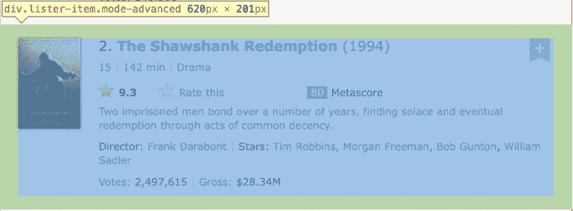
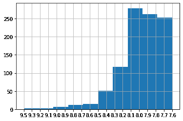
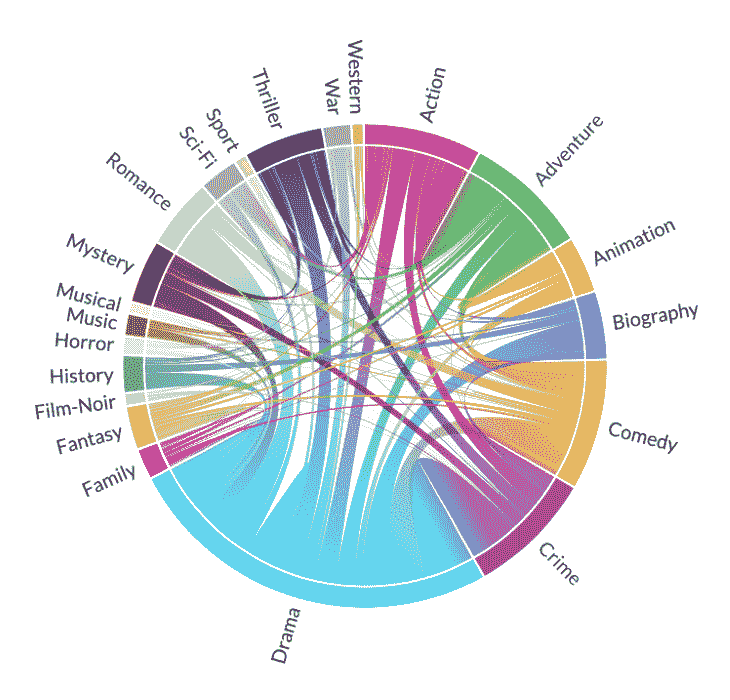

# 使用 lxml 和 pandas 在 Python 中进行 Web 抓取

> 原文：<https://blog.logrocket.com/web-scraping-python-lxml-pandas/>

数据科学和可视化教程通常从引用现有数据集开始。然而，通常情况下，我们需要或想要创建自己的数据集。所以让我们后退几步，想想我们如何使用 Python 和它的一些流行包来创建一个！

```
import requests
import lxml.html
import pandas as pd

```

让我们先快速浏览一下软件包本身:

*   一个简单的 HTTP 库，也是现存下载量最大的 Python 包之一
*   `[lxml](https://lxml.de)`，一个用于处理 XML 和 HTML 的功能丰富的库
*   一个强大的数据操作库，具有有用的结构

这些包没有一个是深奥的、难以使用的或难以访问的。可以肯定地说，了解它们是一项值得的投资。

因此，让我们将这些工具结合在一起，基于当前的 IMDb 1000 强自动创建一个电影数据集。

## 为 Python 获取数据

这是来自 IMDb 1000 强排行榜的数据。

默认情况下，我们每页看到 50 部电影，按照受欢迎程度(升序)排序。

通过对我们的请求进行一些修改，我们可以[将它更改为每页 200 部电影，这些电影已经按照(降序)用户评级](https://www.imdb.com/search/title/?groups=top_1000&sort=user_rating,desc&count=200)进行了排序。

如果我们访问页面并检查电影项目的源代码，我们可以看到它们都出现在带有类`lister-item`和`mode-advanced`的`div`元素中。



定位这些节点的 XPath 是 `//div[contains(@class, 'lister-item mode-advanced')]`。

使用我们的 web inspector，让我们获得感兴趣的电影特性的 XPath。这里的想法是找到导航 HTML 文档的参考点，允许我们提取我们需要的数据。相对于上面的每个电影节点，它们是:

*   网址:`.//h3[@class="lister-item-header"]//a/@href`
*   名称:`.//h3[@class="lister-item-header"]//a/text()`
*   缩略图:`.//div[@class="lister-item-image float-left"]//a//img/@loadlate`
*   评级:`.//div[@class="inline-block ratings-imdb-rating"]//strong/text()`
*   类型:t0]
*   总值:`.//p[@class="sort-num_votes-visible"]//span[last()]/text()`

## 提取单部电影的数据

让我们将准备工作付诸实践，将排名第二的电影*《肖申克的救赎》*的数据转化为几个变量。

首先，我们将使用`requests`包来检索 200 部电影的第一页的 HTML 源代码。

```
url = "https://www.imdb.com/search/title/?groups=top_1000&sort=user_rating,desc&count=200"
response = requests.get(url)
content = response.content

```

这样，我们就获得了对 GET 请求的响应，并将内容存储在内容变量中。我们可以通过查看响应代码来检查我们的响应是否成功，其中响应代码`200`意味着一切正常。

```
print(response.status_code)
200

```

看起来不错！接下来，我们将使用`lxml`解析 HTML 内容，以便开始处理它。

```
html = lxml.html.fromstring(content)

```

我们可以开始使用前面的 XPath 表达式来选择节点。让我们选择我们知道的存储电影数据的每个父元素`div`。

```
items = html.xpath("//div[contains(@class, 'lister-item mode-advanced')]")

```

我们应该预计每页有 200 部电影，所以让我们仔细检查一下这是否符合我们刚才选择的列表的长度:

```
print(len(items))
200

```

太好了！现在让我们选择包含《肖申克的救赎》*的所有数据的`div`。我们知道它在 IMDb 1000 强中排名第二，所以我们将尝试索引第二项。*

```
item = items[1]

```

最后，让我们为之前准备的每个特性提取数据。

```
name = item.xpath('.//h3[@class="lister-item-header"]//a/text()')[0]
thumbnail = item.xpath('.//div[@class="lister-item-image float-left"]//a//img/@loadlate')[0]
rating = item.xpath('.//div[@class="inline-block ratings-imdb-rating"]//strong/text()')[0]
genre = item.xpath('.//span[@class="genre"]//text()')[0].strip()
gross = item.xpath('.//p[@class="sort-num_votes-visible"]//span[last()]/text()')[0].strip()
gross = gross if "$" in gross else "N/A"
url = "https://www.imdb.com" + item.xpath('.//h3[@class="lister-item-header"]//a/@href')[0]

```

为了清理数据，需要对特性进行一些额外的争论:

*   `url`:路径是相对的，所以它们被加上了协议和域名的前缀，[https://www.imdb.com](https://www.imdb.com)
*   `genre`和`gross`在想要的字符串前后有多余的空格，所以用 Python 的`.strip()`去掉了这些空格
*   并不总是存在，但当它存在时，它总是以美元存在。因此，我们将检查`$`字符的存在，如果缺少`gross`，则将它列为不可用

让我们把这些都打印出来，看看我们做得怎么样！

```
print(f"{name=}")
print(f"{thumbnail=}")
print(f"{rating=}")
print(f"{genre=}")
print(f"{gross=}")
print(f"{url=}")

name='The Shawshank Redemption'
thumbnail='https://m.media-amazon.com/images/M/MV5BMDFkYTc0MGEt[email protected]._V1_UX67_CR0,0,67,98_AL_.jpg'
rating='9.3'
genre='Drama'
gross='$28.34M'
url='https://www.imdb.com/title/tt0111161/'

```

完美！我们还借此机会强调了 [Python f-strings](https://docs.python.org/3/tutorial/inputoutput.html#formatted-string-literals) 的一个有用特性，它允许我们打印表达式、等号，然后是求值后的表达式！

## 自动化和创建我们的数据框架

我们已经为一部电影做了一次所有的事情，所以让我们继续为所有 1000 部电影做自动化的事情。

当访问上面的 IMDB Top 1000 页面并点击**下一个**按钮时，我们被[带到这个页面](https://www.imdb.com/search/title/?groups=top_1000&sort=user_rating,desc&count=200&start=201&ref_=adv_nxt)。

我们可以看到这里的关键区别是包含了一个 start 参数，它被设置为从 201 开始。这将是自动检索所有 1000 部电影的关键，所以我们将在即将到来的循环中对此进行参数化。

```
items = []
for start in range(1,1000,200):
    url = f"https://www.imdb.com/search/title/?groups=top_1000&sort=user_rating,desc&count=200&start={start}&ref_=adv_nxt"
    response = requests.get(url)
    content = response.content
    html = lxml.html.fromstring(content)
    items += html.xpath("//div[contains(@class, 'lister-item mode-advanced')]") 

```

这里，我们更新了前面的代码，将它放入一个循环中，从 1 到 1000，间隔 200。这个值被输入到我们刚刚发现的参数`start`中，我们一次将电影添加到 200 个项目列表中。让我们检查列表的长度以确保正确。

* * *

### 更多来自 LogRocket 的精彩文章:

* * *

```
print(len(items))
1000

```

我们快到了！现在是我们的数据框架。让我们从创建一个包含所需列的空数据框架开始。

```
data = pd.DataFrame(columns=['name', 'thumbnail', 'rating', 'genre', 'gross', 'thumbnail', 'url'])

```

现在剩下的就是遍历检索到的电影项目，并将数据追加到 DataFrame 中。

```
for item in items:
    name = item.xpath('.//h3[@class="lister-item-header"]//a/text()')[0]
    thumbnail = item.xpath('.//div[@class="lister-item-image float-left"]//a//img/@loadlate')[0]
    rating = item.xpath('.//div[@class="inline-block ratings-imdb-rating"]//strong/text()')[0]
    genre = item.xpath('.//span[@class="genre"]//text()')[0].strip()
    gross = item.xpath('.//p[@class="sort-num_votes-visible"]//span[last()]/text()')[0].strip()
    gross = gross if "$" in gross else "N/A"
    url = "https://www.imdb.com" + item.xpath('.//h3[@class="lister-item-header"]//a/@href')[0]

    data = data.append({'name': name, 'thumbnail': thumbnail, 'rating': rating, 'genre': genre, 'gross': gross, 'url': url}, ignore_index=True)

```

通过显示前 10 行，我们可以看到新生成的数据集的示例。

```
data.head(10)
```

| "` | **名称** | **缩略图** | **评级** | 型 | **总值** | **缩略图** | **网址** |
| **0** | 贾伊·比姆 | [https://m.media-amazon.com/images/M/MV5BY2Y5ZW&# 8230](https://m.media-amazon.com/images/M/MV5BY2Y5ZW&#8230)； | 9.5 | 犯罪，戏剧 | 不适用的 | [https://m.media-amazon.com/images/M/MV5BY2Y5ZW&# 8230](https://m.media-amazon.com/images/M/MV5BY2Y5ZW&#8230)； | [https://www.imdb.com/title/tt15097216/](https://www.imdb.com/title/tt15097216/) |
| **1** | 肖申克的救赎 | [https://m.media-amazon.com/images/M/MV5BMDFkYT&# 8230](https://m.media-amazon.com/images/M/MV5BMDFkYT&#8230)； | 9.3 | 戏剧 | 2834 万美元 | [https://m.media-amazon.com/images/M/MV5BMDFkYT&# 8230](https://m.media-amazon.com/images/M/MV5BMDFkYT&#8230)； | [https://www.imdb.com/title/tt0111161/](https://www.imdb.com/title/tt0111161/) |
| **2** | 《教父》 | [https://m.media-amazon.com/images/M/MV5BM2MyNj&# 8230](https://m.media-amazon.com/images/M/MV5BM2MyNj&#8230)； | 9.2 | 犯罪，戏剧 | 1.3497 亿美元 | [https://m.media-amazon.com/images/M/MV5BM2MyNj&# 8230](https://m.media-amazon.com/images/M/MV5BM2MyNj&#8230)； | [https://www.imdb.com/title/tt0068646/](https://www.imdb.com/title/tt0068646/) |
| **3** | Soorarai Pottru | [https://m.media-amazon.com/images/M/MV5BOGVjYm&# 8230](https://m.media-amazon.com/images/M/MV5BOGVjYm&#8230)； | 9.1 | 戏剧 | 不适用的 | [https://m.media-amazon.com/images/M/MV5BOGVjYm&# 8230](https://m.media-amazon.com/images/M/MV5BOGVjYm&#8230)； | [https://www.imdb.com/title/tt10189514/](https://www.imdb.com/title/tt10189514/) |
| **4** | 黑暗骑士 | [https://m . media-Amazon . com/images/m/mv 5 bmtmxnt&# 8230](https://m.media-amazon.com/images/M/MV5BMTMxNT&#8230)； | 9.0 | 动作，犯罪，戏剧 | 5.3486 亿美元 | [https://m . media-Amazon . com/images/m/mv 5 bmtmxnt&# 8230](https://m.media-amazon.com/images/M/MV5BMTMxNT&#8230)； | [https://www.imdb.com/title/tt0468569/](https://www.imdb.com/title/tt0468569/) |
| **5** | 教父:第二部 | [https://m.media-amazon.com/images/M/MV5BMWMwMG&# 8230](https://m.media-amazon.com/images/M/MV5BMWMwMG&#8230)； | 9.0 | 犯罪，戏剧 | 5730 万美元 | [https://m.media-amazon.com/images/M/MV5BMWMwMG&# 8230](https://m.media-amazon.com/images/M/MV5BMWMwMG&#8230)； | [https://www.imdb.com/title/tt0071562/](https://www.imdb.com/title/tt0071562/) |
| **6** | 12 个愤怒的男人 | [https://m.media-amazon.com/images/M/MV5BMWU4N2&# 8230](https://m.media-amazon.com/images/M/MV5BMWU4N2&#8230)； | 9.0 | 犯罪，戏剧 | 436 万美元 | [https://m.media-amazon.com/images/M/MV5BMWU4N2&# 8230](https://m.media-amazon.com/images/M/MV5BMWU4N2&#8230)； | [https://www.imdb.com/title/tt0050083/](https://www.imdb.com/title/tt0050083/) |
| **7** | 萨达尔·乌达姆 | [https://m.media-amazon.com/images/M/MV5BZGFhNT&# 8230](https://m.media-amazon.com/images/M/MV5BZGFhNT&#8230)； | 8.9 | 传记、犯罪、戏剧 | 不适用的 | [https://m.media-amazon.com/images/M/MV5BZGFhNT&# 8230](https://m.media-amazon.com/images/M/MV5BZGFhNT&#8230)； | [https://www.imdb.com/title/tt10280296/](https://www.imdb.com/title/tt10280296/) |
| **8** | 指环王:王者归来 | [https://m.media-amazon.com/images/M/MV5BNzA5ZD&# 8230](https://m.media-amazon.com/images/M/MV5BNzA5ZD&#8230)； | 8.9 | 动作，冒险，戏剧 | 3.7785 亿美元 | [https://m.media-amazon.com/images/M/MV5BNzA5ZD&# 8230](https://m.media-amazon.com/images/M/MV5BNzA5ZD&#8230)； | [https://www.imdb.com/title/tt0167260/](https://www.imdb.com/title/tt0167260/) |
| **9** | 低俗小说 | [https://m . media-Amazon . com/images/m/mv 5 bngnhmd&# 8230](https://m.media-amazon.com/images/M/MV5BNGNhMD&#8230)； | 8.9 | 犯罪，戏剧 | 1.0793 亿美元 | [https://m . media-Amazon . com/images/m/mv 5 bngnhmd&# 8230](https://m.media-amazon.com/images/M/MV5BNGNhMD&#8230)； | [https://www.imdb.com/title/tt0110912/](https://www.imdb.com/title/tt0110912/) |

全部完成！此时将其保存为 CSV 文件可能会有所帮助。

```
data.to_csv('data.csv')

```

## 分析我们的数据

让我们稍微检查一下我们的数据。我们从收视率直方图开始。

```
data.rating.hist()
<AxesSubplot:>

```



我们还可以查看一些汇总统计数据。

```
data.rating.astype(float).describe()

count    1000.000000
mean        7.968300
std         0.280292
min         7.600000
25%         7.700000
50%         7.900000
75%         8.100000
max         9.500000
Name: rating, dtype: float64

```

## 加分练习！

作为奖励，我们在**流派**列中有一些有趣的数据，我们可以用它们来构建一个共现矩阵。

我们将使用 [itertools](https://docs.python.org/3/library/itertools.html) 包给我们一些额外的函数来处理迭代器。

```
import itertools

```

现在，让我们来讨论一下我们的流派吧！首先，将流派分成列表。

```
data['genre'] = data['genre'].str.split(",")

```

然后，清除数据中的任何空白。

```
for index, row in data.iterrows():
    genre = [x.strip(' ') for x in row.genre]
    row.genre = genre

```

我们将建立一个每个独特流派的列表，并按字母顺序排列:

```
genres = [st for row in data.genre for st in row]
genres = set(genres)
genres = sorted(genres)

```

然后，我们构造我们的共生矩阵。

```
matrix = pd.DataFrame(0, columns=genres, index=genres)

for index, row in data.iterrows():
    if len(row.genre) == 1:
        matrix[row.genre[0]][row.genre[0]] += 1
    else:
        for genre in list(itertools.combinations(row.genre, 2)):
            matrix[genre[0]][genre[1]] += 1
            matrix[genre[1]][genre[0]] += 1

```

如果我们好奇的话，它看起来像下面这样。

```
matrix
```

| "` | **动作** | **冒险** | **动画** | **传记** | **喜剧** | **犯罪** | **剧情** | **家庭** | **幻想** | **薄膜** | **…** | **恐怖** | **音乐** | **音乐剧** | **谜团** | **浪漫** | **科幻** | **运动** | **惊悚片** | **战争** | **西方** |
| **动作** | 0 | 85 | 19 | 10 | 22 | 51 | 84 | 1 | 8 | 0 | … | 3 | 0 | 0 | 9 | 3 | 30 | 2 | 24 | 7 | 3 |
| **冒险** | 85 | 0 | 55 | 9 | 56 | 4 | 59 | 15 | 21 | 1 | … | 2 | 0 | 0 | 5 | 3 | 30 | 0 | 10 | 6 | 7 |
| **动画** | 19 | 55 | 0 | 3 | 34 | 4 | 23 | 15 | 10 | 0 | … | 0 | 0 | 0 | 1 | 1 | 2 | 0 | 0 | 1 | 0 |
| **传记** | 10 | 9 | 3 | 0 | 9 | 20 | 100 | 4 | 0 | 0 | … | 0 | 7 | 0 | 0 | 1 | 0 | 8 | 3 | 1 | 0 |
| **喜剧** | 22 | 56 | 34 | 9 | 13 | 31 | 121 | 11 | 13 | 1 | … | 4 | 8 | 4 | 3 | 48 | 4 | 1 | 4 | 8 | 1 |
| **犯罪** | 51 | 四 | 四 | 20 | 31 | 0 | 157 | 0 | 2 | 10 | … | 2 | 1 | 1 | 35 | 5 | 1 | 1 | 42 | 0 | 0 |
| **剧情** | 84 | 59 | 23 | 100 | 121 | 157 | 88 | 24 | 31 | 15 | … | 15 | 33 | 11 | 66 | 109 | 29 | 18 | 78 | 45 | 13 |
| **家庭** | 一 | 15 | 15 | 四 | 11 | 0 | 24 | 0 | 14 | 0 | … | 0 | 0 | 4 | 0 | 0 | 1 | 2 | 0 | 0 | 0 |
| **幻想** | 8 | 21 | 10 | 0 | 13 | 2 | 31 | 14 | 0 | 0 | … | 2 | 2 | 1 | 4 | 8 | 1 | 0 | 0 | 1 | 0 |
| **薄膜** | 0 | 1 | 0 | 0 | 1 | 10 | 15 | 0 | 0 | 0 | … | 0 | 0 | 0 | 5 | 2 | 0 | 0 | 3 | 0 | 0 |
| **历史** | 3 | 5 | 0 | 25 | 0 | 2 | 49 | 0 | 0 | 0 | … | 0 | 1 | 0 | 1 | 2 | 0 | 0 | 4 | 6 | 0 |
| **恐怖** | 3 | 2 | 0 | 0 | 四 | 2 | 15 | 0 | 2 | 0 | … | 2 | 0 | 0 | 7 | 0 | 7 | 0 | 13 | 0 | 0 |
| **音乐** | 0 | 0 | 0 | 七 | 8 | 一 | 33 | 0 | 2 | 0 | … | 0 | 0 | 3 | 1 | 9 | 0 | 0 | 0 | 0 | 0 |
| **音乐剧** | 0 | 0 | 0 | 0 | 四 | 一 | 11 | 4 | 1 | 0 | … | 0 | 3 | 0 | 0 | 2 | 0 | 1 | 0 | 0 | 0 |
| **谜团** | 9 | 5 | 一 | 0 | 3 | 35 | 66 | 0 | 4 | 5 | … | 7 | 1 | 0 | 0 | 9 | 8 | 0 | 31 | 2 | 0 |
| **浪漫** | 3 | 3 | 一 | 一 | 48 | 5 | 109 | 0 | 8 | 2 | … | 0 | 9 | 2 | 9 | 0 | 2 | 0 | 3 | 5 | 0 |
| **科幻** | 30 | 30 | 2 | 0 | 四 | 1 | 29 | 1 | 1 | 0 | … | 7 | 0 | 0 | 8 | 2 | 0 | 0 | 5 | 0 | 0 |
| **运动** | 2 | 0 | 0 | 8 | 一 | 一 | 18 | 2 | 0 | 0 | … | 0 | 0 | 1 | 0 | 0 | 0 | 0 | 0 | 0 | 0 |
| **惊悚片** | 24 | 10 | 0 | 3 | 4 | 42 | 78 | 0 | 0 | 3 | … | 13 | 0 | 0 | 31 | 3 | 5 | 0 | 1 | 3 | 1 |
| **战争** | 七 | 6 | 一 | 一 | 8 | 0 | 45 | 0 | 一 | 0 | … | 0 | 0 | 0 | 2 | 5 | 0 | 0 | 3 | 0 | 1 |
| **西方** | 3 | 七 | 0 | 0 | 一 | 0 | 13 | 0 | 0 | 0 | … | 0 | 0 | 0 | 0 | 0 | 0 | 0 | 1 | 1 | 4 |

注意大小:21 行× 21 列

最后，我们将使用 [Plotapi](https://plotapi.com/) 用我们的数据创建一个交互式和弦图！

```
from plotapi import Chord

Chord.set_license("your username", "your license key")

Chord(matrix.values.tolist(), genres, colors="movies").show()

```



## 结论

你有它！在本文中，我们经历了数据集创建到可视化的旅程。我们使用 Python 完成了所有这些步骤，并完全依赖于流行且维护良好的包 lxml 和 pandas。

知道如何从现有资源创建我们自己的数据集是非常有用的，有时当 API 或数据转储不可用时，这是唯一的选择。

从这里，我们可以通过包括每部电影中的演员来增加我们的 IMDb 数据集，或者访问另一个数据源，并在那里练习我们新的数据检索、处理和可视化技能。这里有一些使用相同技术的例子:[口袋妖怪类型的共现](https://plotapi.com/gallery/posts/showcase/pokemon-types-with-plotapi-chord/)，[动物穿越村民物种和个性的共现](https://plotapi.com/gallery/posts/showcase/animal-crossing-with-plotapi-chord/)，以及[用请求包检索 JSON】。](https://datacrayon.com/posts/programming/python/requests-and-json/)

## 使用 [LogRocket](https://lp.logrocket.com/blg/signup) 消除传统错误报告的干扰

[](https://lp.logrocket.com/blg/signup)

[LogRocket](https://lp.logrocket.com/blg/signup) 是一个数字体验分析解决方案，它可以保护您免受数百个假阳性错误警报的影响，只针对几个真正重要的项目。LogRocket 会告诉您应用程序中实际影响用户的最具影响力的 bug 和 UX 问题。

然后，使用具有深层技术遥测的会话重放来确切地查看用户看到了什么以及是什么导致了问题，就像你在他们身后看一样。

LogRocket 自动聚合客户端错误、JS 异常、前端性能指标和用户交互。然后 LogRocket 使用机器学习来告诉你哪些问题正在影响大多数用户，并提供你需要修复它的上下文。

关注重要的 bug—[今天就试试 LogRocket】。](https://lp.logrocket.com/blg/signup-issue-free)