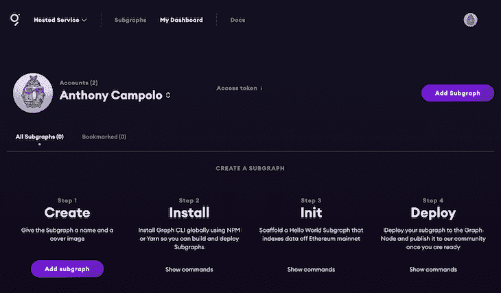
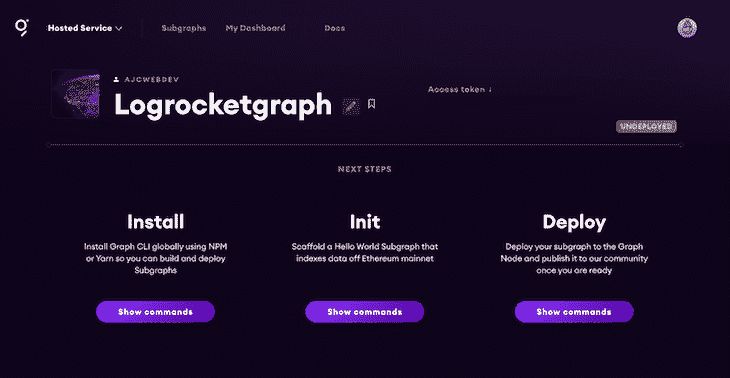

# 用图和子图进行 Web3 数据查询

> 原文：<https://blog.logrocket.com/web3-data-querying-the-graph-subgraphs/>

图表是组织区块链数据的索引协议。它使用一个 [GraphQL](https://blog.logrocket.com/tag/graphql/) API 来提供比发送 RPC 调用的传统方法更容易的对链上信息的访问。

网络用子图组织数据；由社区创建的开源 API，用于从索引器、管理器和代理器中检索数据。

在本文中，我们将了解如何使用图和子图进行 Web3 数据查询。

## 索引器操作网络节点

索引器操作网络的节点，这些节点索引数据并为查询服务。

由于图网络使用一种利益证明算法，索引器利用图令牌(GRT)来提供索引和查询处理服务。反过来，索引员可以赚取查询费和索引奖励。

他们基于子图的策化信号选择要索引的子图。使用索引器数据的应用程序可以设置他们希望哪些索引器处理他们的查询的参数，以及他们对查询费用定价的偏好。

### 策展人展示高质量的子图

[管理员](https://thegraph.com/docs/en/curating/)通过发信号通知应该由图网络索引的子图来组织来自子图的数据。

他们使用图策展共享(GCS)来实现这一点，这允许他们在子图上进行等价投资。

策展人持有 GRT 股份，这使他们能够铸造 GC。每个子图都有一条结合曲线，它决定了 GRT 的价格和可以铸造的股票数量之间的关系。

根据图表的文档，策展被认为是有风险的，只应在彻底研究和调查所涉及的权衡之后进行。

### 授权者通过饥饿来保护网络

[委托人](https://thegraph.com/docs/en/delegating/)将 GRT 委托给一个或多个索引器，以帮助保护网络，而无需自己运行节点。

委托人赚取部分索引器的查询费和奖励，这取决于索引器和委托人的股份，以及索引器对每个查询收取的价格。

向索引器分配更多的股份允许处理更多的潜在查询。Graph 的文档声称，作为委托人比作为馆长风险更小，因为他们不会受到 GRT 价格波动的影响，因为 GCS 的股票正在燃烧。

## 图表基金会

该图由 Graph Foundation 开发和维护。为了确保网络和更大的社区继续改善，基金会向从事协议基础设施、工具、dApps、子图和社区建设的社区成员分发赠款(称为图赠款)。

### 三种不同的图形服务

如果您没有托管自己的子图，有三种不同的方式与图形交互:

*   **图形浏览器**:浏览不同的子图，并与图形协议交互
*   **子图工作室**:使用以太坊 Mainnet 创建、管理和发布子图和 API 键
*   托管服务(Hosted Service):使用以太坊之外的其他网络，如 Avalanche、Harmony、Fantom 和 Celo，创建、管理和发布子图和 API 密钥

托管服务不需要加密钱包，可以使用 GitHub 帐户。图形浏览器和子图工作室都将要求你连接一个钱包，如 MetaMask 或比特币基地。

## 在托管服务上创建项目

在托管服务上创建帐户后，单击导航栏上的“我的仪表板”查看您的仪表板。



单击“添加子图”创建子图。


为子图添加名称和副标题。填写完子图信息后，向下滚动到页面底部，点击“创建子图”。



通过在托管服务上设置子图，我们可以创建项目文件。创建一个新目录，初始化一个`package.json`，并安装依赖项。

```
mkdir graphrocket
cd graphrocket
yarn init -y
yarn add -D @graphprotocol/graph-cli @graphprotocol/graph-ts

```

在托管服务上复制项目仪表板上可用的访问令牌。在`yarn graph auth --product hosted-service`命令后粘贴令牌。

```
yarn graph auth --product hosted-service YOURTOKEN

```

为 TypeScript 和 Git 创建配置文件。

* * *

### 更多来自 LogRocket 的精彩文章:

* * *

```
echo '{"extends": "@graphprotocol/graph-ts/types/tsconfig.base.json"}' > tsconfig.json
echo '.DS_Store\nnode_modules' > .gitignore

```

以太坊区块链上的智能合约公开了一个应用程序二进制接口(或 ABI ),作为客户端应用程序和以太坊区块链之间的接口。我们的子图需要这个。

用 cURL 下载合同的 ABI，并保存到一个名为`Token.json`的文件中。

```
curl "http://api.etherscan.io/api?module=contract&action=getabi&address=0xe7c29cba93ef8017c7824dd0f25923c38d08065c&format=raw" > Token.json

```

创建三个项目文件，包括:

*   `token.ts`用于将以太坊事件数据翻译成方案中定义的实体的汇编脚本代码
*   `subgraph.yaml`对于子图清单的 YAML 配置
*   `schema.graphql`用于定义为子图存储的数据以及如何通过 GraphQL 查询它的 GraphQL 模式

```
echo > token.ts
echo > schema.graphql
echo > subgraph.yaml

```

### 定义`Token`和`User`实体

在`schema.graphql`中，我们定义了两种类型，`Token`和`User`。

```
# schema.graphql

type Token @entity {}
type User @entity {}

```

`Token`有一个`name`和其他信息，比如创建时间、内容 URI 和 IPFS 文件路径。它还包括关于`creator`和`owner`的信息。

```
# schema.graphql

type Token @entity {
  id: ID!
  tokenID: BigInt!
  contentURI: String
  tokenIPFSPath: String
  name: String!
  createdAtTimestamp: BigInt!
  creator: User!
  owner: User!
}

```

`creator`和`owner`是`User`类型。他们有一个`id`，他们拥有一个`tokens`数组，他们拥有一个`tokens`数组`created`。

```
# schema.graphql

type User @entity {
  id: ID!
  tokens: [Token!]! @derivedFrom(field: "owner")
  created: [Token!]! @derivedFrom(field: "creator")
}

```

`@derivedFrom`启用反向查找，这意味着我们不存储关系的两端，以提高索引和查询性能。对于一对多关系，关系应该存储在“一”方，而“多”方则从“一”方派生而来。

### 创建子图

`subgraph.yaml`文件将包含我们的子图的定义。从使用的规范版本和`schema.graphql`中实体类型的文件路径开始。

```
# subgraph.yaml

specVersion: 0.0.4
schema:
  file: ./schema.graphql

```

接下来是包含我们的数据源的网络。`dataSources.source`需要智能合同的地址和 ABI。

```
# subgraph.yaml

dataSources:
  - kind: ethereum
    name: Token
    network: mainnet
    source:
      address: "0x3B3ee1931Dc30C1957379FAc9aba94D1C48a5405"
      abi: Token
      startBlock: 11648721

```

`dataSources.mapping.entities`定义数据源写入存储的实体，由`schema.graphql`中的模式指定。

```
# subgraph.yaml

mapping:
  kind: ethereum/events
  apiVersion: 0.0.5
  language: wasm/assemblyscript
  entities:
    - Token
    - User

```

`dataSources.mapping.abis`取源合同 ABI 的`name`和`file`地点。

```
# subgraph.yaml

abis:
  - name: Token
    file: ./Token.json

```

`dataSources.mapping.eventHandlers`列出子图对其做出反应的智能合约事件，以及映射中的处理程序，这些处理程序将这些事件转换为存储中的实体。

```
# subgraph.yaml

eventHandlers:
  - event: TokenIPFSPathUpdated(indexed uint256,indexed string,string)
    handler: handleTokenIPFSPathUpdated
  - event: Transfer(indexed address,indexed address,indexed uint256)
    handler: handleTransfer
file: ./token.ts

```

完成`subgraph.yaml`文件:

```
# subgraph.yaml

specVersion: 0.0.4
schema:
  file: ./schema.graphql
dataSources:
  - kind: ethereum
    name: Token
    network: mainnet
    source:
      address: "0x3B3ee1931Dc30C1957379FAc9aba94D1C48a5405"
      abi: Token
      startBlock: 11648721
    mapping:
      kind: ethereum/events
      apiVersion: 0.0.5
      language: wasm/assemblyscript
      entities:
        - Token
        - User
      abis:
        - name: Token
          file: ./Token.json
      eventHandlers:
        - event: TokenIPFSPathUpdated(indexed uint256,indexed string,string)
          handler: handleTokenIPFSPathUpdated
        - event: Transfer(indexed address,indexed address,indexed uint256)
          handler: handleTransfer
      file: ./token.ts

```

### 生成类型

为 ABI 和子图架构生成 AssemblyScript 类型。

```
yarn graph codegen

```

### 写入映射

导入生成的类型和生成的模式，创建两个函数:`handleTransfer`和`handleTokenURIUpdated`。

当创建、传输或更新新令牌时，会触发一个事件，映射会将数据保存到子图中。

```
// token.ts

import {
  TokenIPFSPathUpdated as TokenIPFSPathUpdatedEvent,
  Transfer as TransferEvent,
  Token as TokenContract,
} from "./generated/Token/Token"
import {
  Token, User
} from './generated/schema'

export function handleTransfer(event: TransferEvent): void {}

export function handleTokenURIUpdated(event: TokenIPFSPathUpdatedEvent): void {}

```

`handleTransfer`加载`tokenId`并设置`owner`。

```
// token.ts

export function handleTransfer(event: TransferEvent): void {
  let token = Token.load(event.params.tokenId.toString())
  if (!token) {
    token = new Token(event.params.tokenId.toString())
    token.creator = event.params.to.toHexString()
    token.tokenID = event.params.tokenId

    let tokenContract = TokenContract.bind(event.address)
    token.contentURI = tokenContract.tokenURI(event.params.tokenId)
    token.tokenIPFSPath = tokenContract.getTokenIPFSPath(event.params.tokenId)
    token.name = tokenContract.name()
    token.createdAtTimestamp = event.block.timestamp
  }
  token.owner = event.params.to.toHexString()
  token.save()

  let user = User.load(event.params.to.toHexString())
  if (!user) {
    user = new User(event.params.to.toHexString())
    user.save()
  }
}

```

`handleTokenURIUpdated`随时更新`tokenIPFSPath`的变化。

```
// token.ts

export function handleTokenURIUpdated(event: TokenIPFSPathUpdatedEvent): void {
  let token = Token.load(event.params.tokenId.toString())
  if (!token) return
  token.tokenIPFSPath = event.params.tokenIPFSPath
  token.save()
}

```

## 部署子图

构建要部署的项目:

```
yarn graph build

```

包括您自己的 GitHub 用户名，后跟您的子图名称:

```
yarn graph deploy --product hosted-service USERNAME/logrocketgraph

```

终端将返回一个 URL，其中包含子图的浏览器和发送查询的 API 端点。

```
Deployed to https://thegraph.com/explorer/subgraph/ajcwebdev/logrocketgraph

Subgraph endpoints:
Queries (HTTP):     https://api.thegraph.com/subgraphs/name/ajcwebdev/logrocketgraph

```

您需要等待您的子图与区块链的当前状态同步。一旦同步完成，运行以下查询以降序显示按`id`排序的前两个令牌。

```
{
  tokens(first: 2, orderBy: id, orderDirection: desc) {
    id
    tokenID
    contentURI
    tokenIPFSPath
  }
}

```

这将输出以下内容:

```
{
  "data": {
    "tokens": [
      {
        "id": "99999",
        "tokenID": "99999",
        "contentURI": "https://ipfs.foundation.app/ipfs/QmdDdmRAw8zgmN9iE23oz14a55oHGWtqBrR1RbFcFq4Abn/metadata.json",
        "tokenIPFSPath": "QmdDdmRAw8zgmN9iE23oz14a55oHGWtqBrR1RbFcFq4Abn/metadata.json"
      },
      {
        "id": "99998",
        "tokenID": "99998",
        "contentURI": "https://ipfs.foundation.app/ipfs/QmZwZ5ChjHNwAS5rFDGkom2GpZvTau6xzr8M7gro5HqQhB/metadata.json",
        "tokenIPFSPath": "QmZwZ5ChjHNwAS5rFDGkom2GpZvTau6xzr8M7gro5HqQhB/metadata.json"
      }
    ]
  }
}

```

以下是对第一个用户及其相关内容的查询:

```
{
  users(first: 1, orderBy: id, orderDirection: desc) {
    id
    tokens {
      contentURI
    }
  }
}

```

这将输出以下内容:

```
{
  "data": {
    "users": [
      {
        "id": "0xfffff449f1a35eb0facca8d4659d8e15cf2f77ba",
        "tokens": [
          {
            "contentURI": "https://ipfs.foundation.app/ipfs/QmVkXqo2hmC2j18udhZG1KavxaTGrnEX7uuddEbghPKCUW/metadata.json"
          },
          {
            "contentURI": "https://ipfs.foundation.app/ipfs/QmTSEgtJmptBCpEJKubK6xDZFiCMEHgGQjhrUAsJSXwzKZ/metadata.json"
          },
          {
            "contentURI": "https://ipfs.foundation.app/ipfs/QmPzSJGhheyyA7MZMYz7VngnZWN8TinH75PTP7M1HAedti/metadata.json"
          },
          {
            "contentURI": "https://ipfs.foundation.app/ipfs/QmeroC2cWfdN31hLd3JpBQMbbWqnQdUdGx94FGUR4AGBUP/metadata.json"
          },
          {
            "contentURI": "https://ipfs.foundation.app/ipfs/QmQVkhqEsZvsstfDp6QAPXB4TkxFnpeAc9BWu2eQo6QvZD/metadata.json"
          },
          {
            "contentURI": "https://ipfs.foundation.app/ipfs/QmRax3fw4skHp95i2v3BzroMoKQVHqAkwbov8FyPdesk3j/metadata.json"
          },
          {
            "contentURI": "https://ipfs.foundation.app/ipfs/QmViGRnvHFBZ6CWHoxZGJoU9iwnoGwZfqj2vgDN3dgsGv4/metadata.json"
          },
          {
            "contentURI": "https://ipfs.foundation.app/ipfs/QmdRBPxDF1tUzm1Pczyme24vguUjW28cLwM4n9MvtxAWX6/metadata.json"
          }
        ]
      }
    ]
  }
}

```

对最近创建的两个 NFT 的查询。

```
{
  tokens(
    first: 2,
    orderBy: createdAtTimestamp,
    orderDirection: desc
  ) {
    id
    tokenID
    contentURI
    createdAtTimestamp
  }
}

```

这将输出以下内容:

```
{
  "data": {
    "tokens": [
      {
        "id": "133012",
        "tokenID": "133012",
        "contentURI": "https://ipfs.foundation.app/ipfs/QmSmk85TjpaegCmHDRWZQqMz18vJtACZdugVx5a1tmfjpv/metadata.json",
        "createdAtTimestamp": "1656792769"
      },
      {
        "id": "133011",
        "tokenID": "133011",
        "contentURI": "https://ipfs.foundation.app/ipfs/QmU6RFcKFDteUTipg5tg4NFkWKApdVbo9oq9UYMtSmcWVe/metadata.json",
        "createdAtTimestamp": "1653825764"
      }
    ]
  }
}

```

您还可以使用 HTTP 端点，并通过 cURL 直接发送 GraphQL 查询。

```
curl \
  --header 'content-type: application/json' \
  --url 'https://api.thegraph.com/subgraphs/name/ajcwebdev/logrocketgraph' \
  --data '{"query":"{ tokens(first: 1) { contentURI tokenIPFSPath } }"}'

```

## **结论**

在本文中，我们看到了如何创建一个 GraphQL 端点来公开以太坊区块链上包含的某些信息。通过编写包含实体的模式，我们定义了将由子图索引的信息。

在 Web3 中，区块链网络的数量和多样性继续激增。拥有一种标准化的、被广泛采用的查询语言将使开发人员能够以更高的效率迭代和测试他们的应用程序。

## 加入像 Bitso 和 Coinsquare 这样的组织，他们使用 LogRocket 主动监控他们的 Web3 应用

影响用户在您的应用中激活和交易的能力的客户端问题会极大地影响您的底线。如果您对监控 UX 问题、自动显示 JavaScript 错误、跟踪缓慢的网络请求和组件加载时间感兴趣，

[try LogRocket](https://lp.logrocket.com/blg/web3-signup)

.

[](https://lp.logrocket.com/blg/web3-signup)[https://logrocket.com/signup/](https://lp.logrocket.com/blg/web3-signup)

LogRocket 就像是网络和移动应用的 DVR，记录你的网络应用或网站上发生的一切。您可以汇总和报告关键的前端性能指标，重放用户会话和应用程序状态，记录网络请求，并自动显示所有错误，而不是猜测问题发生的原因。

现代化您调试 web 和移动应用的方式— [开始免费监控](https://lp.logrocket.com/blg/web3-signup)。