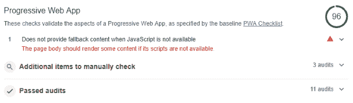
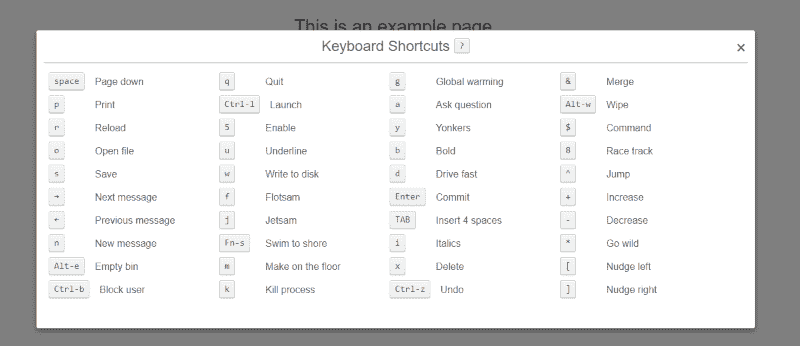

# 网络应用清单-日志火箭博客

> 原文：<https://blog.logrocket.com/webapp-checklist/>

在这篇文章中，我将试着总结一些如今启动一个 web 应用程序(大概是在商业环境中)所需要的东西。我不能给你任何完整性的保证，所以如果你在下面的列表中发现了什么缺失(或者有一些建议),请使用评论。

该列表通过对各种项目符号使用不同的类别来构建。在类别中，使用了两组项目——它们要么是必需的，要么只是从我个人的角度推荐的。分类可能与你的观点不同。

此外，我试图在开始时解释我对该类别的思维过程推理(特别是，为什么我认为它的项目应该被考虑)，并添加了一个例子作为说明。

## 准备

在实现 web 应用之前，您需要考虑一些组织和非技术方面的问题。如果 web 应用程序是在团队中开发的，或者应该有助于维持业务，下面的列表似乎是合理的。

开源 web 应用程序遵循类似的模式，即使像支持者和社区接受度这样的事情不太可预测，并且在一个稍微不同的范围内。

### 需要

*   团队就技术设置达成一致
*   许可证、基础设施成本等。有顶的
*   运营模式(包括服务水平协议)已确定
*   制定了商业计划

### 被推荐的

*   支持的浏览器列表可用

### 例子

支持的浏览器列表可以简单地指定为一个[浏览器列表](https://github.com/browserslist/browserslist)规则集，例如，“最近 2 个版本，IE 10”。最棒的是，这个规则集可以被添加到我们的 web 应用程序的`package.json`中，并且会被自动选取。

添加可以简单到:

存在若干工具，例如，将规则集导出到匹配浏览器的列表。

## 基础设施

基础设施从来都不性感，但它总是必要的。您可能已经注意到，在云优先、完全自动化的设置中，基础架构的复杂性增加了。不出所料，工具也是如此。拥有合适的工具使基础设施不仅易于管理，而且有趣高效。

除了最先进的 CI/CD 管道，我们还应该包含完整的错误跟踪。最后，知道什么会中断以及为什么会中断对于改进 web 应用程序至关重要。能够快速推出变化有助于我们变得不那么脆弱。

### 需要

*   构建过程完全自动化
*   包括错误报告(如 LogRocket)
*   数据备份到位并安全存储

### 被推荐的

*   Terraform(或类似的)脚本可用吗？
*   确定可扩展性
*   静态资源托管在 CDN 上

### 例子

为了包含高级错误报告，我们通常只需要包含一个脚本并调用一个 init 函数。有时更复杂的配置(例如，提供特定于用户的元数据)是有用的，但是，任务的关键部分已经通过调用 init 函数来处理了。

作为一个例子，我们看一下 [LogRocket](https://docs.logrocket.com/reference) :

```
{
  "browserslist": [
    "last 2 versions",
    "IE 10"
  ]
} 
```

差不多就是这样了！剩下的就是(自定义)混合使用官方工具来访问收集的数据和 API，以便集成到我们自己的工具中。

## 技术基础

显然，任何应用程序要被认为是稳定的和可维护的，都需要有一个坚实的架构、合理的业务逻辑和足够的测试。然而，对于网络应用程序，一些特殊的规则适用。

我们不仅需要寻找尽可能小的代码和资产捆绑包来提供服务(还需要提供独特甚至出色的用户体验)，我们还需要针对各种不同的浏览器和屏幕大小来测试我们的代码。

更糟糕的是，可用的 API、ECMAScript 规范和样式边缘案例可能会以不同的方式处理。

### 需要

*   适用于所有受支持浏览器的端到端测试
*   发出的 JS 被捆绑和缩小
*   发出的 CSS 被捆绑和缩小
*   发出的 CSS 是自动前缀的

### 被推荐的

*   捆绑结构鼓励缓存重用
*   发出的 HTML 被缩小
*   所有发出的资源都可以被缓存(例如，使用散列名称)
*   发出的 HTML 被缩小
*   所有发出的资源都可以被缓存(例如，使用散列名称)

### 例子

我们如何从简单的源代码中获得一个缩小的、多填充的、智能拆分的包，该包可以轻松缓存并包含所有想要的功能，这在很大程度上取决于我们的技术集。一些框架已经有了开箱即用的捆绑器。

一个非常通用，但容易理解的解决方案是[包裹](https://parceljs.org/)。它还可以与先前定义的 browserlist 一起工作，并且是框架不可知的。开箱即用(双关语)，它提供了打字支持，多填充，生产(缩小等)。)构建，以及热模块重载。

使用它就像跑步一样简单:

```
import LogRocket from 'logrocket';

LogRocket.init('YOUR_APP_ID');
```

默认的输出目录通常是想要的目录(“dist”)。

## 无障碍和移动

当开发一个 web 应用程序时，我们会面对大量不同的目标平台。网站可以以非图形的形式被消费。网站可能由具有非常奇怪的输入(例如，只能前进、后退和进入)或非常小的屏幕的大型设备使用。

此外，一个网站可能会被各种连接类型占用—快速、慢速、有限、无限等等。如果我们的应用要取得成功，我们需要找到一个平衡点，让大多数用户都有很好的体验。

* * *

### 更多来自 LogRocket 的精彩文章:

* * *

### 需要

*   存在一个移动友好视图
*   不必要的资源不会被下载

### 被推荐的

*   包括 PWA 增强功能(例如高级缓存)
*   包括 noscript 部分
*   优化链接文本、图像描述和 tab 键顺序
*   验证调色板和背景与前景色的比例
*   存在打印机友好的视图

### 例子

例如，如果我们在没有任何`noscript`元素的 SPA 上运行 Google Lighthouse，我们将得到一个逻辑警告。让用户知道看不到任何东西的原因(或者没有超出一些加载微调器)可以在缺少 JavaScript 支持中找到，这对渐进式 web 应用程序至关重要。



Google Lighthouse audit on a SPA without noscript.

幸运的是，纠正这个问题很简单，只需向`body`添加一个简单的`noscript`消息，比如:

## 安全性

我们的主要关注点之一应该是创建一个安全可信的应用程序，它不会提供任何漏洞来访问我们用户的敏感数据或进入我们的系统。

这显然从加密连接开始，但也包括可靠的身份验证和授权方案，以及对任何输入的正确验证。

理想情况下，对我们的应用程序进行定期渗透测试。

### 需要

*   没有秘密、密钥或令牌被传输到客户端
*   对于每个呼叫的*，HTTPS 是必需的并且是活动的*

### 被推荐的

*   使用了 HSTS 报头
*   上传字段受到病毒扫描服务的保护
*   放置在外部链接上，例如`rel="noopener"`

### 例子

在锚点标签上放置一个`noopener`(或者甚至`nofollow`)关系非常简单。

## 隐私

潜在地，我作为一个德国人(即欧洲人)的背景使我对这个话题特别敏感，然而，GDPR 不仅仅是令人讨厌的“我们使用 cookies”信息。

理解和重视用户对充分的隐私和数据保护的需求是构建可信环境的必要条件。

请记住，魔鬼通常不直接存在于我们的代码中，而是存在于我们为了方便而使用的某些组件中。

### 需要

*   隐私同意通知只显示一次
*   提供印记、数据保护和更多法律信息的链接
*   包括有关跟踪、第三方集成、数据使用等的信息。

### 被推荐的

*   对使用的 cookies 和第三方集成进行细粒度控制是可能的

### 例子

集成兼容 cookie 免责声明的一个简单选择是使用一个方便的插件，如 [Cookie 同意](https://github.com/insites/cookieconsent/)。

## 表演

今天的网络应用程序绝不是轻量级的。我们需要传输脚本、样式、字体、图像，甚至可能是音频或视频。为多媒体背景下的多目标目的而创建的复杂逻辑永远不会是轻量级的，然而，这并不意味着它必须很慢。

使用适当的缓存、延迟加载和有效的包分割会有所帮助。只加载用户需要和想要的内容。

**必需的**

*   进行了灯塔速度测试(包括不同的连接速度)

### 被推荐的

*   对所有资源使用 HTTP/2
*   预加载二级资源(通过`<link>`)
*   将脚本作为异步放在底部

### 例子

预加载资源对于流畅的用户体验至关重要。作为使用我们的样式和脚本的预加载的例子，我们得到(取自 [MDN](https://developer.mozilla.org/en-US/docs/Web/HTML/Preloading_content) ):

在任何提到的资源出现之前把它放在头部。根据在文档中的位置，影响可能相当小，但是，特别是对于通过 JavaScript 加载的资源，影响可能相当大。

## 网络分析

我个人一直对这一条有强烈的怀疑。然而，我们需要从(普通)用户那里学习，因此需要一些匿名跟踪。

更重要的可能是搜索排名，它鼓励我们遵循一些搜索引擎优化的准则。

### 需要

*   提供一个有意义的 robots.txt

### 被推荐的

*   提供生产跟踪代码并跟踪正确的事件
*   正确跟踪页面转换(SPA)
*   元数据(如用户属性)设置正确

### 例子

提供一个正确的`robots.txt`可以简单到在根目录中提供以下文本文件(用`text/plain`作为`content-type`):

该文件将允许任何机器人(例如，谷歌搜索爬虫)访问(即，索引)所有文件。此外，如果需要，我们可以设置规则来禁止某些文件或整个目录。

## 花哨的附加物

花哨的添加给了我们的应用程序额外的触感，这是吸引普通客户和吸引精通技术的人所需要的。它们可能以各种形式出现，例如，键盘快捷键、花式加载微调器、有用的推荐等。这些增加表明，我们实际上关心我们的应用程序，并努力让它变得超级有趣。

### 需要

*(无)*

### 被推荐的

*   应用内教程和有用的帮助信息
*   快捷键

### 例子

像 [QuestionMark.js](https://www.impressivewebs.com/demo-files/question-mark-js/) 这样的东西很容易设置，但给专业用户提供了更快的输入可能性。



QuestionMark.js integrated help dialog.

## 结论

如上所述，给出的列表并不试图完整。它应该被理解为朝着正确方向思考的指南。为法律挑战和潜在问题做好准备，至少与拥有一个可靠而有用的网络应用程序一样重要。

## 链接

这些链接包含审计和清单，更加完整和互动。它们确实提供了有用的检查，形成了坚实的技术基础。

插头

## 使用 [LogRocket](https://lp.logrocket.com/blg/signup) 消除传统错误报告的干扰

[](https://lp.logrocket.com/blg/signup)

[LogRocket](https://lp.logrocket.com/blg/signup) 是一个数字体验分析解决方案，它可以保护您免受数百个假阳性错误警报的影响，只针对几个真正重要的项目。LogRocket 会告诉您应用程序中实际影响用户的最具影响力的 bug 和 UX 问题。

然后，使用具有深层技术遥测的会话重放来确切地查看用户看到了什么以及是什么导致了问题，就像你在他们身后看一样。

LogRocket 自动聚合客户端错误、JS 异常、前端性能指标和用户交互。然后 LogRocket 使用机器学习来告诉你哪些问题正在影响大多数用户，并提供你需要修复它的上下文。

关注重要的 bug—[今天就试试 LogRocket】。](https://lp.logrocket.com/blg/signup-issue-free)