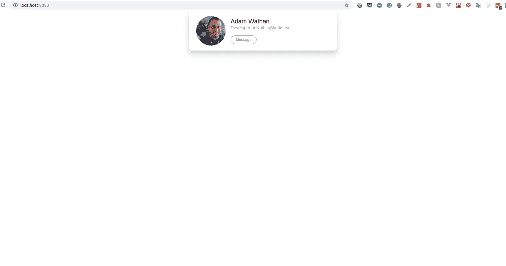

# 用 React - LogRocket Blog 为 Tailwind CSS 从头开始配置 webpack

> 原文：<https://blog.logrocket.com/webpack-from-scratch-for-tailwind-css-with-react/>

在本教程中，我们将通过配置 webpack 来使用 React 和 Tailwind CSS。在我们深入研究配置之前，让我们先来看一下相关技术的概述。

### 网络包

webpack 是一个捆绑和优化前端资产(JS、CSS 和 Images)的极好工具。webpack 使用一个配置文件来决定如何将特定的东西加载到您的应用程序中。您在配置文件中编写命令，说明资产的位置以及如何加载它们。然后，当你运行它时，它进入你的应用程序入口点(你的应用程序加载的基础文件),读取它并计算出它到底需要什么，它需要它的顺序，以及每一部分依赖于什么。

然后它将创建一些包，优化它们，并作为脚本包含在您的应用程序中。它不在页面加载期间运行，而是在开发期间运行。它还允许您轻松地使用来自 NPM(节点包管理器)的其他包。

### 反应

正如您可能已经意识到的，React 是一个简单、现代的前端库，用于构建优雅的用户界面。它通过有效地处理 DOM 操作和事件处理，减少了构建通用 UI 的工作量，产生了更可预测和更易于调试的代码。

在 React 之前，jQuery 等其他库被用来操作 DOM。但是随着网络的发展，更多的框架如 Angular、Vue 和 React 开始出现。React 与其他包的不同之处在于，它允许您创建自己的 HTML 元素(通常包装在组件中),并具有定制的功能。

### 顺风 CSS

Tailwind 是一个实用至上的 CSS 框架，用于快速构建定制用户界面。我喜欢 Tailwind CSS 的一点是，它没有任何预定义的组件，而是提供了高度可组合的低级实用程序类。

它把所有的魔力都留在了你的手里，并不能帮助你决定你的网站应该是什么样子。这使得你的网站在每一个新的设计中看起来和感觉上都是独一无二的。

因为它首先是实用程序，所以你需要做的就是将这些实用程序类应用到你的 HTML 标签中。只使用顺风 CSS 或者只添加少量 CSS 就可以建立一个功能齐全的网站。

## 假设和前提条件

本教程假设您已经预安装了以下软件:

**包装经理:npm 或纱线**

> 如果您愿意，您可以使用 Yarn，尽管命令会略有不同。

在我们开始之前，这里是我们将在本教程中一起设置的功能的完整列表:

*   网络包 4
*   `webpack-bundle-analyzer`
*   `webpack-dev-server`
*   反应 16
*   反应 DOM
*   顺风 CSS
*   `autoprefixer` *(顺风 CSS 所需)*
*   `postcss-cli` *(顺风 CSS 所需)*
*   `css-loader` *(编译 CSS 文件)*
*   `postcss-loader` *(编译顺风 CSS 文件)*
*   `babel-loader` *(反应所需)*
*   `@babel/core` *(反应所需)*
*   `@babel/preset-env` *(反应所需)*
*   `@babel/preset-react` *(反应所需)*
*   `@babel/cli` *(反应所需)*

至此，我们清楚地了解了所涉及的每项技术，让我们将它们配置为协同工作。

## 安装 web 包

让我们从创建一个新目录开始。在您的终端中，键入:

```
mkdir rect_test 
```

首先，我们进入新目录，然后初始化一个`package.json`文件:

```
cd rect_test
npm init 
```

回答提示或键入`npm init -y`如果您想跳过提示。`**package.json**`内的
如果不存在的话添加这个。

```
{
  "name": "rect_test"
  "version": "1.0.0",
  "main": "index.js",
  "license": "MIT"
} 
```

现在我们需要在我们的机器上安装 webpack。您可以在本地(仅项目)或全局安装它。出于我们的目的，我们将把它作为一个开发依赖项和`webpack-cli`来安装，这样我们就可以在终端中使用它。在您的终端中，键入以下命令:

```
npm i webpack webpack-cli -D 
```

现在我们需要为我们的应用程序创建一个入口点(应用程序启动时加载的页面)。为此:

*   创建一个`src`文件夹，并在其中创建一个`index.js`文件。
*   更新您的`package.json`的脚本部分，如下所示:

```
"scripts": {
    "start": "webpack --mode development",
    "build": "webpack --mode production"
} 
```

要测试我们到目前为止的进度，请在您的终端中键入:

```
npm run start 
```

您应该会看到以下输出:


如果您看到这个，那么 webpack 已经启动并正常运行。

## 添加反应

现在我们准备安装 React。但是为了让 React 工作，我们需要安装 Babel，因为一些浏览器还不支持 ES6。

所以，我们将 React 作为依赖项安装，Babel 作为开发依赖项安装。在您的终端中，键入:

```
npm i react react-dom -S 
```

然后安装`babel-core`、`babel-loader`、`babel-preset-env`和`babel-preset-react`作为开发依赖项:

```
npm i babel-loader @babel/core @babel/preset-env @babel/preset-react @babel/cli -D 
```

现在我们需要创建和配置我们的`**webpack.config.js**`。在您的项目根目录中，创建该文件并向其中添加以下内容:

```
module.exports = {
  module: {
    rules: [
      {
        test: /\.js$/,
        exclude: /node_modules/,
        use: {
          loader: "babel-loader"
        }
      }
    ]
  }
}; 
```

我们现在需要创建一个名为`.babelrc`的单独文件来为`babel-loader`提供配置选项。当你在你的 webpack 配置中声明你正在使用`babel-loader`时，它会寻找一个`.babelrc`文件，如果有的话。在您的终端中键入:

```
touch .babelrc 
```

现在向其中添加以下代码:

```
{
  "presets": ["@babel/preset-env", "@babel/preset-react"]
} 
```

此时，我们还需要在`src`文件夹中创建一个`index.html`文件，我们可以在其中添加带有 id 索引的 section 元素。

这是我们渲染主要 React 组件的地方:`src`文件夹下的
创建一个`index.html`文件，并向其中添加以下几行:

```
<!DOCTYPE html>
<html lang="en">
<head>
  <meta charset="UTF-8">
  <meta name="viewport" content="width=device-width, initial-scale=1.0">
  <meta http-equiv="X-UA-Compatible" content="ie=edge">
  <title>React, Webpack and TailwindCSS</title>
</head>
<body>
  <section id="index"></section>
</body>
</html> 
```

现在我们需要安装`html-webpack-plugin`并在我们的 webpack 配置文件中使用它。它将为您的应用程序生成一个 HTML 文件，或者您可以提供一个模板。它还会缩小文件。

要在您的终端类型中安装`html-webpack-plugin`作为开发依赖项:

```
npm i html-webpack-plugin -D 
```

现在更新您的 webpack 配置文件，如下所示:

```
const HtmlWebPackPlugin = require("html-webpack-plugin");

module.exports = {
  module: {
    rules: [
      {
        test: /\.js$/,
        exclude: /node_modules/,
        use: {
          loader: "babel-loader"
        }
      }
    ]
  },
  plugins: [
    new HtmlWebPackPlugin({
    template: "./src/index.html",
    filename: "./index.html"
  });
]
}; 
```

现在 React 已成功设置，我们需要设置一个开发服务器，以便在我们启动应用程序时，它会出现在浏览器中，并在我们更改文件时自动更新。

在您的终端中键入:

```
npm i webpack-dev-server -D 
```

现在更新您的`package.json`文件中的脚本对象，如下所示:

```
 "scripts": {
    "start": "webpack-dev-server --mode development",
    "build": "webpack --mode production"
  }, 
```

## 添加顺风 CSS

此时，我们需要安装 Tailwind CSS 及其依赖项，然后对其进行配置以供使用。在您的终端中，键入:

```
npm install tailwindcss autoprefixer postcss-cli mini-css-extract-plugin postcss-loader --save-dev 
```

接下来，我们生成一个顺风配置文件。在您的终端中键入:

```
./node_modules/.bin/tailwind init tailwind.config.js 
```

该命令将在项目的根目录下生成一个`**tailwind.config.js**`文件。

现在让我们配置`PostCSS`，这样我们就可以使用它将 Tailwind 指令转换为纯 CSS，在项目的根目录下，创建一个名为`postcss.config.js`的文件，并添加以下代码:

```
const tailwindcss = require('tailwindcss');
module.exports = {
    plugins: [
        tailwindcss('./tailwind.config.js'),
        require('autoprefixer'),
    ],
}; 
```

现在我们需要告诉 webpack 在每次更改时要观察和重建什么 CSS 文件。

* * *

### 更多来自 LogRocket 的精彩文章:

* * *

在您的 **src/** 目录中创建一个`**styles.css**`，并向其中添加以下代码行:

> 这也是您可以添加自定义 CSS 文件的地方。

```
@tailwind preflight;

@tailwind components;

@tailwind utilities; 
```

因为我们将 CSS 文件导入到 React 组件中，所以我们需要安装`css-loader`模块来解决它们。一旦解决了这个问题，我们还需要一个`style-loader`将它注入到我们的 DOM 中，方法是在 HTML 的`head`元素中添加一个`style`标签。在您的终端中，键入:

```
npm i css-loader style-loader -D 
```

现在更新您的 webpack 配置文件，如下所示:

```
const HtmlWebPackPlugin = require("html-webpack-plugin");
const MiniCssExtractPlugin = require("mini-css-extract-plugin");

module.exports = {
  module: {
    rules: [
      {
        test: /\.js$/,
        exclude: /node_modules/,
        use: {
          loader: "babel-loader"
        }
      },
       {
        test: /\.css$/,
        use: [
          MiniCssExtractPlugin.loader,
          "css-loader", "postcss-loader",
          ],
      },
    ]
  },
  plugins: [
    new MiniCssExtractPlugin({
      filename: "styles.css",
      chunkFilename: "styles.css"
    }),
    new HtmlWebPackPlugin({
    template: "./src/index.html",
    filename: "./index.html"
  }),
]
}; 
```

## 测试

是时候看看我们到目前为止做了些什么了。打开您的`index.js`，添加直接从顺风网站复制的以下几行:

```
import React from "react";
import ReactDOM from "react-dom";
import './styles.css';

const Index = () => {
  return <div className="bg-white mx-auto max-w-sm shadow-lg rounded-lg overflow-hidden">
  <div className="sm:flex sm:items-center px-6 py-4">
    
    <div className="text-center sm:text-left sm:flex-grow">
      <div className="mb-4">
        <p className="text-xl leading-tight">Adam Wathan</p>
        <p className="text-sm leading-tight text-grey-dark">Developer at NothingWorks Inc.</p>
      </div>
      <div>
        <button className="text-xs font-semibold rounded-full px-4 py-1 leading-normal bg-white border border-purple text-purple hover:bg-purple hover:text-white">Message</button>
      </div>
    </div>
  </div>
</div>;
};

ReactDOM.render(<Index />, document.getElementById("index")); 
```

在您的终端中运行`npm start`，您应该会在浏览器中看到这个。



## 结论

在这篇文章中，我们已经学习了如何安装和配置 webpack 来使用 Tailwind CSS 和 React。如果你充分利用这些新知识，还有很多更棒的事情可以实现。黑进去。

## 使用 LogRocket 消除传统反应错误报告的噪音

[LogRocket](https://lp.logrocket.com/blg/react-signup-issue-free)

是一款 React analytics 解决方案，可保护您免受数百个误报错误警报的影响，只针对少数真正重要的项目。LogRocket 告诉您 React 应用程序中实际影响用户的最具影响力的 bug 和 UX 问题。

[ ](https://lp.logrocket.com/blg/react-signup-general) [  ](https://lp.logrocket.com/blg/react-signup-general) [LogRocket](https://lp.logrocket.com/blg/react-signup-issue-free)

自动聚合客户端错误、反应错误边界、还原状态、缓慢的组件加载时间、JS 异常、前端性能指标和用户交互。然后，LogRocket 使用机器学习来通知您影响大多数用户的最具影响力的问题，并提供您修复它所需的上下文。

关注重要的 React bug—[今天就试试 LogRocket】。](https://lp.logrocket.com/blg/react-signup-issue-free)

* * *