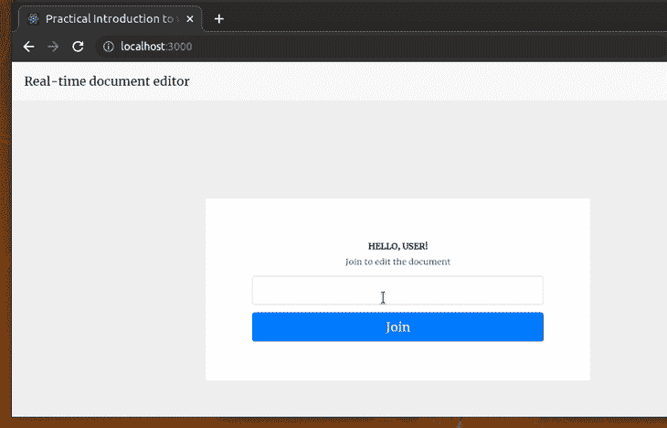
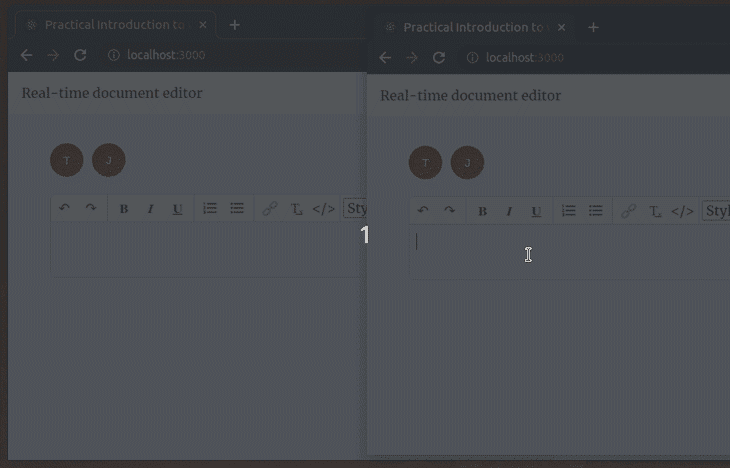
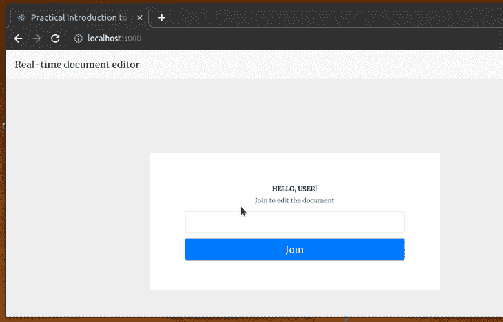

# WebSockets 教程:如何实时使用 Node 和 React - LogRocket 博客

> 原文：<https://blog.logrocket.com/websocket-tutorial-real-time-node-react/>

***编者按**:本 WebSockets 教程最后一次更新是在 2022 年 12 月 23 日，将示例应用升级到 React v18，采用钩子和功能组件，并使用`react-use-websocket`库来处理 WebSockets。*

以前，大多数 web 应用程序都有一个紧密连接的后端和前端，因此应用程序将数据和视图内容一起提供给用户的浏览器。如今，我们通常开发松散耦合的、独立的后端和前端，通过面向网络的通信线路将两者连接起来。

例如，开发人员经常使用 RESTful 模式和 HTTP 协议来实现前端和后端之间的通信线路，以便进行数据传输。但是基于 HTTP 的 RESTful 概念使用的是单工通信(单向)，所以如果不实现轮询之类的变通方法，我们就不能直接从客户端(前端)向服务器(后端)发送数据。

WebSocket 协议解决了传统 HTTP 模式的这一缺点，提供了全双工(或双向)通信机制，并帮助开发人员构建实时应用程序。

在本文中，我将解释 WebSocket 协议背后的理论概念，并演示如何使用 WebSocket 协议构建一个具有 Node.js 后端和 React 前端的实时协作文档编辑应用程序。

向前跳:

## 什么是 WebSocket 协议？

WebSocket 协议通过单个 TCP 套接字连接在客户端和服务器之间提供持久、实时、全双工的通信。

WebSocket 协议只有两个目的:开启握手和帮助数据传输。一旦服务器接受客户端发送的握手请求并发起 WebSocket 连接，它们就可以随意地以较少的开销互相发送数据。

WebSocket 通信通过使用 WS(端口 80)或 WSS(端口 443)协议的单个 TCP 套接字进行。除了 Opera Mini 之外，几乎所有的浏览器在编写的时候都提供了令人钦佩的对 WebSockets 的支持，根据[我可以使用](https://caniuse.com/#feat=websockets)。

下面的视频解释了与传统 HTTP 协议相比，WebSocket 协议的工作原理及其对用户的益处:

 [https://www.youtube.com/embed/LenNpb5zqGE?version=3&rel=1&showsearch=0&showinfo=1&iv_load_policy=1&fs=1&hl=en-US&autohide=2&wmode=transparent](https://www.youtube.com/embed/LenNpb5zqGE?version=3&rel=1&showsearch=0&showinfo=1&iv_load_policy=1&fs=1&hl=en-US&autohide=2&wmode=transparent)

视频

## WebSocket 与 HTTP 轮询、HTTP 流和服务器发送的事件有什么不同？

历史上，创建需要实时数据的 web 应用程序(如游戏或聊天应用程序)需要滥用 HTTP 协议来建立双向数据传输。有多种方法用于实现实时功能，但没有一种方法像 WebSocket 那样高效。HTTP 轮询、HTTP 流、 [Comet](https://en.wikipedia.org/wiki/Comet_(programming)) 和 SSE(服务器发送事件)都有它们的缺点。

### HTTP 轮询

解决这个问题的第一个尝试是定期轮询服务器。正常的轮询方法根据客户端定义的时间间隔频繁地从服务器获取数据(通常使用`setInterval`或递归`setTimeout`)。另一方面，长轮询方法类似于普通轮询，但是服务器处理超时/等待时间。

HTTP 长轮询生命周期如下:

1.  客户端发出请求并等待响应
2.  服务器会推迟响应，直到发生更改、更新或超时。请求保持“挂起”状态，直到服务器有东西返回给客户机
3.  当服务器端发生一些变化或更新时，它会向客户端发回一个响应
4.  客户端发送一个新的长轮询请求来监听下一组更改

长轮询有很多漏洞——报头开销、延迟、超时、缓存等等。

### HTTP 流

这种机制免除了网络延迟的痛苦，因为初始请求是无限期开放的。即使在服务器推送数据之后，请求也不会终止。HTTP 流的前三种生命周期方法在 HTTP 长轮询中是相同的。

然而，当响应被发送回客户机时，请求永远不会终止；服务器保持连接打开，并在有变化时发送新的更新。

### 服务器发送的事件(SSE)

使用 SSE，服务器将数据推送到客户端，类似于 HTTP 流。SSE 是 HTTP 流概念的标准化形式，带有一个内置的浏览器 API。聊天或游戏应用程序不能完全依赖 SSE。例如，SSE 的完美用例是脸书新闻提要:每当有新的帖子进来，服务器就把它们推到时间线上。SSE 通过传统的 HTTP 发送，并且对打开的连接数有限制。

从 GitHub Gist 文件中了解更多关于 SSE 架构的信息。与 WebSockets 相比，这些方法不仅效率低下。其中的代码似乎是一种变通方法，使请求-应答类型的协议类似于全双工。

## 为什么应该使用 WebSockets

WebSockets 旨在取代现有的双向通信方法。当涉及全双工实时通信时，上述现有方法既不可靠也不高效。

WebSockets 类似于 SSE，但同样成功地将消息从客户端传回服务器。连接限制不再是问题，因为数据是通过单个 TCP 套接字连接提供的。

## 如何将 WebSockets 与 Node.js 和 React 一起使用

正如介绍中提到的，WebSocket 协议只有两个目的:1)建立握手，2)帮助数据传输。让我们看看 WebSockets 如何实现这些议程。为此，我将剥离 Node.js 服务器并[将其连接到用 React.js](https://blog.logrocket.com/beyond-rest-using-websockets-for-two-way-communication-in-your-react-app-884eff6655f5/) 构建的客户端。

首先，下载或者克隆这个 GitHub 库到你的电脑上。这个存储库包含示例协作文档编辑应用程序的源代码。用你最喜欢的代码编辑器打开它。您将看到如下两个目录:

*   `server`:node . js web socket 服务器，处理文档编辑器的后端逻辑
*   `client`:React 应用程序，连接到 WebSocket 服务器以获得实时特性

您可以使用以下命令启动文档编辑器应用程序:

```
#-- Setup and start the server
cd server
npm install # or yarn install
npm start # or yarn start

#-- Setup and start the client
cd client
npm install # or yarn install
npm start # or yarn start

```

使用上述命令运行应用程序，尝试用两个浏览器窗口打开它，然后从两个浏览器窗口编辑文档:



让我们研究一下源代码，了解一下它是如何使用 WebSockets 工作的！

## 议程 1: WebSocket 在服务器和客户端之间建立握手

### 使用 Node.js 在服务器级别创建握手

我们可以利用单个端口来分离 HTTP 服务器并附加 WebSocket 服务器。下面的要点(摘自`server/index.js`)展示了一个简单 HTTP 服务器的创建。一旦它被创建，我们将 WebSocket 服务器绑定到 HTTP 端口:

```
const { WebSocketServer } = require('ws');
const http = require('http');

// Spinning the http server and the WebSocket server.
const server = http.createServer();
const wsServer = new WebSocketServer({ server });
const port = 8000;
server.listen(port, () => {
  console.log(`WebSocket server is running on port ${port}`);
});

```

在示例项目中，我使用流行的`[ws](https://github.com/websockets/ws)`库将 WebSocket 服务器实例附加到 HTTP 服务器实例。一旦 WebSocket 服务器连接到 HTTP 服务器实例，它将通过将协议从 HTTP 升级到 WebSocket 来接受传入的 WebSocket 连接请求。

在我的代码中，我将所有连接的客户端作为一个对象进行维护，在从浏览器接收到它们的请求时，通过 [`uuid`](https://github.com/uuidjs/uuid) 包生成一个唯一的键:

```
// I'm maintaining all active connections in this object
const clients = {};

// A new client connection request received
wsServer.on('connection', function(connection) {
  // Generate a unique code for every user
  const userId = uuidv4();
  console.log(`Recieved a new connection.`);

  // Store the new connection and handle messages
  clients[userId] = connection;
  console.log(`${userId} connected.`);
});

```

## 当 HTTP 连接被接受时

当发送常规 HTTP 请求以建立连接时，在请求头中，客户机发送`Sec-WebSocket-Key`。服务器对这个值进行编码和散列，并添加一个预定义的 GUID。它回显服务器发送的握手中的`Sec-WebSocket-Accept`中生成的值。

一旦请求在服务器中被接受(在产品中进行必要的验证之后)，握手就用[状态码](https://developer.mozilla.org/en-US/docs/Web/HTTP/Status/101) [`101`](https://developer.mozilla.org/en-US/docs/Web/HTTP/Status/101) (交换协议)完成。如果您在浏览器中看到除了状态代码`101`之外的任何内容，WebSocket 升级已经失败，将遵循正常的 HTTP 语义。

`Sec-WebSocket-Accept`头字段指示服务器是否愿意接受连接。同样，如果响应缺少一个`Upgrade`头字段，或者`Upgrade`不等于`websocket`，这意味着 WebSocket 连接失败。

成功的 WebSocket 服务器握手如下所示:

```
HTTP GET ws://127.0.0.1:8000/ 101 Switching Protocols
Connection: Upgrade
Sec-WebSocket-Accept: Nn/XHq0wK1oO5RTtriEWwR4F7Zw=
Upgrade: websocket

```

## 在客户端级别创建握手请求

在客户端级别，我使用`[react-use-websocket](https://github.com/robtaussig/react-use-websocket)`库来启动 WebSocket 连接。我们也可以使用内置的 WebSocket 浏览器 API，不需要任何第三方包，但是在 React 功能组件中直接使用浏览器 API 通常会生成复杂的代码。

作为一个解决方案，我们可以为 WebSocket 连接创建一个定制的 React 钩子，但是之后我们将重新发明轮子并创建一个`react-use-websocket`克隆。`react-use-websocket`提供了`useWebSocket`钩子来管理 React 功能组件的 WebSocket 连接。查看`react-use-websocket`文档，更加熟悉特定 React 吊钩的设计。

一旦请求被服务器接受，我们将在浏览器控制台上看到`WebSocket connection established`。

下面是通过`App`组件(在`client/src/App.js`中)创建到服务器的连接的初始框架:

```
import React from 'react';
import useWebSocket from 'react-use-websocket';

import './App.css';

const WS_URL = 'ws://127.0.0.1:8000';

function App() {
  useWebSocket(WS_URL, {
    onOpen: () => {
      console.log('WebSocket connection established.');
    }
  });

  return (
    <div>Hello WebSockets!</div>
  );
}

export default App;

```

客户端发送以下头来建立握手:

```
HTTP GET ws://127.0.0.1:8000/ 101 Switching Protocols
Upgrade: websocket
Connection: Upgrade
Sec-WebSocket-Key: vISxbQhM64Vzcr/CD7WHnw==
Origin: http://localhost:3000
Sec-WebSocket-Version: 13

```

现在客户机和服务器通过 WebSocket 握手事件连接起来了，WebSocket 连接可以在接收消息的同时传输消息，从而实现了 WebSocket 协议的第二个议程。

## 议程 2:实时信息传输



用户可以在示例 React 应用程序中加入并编辑文档。该应用程序跟踪两个事件:

1.  **用户活动:**每次用户加入或离开时，我都会将消息广播给所有其他连接的客户端
2.  **内容更改:**每次编辑器中的内容发生更改时，都会广播到所有其他连接的客户端

该协议允许我们以二进制数据或 UTF-8 的形式发送和接收消息(注意，传输和转换 UTF-8 的开销较小)。

只要我们很好地理解了套接字事件:`onopen`、`onclose`和`onmessage`，理解和实现 WebSockets 是非常容易的。客户端和服务器端的术语是相同的。

## 使用`react-use-websocket`在客户端发送和收听消息

在客户端，当新用户加入或内容发生变化时，我们使用`sendJsonMessage`向服务器发送一条消息，将新信息发送到服务器:

```
/* When a user joins, I notify the
server that a new user has joined to edit the document. */
function LoginSection({ onLogin }) {
  const [username, setUsername] = useState('');
  useWebSocket(WS_URL, {
    share: true,
    filter: () => false
  });
  function logInUser() {
    if(!username.trim()) {
      return;
    }
    onLogin && onLogin(username); // Triggers sendJsonMessage in App
  }
  // ----
  // ----

/* When content changes, we send the
current content of the editor to the server. */
function handleHtmlChange(e) {
  sendJsonMessage({
    type: 'contentchange',
    content: e.target.value
  });
}

return (
  <DefaultEditor value={html} onChange={handleHtmlChange} />
);

```

监听来自服务器的消息非常简单。例如，看看`History`组件如何监听用户事件并呈现活动日志:

```
function History() {
  const { lastJsonMessage } = useWebSocket(WS_URL, {
    share: true,
    filter: isUserEvent
  });
  const activities = lastJsonMessage?.data.userActivity || [];
  return (
    <ul>
      {activities.map((activity, index) => <li key={`activity-${index}`}>{activity}</li>)}
    </ul>
  );
}

```

这里我们使用了`share: true`设置来重用我们在`App`组件中启动的现有 WebSocket 连接。默认情况下，每当 WebSocket 连接收到来自服务器的新消息并且连接状态改变时，`useWebSocket`钩子会重新呈现组件。

因此，`History`组件将为用户和编辑者事件重新呈现。因此，作为性能增强，我们使用`filter: isUserEvent`设置只为用户事件重新呈现组件。

## 在 Node.js WebSocket 服务器上发送和侦听消息

在服务器中，我们只需捕获传入的消息，并将其广播给连接到 WebSocket 的所有客户端。而这也是臭名昭著的[插座的区别之一。IO](https://blog.logrocket.com/building-real-time-location-app-node-js-socket-io/) 和 WebSocket:我们在使用 WebSocket 时需要手动发送消息给所有客户端。插座。IO 是一个成熟的库，所以它可以自己处理。

了解我们如何处理后端广播:

```
function broadcastMessage(json) {
  // We are sending the current data to all connected active clients
  const data = JSON.stringify(json);
  for(let userId in clients) {
    let client = clients[userId];
    if(client.readyState === WebSocket.OPEN) {
      client.send(data);
    }
  };
}

```



## 浏览器关闭后会发生什么？

当浏览器关闭时，WebSocket 调用`close`事件，这允许我们编写逻辑来终止当前用户的连接。在我的代码中，当用户离开文档时，我向其余用户广播一条消息:

```
function handleDisconnect(userId) {
    console.log(`${userId} disconnected.`);
    const json = { type: typesDef.USER_EVENT };
    const username = users[userId]?.username || userId;
    userActivity.push(`${username} left the document`);
    json.data = { users, userActivity };
    delete clients[userId];
    delete users[userId];
    broadcastMessage(json);
}

// User disconnected
connection.on('close', () => handleDisconnect(userId));

```

## 结论

WebSockets 是在应用程序中实现实时功能的最有趣和最方便的方式之一。它为我们利用全双工通信提供了很大的灵活性。我强烈建议在试用 Socket 之前先使用 WebSocket。IO 和其他可用的库。

编码快乐！🙂

## 使用 LogRocket 消除传统反应错误报告的噪音

[LogRocket](https://lp.logrocket.com/blg/react-signup-issue-free)

是一款 React analytics 解决方案，可保护您免受数百个误报错误警报的影响，只针对少数真正重要的项目。LogRocket 告诉您 React 应用程序中实际影响用户的最具影响力的 bug 和 UX 问题。

[ ](https://lp.logrocket.com/blg/react-signup-general) [  ](https://lp.logrocket.com/blg/react-signup-general) [LogRocket](https://lp.logrocket.com/blg/react-signup-issue-free)

自动聚合客户端错误、反应错误边界、还原状态、缓慢的组件加载时间、JS 异常、前端性能指标和用户交互。然后，LogRocket 使用机器学习来通知您影响大多数用户的最具影响力的问题，并提供您修复它所需的上下文。

关注重要的 React bug—[今天就试试 LogRocket】。](https://lp.logrocket.com/blg/react-signup-issue-free)