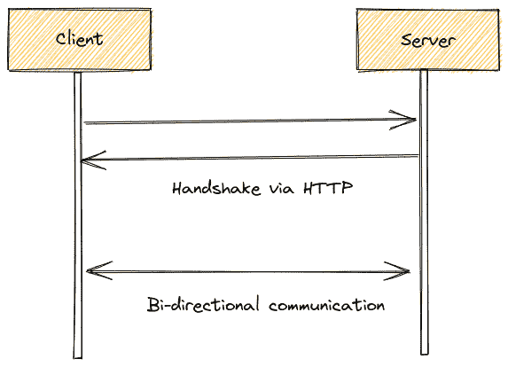
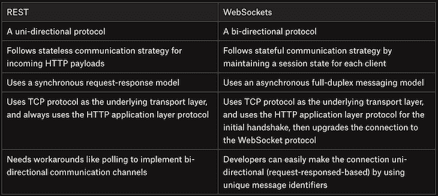
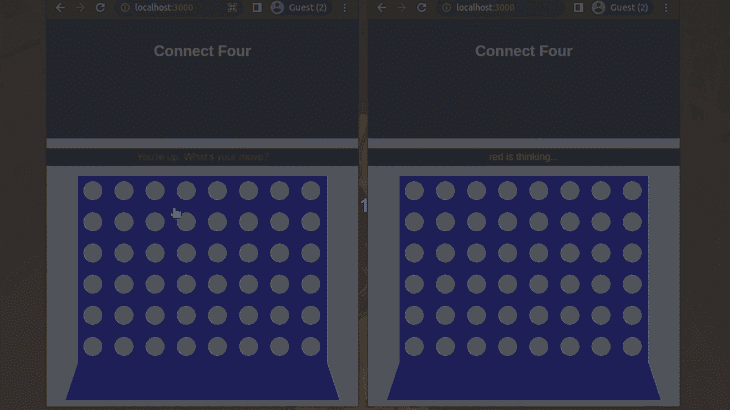
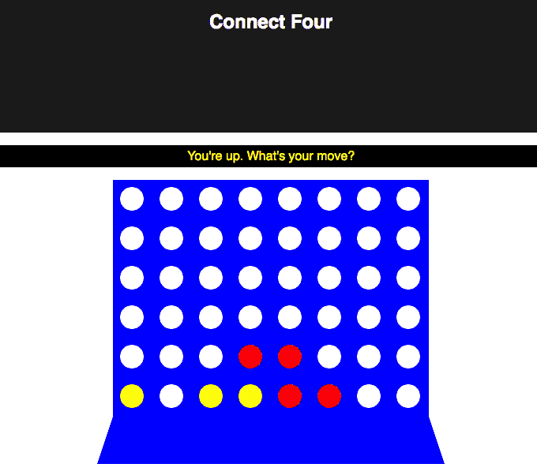
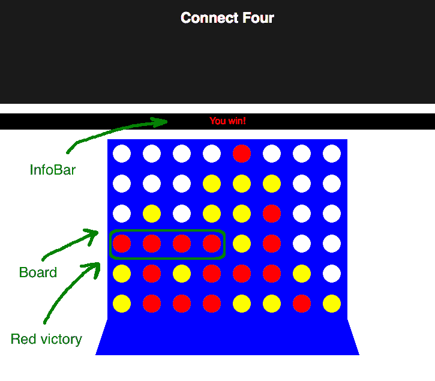

# 在 React apps 中使用 WebSockets 进行双向通信

> 原文：<https://blog.logrocket.com/websockets-two-way-communication-react-app/>

***编者按:**本文于 2022 年 4 月 10 日更新，以确保代码块与 React 18 一致，并保持与 Socket IO v4.x 相关的依赖关系最新*

REST 是 web APIs 无可争议的冠军。它抛弃了旧的 SOAP 及其冗长的 XML，转而支持 JSON 而不是 HTTP。REST 也有基于资源和动词的复杂概念模型。

但是，REST 并不是所有基于网络的交流问题的完美解决方案。开发人员竭尽全力，试图将所有的通信和数据交换需求融入 RESTful 模式。

如今，现代软件开发团队倾向于在传统的 RESTful 模式上使用 WebSockets、GraphQL、gRPC 和 HTTP/2 来开发他们的 web 服务通信。Web 开发人员经常选择 WebSockets 来构建现代实时 web 应用程序。

这篇文章是关于 WebSockets 的。您将了解到:

我们的演示将让您构建一个很酷的客户端-服务器游戏 Connect4，Node 在后端，React+SVG 在前端，服务器和客户端之间的所有通信都通过 WebSockets 运行。

## 什么是 WebSockets？

WebSockets 是一种基于连接的通信协议，支持全双工实时通信。

你会问，这有什么大不了的？为了满足这种需求，我们从一开始就有了 TCP。

的确如此，但 TCP 是一种低级通信协议，不能作为 web API 在浏览器中供 web 开发人员使用。

每个现代的 web 浏览器都支持 WebSockets，每个流行的后端语言都有 WebSocket 服务器库，作为第三方模块或标准库模块。在 WebSockets 出现之前，您只能在 web 浏览器中执行 HTTP 请求-响应操作。

然而，WebSockets 是基于消息的——这意味着你发送一条消息，另一端接收一条消息。WebSockets 是在 TCP 之上实现的，但是原始 TCP 是基于流的。你发送一串字节(八位字节),另一端必须找出如何累积它们，并把它们分解成连贯的消息。WebSockets 帮你做到了，对开发者帮助很大。

让我们看下图，了解 WebSocket 客户端和服务器全双工通信通道是如何形成的:



如上图所示，客户端首先倾向于通过发送 HTTP 请求来初始化与服务器的 WebSocket 连接。

接下来，服务器通过回复一个 HTTP 响应来初始化 WebSocket 连接，从而完成 WebSocket 握手。

一旦建立了连接，客户端和服务器都可以使用 WebSocket 协议消息异步地相互发送消息。

## WebSockets 有什么用？

当服务器想要推送大量数据和/或频繁更新浏览器时(想想多人游戏或聊天服务)，WebSockets 真的很有用。传统的 RESTful 模式是一种基于同步请求-响应的机制，不适合全双工实时场景。请看下面 RESTful 方法和 WebSockets 之间的比较:



考虑一个游戏，其中一个玩家执行的每个操作都必须尽快传达给其他玩家。

如果你试图用 REST 来实现它，你可能会求助于一些轮询机制，所有玩家不断地用更新请求轰炸服务器。

这个场景有几个问题:

*   服务器必须处理大量的请求，即使它没有什么新的东西要报告
*   如果玩家变得更好并且不经常投票，滞后将会存在并增长
*   服务器必须保持最近的状态，直到所有玩家都得到通知，并想出一个解决方案来与客户端协调版本控制
*   如果一个客户机掉线，服务器没有好的方法知道它

有了 WebSockets，所有这些问题都迎刃而解了——服务器处于控制之中，它确切地知道每次有多少客户端被连接。

当有值得做的事情发生时，它可以立即更新所有连接的客户端，并且 HTTP 轮询机制没有延迟。一旦通知了所有客户端，服务器就不需要保持状态，此外，如果客户端断开连接，服务器会立即得到通知。

## 使用 WebSockets 构建 Connect4 风格的演示应用程序

聊天服务是 WebSockets 的杀手级应用。如果浏览器中没有 WebSockets，逐字符更新甚至仅仅是消息:“X 正在输入…”是不可能的。

让我们构建一个 Connect4 游戏来演示 WebSockets 是如何工作的。

* * *

### 更多来自 LogRocket 的精彩文章:

* * *

将会有一个管理游戏状态的服务器和两个互相对战的玩家。服务器负责管理棋盘，确保玩家只进行有效的移动，告诉每个玩家何时轮到他们，检查胜利条件，并通知玩家。

客户端是一个基于 React 的应用程序。它显示来自服务器的公告板和消息。当服务器发送更新的公告板或消息时，客户端更新其状态，React 负责更新显示。

当轮到玩家时，客户端还负责响应板上的点击，并通知服务器。

(注:Connect4 游戏根本没有优化。每次都发送整个板，而不只是更改，即使可以组合，我也发送多个消息。这是有意的——我这样做是为了展示 WebSockets 是多么简单和用户友好。代码非常简单易读，唯一有点复杂的方面是检查胜利，它在服务器端有自己的功能)

它看起来是这样的:



## 项目结构

在我们深入研究代码之前，让我们快速找到它并检查它的结构。

服务器和客户端的代码都可以在[这个](https://github.com/codezri/connect4-websockets) GitHub 仓库中找到。在您的工作目录中克隆 GitHub 存储库，用您最喜欢的代码编辑器打开它，开始检查源代码。

您会注意到，整个服务器都在一个文件中，即 [server.js](https://github.com/codezri/connect4-websockets/blob/master/server.js) ，而客户端是使用 [Create React App (CRA)](https://blog.logrocket.com/tag/create-react-app) 创建的，它创建了自己的目录结构。我把所有的东西都移到了客户端子目录中，以隔离前端代码和后端代码。

有两个自述文件。

README.md 是一个简洁的文件，对该应用程序及其使用方法进行了简短描述。

README2.md 是由 CRA 生成的文件，其中包含了许多关于使用 CRA 启动项目的好处的信息。

现在，安装依赖项并运行以下命令来启动游戏:

```
npm run dev
# or
yarn dev

```

上面的命令在开发模式下启动服务器和客户端。在两个浏览器窗口中同时打开游戏，并尝试玩游戏。

让我们深入源代码，研究每个模块。

## 构建 Connect4 服务器

服务器是一个 Node.js 应用程序，它使用 [socket.io](https://socket.io/) 作为 WebSockets 服务器。启动所需要的只是一个监听端口 1337 的 WebSockets 服务器:

```
const { createServer } = require('http')
const { Server } = require('socket.io')

const httpServer = createServer()
const io = new Server(httpServer, {
  cors: {
    origin: '*'
  }
})
.
.
.
reset()
const port = 1337
httpServer.listen(port)
console.log('Listening on port ' + port + '...')

```

服务器超级简单；它一次只能运行一个游戏。游戏状态包括游戏板、两个玩家以及当前玩家是谁。

该板是一个 6×8 的 2D 阵列，其中所有单元最初都是白色的。我选择将玩家表示为一个具有两个属性的对象，`red`和`yellow`。这里不需要映射，因为键是字符串，我不需要迭代它们。每个玩家的值是他们的 WebSocket 连接引用，最初为空。

```
let board = null
const players = {'red': null, 'yellow': null}
let player = 'red'

function reset() {
  board = Array(6).fill(0).map(x => Array(8).fill('white'))
  players['red'] = null
  players['yellow'] = null
  player = 'red'
}

```

为什么保留一个`players`对象而不是两个变量？字符串`red`和`yellow`始终用于在服务器和客户端之间来回传递重要信息。

在服务器端，一切都发生在`io.on('connection', function(socket) {...}`内部。每当有新的客户端连接到服务器时，都会调用这个回调函数。

然后，服务器为各种事件和消息注册回调，我将很快介绍这一点。但是首先，服务器将套接字对象引用存储在`players`对象中。

第一个连接的客户端成为红色玩家；黄色是第二。服务器将断开任何进一步的连接尝试，以隔离当前的双人游戏会话。服务器也将发送给每个玩家他们的颜色和轮到谁了。

```
if (players['red'] == null) {
    players['red'] = socket
    socket.emit('color', 'red')
  } else if (players['yellow'] == null) {
    players['yellow'] = socket
    socket.emit('color', 'yellow')
    io.emit('turn', 'red')
  } else {
    socket.disconnect()
  }

```

用于向客户端发送消息的`emit()`函数有两种风格:

1.  `io.emit()`调用:这让服务器向所有连接的客户机广播相同的消息
2.  调用:这将消息发送给一个特定的客户端

这里要考虑的一个例子是，每个玩家需要得到不同的信息来知道他们的颜色，但是所有玩家需要得到相同的信息来告诉该轮到谁了。

然后，服务器继续为两个事件注册回调:`disconnect`和`click`。`disconnect`事件不是很有趣，只是把断开玩家的插座从玩家的物体上移除了。

## `click`事件

`click`事件是所有活动发生的地方。当活动玩家点击棋盘上的一列时，服务器接收到`click`事件并开始工作。首先，服务器验证点击是有效的。

在下列情况下，单击会被忽略:

*   轻言放弃
*   点击全栏(第一名已被占据)
*   当只有一个玩家连接时点击(如果没有人连接，那么没有人可以

    ```
    click)socket.on('click', function (column) { // Ignore players clicking when it's not their turn if (players[player] !== socket) { return } // Ignore clicks on full columns if (board\[0\][column] !== 'white') {   return }  // Ignore clicks before both players are connected if ((players['red'] == null) || (players['yellow'] == null)) {   return } 
    ```

一旦这一部分完成，服务器知道这是一个正确的点击，并继续处理它。然后，服务器在目标栏的顶部放置一个新棋子，并通过`board`消息将更新后的棋盘发送给所有玩家:

```
// find first open spot in the column
    let row = -1
    for (row = 5; row >= 0; --row) {
      if (board\[row\][column] === 'white') {
        board\[row\][column] = player
        break
      }
    }

io.emit('board', board)

```

现在，服务器需要检查当前玩家是否真的通过放置该棋子而获胜。它用当前放置棋子的位置调用`checkVictory()`函数，如果返回`true`，则表示当前玩家赢了。

然后服务器会用获胜玩家的颜色向两个玩家广播`victory`消息，断开两个玩家的连接，然后退出。

但是，如果玩家没有赢，玩家切换当前玩家，并用`turn`消息通知两个玩家。

```
// Check victory (only current player can win)
    if (checkVictory(row, column)) {
      io.emit('victory', player)
      // Disconnect players
      players['red'].disconnect()
      players['yellow'].disconnect()
      reset()
      return
    }

// Toggle the player
    player = player === 'red' ? 'yellow' : 'red'
    io.emit('turn', player)

```

## 检查胜利

服务器最复杂的部分是胜利检查。这不是火箭科学，但是如果你不小心的话，你很容易错过一些关键案例。让我们稍微讨论一下，然后看看一些代码。

要赢得 Connect4 游戏，玩家必须将四个相邻的棋子水平、垂直或对角对齐。如果一个玩家在一个回合中获胜，那么刚刚放置的棋子必须是四个相邻棋子的一部分。

简单的方法是从最后放置的棋子开始，然后在八个方向中的每一个方向检查玩家颜色的另外三个相邻的棋子。

但是，您可能会忽略放置的棋子位于序列中间的情况，如下图所示:



所以，正确的检查方法是双向进行，用玩家的颜色数出棋子总数。例如，当检查水平方向时，我们检查左侧和右侧。

这意味着我们只需要检查四个方向:水平、垂直、从左上角到右下角的对角线，以及从左下角到右上角的对角线。我们还需要注意，不要超出我们的检查范围。以下是水平检查的部分代码:

```
function checkVictory(i, j) {
  const c = board\[i\][j]

// Check horizontally
  let count = 0
  // count to the left
  for (let k = 1; k < 4; ++k) {
    if (j - k < 0) {
      break
    }
    if (board\[i\][j - k] !== c) {
      break
    }
    count++
  }
  // count to the right
  for (let k = 1; k < 4; ++k) {
    if (j + k > 7) {
      break
    }
    if (board\[i\][j + k] !== c) {
      break
    }
    count++
  }

if (count > 2) {
    return true
  }

```

我们向左向右最多数三个地方，遇到任何不是当前玩家颜色的东西就破。最后，如果计数超过 2，这意味着我们有一个 4 的序列，包括当前放置的棋子，这是一个胜利。

对垂直线和对角线的检查非常相似，除了索引稍有不同，在对角线的情况下，`i`和`j`都增加。

从[这里](https://github.com/codezri/connect4-websockets/blob/9f4874491aa7c94e2647e4ce634824f0c12c4f2e/server.js#L23)检查`checkVictory`功能的完整实现。

## WebSockets 和解决方案设计

WebSockets 很牛逼，但还是来说说基于 WebSockets 的解决方案设计吧。

客户端连接并向服务器发送`click`消息。服务器发送多条消息，如`board`、`color`和`turn`。

真的有必要将所有这些信息分开发送吗？不完全是。服务器可以发送包含所有内容的单个状态消息。

但是，如果您只发送一条消息，那么客户端代码将会更加复杂，因为它必须解析并找出发生了什么变化。

`board`消息提供了另一个决策点。在我们的演示应用程序中，我发送了整个棋盘，但是我也可以很容易地只发送最近放置棋子的位置。

如果是这种情况，那么应用前端实现必须将板状态存储在存储器中，并在接收到关于新放置的块的消息时适当地更新它，而不是仅仅接收整个板。

我们的应用前端的电路板渲染逻辑现在很简单，因为我们用`board`消息发送整个电路板矩阵。我们可以用下面的一行代码呈现新的电路板状态:

```
this.setState({...self.state, board: board})

```

此外，我们直接从服务器端发送`board`对象。但是，我们可以通过只发送更新后的电路板位置坐标来减少 WebSocket 消息的有效负载大小。但是，为了简单起见，我们将在本教程中发送整个电路板矩阵。

## 构建 Connect4 客户端

客户端是一个 React 应用程序，所有的动作都发生在`App`主组件中。它还有两个子组件:`Board`和`Infobar`。

### **`InfoBar`**componen**t**

 **`InfoBar`是一个无状态的功能组件，以玩家的颜色显示信息。它有一些嵌入的样式，并从其父节点接收消息和颜色作为属性:

```
import React from 'react'

const InfoBar = ({message, color}) => {
  let style = {color: color, 
               backgroundColor: 'black', 
               padding: '5px'};
  return <p style={style}>{message}</p>
}

export default InfoBar

```

### **`Board`**分量****

 **棋盘有趣多了。它必须处理点击，但它也是一个无状态的功能组件，对服务器或 WebSockets 一无所知。

它是如何工作的？

父组件`App`传递一个名为`onColumnClick`的回调函数作为道具——电路板只是用被点击的列调用这个回调函数。

关于棋盘的另一个很酷的事情是，它使用 [SVG](https://developer.mozilla.org/en-US/docs/Web/SVG) 来呈现棋盘和棋子——而不是传统的 DOM 元素。此外，它还根据玩家的回合改变鼠标指针。

让我们一点一点地分解它，以获得关于棋盘组件的道具的详细信息。

董事会接受了父母的三点支持。`board`道具是 6×8 2D 阵列，您在构建服务器时已经很熟悉了。`onColumnClick`属性是当点击一列时调用的回调函数，`yourTurn`是处理当前鼠标光标的布尔值。

接下来，板为稍后将被填充的单元定义一个空数组，并根据`yourTurn`属性将鼠标光标设置为指针或不放。

```
import React from 'react'

const Board = ({board, onColumnClick, yourTurn}) => {
  const cells = []
  const style = {cursor: yourTurn? 'pointer' : 'no-drop'}

```

这里，我们用电路板单元填充`cells`数组。每个单元格都是一个 SVG 组，有一个 50×50 像素的蓝色矩形，中间有一个圆。圆圈的颜色来自`board`道具，可以是红色、黄色或白色。

```
for (let i = 0; i < 6; ++i) {
  for (let j = 0; j < 8; ++j) {
    let cell =  onColumnClick(j)} 
                style={style}>

    cells.push(cell)
  }
}

```

最后，我们返回一个 440×360 px 的 SVG 元素，上面的单元格代表板子，后面是一个蓝色的梯形作为底部。

```
return <svg width={440} height={360}>
          {cells}
          <polygon points="20,300 0,360 440,360 420,300"
          fill={'blue'}/>
       </svg>
}
export default Board

```

### **`App`**分量****

 **`App`是主要部件。它负责渲染`InfoBar`和`board`组件，以及处理所有的通信。

它还使用了一点来自 App.css 的 CSS，为了与服务器通信，它使用了提供`io()`函数的 [Socket.io 库](https://socket.io/docs/v4/)。

```
import React, {Component} from 'react'
import './App.css'
import InfoBar from './components/InfoBar'
import Board from './components/Board'
import { io } from 'socket.io-client'

```

构造函数设置状态，包括:

*   *   与服务器表示相同的板
    *   总是显示在`InfoBar`中的信息
    *   `yourTurn`布尔

```
class App extends Component {
  constructor(props) {
    super(props)

    this.state = {
      board: Array(6).fill(0).map(x => Array(8).fill('white')),
      message: 'Waiting for another player...',
      yourTurn: false
    }

```

构造函数的下一部分是所有通信发生的地方。首先，`this`指针被存储为闭包中的`self`变量。这是 WebSockets 访问组件状态所必需的。

然后，app 构造函数为以下消息注册处理程序:

在每种情况下，构造函数都更新状态的相关部分。

(注意:处理程序是在构造函数中注册的，但是随着游戏的进行会被再次调用)

```
let self = this

socket.on('board', board => {
  this.setState({...self.state, board: board})
});

socket.on('color', color => {
  this.setState({...self.state, color: color})
});

socket.on('turn', player => {
  if (player === this.state.color) {
    this.setState({...self.state, message: "You're up. What's your move?", yourTurn: true})
  } else {
    this.setState({...self.state, message: player + ' is thinking...', yourTurn: false})
  }
});

socket.on('victory', player => {
  let newState = {yourTurn: false}
  if (player === this.state.color) {
    newState['message'] = 'You win!'
  } else {
    newState['message'] = 'You lose!'
  }
  this.setState({...self.state, ...newState})
});

```

还记得当点击一列时，电路板接收到的调用函数`onColumnClick`吗？这是一个只向服务器发送一条`click`消息的单行程序。

```
onColumnClick = column => socket.emit('click', column);

```

`render()`函数非常简单。它呈现标题，然后是`InfoBar`，然后是棋盘，从状态中传递必要的属性。

```
render() {
    return (
      <div className="App">
        <header className="App-header">
          <h1 className="App-title">Connect Four</h1>
        </header>
        <InfoBar color={this.state.color} 
                 message={this.state.message} />
        <Board board={this.state.board} 
               onColumnClick={this.onColumnClick} 
               yourTurn={this.state.yourTurn}/>
      </div>
    )
  }

```

这是一个带有胜利之箭的插图:



## 结论

WebSockets 对于客户机-服务器应用程序来说是一项伟大的技术，在这种应用程序中，服务器需要向客户机发送消息、事件或通知，而不需要不断地被提示或轮询。

例如，我们可以使用 WebSockets 构建实时聊天应用程序、基于浏览器的在线多人游戏和监控工具。WebSocket 有效负载比 HTTP 消息更轻量级，因此我们也可以使用 web socket 来构建实时 web 仪表板。

在这篇文章中，我们了解了使用 WebSockets 相对于 REST 的优势，并且我们通过一个节点服务器和 React 客户端的完整示例，这些客户端通过 WebSockets 进行通信，并一起实现了经典的 Connect4 游戏。作为奖励，我们使用 SVG 来渲染棋盘和棋子。

现在，是时候走出去，用 WebSockets 构建令人敬畏的东西了。

## 使用 LogRocket 消除传统反应错误报告的噪音

[LogRocket](https://lp.logrocket.com/blg/react-signup-issue-free)

是一款 React analytics 解决方案，可保护您免受数百个误报错误警报的影响，只针对少数真正重要的项目。LogRocket 告诉您 React 应用程序中实际影响用户的最具影响力的 bug 和 UX 问题。

[ ](https://lp.logrocket.com/blg/react-signup-general) [  ](https://lp.logrocket.com/blg/react-signup-general) [LogRocket](https://lp.logrocket.com/blg/react-signup-issue-free)

自动聚合客户端错误、反应错误边界、还原状态、缓慢的组件加载时间、JS 异常、前端性能指标和用户交互。然后，LogRocket 使用机器学习来通知您影响大多数用户的最具影响力的问题，并提供您修复它所需的上下文。

关注重要的 React bug—[今天就试试 LogRocket】。](https://lp.logrocket.com/blg/react-signup-issue-free)******