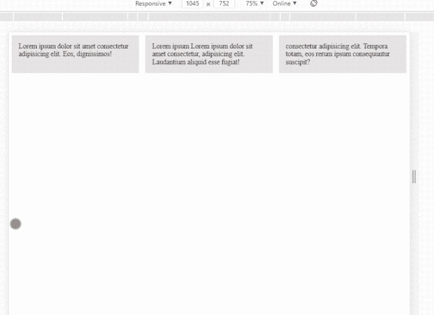
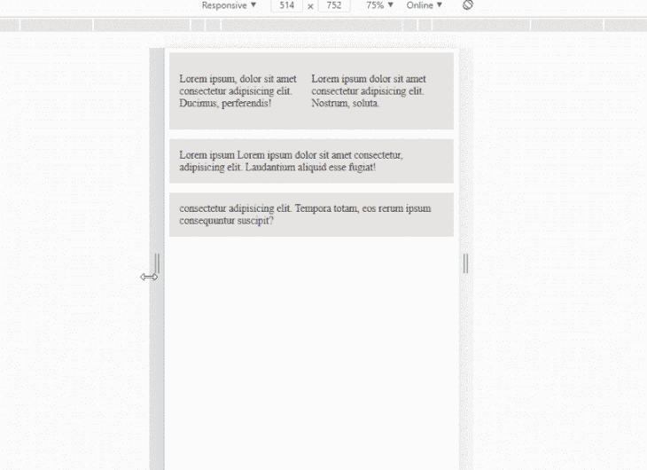

# CSS 中的容器查询是什么？- LogRocket 博客

> 原文：<https://blog.logrocket.com/what-are-container-queries-in-css/>

容器查询是 CSS 中谈论最多和被请求最多的特性之一。以至于它已经成为开发人员社区的陈词滥调。但是什么是真正的容器查询呢？

[容器查询是帮助我们根据其属性](https://blog.logrocket.com/cascade-layers-subgrid-container-queries-whats-new-css/)如宽度和高度来设计容器内容样式的查询。这采用了不同于媒体查询的方法，媒体查询帮助我们基于视口的变化来设计网页/网站的样式。

在本文中，我们将研究一些调整，以便在 CSS 代码中实现类似容器查询的行为。具体来说，我们将探讨以下内容:

## 使用 flexbox 的容器查询

Flexbox 是一个单向布局模型，它允许我们创建一个响应速度更快的网站。

在本文中，我们将使用源于 flexbox 并由 Heldon Pickering 创建的技术来模拟容器查询。我们的目标是用 flexbox 创建三列，并将它们全部移动到某个容器宽度的行中。

在您的首选目录中创建一个名为`container_query`的文件夹，然后在代码编辑器中打开它。接下来，让我们在`container_query`文件夹中创建两个文件，分别命名为`index.html`和`style.css`。

继续将以下代码粘贴到您的`index.html`文件中:

```
<!DOCTYPE html>
<html lang="en">
<head>
    <title>container queries</title>
</head> 
<body>
    <div class="container">
        <div class="child child1">
           Lorem ipsum dolor sit amet consectetur adipisicing elit. Ex, enim!
        </div>
        <div class="child child2">
            Lorem ipsum Lorem ipsum dolor sit amet consectetur, adipisicing elit. Laudantium aliquid esse fugiat!
        </div>
        <div class="child child3">
             consectetur adipisicing elit. Tempora totam, eos rerum ipsum consequuntur suscipit?
        </div>
    </div>
</body>
</html>

```

在上面的 HTML 代码中，我们用另外两个`div`容器创建了一个`div`容器作为它的内容。

接下来，让我们添加一些基本的 CSS 样式来赋予它形状。

将以下代码添加到您的`style.css`文件中:

```
.child{
    background: rgb(231, 227, 227);
    padding:1em;
    font-size: 18px;
}

```

现在，让我们开始应用赫尔顿的方法。我们将添加所有的 CSS 代码，然后一个接一个地解释它们。让我们用下面的文件更新我们的 CSS 文件:

```
.container{
    display:flex;
    flex-wrap:wrap;
    gap:1em;

}
.child{
    flex-basis: calc( calc(500px - 100%) * 999);;
    flex-grow: 1;
    background: rgb(231, 227, 227);
    padding:1em;
    font-size: 18px;
}

```

我们给了具有`.container`类的容器一个`flex`和`wrap`的`flex-wrap`的显示。这是必要的，因为它有助于我们的子元素在必要时伸缩和突破。

主容器的所有子容器都被赋予一个`1`的`flex-grow`。这允许元素增长到超出其原始宽度，并填充剩余的空间。

属性帮助我们设置所有子元素的理想宽度。注意，flexbox 并没有严格遵循这一点，它会在必要的时候做出调整。

较大的负值`flex-basis`将导致子元素最终从初始列位置占据行位置。

我们在上面的`flex-basis`属性中所做的是，我们利用`calc()`来设置`flex-basis`属性，这样它会给我们一个低于 500px 值的负值。这将导致所有子元素从列位置占据行位置。



我们可以采用与上面相同的方法，在第一个子元素中创建两个`p`标记，随着父元素宽度的减少，这两个标记将从一列移动到另一行。

让我们用下面的代码更新`index.html`文件中第一个子元素的内容:

```
<p>
    Lorem ipsum, dolor sit amet consectetur adipisicing elit. Ducimus, perferendis!
</p>
<p>
    Lorem ipsum dolor sit amet consectetur adipisicing elit. Nostrum, soluta.
</p>

```

将以下附加代码添加到我们的`style.css`文件中:

```
.child1{
    display:flex;
    flex-wrap:wrap;
}

```

```
.child1 p{
    flex-basis: calc( calc(400px - 100%) * 999);
    flex-grow: 1;
}

```

就像在第一个例子中一样，我们利用`flex-basis`属性来设置一个理想的宽度，然后允许带有`p`标签的元素在值变为负值时占据行位置。

下面是生成的代码:



## 使用 CSS 网格的容器查询

就像使用 flexbox 一样，我们可以借助 CSS grid 及其属性实现有条件的容器样式。

我们将使用我们在上面的例子中使用的相同的 HTML 代码，所以从你的新索引文件上面的例子中复制 HTML 代码。

现在，让我们把下面的代码复制到新的 CSS 文件中。我将解释每一个添加。

```
.container{
    display:grid;
    grid-template-columns: repeat(auto-fit, minmax(300px, 1fr));
    grid-gap:1em;

}
.child{

    background: rgb(231, 227, 227);
    padding:1em;
    font-size: 18px;
}

```

我们首先将显示设置为 grid，然后给子容器一个 1em 的`grid-gap`。在这种情况下，`grid-template-columns`属性发挥了所有的作用。我们正在利用`repeat()`创建一个网格，最小宽度为 300 像素，最大宽度为 1fr，限制为`auto-fit`. This allows the grid to fill out the whole viewport.``

结果是一个三列布局，当父容器低于 300px 时切换到行:


## 监视框

创建监视框的唯一目的是解决无容器查询问题。为了使用它，我们可以在安装后将它导入到我们的代码中，如下所示:

```
import WatchedBox from './path/to/watched-box.min.js';

```

然后，我们可以通过将它包装在我们的 HTML 代码中来使用它:

```
<watched-box widthBreaks="70ch, 900px" heightBreaks="50vh, 60em">
<!-- HTML and text stuff here -->
  </watched-box>

```

我们分别用“widthBreaks”和“heightBreaks”设置宽度和高度断点。

最后，您可以将以下代码添加到您的 CSS 文件中:

```
watched-box {
    display: block;
  }

```

通过访问官方 Github 知识库[了解更多关于 watched box 的信息。](https://www.google.com/url?q=https://www.google.com/url?q%3Dhttps://github.com/Heydon/watched-box%26amp;sa%3DD%26amp;ust%3D1607897668185000%26amp;usg%3DAOvVaw1IAGYQ7xoma_hQ5n3rWE-h&sa=D&ust=1607897668198000&usg=AOvVaw2tmdym3gDKrxos51Yixfuw)

## 结论

虽然容器查询还不是 CSS 的正式添加，但是我们总是可以用上面的任何方法绕过没有容器查询的限制。Bootstrap 提供了与上述类似的解决方案，但有一些限制，你可以在这里阅读更多关于 bootstrap 的内容。

## 你的前端是否占用了用户的 CPU？

随着 web 前端变得越来越复杂，资源贪婪的特性对浏览器的要求越来越高。如果您对监控和跟踪生产环境中所有用户的客户端 CPU 使用、内存使用等感兴趣，

[try LogRocket](https://lp.logrocket.com/blg/css-signup)

.

[](https://lp.logrocket.com/blg/css-signup)[https://logrocket.com/signup/](https://lp.logrocket.com/blg/css-signup)

LogRocket 就像是网络和移动应用的 DVR，记录你的网络应用或网站上发生的一切。您可以汇总和报告关键的前端性能指标，重放用户会话和应用程序状态，记录网络请求，并自动显示所有错误，而不是猜测问题发生的原因。

现代化您调试 web 和移动应用的方式— [开始免费监控](https://lp.logrocket.com/blg/css-signup)。