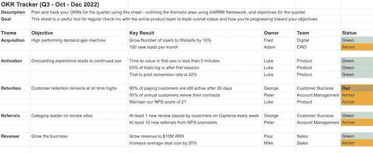
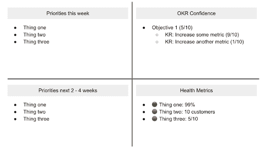

# 什么是 okr 以及如何写它们(有模板和例子)

> 原文：<https://blog.logrocket.com/product-management/what-are-okrs-how-to-write-templates-examples/>

* * *

## 目录

* * *

## 什么是目标和关键结果？

目标和关键结果(okr)可以帮助产品经理指导和集中团队的努力，增加影响，建立一致性，并确保每个人都在同一页上。

OKR 框架是由约翰·杜尔登于 20 世纪 90 年代初在英特尔工作时开发的。从那时起，OKRs 已经成为一种在组织和其他环境中衡量进展和提高绩效的流行工具。

杜尔的书， *[衡量什么是重要的](https://www.amazon.com.au/Measure-What-Matters-Simple-Drives/dp/024134848X/ref=asc_df_024134848X/?tag=googleshopdsk-22&linkCode=df0&hvadid=341744909748&hvpos=&hvnetw=g&hvrand=5722699013198395126&hvpone=&hvptwo=&hvqmt=&hvdev=c&hvdvcmdl=&hvlocint=&hvlocphy=9071478&hvtargid=pla-440960730426&psc=1)* ，演示了如何[收集及时和相关的数据](https://blog.logrocket.com/product-management/what-metrics-kpis-product-managers-track/)来跟踪进展，以便你可以提高自己的绩效。2018 年，他还做了一场精彩的 [TED 演讲](https://www.youtube.com/watch?v=L4N1q4RNi9I)，讲述了为什么成功的秘诀在于设定正确的目标。

[https://www.youtube.com/embed/L4N1q4RNi9I](https://www.youtube.com/embed/L4N1q4RNi9I)

视频

okr 在产品管理中被广泛使用，因为它们允许产品经理专注于他们的业务要完成的目标，并团结组织内的其他人也关注他们。

使用 OKRs，产品经理可以:

*   跟踪多个优先事项和目标
*   关注最重要的事情
*   [向利益相关者传达产品目标](https://blog.logrocket.com/product-management/how-to-communicate-product-strategy/)
*   衡量产品目标的进展

尽管这些只是产品经理众多职责中的一小部分，但它们通常是最重要的。项目经理经常挖掘数据，创建报告和仪表板，以[跟踪关键业务目标的进展](https://blog.logrocket.com/product-management/what-product-management-metrics-matter-most-to-pms/)，并向利益相关者传达更新。

## 产品经理如何使用 OKRs？

项目经理可以与其他职能部门合作，在下一季度之前创建有效的 okr。

有三个主要的协调活动旨在对有效的产品 okr 进行三角分析，这将帮助您避免被本季度突然出现的新计划搞得措手不及:

1.  [使目标与公司目标一致](#aligning-objectives-with-company-goals)
2.  [与其他功能对齐](#aligning-with-other-functions)
3.  [与产品战略保持一致](#aligning-to-the-product-strategy)

### 使目标与公司目标一致

建立 OKRs 时，将目标与组织的战略相匹配，并确保重大成果是可衡量的，这一点至关重要。

### 与其他功能保持一致

向其他部门的领导汇报将有助于您确保一致性，并避免错过从产品管理角度来看可能需要您支持的计划。它还使您能够识别可能需要开发资源的任何其他紧急计划，并降低不太紧急的战略计划的优先级。

### 与产品战略保持一致

一些目标可能与您的总体[产品战略](https://blog.logrocket.com/product-management/product-strategy-frameworks-examples/)相关联。这些目标可能仅限于产品体验本身，并对公司的财务目标有重大贡献。

您还应该与您的[工程同行](https://blog.logrocket.com/product-management/3-scrum-roles-agile/#developers)合作，通过在整个企业范围内调整您的产品目标来确定在整个公司范围内执行目标的能力需求。

## 如何写 OKRs(附例子)

在设置 okr 时，产品经理应该记住以下几点:

为了演示如何创建 okr，让我们看几个说明性的例子:

1.  [基于结果的 OKR](#example-no-1-outcome-based-okr)
2.  [将交付目标转化为 OKR](#example-no-2-turning-a-delivery-objective-into-an-okr)

### 例子 1:基于结果的 OKR

#### 目标

创建高性能需求生成机器。

#### 主要结果

*   网站用户数量增长 10%
*   每月产生 100 条新线索

#### 如果公司不是目标驱动的呢？

如果你没有目标驱动，很有可能你只是在接受高层的命令。或者你是一个特性工厂，或者你正在执行项目，而不是朝着目标优化。

如果你没有任何正式的目标设定框架，试着从以下几点开始:

1.  将您当前的[产品重点](https://blog.logrocket.com/product-management/what-is-a-product-vision-statement-examples/)重新设定为一个目标
2.  将它与公司当前的目标联系起来
3.  概述 2-3 个衡量成功的标准

### 示例 2:将交付目标转化为 OKR

#### 目标

年底交付 X 项目。

#### 主要结果

*   工程团队在整个季度保持 X 个故事点的冲刺速度
*   在用户体验过程中进行五次客户访谈，收集可用性反馈
*   召开两次产品更新会议，与组织分享项目进展

如果很难找到你正在做的事情的可衡量的标准，也许这只是一个专注于交付的目标，关键的成功衡量标准是在给定的日期之前完成一些事情，如果这是你正在努力实现的里程碑，这是没问题的。你仍然应该思考你在前进的道路上可以追求的度量标准，这些标准表明你是否取得了正确类型的进步。

#### 收集关键结果的数据

当你决定证明你的目标成功的关键指标时，确保你能实际获得关键结果的数据。如果您目前没有跟踪任何重要的成功指标，请确保它们包含在范围内，并在您需要开始引用它们之前构建它们。

#### 战术不是关键结果

一个常见的错误是将关键结果视为待办事项。关键成果应易于衡量；如果你列出了要完成的任务，这些应该被认为是策略——也就是说，我们为了达到关键结果可以做的事情。这最好留给团队来衡量努力，并优先考虑可能的最佳策略。

通过向更广泛的团队征求如何达到目标的想法，可以收集策略。在这里，由产品经理主持的研讨会非常合适。

#### 限制目标的数量

理想的情况是，你希望在组织的每一个层级上，向下级联的目标不超过三到五个。每个人都有自己的目标，这些目标应该与职能和业务目标相一致。同样，个人在任何时候都应该积极追求不超过三到五个目标。

#### 考虑容量

限制所有目标的数量并确保每个人都是一致的对于能力的目的也很重要。

考虑到上面的例子，[产品、UX 和工程](https://blog.logrocket.com/product-management/dual-track-agile-continuous-discovery/#the-trio-design-product-and-engineering)可能需要一起工作来确保已经做了足够的计划来保证冲刺速度。产品和 UX 将需要共同努力，以招募客户，计划，运行，并综合采访的结果。这可能会限制他们帮助工程团队定义工作的有效性。

## OKR 模板和最佳实践

规划 okr 有几个策略。开始时，我建议查看您的[盗版指标(AARRR)](https://blog.logrocket.com/product-management/6-product-management-frameworks-you-should-know/#aarrr-metrics) :

*   [获取](https://blog.logrocket.com/product-management/what-metrics-kpis-product-managers-track/#acquisition) —客户找到产品
*   [激活](https://blog.logrocket.com/product-management/what-metrics-kpis-product-managers-track/#activation) —客户体验产品的核心价值
*   [保留率](https://blog.logrocket.com/product-management/what-metrics-kpis-product-managers-track/#retention) —再次回来使用产品的客户
*   [推荐](https://blog.logrocket.com/product-management/what-metrics-kpis-product-managers-track/#referral) —与他人分享产品的客户
*   [收入](https://blog.logrocket.com/product-management/what-metrics-kpis-product-managers-track/#revenue) —将客户货币化

***这里有一个[可下载和定制的 OKR 模板](https://docs.google.com/spreadsheets/d/1BjzPZgKdyY0O5KKn2cyVaPdo82acJTOKXpms5d-Uxgc/edit#gid=0)，你可以在计划你的 okr 时使用。我们还有以下可用的模板(稍后将详细介绍):***

[Download and customize this OKR planning template](https://docs.google.com/spreadsheets/d/1BjzPZgKdyY0O5KKn2cyVaPdo82acJTOKXpms5d-Uxgc/edit#gid=0)

### 审查并签署 OKRs

与其他职能部门一起审查和签署 okr 对于确保您从一开始就保持一致并消除整个季度出现的任何意外至关重要。

作为一名产品经理，你通常了解企业想要实现的目标，并应该与其他职能部门会面，协调 okr，确保每个人都朝着同一个目标努力。这也是一个机会，让你了解对利益相关者来说什么是重要的，并分享你希望在本季度实现的目标。

此外，它使您能够一起探索策略，并确定哪些活动有助于尽可能高效地实现目标。

* * *

订阅我们的产品管理简讯
将此类文章发送到您的收件箱

* * *

在上面链接的 [OKR 模板](https://docs.google.com/spreadsheets/d/1BjzPZgKdyY0O5KKn2cyVaPdo82acJTOKXpms5d-Uxgc/edit#gid=0)中， **OKR 调整**选项卡提供了一个结构和一份职能清单，您应该与这些职能会面以回顾和讨论本季度的 OKR。记录会议安排的时间以及讨论后需要解决的任何意见。

### 执行和监控

到目前为止，您已经计划好了本季度的 okr，现在正进入执行模式，并在努力实现您的目标。

有几个关键策略可以确保你取得期望的进步水平，即:

#### 在团队会议期间检查进度

每周与团队一起打开你的 OKR 计划，快速检查你是如何追踪关键结果的。

如果每个人都更新了他们的状态，快速回顾可能不会超过五分钟，让您有时间讨论任何不在正轨上的目标的问题。

Christina Wodtke 在她的书 *[激进聚焦](https://www.amazon.com.au/Radical-Focus-SECOND-Achieving-Objectives/dp/1955469016/ref=pd_lpo_1?pd_rd_i=1955469016&psc=1)* 中提供了一个很好的跟踪 OKRs 周的模板:

Source: [Radical Focus](https://www.amazon.com.au/Radical-Focus-SECOND-Achieving-Objectives/dp/1955469016/ref=pd_lpo_1?pd_rd_i=1955469016&psc=1) by Christina Wodtke

在您的[产品管理工具](https://blog.logrocket.com/product-management/product-roadmap-tools-best-features-free-paid/)(例如 [Aha](https://blog.logrocket.com/product-management/product-roadmap-tools-best-features-free-paid/#aha) 、 [ProductBoard](https://blog.logrocket.com/product-management/product-roadmap-tools-best-features-free-paid/#productboard) 、 [ProductPlan](https://blog.logrocket.com/product-management/product-roadmap-tools-best-features-free-paid/#productplan) 等。)，路线图上的项目应该与目标保持一致。检查这些项目的进度以确保时间表是最新的是值得的。同样，你应该讨论日期延误的影响和问题。

#### 发送异步 OKR 进度报告

有太多的策略可以让沟通变得更容易，但我们仍然默认会遇到地狱。

如果你没有时间在团队会议上分享进展，那就投入时间通过制作报告来实现信息自助服务。发送一封快速邮件、时差更新、 [Loom](https://www.loom.com/) 视频或 [Enform](https://www.enform.io) 更新将有助于让利益相关者了解最新情况。

更新的格式不必过于繁琐。更新的每一部分都应该以目标和关键结果开头。它应该包括你上周所取得的成就，以及你下周要做的事情。

***随时下载并定制这个 [OKR 每周更新模板](https://docs.google.com/document/d/1njkpwajecfxE2IfS1QdeTHR_VRVcJg8_mSchqdVd7xs/edit)来帮助你撰写自己的进度报告。***

### 季度评论

季度回顾会议是结束本季度、展望未来和为下一个季度重新设置的完美方式。

季度评估非常重要，因为:

*   并非每个人都会关注每周的进展
*   这给了团队一个机会来评估他们所取得的成就——毕竟，并不是所有的事情都在燃烧

作为产品经理，季度回顾可以让你停下来，反思每个人在追求特定目标时所做的出色工作。这是一个很好的工件，可以直接与工程团队和整个企业的利益相关者共享。

季度回顾的形式很简单，可以是 30-60 分钟的会议:

*   展示每个目标的成就和指标的当前状态
*   深入了解任何感兴趣的点，例如，一段时间内的趋势数据、之前/之后的屏幕截图等。
*   向团队介绍下个季度的 OKRs
*   深入了解任何新问题领域的当前状态，并阐明为什么它们对于团队现在要解决的问题很重要

***要了解这在实践中是什么样子，请看这个[季度回顾平台的真实例子](https://docs.google.com/presentation/d/1LvOq1tLP1tS6p_bYLfy1DjWwqvUHaHpQxZBF7TWDES0/edit#slide=id.g1f88252dc4_0_1535)。***

## 结论

okr 是一个强大的工具，产品经理可以用它来推动重点，实现他们的产品目标。建立有效的 okr 和跟踪进度使产品经理能够让他们的团队保持在正确的轨道上，专注于正确的事情。

*精选图片来源:[icon scout](https://iconscout.com/icon/graph-1567975)*

## [LogRocket](https://lp.logrocket.com/blg/pm-signup) 产生产品见解，从而导致有意义的行动

[LogRocket](https://lp.logrocket.com/blg/pm-signup) 确定用户体验中的摩擦点，以便您能够做出明智的产品和设计变更决策，从而实现您的目标。

使用 LogRocket，您可以[了解影响您产品的问题的范围](https://logrocket.com/for/analytics-for-web-applications)，并优先考虑需要做出的更改。LogRocket 简化了工作流程，允许工程和设计团队使用与您相同的[数据进行工作](https://logrocket.com/for/web-analytics-solutions)，消除了对需要做什么的困惑。

让你的团队步调一致——今天就试试 [LogRocket](https://lp.logrocket.com/blg/pm-signup) 。

[Luke Grimstrup Follow](https://blog.logrocket.com/author/lukegrimstrup/) Building [enform.io](https://www.enform.io/) to help product leaders save time, eliminate surprises, and streamline reporting. Product management leader in Melbourne, Australia.