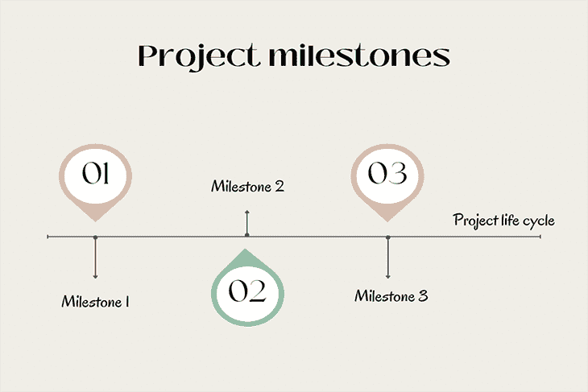

# 什么是项目里程碑，它们是如何发展的？

> 原文：<https://blog.logrocket.com/product-management/what-are-project-milestones-how-do-they-evolve/>

你是否面临为一个项目设定里程碑的问题？或者，您可能对项目里程碑以及业务增长如何影响它们感到好奇。那么，你来对地方了。

项目里程碑对于任何项目的成功都是至关重要的。团队使用里程碑来设定现实的目标，并确保可跟踪的进展。

在本文中，我们将讨论里程碑的含义以及它们是如何定义的。我们还将学习里程碑如何随着业务的增长而演变，以及如何利用里程碑来设定现实的目标。

* * *

## 目录

1.  [创建项目时间表](#create-a-project-timeline)
    1.  [确定里程碑和所有权](#identify-milestones-and-ownership)
    2.  [确定里程碑的优先级](#prioritize-milestones)
    3.  [设定截止日期](#set-deadlines)
    4.  [与利益相关方达成一致](#get-stakeholder-alignment)

1.  [设定智能目标](#set-smart-goals)
    1.  [评估团队的可用性和承诺](#assess-the-teams-availability-and-commitment)
    2.  [检查风险因素](#examine-risk-factors)
    3.  [确保正确的任务优先级](#ensure-proper-task-prioritization)
    4.  [保持准时交货](#maintain-on-time-delivery)
    5.  什么是里程碑？

* * *

## 项目里程碑是项目生命周期中的一个重要点。它用于跟踪进度，提供成就感，并将注意力集中在关键交付成果上:

里程碑帮助项目经理和贡献者保持专注，同时避免范围蔓延([扩展项目的意外工作](https://blog.logrocket.com/product-management/what-is-feature-creep-how-to-avoid/))。里程碑对于估计完成日期、测量性能和质量也很有用，有时[会激励项目干系人](https://blog.logrocket.com/product-management/what-stakeholder-management-tools-techniques/)。

项目里程碑是如何定义的？

## 当你知道你的目标是什么，并有实现它们的计划时，就该定义项目里程碑了。

一个好的经验法则是，里程碑应该由一些有形的东西来定义，也就是说，你可以看到和感觉到的东西。这可能是一个事件或一项成就，表明你朝着目标前进。

例如，假设项目目标是在 2023 年 Q1 奥运会上让五家企业客户使用你的产品。

项目里程碑可以是:

完成产品交付

*   吸引企业客户
*   签署合作协议
*   成功装载客户端
*   里程碑也可以基于 100%完成的可测量的结果。对于上述项目，里程碑可以是在 Q1 2023 年每个月至少搭载一个客户。

项目里程碑也可以从一个行为改变到另一个行为。对于上面的项目示例，里程碑可能包括确定要关注的新垂直市场，确认市场兴趣，实施新的沟通和营销渠道，吸引目标客户，以及让客户加入新的垂直市场。

将项目阶段划分为里程碑的过程是什么？

## 以下是将项目拆分为里程碑时需要遵循的一些步骤:

1.创建项目时间表

### 项目时间表是将项目划分为里程碑的第一步。当项目有一个明确的时间表时，分解可交付成果和管理总体期望变得更加容易。要创建项目时间表，只需设置项目的开始和结束日期。这通常是一个估计值；尽管最佳实践是考虑内部和外部依赖性，如员工休假、客户需求的变化、公司范围的活动等。

2.确定里程碑和所有权

### 接下来，将项目分解成里程碑。我们已经解释了里程碑是项目生命周期中特定的、重要的点。本质上，它是完成一个重要目标的一组相关任务。此外，如果项目还有其他的关键贡献者，为每个里程碑指定负责人。

3.区分里程碑的优先级

### 还必须对里程碑进行优先排序，以设定最后期限并按时完成。

如果你不确定如何区分任务的优先级，问问自己以下问题:

哪个任务是最紧急的？

*   哪项任务最省力？
*   哪个任务对项目影响最大？
*   哪个任务会帮助你完成另一个任务？
*   您需要根据紧急程度、影响、潜在的依赖性以及有时所涉及的工作量来确定任务的优先级。

4.设定截止日期

### 最后，为每个里程碑设定交付时间表。设定截止日期可以让你跟踪进度，让你的团队在每一点上都专注于最重要的任务。及早发现延迟并做出必要的调整也是有用的。

5.获得利益相关方的支持

### 这是一个可选步骤。对于较大的项目团队来说，围绕已定义的里程碑与利益相关者保持一致是很重要的。寻求一致性使项目经理能够识别差距，并暴露项目中需要进一步审查的部分。对于项目经理来说，这也是一个获得高级涉众对合适的里程碑的看法的机会。

随着业务的增长，项目里程碑如何演变？

## 随着业务的增长，项目里程碑也在发展。小公司专注于建立业务运作功能，并满足目标，以保持业务的活力。这些里程碑可能包括获得经营许可、明确定位、寻找制造合作伙伴、获得种子基金等。

然而，随着业务的增长，里程碑更能代表扩展工作和增长，如接纳下一个 100，000 名客户、扩大产品供应，甚至收购较小的企业来扩展其运营。

较大的公司通常更有雄心，这影响了里程碑的定义和重大进展。例如，对于打入新市场的项目目标，员工少于 50 人的小企业可以每年瞄准一个新的国家。相比之下，一家拥有 1，000 多名员工的成长阶段的公司可能会以每年在至少三个国家推出其产品为目标。企业有望达到更高的标准；因此，他们的利益相关者要求更高。

订阅我们的产品管理简讯
将此类文章发送到您的收件箱

* * *

设立里程碑的计划阶段也很关键。随着业务的增长和获得更多的客户，某些决策会更有影响力。因此，如何定义里程碑将需要在实施前由高级利益相关者审查和批准。为了确保项目里程碑按时交付，大公司的贡献者也比小公司多。

* * *

成长伴随着新的挑战。如果没有有效地完成，定义、交流和管理大型项目的里程碑可能是一件麻烦的事情。您需要更新您的业务流程以适应这些变化，从而为所有利益相关者带来更高效的协作和更好的结果。

参与你的业务的人越多，跟踪就变得越复杂——这就是为什么项目管理工具是必不可少的。一个成功的项目和一个失败的项目之间的区别在于你计划、安排和与你的团队沟通的程度。

你如何利用里程碑来设定现实的目标？

## 既然你已经了解了里程碑以及如何定义它们，让我们看看通过设定现实的目标来确保成功的各种方法。

1.设定 SMART 目标

### 项目经理可以为每个里程碑设定 SMART(具体的、可衡量的、可实现的、相关的和有时限的)目标。智能“公式”有助于确定对项目成功最重要的里程碑，并确保考虑任务的可行性。

2.评估团队的可用性和承诺

### 项目经理还应该评估团队对每个里程碑成功的承诺。要问的问题包括:

受托人有足够的时间承担相关任务吗？

*   我们是否拥有出色表现所必需的技能？
*   团队致力于项目的成功吗？
*   一个成功的项目需要项目成员的肯定回应。它通常有助于获得跨职能团队经理的认同，以确保项目贡献者的承诺。

3.检查风险因素

### 项目经理应在确定在某个日期或期限前完成的活动清单之前，检查可能影响每个里程碑*结果的内部和外部风险因素。项目经理还应该在整个项目过程中定期与风险承担者一起审查该列表，以便在早期识别和解决任何问题。*

4.确保正确的任务优先级

### 项目经理还应该确定里程碑和活动之间是否有任何依赖关系。如果是这样，他们应该为每个里程碑的成功建立一个需要完成的任务的关键路径。然后，可以使用 Microsoft Project 或 Asana 等工具将这些信息用于分配资源。

5.保持准时交货

### 不要落后于你的计划(面对现实吧，我们都经历过)。如果在你的项目生命周期中的任何一点有挑战，或者如果一个利益相关者比预期的更早的要求你更新，那么小心的前进！

如果你的进度落后了，不要以为你会在之前规定的时间内完成未完成的可交付成果。相反，考虑回顾即将到来的任务的时间表，并寻求更聪明地工作的方法。

结论

## 从本质上来说，项目里程碑是一个检查点，它表明您已经到达了项目的下一步。它可以像完成部分设计一样简单，也可以更复杂，比如将计划提交给政府机构审批。里程碑也是有用的，因为它们帮助我们跟踪我们的目标，它们提供了结构和责任，同时允许实现这些目标的灵活性。

关于里程碑，要记住的关键事情是，从一个项目到下一个项目，它们看起来并不总是一样的。因此，随着业务的增长或新流程的引入，里程碑会不断发展。

*精选图片来源:[icon scout](https://iconscout.com/icon/agile-5804828)*

[LogRocket](https://lp.logrocket.com/blg/pm-signup) 产生产品见解，从而导致有意义的行动

## [LogRocket](https://lp.logrocket.com/blg/pm-signup) 确定用户体验中的摩擦点，以便您能够做出明智的产品和设计变更决策，从而实现您的目标。

使用 LogRocket，您可以[了解影响您产品的问题的范围](https://logrocket.com/for/analytics-for-web-applications)，并优先考虑需要做出的更改。LogRocket 简化了工作流程，允许工程和设计团队使用与您相同的[数据进行工作](https://logrocket.com/for/web-analytics-solutions)，消除了对需要做什么的困惑。

让你的团队步调一致——今天就试试 [LogRocket](https://lp.logrocket.com/blg/pm-signup) 。

Get your teams on the same page — try [LogRocket](https://lp.logrocket.com/blg/pm-signup) today.

[Uju Ezeanyagu Follow](https://blog.logrocket.com/author/ujuezeanyagu/) I am a Product Manager in the UK, and founder of enurture.co. Find me on Twitter @ujuezeanyagu