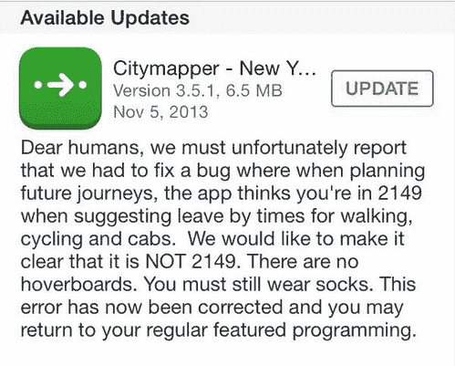
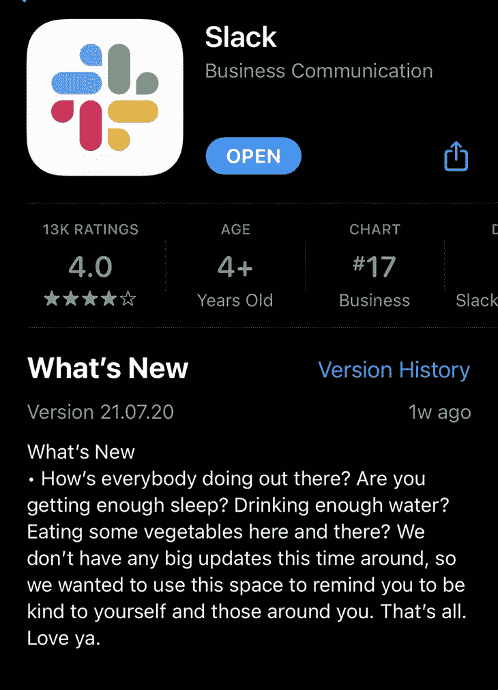
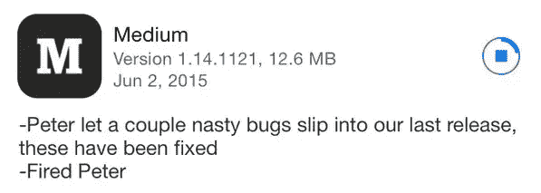
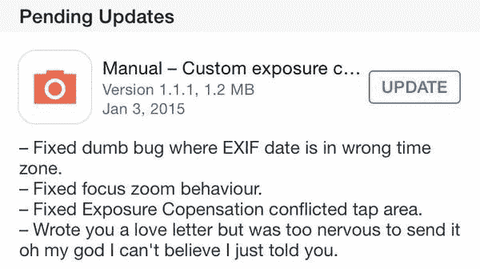
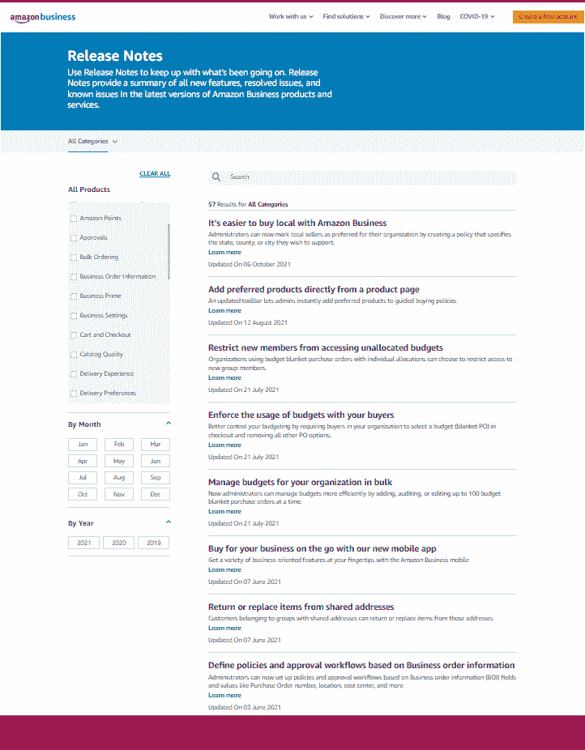
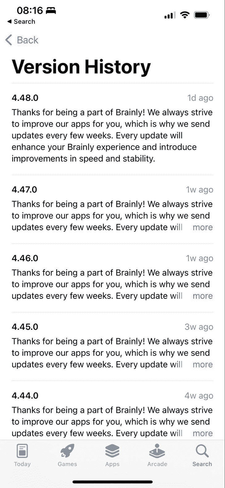

# 什么是发行说明，如何写出好的发行说明

> 原文：<https://blog.logrocket.com/product-management/what-are-release-notes-how-to-write-good-ones/>

发行说明通常被视为另一个乏味的正式需求。这是非常错误的。

尽管残酷的事实是绝大多数人不读它们，但是发行说明提供了一个让真正阅读它们的小众惊叹的好机会。

经过深思熟虑的外部发行说明可以帮助用户更容易记住你。内部发行说明使潜在的故障排除和依赖性易于修复。

在本文中，我将讨论外部发行说明的主题——特别是那些与用户公开共享的发行说明。让我们看看如何有效地编写和分发这些。

* * *

## 目录

* * *

## 撰写好的发行说明

外部发行说明通常可以在三个地方找到:

*   应用商店
*   Google Play
*   公司的公共网站

他们的官方目标是通知用户最近的变化和补丁/更新的内容。大约 90%的用户不阅读它们。

但是对于剩下的 10%来说——这毕竟不算少——发布说明是他们和你的产品之间的另一个接触点。

你使用这个接触点的方式有助于[你的整体品牌认知](https://blog.logrocket.com/product-management/what-is-product-positioning-examples-strategies-template/)。可悲的是，大多数产品只是用事实让用户厌烦。虽然这没什么错，但除了分享干巴巴的事实，还有更有趣的方式来传递信息。

让我们来看一些例子。

## 示例:Citymapper 使用发行说明带来一些幽默

Citymapper 早在十年前就证明了除了“小漏洞修复”还有其他选择:

虽然有点罗嗦，但将幽默与一点点讲故事结合起来，使得这些发行说明成为令人兴奋和难忘的读物。

### 我们能从这些中学到什么

首先也是最重要的，即使是小的 bug 修复也可能以有趣的方式呈现。

“没有悬浮滑板。你必须仍然穿袜子”——虽然这些没有传达任何额外的信息，但它们非常适合讲故事，使阅读更加迷人。

## 示例:Slack 使用发行说明作为沟通接触点

Slack 把事情做得更进一步。在新冠肺炎疫情爆发期间，他们仅将该空间用作与用户沟通的接触点，而没有提供任何关于此次疫情的信息:

如果你是这 10%阅读发行说明的用户中的一员，这可能会让你感到些许温暖。这些笔记传播得如此之快，以至于你可能没有在 App Store 上阅读就听说过它们，这进一步强化了 Slack 的品牌。

### 我们能从这些中学到什么

最重要的是，发行说明可以作为一个额外的沟通渠道——介于推送和电子邮件之间。

也有可能在没有实际通知用户发布内容的情况下编写发布说明。但是要小心，这种方法对知名品牌最有效。

最后，好的发行说明可以像病毒一样传播，让你在网络媒体上获得足够的关注。

## 例子:中等保持简短和甜蜜

发布说明不一定总是冗长的。让我们来看看 2015 年 Medium 的一份发行说明:

这些发行说明可以很快被消费掉，但仍会在用户的记忆中停留更长时间。

### 我们能从这些中学到什么

嗯，有时候一句话就够了。几个词，如“解雇彼得”，可以区分无聊和难忘的发行说明。

还有，不要雇佣彼得。

* * *

订阅我们的产品管理简讯
将此类文章发送到您的收件箱

* * *

## 示例:手动将单个项目符号隐藏到标准发行说明中

也许你更喜欢老派风格的发布说明，也就是，一个有项目符号的变更列表。没关系，但是你也可以增加它的味道:

几年前，Manual 在他们的修复列表中加入了一段爱的表白，让我们开怀大笑。只是好奇，谁是真正的接受者？

### 我们能从这些中学到什么

一个额外的标准发布说明可能会有很大的不同。

## 例子:亚马逊使他们的发布说明易于浏览

易于浏览和理解的发行说明标题很神奇。他们:

*   总结发行说明的内容
*   允许轻松找到我们正在寻找的笔记
*   帮助用户赶上几个月的更新，显示产品正在随着时间的推移而发展

你不必深究细节就能明白亚马逊业务上发生了什么。在访问他们的发布说明网站后，你已经知道他们正在发生很多事情。你可以很容易地补上你错过的内容，并深入挖掘你真正感兴趣的话题。

### 我们能从这些中学到什么

写得好的标题可以帮助用户赶上几个月的更新。他们还展示了一个产品开发的故事。

## 例子:连续交付的智能自动化

这些都很好，但是如果您有一个健壮的持续部署管道呢？每天写发行说明是没有伸缩性的。

在这种情况下，简化和自动化是值得的:

### 我们能从这些中学到什么

发行说明可以非常通用——没有必要每周都写新的东西，尤其是如果你经常发布的话。

## 分发发行说明

编写发行说明是一回事，但是发布它们是另一回事。

虽然你不能改变大多数用户不会阅读发行说明的事实，但是你可以努力增加真正阅读发行说明的人数。

您可能希望这样做有几个原因:

*   它鼓励人们更新他们的产品版本
*   这向他们展示了产品随着时间的推移而增长
*   这促使他们尝试和采用新的功能
*   这是另一个客户接触点

虽然移动应用的发行说明会自动在商店中分发，但有许多方法可以增加移动和网络产品的说明覆盖范围。

### 推送和应用内

其中一种方法是向用户发送推送通知或某种应用内消息，比如弹出横幅。

这些具有相当高的可发现性，是确保用户不会错过关键更新的最佳方式之一。

### 专用页面

包含所有发布信息的专用页面是组织和展示您所有努力工作的好方法。也是 B2B 产品的必备。

为了提高效率，将流量从其他来源转移到那里(比如上面提到的推送)。很少有人通过谷歌有机地搜索发行说明。

虽然你不应该在你的社交媒体渠道上吹嘘每一个漏洞修复，但更有趣的更新值得一些报道。

如果运气好，文笔好，你甚至可以像病毒一样传播。

你计划发布一个改变游戏规则的更新来重新定义你的产品的价值吗？这也许值得媒体报道。

你不必买超级碗的老虎机。在 HackerNoon 或其他互联网出版物上获得报道可能就足够了。

### 电子邮件

如果你每周更新你的应用，请不要每次都给你的客户发电子邮件(虽然，在一些罕见的情况下，这可能是可以接受的)。然而，当你想让尽可能多的人知道一些重要的更新时，它仍然是一个值得使用的可行的沟通渠道。

### 客户代表

一些更新可能值得[直接与客户沟通](https://blog.logrocket.com/product-management/what-stakeholder-management-tools-techniques/)。对于 B2B 产品来说，尤其是如果你发布了一个你的关键客户已经唠叨了很久的更新。

考虑使用你的销售团队和客户经理主动接触客户，并告知他们你刚刚发布的重大变化。

### 其他接触点

回顾您与最终用户的所有接触点，并确定您是否可以将它们用作发布沟通渠道。

例如，您可以在客户支持门户网站上添加一个包含最新更新的小部分。

## 结论

发布说明虽然经常被忽视，但它为你提供了一个让你的用户惊叹并加强你的品牌传播的机会。

不要把它们仅仅作为传达事实的媒介。仔细考虑如何传达你的价值观，增加一些幽默，或者让你的用户微笑。他们会记得的。

然而，如果你花费额外的精力去写杀手级发行说明，不要忘记发行部分。如果你在你的沟通策略中包括实际谈论它们，你可以将你的发布说明的范围扩大三倍。

*精选图片来源:[icon scout](https://iconscout.com/icon/file-3250251)*

## [LogRocket](https://lp.logrocket.com/blg/pm-signup) 产生产品见解，从而导致有意义的行动

[LogRocket](https://lp.logrocket.com/blg/pm-signup) 确定用户体验中的摩擦点，以便您能够做出明智的产品和设计变更决策，从而实现您的目标。

使用 LogRocket，您可以[了解影响您产品的问题的范围](https://logrocket.com/for/analytics-for-web-applications)，并优先考虑需要做出的更改。LogRocket 简化了工作流程，允许工程和设计团队使用与您相同的[数据进行工作](https://logrocket.com/for/web-analytics-solutions)，消除了对需要做什么的困惑。

让你的团队步调一致——今天就试试 [LogRocket](https://lp.logrocket.com/blg/pm-signup) 。

[Bart Krawczyk Follow](https://blog.logrocket.com/author/bartkrawczyk/) Learning how to build beautiful products without burning myself out (again). Writing about what I discovered along the way.