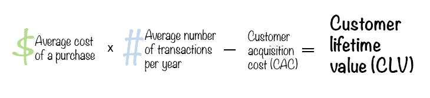
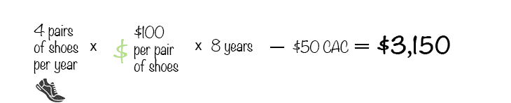
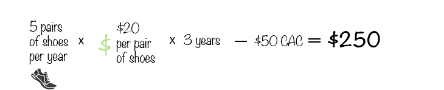

# 什么是顾客终身价值(CLV ),如何计算

> 原文：<https://blog.logrocket.com/product-management/what-customer-lifetime-value-clv-how-calculate/>

产品团队和业务负责人必须跟踪和理解许多关键指标。这些至关重要的措施可以帮助您在扩展和扩大业务时保持正确的方向，从净利润率到销售收入和客户保持率。

不衡量这些指标是有风险的，因为随着您的成长，这可能会带来一些惊喜。

客户终身价值，或 CLV，是这些关键指标之一，你应该密切关注。CLV 概述了典型的客户体验，你可能会在整个业务关系的生命周期中预期。

* * *

## 目录

* * *

## 什么是顾客终身价值(CLV)？

客户终身价值是指在一般的商业关系中，客户在你的产品上，以及在你的公司上，预期花费的总金额。了解这个数字是至关重要的，因为它会让你选择花多少钱来吸引新客户和留住现有客户。

您可以使用客户终身价值来分析和评估当前的客户忠诚度。如果客户不断回来购买更多的产品或服务，这通常表明你的公司运营良好。此外，生命周期价值越高，您需要花费的购买成本就越少。

考虑下面的例子来更好地理解 CLV 是什么。

如果车主对他们选择的汽车感到满意，并决定随着时间的推移购买更多的汽车，他们的 CLV 可能会高达 100，000 美元。或者，每天喝咖啡的人的 CLV 可能远远大于这个数字，这取决于他们每天喝多少杯咖啡以及从哪里得到咖啡。

相比之下，在一生中买两次房子的人对房地产经纪人来说可能只值 15，000 美元。这是因为，尽管购买价格很高，但代理商的佣金只是整个金额的一小部分。

从更大的角度来看，客户终身价值是对与特定客户关系相关的收入的衡量。这将决定你愿意花多少钱来维持这种关系。换句话说，如果你认为客户的 CLV 是 500 美元，你就不会花更多的钱来维持关系。简单地说，你不能从中赚钱。

了解你的 CLV 可能会帮助你制定一个商业或产品计划，专注于留住现有客户，而不是花钱吸引新客户。当然，吸引新客户和现有客户对总体业务发展至关重要。

## 为什么客户终身价值很重要？

做出业务决策是为各种客户计算 CLV 的主要好处之一。了解您的 CLV 有助于您确定:

*   你能花多少钱与一个相似的消费者保持有利可图的联系
*   随着时间的推移，典型消费者将花费的确切金额
*   最高的 CLV 顾客想要什么产品
*   哪些产品在财务上最成功
*   哪些客户关系是你销售的主要驱动力
*   谁是你最有利可图的客户
*   你可以试着以 CLV 为起点，了解更多你最忠实的消费者。他们对什么感兴趣，为什么他们仍然从你这里购买？

总之，这些选择可以大大增加你的产品的利润。仅仅知道数字是不够的，就像任何其他业务指标一样。您的完整业务或产品计划必须使用您的 CLV 来塑造。

如果您的客户终身价值在增加，您可能希望继续投资您的客户成功团队或产品开发。如果你的 CLV 下降，你最近的营销活动可能需要更新。随着时间的推移，了解 CLV 可以帮助您大幅降低客户获取费用，这是其关键优势之一。

## CAC 与 CLV 的关系

[CAC 是客户获取成本](https://blog.logrocket.com/ptroduct-management/what-is-customer-acquisition-cost-how-to-reduce/)的缩写。顾名思义，这是将潜在客户转化为真实客户的费用。客户终身价值(CLV)和客户获取成本(CAC)是两个不同但同样重要的指标。

自然，你希望你的 CAC 和 CLV 成反比，你的 CLV 比 CAC 高。你获得的利润越多，你获得一个消费者的花费就越少，这个消费者代表的整体价值就越大。

然而，更有效的方法是建立这两个数字，利用它们作为基线，然后随着时间的推移努力将它们分开。这比立即寻找明显的差异更可取。如果你让这个余量变得太薄，你会有严重的稳定性问题。

## 如何计算客户终身价值

计算一个人的客户终身价值并没有那么难。确定独特客户的 CLV 的最简单方法是:

平均购买成本乘以消费者每年交易的平均次数(以年为单位)，再减去 CAC。

假设你拥有一家鞋店，让我们看一些例子。

让我们来计算一个经常从你的商店购买鞋子的马拉松运动员的 CLV。他们每年买四双鞋，每双 100 美元，一共买了八年。乘以一起，总数是 3200 美元。减去 50 美元的 CAC 得出 CLV 为 3150 美元:

现在假设你有一位顾客，她是一个蹒跚学步的孩子的母亲。他们每年为他们蹒跚学步的孩子买五双鞋，每双 20 美元。他们这样做了三年，CAC 是 50 美元。因此，他们的 CLV 是 250 美元:

那么，你应该更加关注谁呢？基于 CLV 的计算，你应该专注于马拉松运动员！

产品经理和每一个处于权威地位的领导者都需要了解如何计算客户的终身价值。首席执行官们比任何人都更需要了解这一点。通过了解现有客户的预期收入，你可以清楚地了解当前的业务状况。

* * *

订阅我们的产品管理简讯
将此类文章发送到您的收件箱

* * *

例如，如果你观察到你的 CLV 连续两个季度下降，你可能会[增加你的客户服务和保留支出](https://blog.logrocket.com/product-management/what-is-customer-retention-rate-how-to-calculate/)。顾客快乐有着重要的影响，即使它不是影响顾客终身价值的唯一因素。

如果客户第一次和第三次购买之间的服务质量有变化，CLV 可能会降低。

## 如何提高你的客户终身价值

卖给新客户的机会很低；秘诀是将你的资源集中在增加对现有客户的销售上。大多数时候，向现有客户销售远比投资获得新客户简单。

这里有一些策略可以让消费者更有可能从你这里购买更多的东西。

首先，让顾客从你这里购买的东西的退货变得简单。使其变得困难或昂贵将大大降低他们再次购买的可能性。

接下来，为你最忠实的顾客考虑周到地破例。例如，如果有人考虑退出订阅服务，可以让他选择继续使用你的订阅服务，同时享受一点折扣。

此外，要了解他们为什么一直从你这里购买，与你的主要客户交谈和面谈。

这也是一个好主意，为交付日期设定期望值，目标是低于或超过期望值。承诺 8 月 5 日前发货，7 月 25 日前发货，而不是反过来。

激励很重要。创建一个奖励计划，通过可实现的和期望的激励来推动重复购买。

你也可以使用追加销售，相当于问麦当劳你是否想要薯条，以提高客户交易的平均价值。

最后，保持联系。长期客户希望确保你仍然想着他们。给他们一个简单的联系方式。

接下来，让我们来看看一些跟踪 CLV 并不断改进的工具。

### 帐单由

[Billsby](https://www.billsby.com/) 提供仪表盘、工具和机会来细分数据，从而快速计算 CLV。它还提供了 CRM 和电子商务平台，可以跟踪多渠道企业计算 CLV 所需的所有信息，并了解它如何随时间变化。

这些技术都是单个平台的一部分，该平台为整个组织提供了单个信息源，而不需要其他方的集成。

### 公平度量

连接您的支付处理器后，让 [Baremetrics](https://try.baremetrics.com/lifetime-value/?utm_source=google&utm_medium=cpc&utm_campaign=lifetime%20value%20customer%20pains&utm_term=customer%20ltv%20calculator&gclid=Cj0KCQjwkt6aBhDKARIsAAyeLJ3_PPv_n-H8YzfIWewvmgk6GoYk5oAsK840CfmwInzt2RsAi9MxPMkaArTHEALw_wcB) 跟踪并计算您的客户 CLV。通过实时监控客户的终身价值，您可以做出更好的商业决策。

一键集成！MRR，LTV，ARR 和其他指标。

### 微笑

使用像 [Smile](https://apps.shopify.com/smile-io) 这样的应用程序，您可以建立一个计划，让您的客户在登录您的商店时获得独家津贴和折扣、推荐和 VIP 计划以及其他有趣的方式来参与您的品牌。

## 结论

了解 CLV 能让你根据一个典型的顾客和你在一起的时间长短以及他们在这段关系中花了多少钱来做决定。

这个指标可以帮助你决定如何提高商品和服务的质量，以及如何吸引和留住顾客。

通过利用 CLV 来指导你的业务和产品策略，你将最终通过专注于吸引新客户和保持长期客户来创建一个更有利可图、更成功的公司。最终，满意的长期客户可能会成为品牌大使和回头客。

*精选图片来源:[icon scout](https://iconscout.com/icon/product-2676449)*

## [LogRocket](https://lp.logrocket.com/blg/pm-signup) 产生产品见解，从而导致有意义的行动

[LogRocket](https://lp.logrocket.com/blg/pm-signup) 确定用户体验中的摩擦点，以便您能够做出明智的产品和设计变更决策，从而实现您的目标。

使用 LogRocket，您可以[了解影响您产品的问题的范围](https://logrocket.com/for/analytics-for-web-applications)，并优先考虑需要做出的更改。LogRocket 简化了工作流程，允许工程和设计团队使用与您相同的[数据进行工作](https://logrocket.com/for/web-analytics-solutions)，消除了对需要做什么的困惑。

让你的团队步调一致——今天就试试 [LogRocket](https://lp.logrocket.com/blg/pm-signup) 。

[Advait Lad Follow](https://blog.logrocket.com/author/advaitlad/) Graduate Student @ UC Berkeley (Product Management) | Product enthusiast who loves to talk about features and workflows that drive people toward products.