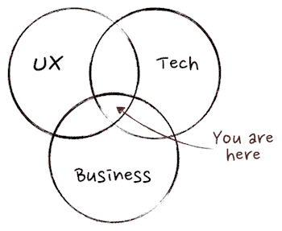

# 产品经理是做什么的？角色和职责- LogRocket 博客

> 原文：<https://blog.logrocket.com/product-management/what-does-a-product-manager-do-role-responsibilities/>

产品经理在开发公司产品的过程中起着至关重要的领导作用。从广义上讲，他们的工作是在增加收入的同时，设想能让顾客满意的产品。这听起来很简单，但是要把一个想法变成一个实用的产品，需要很多努力和协调。

产品经理的职责因公司和产品而异。因此，产品经理的角色很难定义。无论产品经理在哪里工作，做什么，都需要多方面的技能来完成他们的任务，以及时交付最好的产品。

在本指南中，我们将尽最大努力明确产品经理的角色和职责，并列出完成这些任务所需的技能。我们还将区分产品经理和产品所有者，并概述一些通用提示和最佳实践，以帮助项目经理在职业生涯中取得成功。

* * *

## 目录

* * *

## 什么是产品经理？

产品管理大师马丁·埃里克森(Martin Eriksson)将产品经理的角色描述为位于业务、技术和用户体验的交叉点。

Source: [Martin Eriksson](https://medium.com/@bfgmartin/what-is-a-product-manager-ce0efdcf114c)

产品经理在产品愿景和业务目标的背景下确定客户需求，并监督旨在尽可能高效地交付最佳产品的开发流程。虽然产品经理的具体职责因行业而异，但核心职责都围绕着创造能引起客户共鸣的产品。

产品经理通常是一个跨职能的角色。他们与几个团队协作，包括设计、工程和管理人员，来创建和维护产品套件。

## 产品经理的职责是什么？

产品经理有两项长期责任:

*   建立[产品愿景](https://blog.logrocket.com/product-management/what-is-a-product-vision-statement-examples/)并创建[产品路线图](https://blog.logrocket.com/product-management/how-to-build-product-roadmap-overview-examples/)来执行该愿景
*   向所有相关的利益相关者传达产品路线图，并在必要时进行修改

一般来说，产品经理的职责分为四类:

1.  进行客户研究
2.  创建产品策略
3.  与团队和利益相关者沟通和协调
4.  持续评估产品性能

### 1.进行客户研究

产品是为用户解决问题而设计的。为了发现这些问题，产品经理必须深入了解他们的客户、市场趋势和竞争对手。

产品经理的角色包括进行广泛的研究，以创造客户想要使用的高性能产品。

### 2.创建产品策略

在确定了需要构建什么样的产品或功能后，产品经理可以专注于创建产品策略。该战略包含[产品愿景](https://www.christianstrunk.com/blog/product-vision)以及实现该愿景的目标和目的。

此外，产品经理将构建产品路线图，直观地展示预期的发布时间表。他们还将责任和里程碑委派给各自的团队。产品路线图确保所有利益相关者都知道会发生什么。

### 3.与团队和利益相关者沟通和协调

产品经理实际上并不自己构建产品。相反，他们与跨职能团队密切合作，以确保产品路线图的交付。这些团队包括业务分析师、设计师和开发人员。

建立和维护与跨职能团队的关系是产品管理的重要组成部分。良好的关系建立信任和开放的沟通。产品经理需要这两种关系特质来成功执行产品策略。

开发团队在构建产品和特性时经常会遇到障碍，比如预算问题和发布延迟。产品经理负责识别风险、议题和问题，以最小化这些障碍的影响。然后，他们可以提出缓解计划，利用他们已建立的关系和沟通技巧来克服这些困难。

### 4.持续评估产品性能

产品经理还负责收集用户对产品套件喜欢或不喜欢的反馈。识别产品和用户问题之间的差距可以引导到下一个产品版本。

产品经理可能会创建一个流程来接收来自客户和公司团队的想法。通常，公司的员工知道客户面临的问题，并且他们可能知道如何处理这些问题。

## 做产品经理需要哪些技能？

产品经理负责整个开发过程中的各种任务。因此，在产品管理领域建立成功的职业生涯需要广泛的技能。

下面是成为一名有效的产品经理所需的一些关键能力。

### 沟通

优秀的书面和口头沟通技巧对产品经理来说至关重要。没有清晰的沟通，产品经理将很难建立关系并让所有利益相关者支持他们的愿景和战略。

一个项目经理应该知道如何有效地与许多不同的角色沟通，包括客户、高管和内部团队。

### 介绍会；展示会

产品经理经常需要向各种利益相关者展示他们的计划和想法，这需要很强的讲故事和展示技巧。一个产品经理需要能够定义一个计划，解释为什么需要它，清楚地传达战略，并赢得观众对它的热情。表达技巧与有效沟通的能力密切相关。

### 技术的

产品经理不是编写代码来创建软件产品的人，但是他们确实需要理解这些原则。这将有助于与开发人员和工程师就他们的项目和任务进行交流。技术技能也让项目经理更容易理解他们的工程师需要什么才能成功。

* * *

订阅我们的产品管理简讯
将此类文章发送到您的收件箱

* * *

产品管理影响者和作者 [Josh Fechter](https://theproductcompany.com/technical-product-manager-skills/) 将数据分析、SQL、A/B 测试和基本编码列为值得添加到产品经理工具箱中的技术技能。

### 商业

对业务运营的大致了解有助于产品经理做出更好的决策。例如，在决定在产品中加入什么功能时，了解定价、收入和成本等财务信息至关重要。公司正在寻求投资回报(ROI)，产品经理需要知道如何将高质量、高效开发的产品转化为收入。

### 战略思维

产品经理做很多决策。公司通常会寻找能够快速分析形势并有效做出决策的产品经理。

产品经理应该有能力用逻辑和数据来雄辩地捍卫他们的决策，以支持为什么它是最佳选择。自然，解决问题和分析能力也不会有什么坏处。

### 神入

和大多数行业一样，换位思考在产品管理行业大有可为。通常情况下，客户没有一个指定的代表来为他们辩护，并将他们的需求直接传达给公司。

产品经理需要在开发过程的每一步都考虑客户的利益。同理心使 PMs 能够与客户讨论他们的问题，并深入了解产品如何帮助解决这些棘手问题。

### 领导力

根据公司的大小，一个产品经理可能领导其他产品经理，也可能独立工作。不管组织的规模如何，产品经理的工作是确保所有内部团队合作良好。一个伟大的产品经理通过影响力而不是直接的权威来领导。

### 研究和数据分析

研究是制造成功产品的基础。产品经理应该有能力进行研究，分析各种数据点，并在分析的基础上制定产品愿景。这可能包括定量和定性数据、市场趋势和竞争对手研究。所有这些研究和分析对于构建一个既能满足客户需求又能产生投资回报的产品是必要的。

### 项目管理

成功的产品经理有能力同时处理多项任务和管理优先级，这一点不足为奇。推出产品、添加新功能，甚至维护产品都需要相当多的协调。产品经理拥有有效的计划和执行技能，可以帮助团队执行产品路线图和愿景。

## 产品经理与产品负责人

产品经理和产品所有者的头衔不能互换。在大多数组织中，产品经理监督广泛愿景的执行，而产品负责人则关注更精细的日常操作，如产品积压。

每个组织内的角色定义不同，职责可能会有重叠。既有产品经理又有产品所有者的公司应该明确定义职责和期望，以防止不一致。

下表概述了典型组织中与产品经理和产品所有者角色相关的职责。

| 生产部经理 | 产品所有者 |
| --- | --- |
| 创建产品愿景和路线图 | 帮助确保产品路线图得到执行 |
| 与投资者等外部利益相关者合作 | 与客户和内部团队合作 |
| 在概念层面上负责整个产品生命周期 | 负责日常的产品积压和履行工作 |
| 对客户、市场趋势和竞争对手有深刻的理解 | 深入了解客户，创造用户故事，倡导他们的需求 |

Product manager vs. product owner

产品经理和产品负责人通常一起工作，排除障碍，以最少的停顿执行产品路线图。

## 成为成功产品经理的最佳实践和技巧

许多行业都需要产品经理，包括但不限于银行、医疗保健、软件即服务(SaaS)等等。

无论您为哪个行业或哪个规模的公司工作，以下最佳实践和技巧都将帮助您在产品管理职业生涯中取得成功:

### 了解顾客

如果没有人想要一个产品，那么它就没有存在的意义。产品经理应该接触他们的受众，了解客户的需求和痛点。这将帮助他们构建一致的产品。

### 学习如何与你的团队合作

产品经理应该重视与他们的团队建立关系。这些人做着构建产品的实际工作，和他们相处很重要。

### 基于战略做出决策

如前所述，产品经理需要良好的决策技能，他们通常需要快速做出选择。做出快速和正确决策的关键是了解你的产品策略。有了这些知识，你就可以优先考虑什么是重要的，以及如何解决问题。

### 监控产品性能

产品管理不仅仅是构建和发布产品。一旦发布，产品经理的工作就是监控和分析人们是如何使用产品的。您可能会发现影响您转化率的产品体验问题。通过解决这些问题，您可以提高产品的使用率，让客户和利益相关者更加满意。

对于产品经理来说，创造有价值的产品是一种有益的体验。如果你实施了上面概述的最佳实践，你将有一个独特的机会来塑造你的公司以及它如何对世界做出贡献。

## [LogRocket](https://lp.logrocket.com/blg/pm-signup) 产生产品见解，从而导致有意义的行动

[LogRocket](https://lp.logrocket.com/blg/pm-signup) 确定用户体验中的摩擦点，以便您能够做出明智的产品和设计变更决策，从而实现您的目标。

使用 LogRocket，您可以[了解影响您产品的问题的范围](https://logrocket.com/for/analytics-for-web-applications)，并优先考虑需要做出的更改。LogRocket 简化了工作流程，允许工程和设计团队使用与您相同的[数据进行工作](https://logrocket.com/for/web-analytics-solutions)，消除了对需要做什么的困惑。

让你的团队步调一致——今天就试试 [LogRocket](https://lp.logrocket.com/blg/pm-signup) 。

[Sara Nguyen Follow](https://blog.logrocket.com/author/saranguyen/) My greatest career achievement was when I was recognized as "GIF Master" for my GIFs in the company Slack channel. A close second is that I've written over 600,000 words in the past two years.