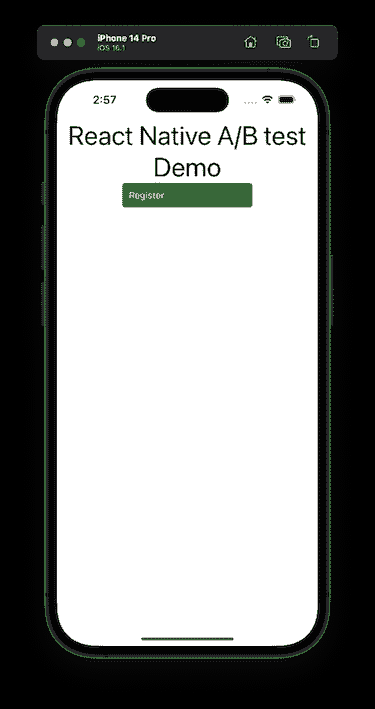
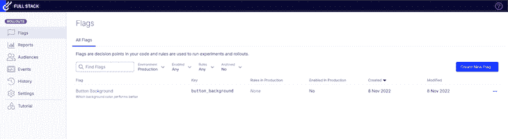
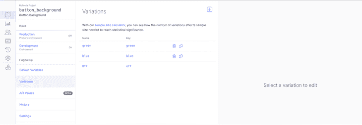
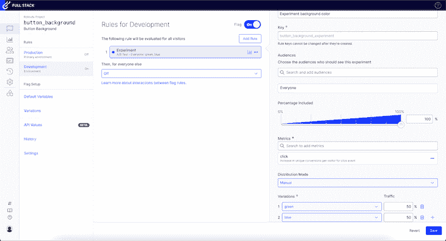
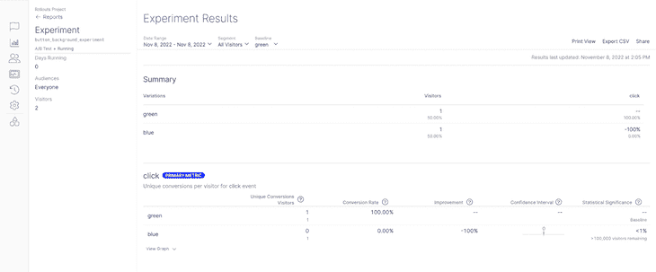

# 什么是 A/B 测试？概述、示例和优化演示

> 原文：<https://blog.logrocket.com/product-management/what-is-a-b-testing-optimizely-demo-examples/>

如果你想实现长期增长和盈利，改进你的产品是必不可少的。挑战在于改进一个数字产品涉及很多主观性。

我们都知道一些公司投入大量资金和精力重新设计网站，却发现用户讨厌它的例子。A/B 测试是一个框架，可以帮助你根据用户反馈做出明智的决定。

在本文中，我们将回顾什么是 A/B 测试，并演示如何使用它来优化您的产品和功能。

我们还将在 React Native 中实现一个演示应用程序，但是您可以很容易地将其应用到 web 上。我们将使用 Optimizely 运行我们的示例 A/B 测试，optimize ly 是市场上最流行的分割测试工具之一。

* * *

## 目录

* * *

## 什么是 A/B 测试？

A/B 测试或分割测试是一种比较同一事物的两个或多个版本的方法(例如，页面、屏幕、文本、功能等)。)并确定哪个表现更好。它包括运行实验，将现有变体(对照变体)与新变体(测试变体)进行比较。

## 如何运行 A/B 测试

下面是 [A/B 测试](https://blog.logrocket.com/server-side-a-b-testing-node-js/)在实践中的样子:

1.  构建控件变体
2.  随机分流流量；一半的用户仍然会看到控件变体，而另一半会看到控件变体
3.  测量用户与两种变体的交互
4.  当你有足够的数据使实验具有统计相关性时，你分析它并做出决定
5.  结束实验，只保留表现更好的变体

这里需要注意一些重要的事情:

首先，不强制将流量分成 50/50 的百分比。将 90%的流量发送到现有的变体，而只将 10%发送到新的变体，这是完全正常的。

第二，如上所述，你需要足够的数据来使实验具有统计相关性。你不能根据几次互动就得出结论。计算统计显著性并不容易，但是任何一个称职的 A/B 测试平台(比如 Optimizely)都会帮你计算出来。

## 你应该 A/B 测试什么？

现在我们已经了解了这个过程是如何工作的，让我们回顾一些你可以通过 A/B 测试改进的例子:

### 内容

精心制作的内容有助于推动更多的销售。您创建的内容越多，您在高容量查询的搜索结果页面上排名靠前的机会就越大。

公司用来[大规模创作内容](https://blog.logrocket.com/product-management/product-growth-channels-strategies-examples/#seo)的常用策略包括:

*   用户生成的内容
*   博客内容
*   自动生成的内容

说到优化内容，[营销人员](https://blog.logrocket.com/product-management/product-marketing-manager-job-description-role-skills/)通常会测试行动号召、页面标题、副标题或任何其他可能吸引读者的相关内容，例如，注册免费试用你的产品。

### 用户界面

用户界面是任何产品、应用程序或网站最常见的 A/B 测试功能之一。

无论我们谈论的是[改变按钮的颜色](https://blog.logrocket.com/create-style-custom-buttons-react-native/)还是整个应用程序的重新设计，在提交行动计划之前进行 A/B 测试都是一个很好的实践。

即使你认为你的用户界面看起来不错，你的客户可能会有不同的看法。

### 产品变化

A/B 测试不仅仅是测试你的产品或服务的前端；您还可以测试不同的订阅模式、价格或其他功能。

[敏捷价值观](https://blog.logrocket.com/product-management/four-agile-manifesto-values-explained/#responding-to-change-over-following-a-plan)和[原则](https://blog.logrocket.com/product-management/12-agile-manifesto-principles-how-to-adopt-them/#2-welcome-changing-requirements)支持拥抱变化。环境在不断演变，变化是我们可以利用的优势。

为了具有竞争力，我们不仅应该预见变化，而且应该欢迎变化。A/B 测试可帮助您验证应用程序的更改是否会吸引更多客户和/或增强现有客户的用户体验。

### 逐步展开

假设你想[推出一个新奇的功能](https://blog.logrocket.com/product-management/what-is-a-product-launch-plan-how-to-create/)。变化很大，你预计会有一些摩擦。

你可以用一小部分流量来 A/B 测试它，而不是向所有人推广这项功能。如果一切顺利，你就可以走了。如果没有，那就从头开始。

不同类型的产品/功能看起来会有不同的成功。了解更多关于[如何衡量产品发布后的成功](https://blog.logrocket.com/product-management/how-to-measure-success-after-product-launch/)。

## 优化使用 A/B 测试示例和演示

为了用一个实际的例子来展示 A/B 测试是如何工作的，我们将在 React Native 中实现一个小的演示应用程序，在这里我们测试一个按钮的背景颜色。

这个实验有两个变种:绿色和蓝色。

我们的演示应用程序将如下所示:



最终应用可在 [GitHub](https://github.com/cristian-rita/rnabtest) 上获得。

为了管理 A/B 测试，我们将优化使用，这是一个管理数字体验的流行工具。有很多替代品，它们都有相似的特性。请随意用适合你的方式替换 Optimizely。

如果你想继续这个演示，请在 Optimizely 网站上[创建一个账户](https://www.optimizely.com/get-started/)。

在向您展示如何配置实验之前，我想介绍一下[特征标志](https://blog.logrocket.com/how-to-implement-feature-flags-react/)的概念。功能标志是一个用于启用或禁用功能的软件，所有这些 A/B 测试平台都是这样工作的。

在我们的例子中，我们将为按钮背景色创建一个特性标志。



接下来，我们需要创建两个变体:



现在我们可以创建实验了。我们还需要指定一个要跟踪的事件。当用户点击按钮时，我们将触发这个事件。这就是我们衡量实验结果的方式。



如您所见，我们在两种变体之间平均分配流量。

* * *

订阅我们的产品管理简讯
将此类文章发送到您的收件箱

* * *

现在让我们创建应用程序:

```
npx react-native init rnabtest

```

接下来，安装 Optimizely SDK 及其依赖项:

```
yarn @optimizely/react-sdk
yarn add @react-native-async-storage/async-storage
yarn add @react-native-community/netinfo

```

修改`App.js`文件:

```
import {
  createInstance,
  OptimizelyExperiment,
  OptimizelyProvider,
  OptimizelyVariation,
} from '@optimizely/react-sdk';
import React, {useId} from 'react';

import {Pressable, SafeAreaView, StyleSheet, Text, View} from 'react-native';

const App = () => {
  const userId = useId();

  const optimizely = createInstance({
    sdkKey: 'YOUR_SDK_KEY',
  });

  return (
    <OptimizelyProvider optimizely={optimizely} user={{id: userId}}>
      <SafeAreaView>
        <View style={styles.container}>
          <Text style={styles.title}>React Native A/B test Demo</Text>
          <OptimizelyExperiment experiment="button_background_experiment">
            <OptimizelyVariation variation="blue">
              <Pressable
                style={[styles.button, {backgroundColor: 'blue'}]}
                onPress={() => optimizely.track('click')}>
                <Text style={styles.text}>Register</Text>
              </Pressable>
            </OptimizelyVariation>
            <OptimizelyVariation variation="green">
              <Pressable
                style={[styles.button, {backgroundColor: 'green'}]}
                onPress={() => optimizely.track('click')}>
                <Text style={styles.text}>Register</Text>
              </Pressable>
            </OptimizelyVariation>
          </OptimizelyExperiment>
        </View>
      </SafeAreaView>
    </OptimizelyProvider>
  );
};

const styles = StyleSheet.create({
  container: {
    justifyContent: 'center',
    alignItems: 'center',
  },
  title: {
    fontSize: 40,
    textAlign: 'center',
  },
  button: {
    width: '50%',
    borderRadius: 5,
    padding: 10,
  },
  text: {
    color: '#fff',
  },
});
export default App;

```

Optimizely SDK 需要一个唯一的用户 ID 来正确划分流量和计算指标。我们使用`useId()`钩子来模拟这个。

然后，添加 SDK 密钥，你可以在你的账户中的**设置>环境>开发**下找到。OptimizelyProvider 需要包装您创建的任何实验。

接下来，初始化实验，并添加蓝色和绿色的变化。对于实验和变化道具，我们必须使用 Optimizely 网站上的精确值。

如果我们检查日志，Optimizely SDK 应该会记录如下内容:

```
INFO  [OPTIMIZELY] - INFO 2022-11-08T12:08:57.115Z DECISION_SERVICE: User :r0: is in variation green of experiment button_background_experiment.

```

您可以在 Optimizely 网站的**报告**部分看到结果。



## 结论

有很多方法可以利用 A/B 测试。A/B 测试有助于您围绕内容和 UI 优化、变更管理、产品/功能推出等做出更明智、更有数据支持的决策。

因为 A/B 测试如此强大且易于实现，所以它在当今的软件开发环境中是必须的。

*精选图片来源:[icon scout](https://iconscout.com/icon/fuel-sample-1842014)*

## [LogRocket](https://lp.logrocket.com/blg/pm-signup) 产生产品见解，从而导致有意义的行动

[](https://lp.logrocket.com/blg/pm-signup)

[LogRocket](https://lp.logrocket.com/blg/pm-signup) 确定用户体验中的摩擦点，以便您能够做出明智的产品和设计变更决策，从而实现您的目标。

使用 LogRocket，您可以[了解影响您产品的问题的范围](https://logrocket.com/for/analytics-for-web-applications)，并优先考虑需要做出的更改。LogRocket 简化了工作流程，允许工程和设计团队使用与您相同的[数据进行工作](https://logrocket.com/for/web-analytics-solutions)，消除了对需要做什么的困惑。

让你的团队步调一致——今天就试试 [LogRocket](https://lp.logrocket.com/blg/pm-signup) 。