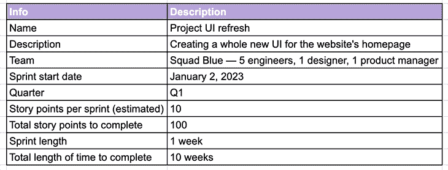
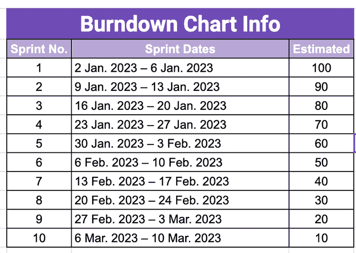
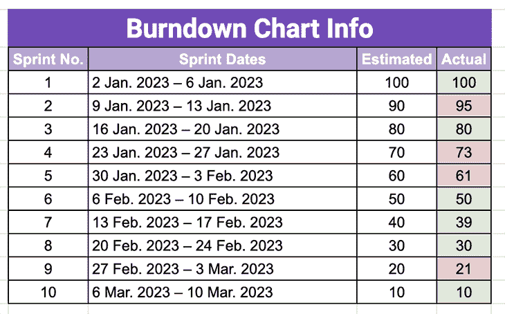
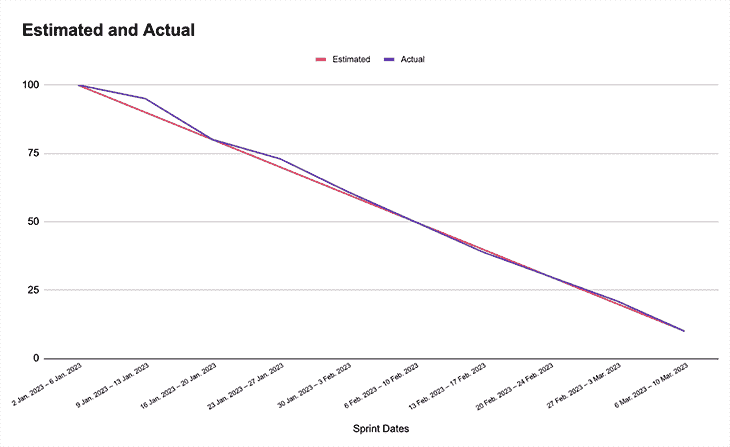

# 什么是燃尽图，如何像产品经理一样使用它

> 原文：<https://blog.logrocket.com/product-management/what-is-a-burndown-chart-how-to-use-it-like-a-product-manager/>

对于许多团队来说，无论大小，团队成员可能都很难估计需要完成的工作量、已经完成的工作以及还剩下多少工作。

这就是创建燃尽图派上用场的地方。简而言之，燃尽图是一个有用的工具，有助于与您的团队讨论完成一个计划或发布一个新特性的预计工作量。一旦商定了估计的工作量，就可以用它来管理和组织一周内完成的工作。它还有助于团队成员跟踪工作是否按时完成。

这篇文章将解释什么是燃尽图，它有什么作用。它还将在 Excel/Google 工作表中演示一个简单的、可复制的模板，任何人都可以使用它来为任何未来的计划或功能创建自己的燃尽图。

* * *

## 目录

* * *

## 什么是燃尽图？

燃尽图是一种简单的方法，可以直观地显示一次或多次冲刺所完成的工作量。它跟踪实际完成的工作量相对于最初为每个后续 sprint 计划的工作量是否进展顺利。

这是许多敏捷团队非常常用的工具。它帮助团队成员跟踪已完成的工作以及还需要做什么。这是一种有效的方式[与公司内部的其他利益相关者](https://blog.logrocket.com/product-management/what-stakeholder-management-tools-techniques/)——比如产品负责人或公司首席执行官——交流你的团队已经完成的工作量以及完成项目还需要多少时间。

## 为什么应该使用燃尽图？

作为产品经理，通过燃尽图跟踪和管理工作是团队的工程经理和 scrum master[的共同责任。使用这种直观的视觉辅助工具不仅可以帮助你组织和计划团队未来的工作，还可以帮助你更好地理解工作。反过来，您也获得了与组织中对您的团队正在取得的进展感兴趣的其他利益相关者交流这种理解的能力。](https://blog.logrocket.com/product-management/how-top-product-managers-work-engineers/)

使用燃尽图的主要优点是:

*   这是与你的工程经理和 scrum master 讨论特定特性或计划的工作量的起点
*   一种跟踪你的团队在一个冲刺接一个冲刺的基础上的进展的方法，而不是一个微观管理者
*   与团队外部的风险承担者交流时的视觉帮助，关于您的团队在交付特性方面所取得的进展

## 创建自己的燃尽图所需的步骤

创建一个谷歌工作表或 Excel 烧毁图表是非常容易的！我们将介绍复制您自己的非常简单(但有用)的 Excel 燃尽图的步骤，您可以在 [Google Sheets](https://docs.google.com/spreadsheets/d/1UThQNWOteWka9TIQnUSPN9gDYb-Cy92sESAKlzRyJDs/edit?usp=sharing) 上下载免费示例。

### 步骤 1:与你的产品三人组(和 scrum master)进行初步讨论

在你开始在一张纸上写下任何东西之前，更不用说创建一个燃尽图了，你需要与工程经理和 scrum master 讨论这个计划。如果需要燃尽图，讨论应集中在充实或评估以下信息:

*   团队完成计划和发布特性所需的总工作量
*   接下来的几个冲刺阶段，这项工作将如何分配和划分
*   根据以上所述，完成计划或发布特性需要多少次冲刺

在提供评估方面，不同的产品经理会提供不同的方法，这取决于他们在哪里工作以及如何工作。就我个人而言，我喜欢保持简单，通过斐波纳契数列利用故事点。这是一种估算完成一个用户故事所需工作量的方法。在斐波纳契数列中，每个数字都是数列中前两个数字的和，例如 0、1、1、2、3、5、8、13、21 等。

在我的日常工作中，我使用高达 13 的等级来评估完成一个 sprint 的用户故事所需的努力，1 表示非常简单，13 表示非常困难。作为一个产品经理，有一个通用的、普遍接受的方法作为中心讨论点是很重要的。

与工程经理和 scrum master 进行这些讨论有助于将工程领导的注意力集中在为计划何时完成提供现实的时间表上。它们也为你提供了某种程度的信心，你的估计在某种程度上是准确的。

除了估计所需的工作量，其他可能有用的信息包括:

*   方案的名称
*   对方案的描述
*   致力于此计划的团队或团队成员数量
*   冲刺开始日期
*   该计划预计在 2014 年完成的季度

你可以看到下面的例子:

### 步骤 2:规划你的冲刺日期和每次冲刺的预计完成时间

一旦围绕努力的讨论已经举行并达成一致，是时候规划出每个 sprint 需要的努力量了。使用上面的例子表，假设我们同意用大约 10 周(或者 10 次 sprint，如果您使用的是每周 sprint 计划)来完成这个计划。总的来说，你估计每个 sprint 需要大约 100 个故事点或者 10 个故事点的努力。

然后，您可以创建包含以下信息的表格:

*   每个冲刺之间的日期跨度(例如，2023 年 1 月 2 日–2023 年 1 月 6 日=冲刺 1)
*   剩余的故事点在冲刺的开始(例如 100 点)
*   重复前两个要点，直到你到达终点(例如，第 10 次冲刺或第 10 周 10 分)

请参见下面的示例:

### 第三步:记录你完成的工作和预计的工作，并做出调整

一旦你画出了每周的估计工作量，就该开始行动了。每周(或每次冲刺)工作完成后，[记录完成的故事点数量](https://blog.logrocket.com/product-management/story-points-velocity-estimation-does-this-really-work/)。在每个冲刺阶段结束时，记录剩余故事点的余额。

下面是这种情况的一个例子:

如上所述，以燃尽图的形式记录故事点有助于提供团队缺乏效率或超出完成工作的概述。这可能会提前或推迟您的发布日期。

使用上面的表格，很容易在 Excel 或 Google 工作表中创建图表。首先选择上述所有数据，然后前往顶部工具栏，选择**插入>图表:**

正确完成后，您可以选择**线图**的选项，这将创建一个类似于以下内容的燃尽图:

在 sprints 过程中，当用户故事的数量或用尽的点数少于预算/估计时，这有助于您考虑团队是否有足够的人员或经验来完成手头的工作。它还可以帮助您找出是否有任何瓶颈阻止了他们完成工作，或者他们是否需要您(作为产品经理)的任何帮助来帮助他们摆脱工作。

在 sprints 过程中，当用户故事的数量或消耗的点数超过预算或估计时，最好进行评估和回顾，看看是否有什么帮助团队在工作中实现更高的效率。你能在接下来的 sprints 中实现这些方法来进一步为团队实现更高的速度吗？需要考虑的大事！

## 燃尽图 Excel/Google 工作表模板

请点击[此处的链接](https://docs.google.com/spreadsheets/d/1UThQNWOteWka9TIQnUSPN9gDYb-Cy92sESAKlzRyJDs/edit?usp=sharing)获取免费的 Google Sheets burndown 图表模板，供您自己的团队使用。这是相当不言自明的，但请随意重读这篇文章，并按照电子表格给你一个更好的理解！

## 结论

使用上面的说明，你马上就能创建自己的燃尽图！

如果你想看我为产品经理创建的其他模板，请随时[访问这个链接](https://khornerstone.gumroad.com)。

*精选图片来源:[icon scout](https://iconscout.com/icon/agile-5804828)*

## [LogRocket](https://lp.logrocket.com/blg/pm-signup) 产生产品见解，从而导致有意义的行动

[LogRocket](https://lp.logrocket.com/blg/pm-signup) 确定用户体验中的摩擦点，以便您能够做出明智的产品和设计变更决策，从而实现您的目标。

使用 LogRocket，您可以[了解影响您产品的问题的范围](https://logrocket.com/for/analytics-for-web-applications)，并优先考虑需要做出的更改。LogRocket 简化了工作流程，允许工程和设计团队使用与您相同的[数据进行工作](https://logrocket.com/for/web-analytics-solutions)，消除了对需要做什么的困惑。

让你的团队步调一致——今天就试试 [LogRocket](https://lp.logrocket.com/blg/pm-signup) 。

[Ian Khor Follow](https://blog.logrocket.com/author/iankhor/) Product Manager @ Octopus Deploy | Ex-lawyer | Enthusiast of all things Agile, LEAN, JTBD, and RICE