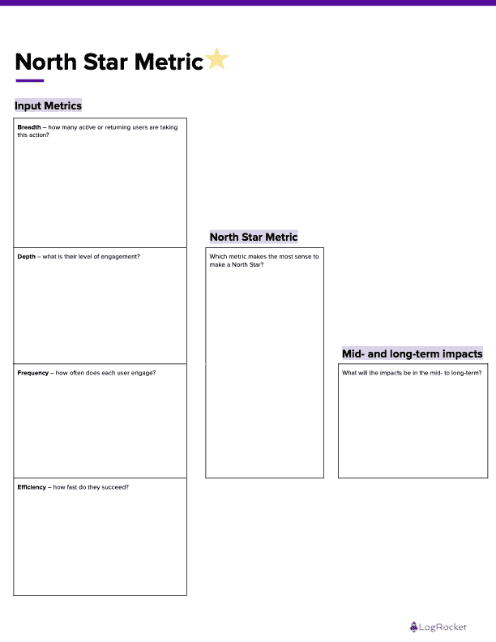

# 什么是北极星度量(NSM)？

> 原文：<https://blog.logrocket.com/product-management/what-is-a-north-star-metric-nsm/>

北极星指标代表了公司通过服务或产品传递给客户的核心价值。这是维持组织长期发展最重要的一个指标。

NSM 还将公司的所有短期目标与交付价值这一核心目标联系起来。此外，NSM 给出了要关注的明确方向，这随后带来了不同团队实现的业务成果的透明度。

* * *

## *向前跳转*

* * *

## 北极星度量是做什么的？

北极星度量使团队专注于一个目标，并防止他们无意中在不同的目标上相互对抗。此外，NSM 将团队、利益相关者和客户放在同一页上。它还可以帮助公司将他们的业务成果与客户价值结合起来。

此外，北极星指标允许团队了解业务进展情况。透明度在北极星度量标准的成功中发挥了重要作用。通过 NSM 成长，当团队看到他们如何创造影响时，他们会受到激励。

当团队放弃大局时，NSM 不会沉迷于小细节，而是防止团队迷失在团队特定的目标中。

应该避免与整体业务目标不一致的团队特定目标；相反，该团队应该通过 NSM 专注于核心目标。

## 现代公司的北极星指标是什么样的？

一家公司的北极星指标并不总是超级战略或秘密的。事实上，这很有道理。

让我们看看一些成功公司的北极星指标示例:

*   Spotify:花在听上的时间
*   Linkedin:每日活跃用户
*   优步:每周骑行
*   空闲:每日活跃用户
*   Salesforce:每个帐户创建的平均记录
*   缩放:每周主持的会议
*   网飞:观看时间/时长

## 北极星指标和收入是一回事吗？

收入不是一个好的 NSM 指标——它不能描述公司对客户的价值。相反，它是由客户购买服务/产品所支付的金额产生的。

因此，如果用收入来衡量 NSM，一家公司将永远无法实现其核心价值的最终目标，并且从长远来看，将会失去重心。

> "收入是公司价值的结果，而不是核心焦点."

网飞可以利用广告在不降低订阅价格的情况下获得更多收入。因此，它可能会产生短期收入，但不会长期持续。为了确保增长，网飞必须为消费者提供实质性的价值，这样他们才会渴望续订或购买订阅，并喜欢看广告。因此，它强调创造价值和关注客户的意义，[和一个非收入 NSM 帮助跟踪它](https://blog.logrocket.com/product-management/what-metrics-kpis-product-managers-track/')。

## 可以有多个北极星度量吗？

理想情况下，没有多样化产品组合的公司应该有一个北极星指标。例如，Zoom 有一个北极星指标，因为多个产品团队、基础设施、增长和营销以及业务的所有内部和外部活动都致力于将 Zoom 扩展到其核心价值:无缝地举办会议。

因此，他们的 NSM 和关键指标——每周主持会议的次数——不仅表明了各个团队跟踪的所有其他次要 KPI，还证明了向客户提供的价值。

另一方面，一个拥有多种产品和[独特核心价值主张](https://blog.logrocket.com/product-management/what-is-product-market-fit-measure-examples/)的复杂组织可以为每种产品拥有多个 nsm，只要它有助于公司的整体收入和利益相关者的回报:

例如，亚马逊有许多产品为其底线做出贡献:电子商务、OTT、云(AWS) extra，因此有多个 nsm 来量化每个产品的成功。

同样，谷歌有多种产品，每种产品都有独特的核心价值。例如，搜索引擎允许用户搜索信息，谷歌云允许客户存储他们的数据，YouTube 有娱乐功能，其余的(谷歌地图、Gmail、Drive、Chrome 和日历)都有其独特的价值，因为它们解决了不同的客户问题。

在这种情况下，通常会有多个 nsm 来跟踪每个产品的价值。除了价值之外，这些产品还有助于提高两家公司的利润，并证明了多个 nsm 的概念是正确的。

## 如何确定贵公司的北极星度量标准

识别北极星需要思考几个发人深省的问题。示例问题包括:

*   我们提供了什么独特的价值最终推动了收入？
*   一个团队如何打破孤岛以实现一个共同的组织目标？
*   作为领先指标，该值是否易于测量？
*   关键指标能否与公司产品的客户成功相关联？
*   我们能控制这个指标吗？
*   各个团队获取了哪些 KPI，它们如何帮助他们实现业务目标？
*   这一堆 KPI 能对一个共同的目标产生共鸣吗？如果能，它是什么？
*   共同目标是否清楚地传达了产品/公司产生的价值？

这些问题导致找到一个好的 NSM。常见的陷阱是不收敛的想法。

## 带有可下载模板的北极星度量框架

您可以使用多个框架进行头脑风暴，以帮助团队确定和探索北极星指标，一种尺寸并不适合所有人。[这里有一个简单的模板示例，带有免费下载的链接](https://docs.google.com/document/d/1CfiKot5QFmJNtc6i_0GW-pgIqDf2WdEoI5HQdspXMRM/edit#):

每个可操作的输入包括四个方面:广度、深度、频率和效率。它们被定义为:

*   广度:有多少活跃/回头客在采取这个行动
*   深度:他们的参与程度如何？
*   频率:每个用户参与的频率如何？
*   效率:他们成功的速度有多快？

此外，市场上有多种免费和付费的框架，如 [Miro 的北极星度量研讨会](https://miro.com/miroverse/just-mads-north-star-metric-workshop/)。此外，该团队可以在任何具有白板功能的协作工具上进行研讨会和练习。

### 参与 NSM 演习的利益相关方

理想情况下，产品赞助商和领导者将加入 NSM 演习的努力。还应包括产品、设计、工程和营销联系人，以确保所有这些业务职能的一致性

### 登上北极星作为更广泛的参考

一旦决定了 NSM，就应该与整个组织或产品团队的更广泛的受众沟通，以影响他们的关注领域。然后，组织和产品团队应该根据 nsm 调整和更新他们的内部 KPI。

## 跟踪团队的北极星指标

团队使用高可用性和[实时分析仪表板(如 LogRocket](https://logrocket.com/features/product-analytics/) )来跟踪 nsm。仪表板应该具有可读性和一致性，因为 NSM 是产品分析的重要组成部分。

产品指标的多个可操作输入共同定义了 NSM。

## 北极星度量标准示例及说明

先说一些热门公司和他们的北极星指标。

* * *

订阅我们的产品管理简讯
将此类文章发送到您的收件箱

* * *

我们之前讨论过 Spotify，他们的 NSM 是花在听上的时间。他们必须考虑广度、频率和深度上的所有输入指标，以获得良好的 NSM。

接下来，我们有 Airbnb。他们的 NSM 是预订的夜数。这个 NSM 完美地定义了提供给预订者和财产租赁者的价值。这一指标的下降显示了对收入和利益相关者回报的直接影响。

Slack 的北极星指标是每日活跃用户(DAU)。Slack 稍微复杂一点，因为它更像是一个 B2B 产品。为了保持 NSM 的增长，他们采用产品导向的增长方式，专注于创新、实验、用户体验以及与初创公司和企业建立合作伙伴生态系统。

最后，让我们考虑一下优步。他们的北极星指标很简单——每周乘坐次数。优步的 NSM 清楚地定义了提供给车手和车手的价值。骑手和驾驶员平台上更多的乘坐显示了优步增长引擎的健康。优步密切关注对其北极星指标有贡献的所有输入指标。

提示:一个组织或产品团队必须重新审视所有的输入指标和 nsm，看看他们是否需要保持或改变它们。这可能是因为市场的现状、不断发展的产品或不断变化的目标。

## 实施北极星战略

它通常被称为“导航北极星”，这是一种通过战略和战术保持和发展 NSM 的方式。北极星战略通过以下方式构建和执行:

1.  通过调整所有长期和短期的愿望，使北极星成功
2.  通过确定所有的目标和目的，并确定实现它们的方法。战略表明如何实现目标，以便组织或产品能够成功地驶向北极星。[战略是一套实现目标的战术、技巧和行动计划](https://blog.logrocket.com/product-management/product-strategy-frameworks-examples/)
3.  最重要的是，通过跟踪关键指标数据来做出明智的决策。这有助于支持组织转向和坚持北极星战略，并朝着 NSM 的预期结果前进

## 结论

总而言之，一个组织需要所有的利益相关者清楚地理解产品给客户的期望、目标和价值。因此，清晰是北极星度量解决的一个重要目的。

缺乏共同的目标不会为一个组织或产品建立一个坚实的基础。北极星通过将共同目标置于所有努力和愿景的中心来设定组织的战略。

## [LogRocket](https://lp.logrocket.com/blg/pm-signup) 产生产品见解，从而导致有意义的行动

[LogRocket](https://lp.logrocket.com/blg/pm-signup) 确定用户体验中的摩擦点，以便您能够做出明智的产品和设计变更决策，从而实现您的目标。

使用 LogRocket，您可以[了解影响您产品的问题的范围](https://logrocket.com/for/analytics-for-web-applications)，并优先考虑需要做出的更改。LogRocket 简化了工作流程，允许工程和设计团队使用与您相同的[数据进行工作](https://logrocket.com/for/web-analytics-solutions)，消除了对需要做什么的困惑。

让你的团队步调一致——今天就试试 [LogRocket](https://lp.logrocket.com/blg/pm-signup) 。