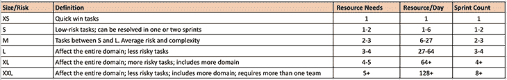
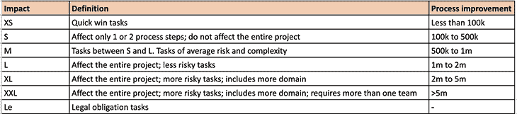
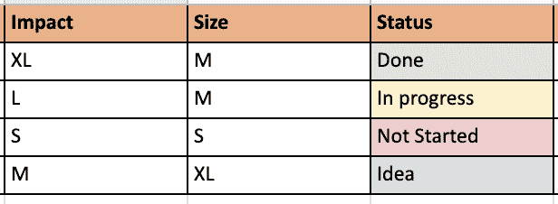
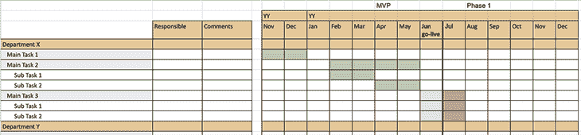

# 什么是项目路线图:概述和操作方法(带模板)

> 原文：<https://blog.logrocket.com/product-management/what-is-a-project-roadmap-overview-how-to-template/>

作为一名产品经理，我知道我们把一切都称为“产品”我的产品有这么多用户，我的产品在这个市场上处于领先地位，等等。我有时把我的猫看作是一个有迭代改进的出版良好的产品。😊

然而，这里有一个误解——并不是我们所做的一切都是产品。根据公司的结构，我们为特定的客户需求建立项目。作为总结，我们可以说，一个项目有一个目标要实现，有一系列的任务和一定的时间表。

在这篇文章中，我将解释什么是项目路线图，以及我们如何用模板和例子来改进我们的监控过程。

* * *

## 目录

* * *

## 什么是项目路线图？

项目路线图是一个简单的表格，它监控所有部门的任务及其状态。它显示了每个任务、子任务和特性的时间表。

公司中的每个角色都可以访问这些文档，并在较高层次上了解项目状态。项目路线图与产品路线图有相似的目标:它用于可视化。主要区别在于，我们将项目任务添加到项目路线图中，而不是产品目标中。

项目路线图应清晰、信息丰富，描述简短。利益相关者应该能够看到全局，而不需要滚动或改变需求。这就是为什么我们在路线图中从不超过一条线的规则。尽量避免冗长的解释和不必要的字段。

## 什么时候需要项目路线图？

如果我们有不止一个计划，我们可以决定是否以及何时需要项目路线图。让我们问一系列问题，以确保我们了解自己的需求。

首先，我们需要监控项目的每一步吗？因为项目路线图的动机是成为任务的可视化后续需求。

其次，我们需要评估规模、风险和复杂性。我们是否包括一个以上的部门，他们是否间接给了我们所需的项目时间表？

项目路线图的另一个动机是监控阶段划分。一些项目需要不同的时间表要求，这份文件使我们的监测变得容易。

## 使用项目路线图的好处是什么？

项目路线图有很多好处，下面让我们深入探讨一下。

### 易于监控

没有比使用项目路线图更简单的方法来监控许多团队的项目了。[每个利益相关者将他们的任务](https://blog.logrocket.com/product-management/what-stakeholder-management-tools-techniques/)添加到路线图中，并更新其状态。您将为每个项目召开更新会议，并且可以使用这些文档进行调整。您可以浏览每个领域/团队的任务，并讨论进一步的步骤。

### 快速通信

你可以去见负责你的任务/问题的人，和他们一起讨论。

### 准备好了吗

您不需要为更新创建会议文档。您可以使用新工作表将每个细节添加到此文档中:会议笔记、日程表、项目图表、项目计划、决策、议程等。

### 很难错过重要的点

您可以查看带有状态和时间线的任务。很容易看到整体情况，并根据优先级讨论每个必需的任务。

### 帮助确定任务的优先级

使用大小和影响列，[您将能够对任务](https://blog.logrocket.com/product-management/what-prioritization-matrix-definition-examples-template/)进行优先级排序，并添加可能的交付日期。

### 可视化任务状态

你不必查看太多的文档或吉拉板，就能知道项目还有多少未完成的任务，或者还有什么没有开始、正在进行、已经完成等等。使用基本的过滤器，您可以为高层管理会议可视化任务状态百分比。

## 如何创建项目路线图？

我们可以添加一个很长的字段列表来跟进项目细节。随着列表越来越长，文档将变得越来越难理解。

为了能够创建一个清晰易读的文档，您可以使用必填字段，并从下面的“最好有”类别中选择“如果”要求。

### 必填字段

项目路线图的第一个方面是必填字段。最常见的有:

#### 领域

如果你管理的项目有多个部门，你应该有一个字段来区分任务所有权。我们可以在该字段中使用团队或部门名称。

#### 任务

该字段应包含您将提供的工作所需的足够信息。您需要具体说明，并尽可能缩短字段。您可以给字段命名，如待办事项、功能或流程。

* * *

订阅我们的产品管理简讯
将此类文章发送到您的收件箱

* * *

#### 预计交货日期

交货日期不应该含糊，但我们应该谨慎给出一个确定或确切的日期。该字段对于创建部署计划和与其他团队的协调非常重要。对于拦截任务，我们应该尽可能快地提供日期信息。

#### 产品负责人/经理

这里可能不止一个名字。如果任务需要不同的跟进，您可以在此处添加负责人。

#### 影响

此字段指示任务的优先级和业务价值。你可以根据任务的影响来区分它的重要性。每个公司都应该创建自己的影响分析矩阵，以便能够输入真实的影响。

如果您没有影响矩阵，您应该在开始项目路线图之前创建一个。大多数团队使用 XS、S、M、L 和 XL 术语。对于那些没有的人，你可以使用下面的图例。我还将它作为表格添加到示例模板中:

#### 规模/风险

在确定任务优先级时，我们将该字段与影响列结合使用。影响大，体积小的多胜。

此字段指示任务的技术图例。我们可以根据资源要求、执行风险、规划要求、复杂性、多个部门的影响、管理要求的变化、数据迁移需求等来选择规模/风险。

为了能够有相同的结构，还可以使用 XS、S、M、L、XL 这一领域的术语:

#### 状态

此字段使我们的路线图易于阅读，能够区分正在进行的任务。我们更喜欢用颜色来表示每个状态，我认为这有助于我们更容易区分任务。

您可以使用“建议”、“新建”、“未开始”、“进行中”、“已取消”或“完成”状态。影响、规模和状态的概述如下所示:

### 有田地真好

接下来，我们有一些不是必需的但是很好的字段。

#### 开始日期

我们可以使用该字段来了解我们开始的每月任务，并监控任务的回溯。我更喜欢保持这个领域几个月。我们不需要知道具体的日期，只要知道月份名称就够了。

#### 任务文件

您可以使用此字段添加您认为可能对观察者有帮助的任何文档的链接。

#### 描述/注释

有些任务需要更多的定义或讨论点，以便于后续跟进。如果不使用文件链接，我建议您添加此字段。您可以在此链接文档或添加更多信息。

#### 企业主

我们使用此字段轻松联系企业所有者。在分析任务或客户需求方面，您的组织可以有不同的角色。您可以添加负责部门或观察者的姓名，以提出澄清性问题。

#### 业务交付期望

此字段向我们显示了客户(或企业所有者)的预期交货时间。我们使用这个字段来查看哪个特性向用户承诺了交付日期。您还可以使用它来跟踪多团队开发的一致性。

该文档将对公司内部的每个角色开放，您可能不想与每个人分享承诺的日期。在添加文档之前，请注意这一点。

#### 定相

如果项目有一个以上的预期交付阶段，我们可以使用阶段字段来确定优先级。

#### 项目

如果项目路线图中包含不止一个项目，您甚至可以将其添加为后续字段。

## 项目路线图与项目计划和项目章程

这三个术语似乎都混淆了，所以让我们快速澄清一下这些文档之间的区别。

### 工程计划

项目计划是显示项目每个步骤的正式方式，如资源管理、风险管理、上线计划、成本、范围等。

[项目计划大多由项目经理](https://blog.logrocket.com/product-management/product-manager-vs-project-manager/)编制。它们包括图表、详细计划，并使用工具创建，以便能够实现时间表。我可以说，项目路线图和计划文档有着相同的目的——控制执行时间表和可视化状态。

正如我所说，项目计划更正式，因为它包括成本、计划时间、实际时间，并在项目结束时执行价格。本文件适用于根据预算、工资、成本、材料和时间表提供计划的项目型公司。

对于基于产品的敏捷公司，这种结构可能很难应用，因为它的瀑布性质。我们在项目路线图中使用项目计划作为可交付任务的可视部分。我们创建了一个月的基础，以方便地准备 Excel 表格，并用颜色显示已完成、正在进行、未开始和延迟的任务。我们可以看到交付计划，控制执行过程，无需正式计算。

您还可以在路线图文档中添加一个项目计划，作为额外的表格来监控您从开始到结束的过程。我在示例模板中添加了下面的平面图:

### 项目章程

项目章程是解释你项目动机的描述页。这是一页纸的格式，在开始项目之前，说明你的目标、风险、优势和主要利益相关者。我们总是在项目路线图中添加一页。

在将问题分成任务之前，你应该知道并能够向你的团队解释章程的每一步。我相信章程为项目路线图提供了素材，项目路线图为项目计划提供了素材。我将在下一篇文章中分享项目章程、它应该包含的字段以及详细的示例模板。

## 一起使用项目路线图、计划和章程

与大多数资源相反，我喜欢使用这三种项目管理文档来监控我的项目。我相信他们都养活了这个项目和每个团队成员。

我建议你从一个章程开始你的项目，继续一个精心准备的路线图，在你列出你的任务后，开始更新你的时间表。这三个概念将使你的一天变得轻松，你将按时交付你的项目。

## 项目路线图模板供下载

最后，现在有很多路线图模板，但是其中很多都需要你注册一项服务或者输入你的信息。相反，我创建了一个免费的[项目路线图文档模板](https://docs.google.com/spreadsheets/d/1QN9Yn0l-ie4baF4aPDcrEw9i_5xEcgdkQ3VXAalBig8/edit#gid=58607616)供您应用到您的项目中。

这里的模板在 Google Sheets 中，所以你可以复制一份或者下载到本地供你使用。欢迎在这个博客的评论中提出任何问题，我很乐意帮助你建立自己的博客！

## 结论

在这篇文章中，我们了解了项目路线图的所有内容。我们讨论了何时需要它们、它们的好处、项目路线图的内容，以及路线图和其他项目文档之间的主要区别。感谢您的阅读，保重！

*精选图片来源:[icon scout](URL%20OF%20IMAGE)*

## [LogRocket](https://lp.logrocket.com/blg/pm-signup) 产生产品见解，从而导致有意义的行动

[LogRocket](https://lp.logrocket.com/blg/pm-signup) 确定用户体验中的摩擦点，以便您能够做出明智的产品和设计变更决策，从而实现您的目标。

使用 LogRocket，您可以[了解影响您产品的问题的范围](https://logrocket.com/for/analytics-for-web-applications)，并优先考虑需要做出的更改。LogRocket 简化了工作流程，允许工程和设计团队使用与您相同的[数据进行工作](https://logrocket.com/for/web-analytics-solutions)，消除了对需要做什么的困惑。

让你的团队步调一致——今天就试试 [LogRocket](https://lp.logrocket.com/blg/pm-signup) 。

[Zeynep Cansu Yildirim Follow](https://blog.logrocket.com/author/zeynepcansuyildirim/) I am an experienced PM of 5+ years with 9+ years of analyst and leadership experience in software companies, currently working as a PM in an e-commerce company. I am an Electric and Electronic Engineer with a Masters in Engineering Management. In my social life, I like skiing, kitesurfing, boxing, and am a professional horse rider in show jumping competitions.